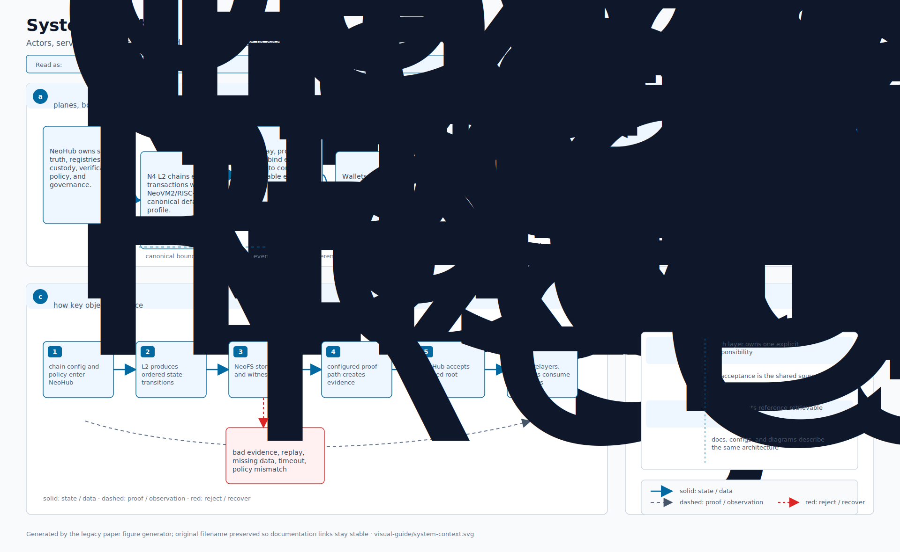
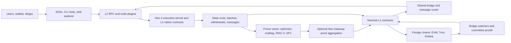
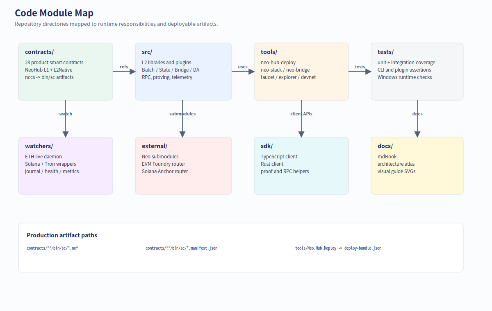
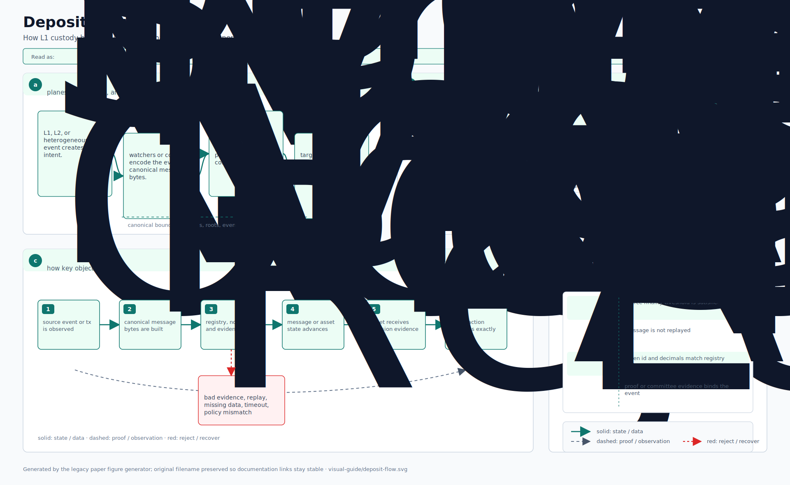
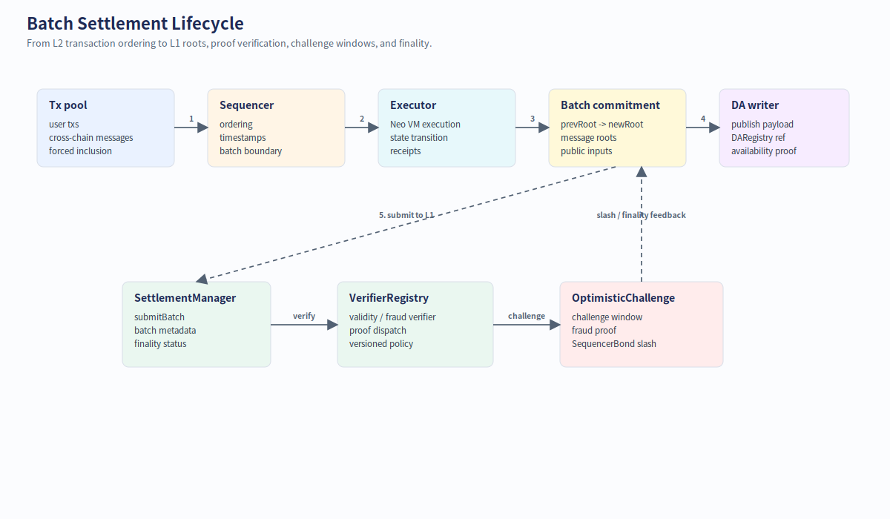
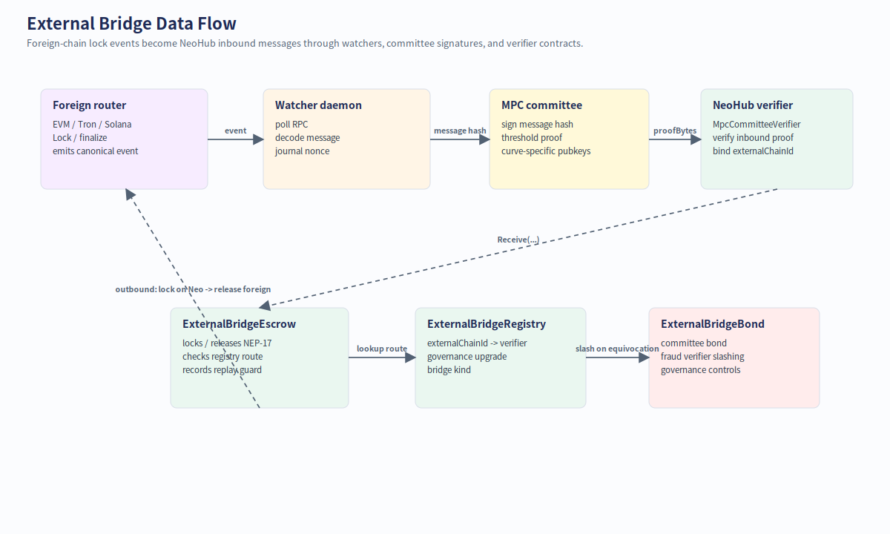
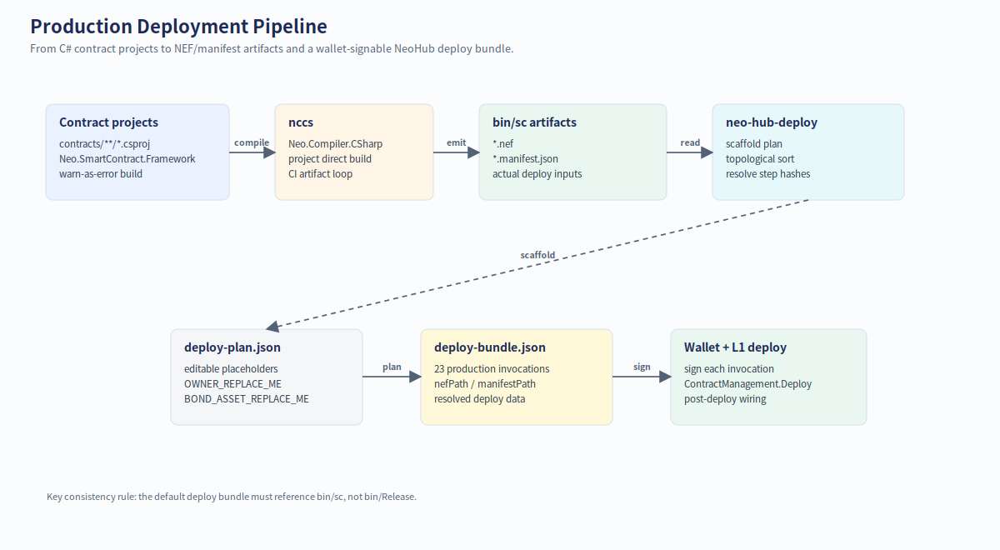
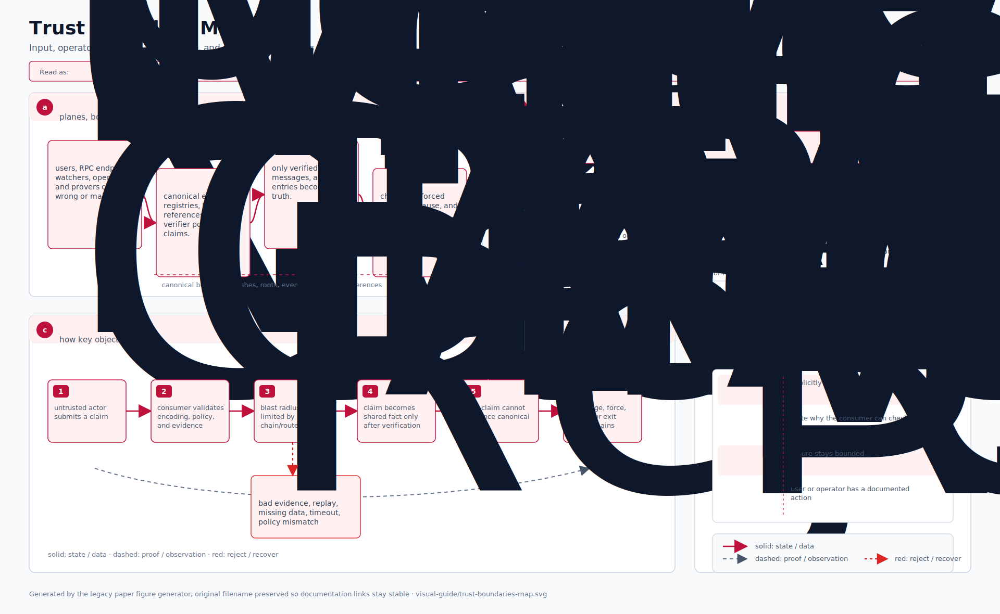
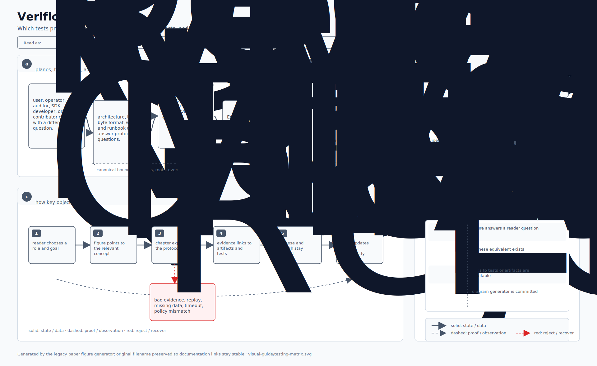

# Neo Elastic Network (`neo4`)

[](https://github.com/r3e-network/neo-n4/actions/workflows/build.yml)

> **A multi-L2 network on Neo 4 core, with a shared bridge, proof aggregation, and native cross-chain messaging.**

> [!IMPORTANT]
> **Independent implementation, not the official Neo 4 release.** This repository is
> an independent implementation of a multi-L2 elastic-network architecture on top of
> Neo's stack — **not endorsed by, affiliated with, or maintained by Neo Global
> Development (NGD), the Neo Foundation, or the
> [`neo-project`](https://github.com/neo-project) organization**. The "Neo 4" name
> refers to the *target core* used as the L2 execution kernel; the canonical Neo 4
> protocol roadmap is owned by the Neo project. The code in this repo is engineered
> for production deployment of L2 chains — full cryptographic primitives, real
> persistence, comprehensive test coverage, and documented operator seams. Provenance
> aside, treat it as you would any third-party implementation of a public protocol:
> review the [security model](docs/security-model.md), audit before mainnet use, and
> wire the documented production seams (live L1 signer, real NeoFS adapter, dBFT
> consensus selector) per your deployment.

`neo4` is the consolidation repo for the **Neo Elastic Network** — a system that uses
the [`r3e-network/neo`](https://github.com/r3e-network/neo) Neo core fork as the L2
execution kernel. The fork now has two maintained r3e branches: `r3e/neo-n3-core`
tracks upstream `master-n3` for L1 core work, while `r3e/neo-n4-core` tracks upstream
`master` for L2 execution-kernel and native-contract changes. Every L2 chain anchors to
a unified L1 contract suite (**NeoHub**) on Neo N3 / Neo 4 L1, and proofs and inter-L2
messages aggregate through an optional **Neo Gateway** layer.

The architecture borrows the *shared-bridge / chain-registry / proof-aggregation* pattern
from ZKsync Elastic Chain, rebuilt on Neo's stack: dBFT 2.0 finality, NEP-17 assets,
NeoVM2/RISC-V execution, and NeoFS data availability.

---

## Table of contents

1. [Visual system tour](#visual-system-tour)
2. [Architecture at a glance](#architecture-at-a-glance)
3. [What's in the repo](#whats-in-the-repo)
4. [Phased status](#phased-status)
5. [Quick start](#quick-start)
6. [Documentation map](#documentation-map)
7. [License](#license)

---

## Visual system tour

This section is the fastest way to understand what the project looks like, what
runs where, and how data moves. The complete diagram set lives in
[`docs/visual-guide.md`](./docs/visual-guide.md).

For a dynamic walkthrough, open the static
[`Neo N4 Runtime Theater`](./docs/interactive-runtime.md). It animates deposits,
batch sealing, proof aggregation, withdrawals, external-chain bridge routing, and
challenge recovery with step/play controls and a live state inspector.

### System context

<p align="center">
  
</p>

At a high level, Neo N4 is an elastic multi-L2 stack:

- users and applications talk through SDKs, CLIs, wallets, or the static web explorer;
- each L2 runs Neo 4 execution with L2 plugins, persistence, batching, proving, and RPC;
- NeoHub on L1 owns the canonical settlement, shared bridge, chain registry, token registry, message routing, and governance state;
- the optional gateway aggregates many L2 proofs before they hit L1;
- external-chain watchers connect EVM-family chains, Tron, and Solana into the same bridge and message model.

### One-minute flow



### Code module map

<p align="center">
  
</p>

Use this map when you are trying to find code. The repo is organized around a
few stable surfaces:

| Surface | Where to look | What it owns |
| --- | --- | --- |
| L1 contracts | `contracts/NeoHub.*` | Settlement, bridge, registries, governance, security controls, external bridge verification. |
| L2 native contracts | `external/neo/src/Neo/SmartContract/Native/L2NativeContracts.cs` | Per-L2 bridge, fee, message, paymaster, AA, interop, system config, bridged-token, and external-bridge surfaces registered in Neo core at genesis. |
| Runtime libraries | `src/Neo.L2.*` | Batch building, state, executor seams, proving, messaging, bridge logic, persistence, telemetry, audit, and SDK types. |
| Node plugins | `src/Neo.Plugins.L2*` | RPC, batch, bridge, DA, gateway, metrics, prover, and settlement plugin integration. |
| Operator tools | `tools/*` | Stack scaffolding, devnet, deploy planning, bridge/faucet/explorer CLIs, and external bridge setup. |
| Prover and watchers | `bridge/*`, `watchers/*` | SP1/RISC-V proof path plus external-chain event ingestion and committee proof construction. |
| SDKs and UI | `sdk/*` | TypeScript, Rust, .NET SDKs and a static web explorer. |

### Core lifecycle diagrams

<table>
  <tr>
    <td width="50%" align="center">
      <strong>L1 to L2 deposit</strong><br>
      
    </td>
    <td width="50%" align="center">
      <strong>L2 to L1 withdrawal</strong><br>
      
    </td>
  </tr>
  <tr>
    <td width="50%" align="center">
      <strong>Batch settlement lifecycle</strong><br>
      
    </td>
    <td width="50%" align="center">
      <strong>External bridge data flow</strong><br>
      
    </td>
  </tr>
</table>

These are the main production flows:

- **Deposits** lock assets on L1, emit canonical payloads, and mint or credit on the target L2.
- **Withdrawals** burn or lock on L2, enter the batch/withdrawal root, and finalize on L1 after the configured proof path succeeds.
- **Batch settlement** turns ordered L2 execution into state roots, public inputs, proof artifacts, and NeoHub finality.
- **External bridging** converts foreign-chain lock events into NeoHub messages through watcher journals, committee signatures, and registered verifiers.

### Deployment, artifacts, and verification

<table>
  <tr>
    <td width="50%" align="center">
      <strong>Production deployment pipeline</strong><br>
      
    </td>
    <td width="50%" align="center">
      <strong>Source to artifact map</strong><br>
      
    </td>
  </tr>
  <tr>
    <td width="50%" align="center">
      <strong>Trust boundary map</strong><br>
      
    </td>
    <td width="50%" align="center">
      <strong>Verification matrix</strong><br>
      
    </td>
  </tr>
</table>

For deeper diagrams, see:
[`architecture figures`](./docs/figures/architecture/),
[`visual guide`](./docs/visual-guide.md),
[`architecture lifecycle`](./docs/architecture-l2-lifecycle.md), and
[`wire formats`](./docs/architecture-wire-formats.md).

---

## Architecture at a glance

<p align="center">
  
</p>

The architecture is three tiers:

- **L1 (NeoHub on Neo N3 / Neo 4)** — canonical anchor. 23 contracts grouped into
  five concerns: *Settlement* (SettlementManager · VerifierRegistry), *Bridge*
  (SharedBridge · TokenRegistry · ChainRegistry), *Messaging* (MessageRouter · DARegistry),
  *Security* (SequencerRegistry · SequencerBond · ForcedInclusion · OptimisticChallenge),
  and *Governance* (GovernanceController · EmergencyManager). Owns assets, settlement,
  message routing, and governance.
- **Neo Gateway (Phase 5, optional)** — aggregates many L2s' proofs into one settlement
  post on L1. `BinaryTreeAggregator` reduces in log-N rounds; `IRoundProver` ships in
  three production-grade implementations (`MultisigRoundProver` for committee-attested
  rounds, `MerklePathRoundProver` for per-leaf inclusion proofs against the aggregate
  root, `PassThroughRoundProver` as the minimal-cost reference). Recursive-ZK fold
  variants (SP1 Compress / Halo2 / Risc0) plug into the same seam when the operator
  brings the toolchain.
- **L2 chains (elastic, N of them)** — Neo 4 core as execution kernel, 8 L2 plugins,
  10 native L2 contracts per chain. Independent state, shared L1 anchor.

For a full English distillation of the architecture, see [`ARCHITECTURE.md`](./ARCHITECTURE.md).
For the formal technical document, see [`WHITEPAPER.md`](./WHITEPAPER.md).
For the master Chinese spec, see [`doc.md`](./doc.md).

---

## What's in the repo

| Area              | Count     | Description                                                              |
| ----------------- | --------- | ------------------------------------------------------------------------ |
| Off-chain libraries | **16**  | `Neo.L2.{Abstractions,Audit,Batch,Bridge,Censorship,Challenge,Executor,Executor.RiscV,ForcedInclusion,Messaging,Persistence,Proving,Sequencer,Settlement.Rpc,State,Telemetry}` (App SDK in `Neo.L2.Sdk` is counted separately under App SDKs) |
| Persistence backends | **2**  | `InMemoryKeyValueStore` (tests) · `RocksDbKeyValueStore` (production default) — see [`docs/persistence.md`](./docs/persistence.md) |
| Node plugins      | **8**     | `Neo.Plugins.L2{Batch,Bridge,DA,Gateway,Metrics,Prover,Rpc,Settlement}`  |
| Smart contracts   | **23 deployable + 10 native** | 23 NeoHub L1 deployable contracts (Phase 0–3 + DA validator + L1 tx filter + 6 cross-foreign-chain bridge contracts) type-check via `Neo.SmartContract.Framework`; 10 L2 system contracts are Neo core native contracts in the r3e `external/neo` fork. |
| CLI tools         | **7**     | `neo-stack`, `neo-l2-devnet`, `neo-hub-deploy`, `neo-l2-explore`, `neo-bridge`, `neo-l2-faucet`, `neo-external-bridge` |
| App SDKs          | **3**     | `src/Neo.L2.Sdk/` (.NET) · `sdk/typescript/` (`@neo-n4/sdk`) · `sdk/rust/` (`neo-n4-sdk`) — all 10 RPC methods, same wire shape, same 4-class error taxonomy |
| Web apps          | **2**     | `sdk/web-explorer/index.html` — single static-file UI: Explore + Bridge + Faucet + state-root continuity Audit · `docs/interactive-runtime/index.html` — static runtime theater for learning architecture/data-flow/business-flow scenarios |
| Docs site config  | **1**     | `book.toml` + `docs/SUMMARY.md` (mdBook) |
| Rust prover/core  | **3**     | `bridge/neo-execution-core/` (backend-agnostic batch parsing, receipt/state folding, Merkle roots, public-input hash; no SP1/PolkaVM dependency) · `bridge/neo-zkvm-host/` (sp1-sdk 6.2.1 prover + `prove-batch daemon`) · `bridge/neo-zkvm-guest/` (the function being proved — compiles to RISC-V ELF, executes real Neo N3 VM via `neo_vm_guest::execute`) |
| Foreign-chain integrations | **6** | Watchers (3): `watchers/neo-bridge-watcher-eth/` (secp256k1+SHA256, **serves the entire EVM family** — Ethereum, Tron, BSC, Polygon, Arbitrum, Optimism, Base, Avalanche, Linea, zkSync Era, Scroll, Mantle, Fantom, Celo — via one chain-id-driven daemon binary; 32 base tests + 55 live-RPC integration tests = 87 with `--features live-rpc`. Production daemon ships **graceful SIGTERM shutdown**, **`/healthz`+`/info` HTTP endpoints**, **`/metrics` Prometheus exposition**, **per-chain `min_confirmations` reorg buffer**, and **`flock`-based concurrent-instance detection** on the journal directory; reference k8s + systemd manifests in [`watchers/neo-bridge-watcher-eth/deploy/`](./watchers/neo-bridge-watcher-eth/deploy/)) · `.../-tron/` (thin re-export with Tron chain-ids `0xE0000010..12`, 7 tests) · `.../-sol/` (ed25519-dalek + Solana chain-ids `0xE0000020..22`, 9 tests; curve-agnostic `Signer` trait dispatches to `CryptoLib.VerifyWithEd25519` on-chain). Foreign-side routers (3): `external/foreign-contracts/eth/` (393-line Solidity that deploys unchanged on any EVM chain — constructor parameterizes `externalChainId`; **21 Foundry tests** = 14 single-chain + 7 multi-chain pinning per-instance state isolation across 17 canonical mainnet slots (14 family banks + Polygon zkEVM, Arbitrum Nova, Sonic variants)) · `.../tron/` (README — TVM is EVM-flavored Solidity, points at the Eth contract) · `.../sol/` (~638-line Anchor program using Solana's ed25519 sigverify precompile, source-only — operator runs `anchor build`). Canonical 16-slot family banks for the namespace + 5-step EVM-onboarding runbook in [`docs/external-bridge-evm-chains.md`](./docs/external-bridge-evm-chains.md). |
| Submodules        | **4**     | `external/neo` (`r3e-network/neo` fork, L2 branch `r3e/neo-n4-core`; L1 core branch is `r3e/neo-n3-core` in the same fork) · `external/neo-devpack-dotnet` (smart-contract devpack + nccs) · `external/neo-riscv-vm` (PolkaVM-backed NeoVM2/RISC-V L2 engine) · `external/neo-zkvm` (SP1 prover crates and legacy Neo VM compatibility guest). None are released on NuGet/crates.io for the versions tracked here. |
| Tests             | **1430 .NET + 165 cross-lang** | 1430 across 34 .NET projects (incl. 7 Phase-C real-secp256k1 fraud-proof tests pinning the equivocation slash path end-to-end, plus optimistic sequencer account/signature binding); 15 TypeScript (vitest) + 10 Rust SDK (mockito) + 5 shared execution-core + 7 SP1 guest (host) + 103 Rust bridge watchers with `live-rpc` (eth: 87, tron: 7, sol: 9 — both secp256k1 and ed25519 paths exercised) + 21 Foundry (Solidity — 14 single-chain + 7 multi-chain) + 4 Solana router tests — all green on the Windows + WSL2 private-network matrix; `neo-zkvm-host` real SP1 E2E is also covered by the private-network script when SP1 is installed |

```
neo4/
├── README.md  ARCHITECTURE.md  WHITEPAPER.md  CHANGELOG.md
├── IMPLEMENTATION_STATUS.md  CONTRIBUTING.md  AGENTS.md  LICENSE
├── doc.md                                  # master spec (Chinese, authoritative)
├── docs/                                   # operator + integrator guides
├── src/
│   ├── Neo.L2.Abstractions/                # interfaces + records (doc.md §19)
│   ├── Neo.L2.{Batch,State,Bridge,Messaging,Executor}/
│   ├── Neo.L2.{Sequencer,ForcedInclusion,Censorship,Challenge,Audit}/
│   ├── Neo.L2.Persistence/                   # IL2KeyValueStore + RocksDB
│   ├── Neo.L2.Proving/                       # Stage 0/1 + RiscVZk testing seam
│   ├── Neo.L2.Settlement.Rpc/
│   ├── Neo.L2.Telemetry/                   # IL2Metrics + PrometheusExporter
│   └── Neo.Plugins.L2{Batch,Bridge,DA,Gateway,Metrics,Prover,Rpc,Settlement}/
├── contracts/
│   ├── NeoHub.* (23)                       # L1 contract suite
├── external/neo/                            # r3e Neo fork with N4 L2 native contracts
├── tools/
│   ├── Neo.Stack.Cli/                      # neo-stack CLI (12 subcommands)
│   ├── Neo.L2.Devnet/                      # in-process end-to-end demo runner
│   └── Neo.Hub.Deploy/                     # declarative L1 deploy planner
├── samples/
│   ├── *.config.json (4)                   # ready-to-run chain configs
│   ├── contracts/                          # Sample.CrossChainGreeter, Sample.WithdrawalDemo
│   └── executors/                          # Sample.CounterChainExecutor + scaffold target
├── bridge/
│   ├── neo-execution-core/                 # backend-neutral batch fold, roots, public input hash
│   ├── neo-zkvm-guest/                     # Rust → RISC-V ELF (SP1-proven execution guest)
│   └── neo-zkvm-host/                      # sp1-sdk 6.2.1 prover daemon (prove-batch)
└── tests/                                  # 1430 tests / 34 projects
```

---

## Phased status

Per [`doc.md` §18](./doc.md):

| Phase | Goal                                | Status | Evidence                                                  |
| ----- | ----------------------------------- | :----: | --------------------------------------------------------- |
| 0     | Sidechain PoC                       | ✅     | MVP integration test passes end-to-end                    |
| 1     | NeoHub v0 + Shared Bridge           | ✅     | All 23 NeoHub contracts compile; deploy planner emits 22-step bundle (15 core + 2 fraud verifiers + 5 external-bridge) |
| 2     | Batch Settlement                    | ✅     | Real `KeyedStateStore` continuity verified across batches |
| 3     | Optimistic Challenge Window         | ✅     | `OptimisticChallenge` contract + `BisectionGame` (log-N narrowing) |
| 4     | NeoVM 2 / RISC-V ZK Validity Proof  | 🟡     | SP1 FFI bridge scaffolded; `--features real-prover` flips to native |
| 5     | Neo Gateway proof aggregation       | ✅     | `BinaryTreeAggregator` ships 3 production `IRoundProver`s: `MultisigRoundProver` (Secp256r1 threshold-attested) · `MerklePathRoundProver` (per-leaf inclusion proofs) · `PassThroughRoundProver` (reference) |
| 6     | Neo Stack CLI / templates           | ✅     | 12 subcommands functional (3 print operator-plan output for the L1/L2-wallet-gated steps; `validate` is a pure JSON sanity-check; `scaffold-executor` emits a custom-executor starter project; `new-l2` is the composite; `list-templates` prints discoverable template + use-case descriptions) |

Legend: ✅ done · 🟡 substantial scaffolding + tests · 🔴 stub.

Detailed coverage per project: [`IMPLEMENTATION_STATUS.md`](./IMPLEMENTATION_STATUS.md).

---

## Quick start

**Requires** .NET 10 SDK (`dotnet --version` must report `10.0.x`). The
[`r3e-network/neo`](https://github.com/r3e-network/neo) Neo core fork is vendored as a
git submodule at `external/neo` on branch `r3e/neo-n4-core` (it is never released on
NuGet; project references go directly at the source tree). L1 core work uses the same
fork's `r3e/neo-n3-core` branch, based on upstream `master-n3`; L2 core work uses
`r3e/neo-n4-core`, based on upstream `master`. `neo-project/neo` is kept as the
read-only upstream source for controlled syncs, not as this repo's build dependency.

```bash
git clone --recurse-submodules https://github.com/r3e-network/neo-n4
cd neo-n4

# If you forgot --recurse-submodules:
# git submodule update --init --recursive

# Type-check everything + run all 1430 tests (~10 seconds)
dotnet test Neo.L2.sln /p:NuGetAudit=false

# --- Bootstrapping a new L2 chain (recommended path) ---

# See available templates + their use-case descriptions
dotnet run --project tools/Neo.Stack.Cli -- list-templates

# Composite: chain.config.json + node working dirs + custom-executor scaffold
# + sibling MSTest project, all in one command. Default output: ./chain-1099/
dotnet run --project tools/Neo.Stack.Cli -- new-l2 \
    --name MyChain --chain-id 1099 --template rollup

# Build + test the scaffolded executor
dotnet build chain-1099/MyChainExecutor /p:NuGetAudit=false
dotnet test  chain-1099/MyChainExecutor.UnitTests /p:NuGetAudit=false

# --- Devnet preview (in-process end-to-end) ---

# Run the default devnet (5 batches, real state-root continuity, post-run audit)
dotnet run --project tools/Neo.L2.Devnet -- 5

# Or preview the working Sample.CounterChainExecutor through the same pipeline
dotnet run --project tools/Neo.L2.Devnet -- 5 --executor counter

# Or preview your own chain config (the post-run getsecuritylabel reflects §16.2)
dotnet run --project tools/Neo.L2.Devnet -- 5 --config chain-1099/chain.config.json

# Same plus a live HTTP /metrics + /healthz + /readyz scrape at :9090
dotnet run --project tools/Neo.L2.Devnet -- 5 --metrics-port 9090

# Persist devnet state to disk via RocksDB (state survives restart)
dotnet run --project tools/Neo.L2.Devnet -- 5 --data-dir /tmp/neo-l2-devnet

# --- L1 deploy (when ready) ---

# Generate a NeoHub deploy bundle (22 production contracts, declarative, dependency-resolved)
dotnet run --project tools/Neo.Hub.Deploy -- scaffold --output deploy-plan.json
dotnet run --project tools/Neo.Hub.Deploy -- plan     --plan deploy-plan.json --output bundle.json

# Type-check a smart contract (no nccs required)
dotnet build contracts/NeoHub.ChainRegistry /p:NuGetAudit=false /p:DisableNccs=true
```

A 5-minute walkthrough is in [`docs/getting-started.md`](./docs/getting-started.md).

---

## Documentation map

| Document                                                                | Audience              | Purpose                                                              |
| ----------------------------------------------------------------------- | --------------------- | -------------------------------------------------------------------- |
| [`README.md`](./README.md)                                              | everyone              | This file. What is `neo4`, how to run it.                            |
| [`WHITEPAPER.md`](./WHITEPAPER.md)                                      | architects, reviewers | Formal technical document — design, security model, comparison.      |
| [`ARCHITECTURE.md`](./ARCHITECTURE.md)                                  | engineers             | English distillation of `doc.md` §-by-§ for quick cross-reference.   |
| [`doc.md`](./doc.md)                                                    | spec authors          | Master architecture spec (Chinese, authoritative).                   |
| [`IMPLEMENTATION_STATUS.md`](./IMPLEMENTATION_STATUS.md)                | reviewers             | What's built vs deferred, per project.                               |
| [`CHANGELOG.md`](./CHANGELOG.md)                                        | reviewers             | Per-iteration change log.                                            |
| [`docs/getting-started.md`](./docs/getting-started.md)                  | new contributors      | Clone → test → run devnet in 5 minutes.                              |
| [`docs/interactive-runtime.md`](./docs/interactive-runtime.md)          | everyone              | Interactive runtime theater with animated NeoHub/L2/Gateway/watcher flows, timeline controls, and live state inspector. |
| [`docs/launching-an-l2.md`](./docs/launching-an-l2.md)                  | L2 operators          | 5-command path to a registered L2 chain + every plug-in point for custom logic (executor / DA / prover / sequencer). Templates: rollup / zk-rollup / validium / sidechain. |
| [`samples/`](./samples/README.md)                                       | L2 operators          | 4 ready-to-run sample chain configs covering distinct use cases (general-rollup / gaming-rollup / exchange-validium / privacy-sidechain), each verified end-to-end via `neo-l2-devnet --config`. |
| [`samples/contracts/`](./samples/contracts/README.md)                   | dApp developers       | Sample L2-aware app contracts (`CrossChainGreeter`, `WithdrawalDemo`) showing standard patterns for integrating with N4 L2 native contracts. |
| [`docs/tech-stack-coverage.md`](./docs/tech-stack-coverage.md)          | reviewers             | Honest gap analysis of L2-stack coverage — 83 components ✅, 0 🟡, 0 🔴 (Phase 4 SP1 ZK end-to-end functional; cross-foreign-chain bridge Phase B/C complete; DA/AA/interop/filter parity contracts in-tree; Layer-4/5 SDKs + web app + mdBook all in-tree). |
| [`docs/architecture-atlas.md`](./docs/architecture-atlas.md) | everyone              | **Front door for the architecture docs.** Reading order by role + cross-reference between the 5 chapters: walkthrough (per-tx tour) · l2-lifecycle (system flow) · wire-formats (canonical bytes) · trust-boundaries (security view) · glossary (term + component catalog). ~2100 lines total, with 29 hand-tuned SVG figures (mirrored under `docs/zh/figures/architecture/`). |
| [`docs/architecture-walkthrough.md`](./docs/architecture-walkthrough.md) | engineers             | Narrative tour mapping every `doc.md` section to code.               |
| [`docs/core-fork-policy.md`](./docs/core-fork-policy.md)                  | maintainers           | How `external/neo` tracks the `r3e-network/neo` fork and where N4 core/native-contract changes land. |
| [`docs/telemetry.md`](./docs/telemetry.md)                              | operators             | Metric catalog, wiring example, Prometheus exposition format.        |
| [`docs/security-model.md`](./docs/security-model.md)                    | operators, reviewers  | What L1 guarantees, threat → mitigation table, operator checklist.   |
| [`docs/persistence.md`](./docs/persistence.md)                          | operators             | RocksDB-backed durable state — IL2KeyValueStore, per-component wiring, operator checklist. |
| [`docs/figures/`](./docs/figures/)                                      | everyone              | Figure gallery — 6 hand-tuned SVGs reused across README + walkthrough + whitepaper + security-model. |
| [`CONTRIBUTING.md`](./CONTRIBUTING.md)                                  | contributors          | Layout, conventions, PR checklist.                                   |
| [`AGENTS.md`](./AGENTS.md)                                              | AI tooling            | Guide for AI-assisted contributors.                                  |

---

## License

MIT — see [`LICENSE`](./LICENSE).
