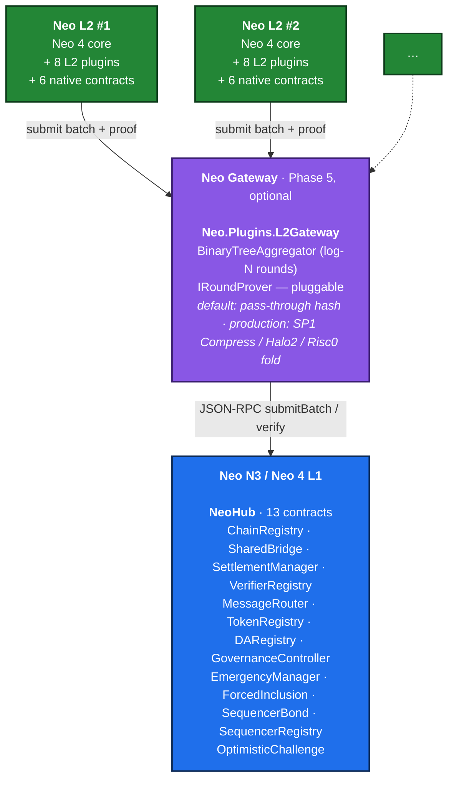

# Neo Elastic Network (`neo4`)

> **A multi-L2 network on Neo 4 core, with a shared bridge, proof aggregation, and native cross-chain messaging.**

> [!IMPORTANT]
> **This is NOT the official Neo 4 release.** This repository is an **independent
> community exploration** — a research/prototype effort to investigate what a multi-L2
> elastic-network architecture *could* look like on top of Neo's stack. It is **not
> endorsed by, affiliated with, or maintained by Neo Global Development (NGD), the Neo
> Foundation, or the [`neo-project`](https://github.com/neo-project) organization**.
> The "Neo 4" name in this repo refers to the *target core* used as the L2 execution
> kernel; the canonical Neo 4 protocol roadmap is owned by the Neo project. Treat
> design choices here as one community's prototype, not as a spec.

`neo4` is the consolidation repo for the **Neo Elastic Network** — a system that uses
[`neo-project/neo`](https://github.com/neo-project/neo) Neo 4 core as the L2 execution
kernel, anchors every L2 chain to a unified L1 contract suite (**NeoHub**) on Neo N3 / Neo 4
L1, and aggregates proofs and inter-L2 messages through an optional **Neo Gateway** layer.

The architecture borrows the *shared-bridge / chain-registry / proof-aggregation* pattern
from ZKsync Elastic Chain, rebuilt on Neo's stack: dBFT 2.0 finality, NEP-17 assets, NeoVM,
NeoFS data availability.

---

## Table of contents

1. [Architecture at a glance](#architecture-at-a-glance)
2. [What's in the repo](#whats-in-the-repo)
3. [Phased status](#phased-status)
4. [Quick start](#quick-start)
5. [Documentation map](#documentation-map)
6. [License](#license)

---

## Architecture at a glance



L1 owns canonical assets, settlement, message routing, and governance. L2s execute, batch,
and prove. Optional Gateway aggregates many L2s' proofs into one settlement post on L1.

For a full English distillation of the architecture, see [`ARCHITECTURE.md`](./ARCHITECTURE.md).
For the formal technical document, see [`WHITEPAPER.md`](./WHITEPAPER.md).
For the master Chinese spec, see [`doc.md`](./doc.md).

---

## What's in the repo

| Area              | Count     | Description                                                              |
| ----------------- | --------- | ------------------------------------------------------------------------ |
| Off-chain libraries | **15**  | `Neo.L2.{Abstractions,Audit,Batch,Bridge,Censorship,Challenge,Executor,ForcedInclusion,Messaging,Proving,Proving.Sp1,Sequencer,Settlement.Rpc,State,Telemetry}` |
| Node plugins      | **8**     | `Neo.Plugins.L2{Batch,Bridge,DA,Gateway,Metrics,Prover,Rpc,Settlement}`  |
| Smart contracts   | **19**    | 13 NeoHub L1 + 6 L2 native; all type-check via `Neo.SmartContract.Framework` |
| CLI tools         | **3**     | `neo-stack`, `neo-l2-devnet`, `neo-hub-deploy`                           |
| Native FFI        | **1**     | `bridge/neo-zkvm-bridge` — Rust cdylib + C ABI for SP1 prover P/Invoke   |
| Tests             | **658 / 25 projects**  | Module-level unit tests + integration tests + contract tests; all green |

```
neo4/
├── README.md  ARCHITECTURE.md  WHITEPAPER.md  CHANGELOG.md
├── IMPLEMENTATION_STATUS.md  CONTRIBUTING.md  AGENTS.md  LICENSE
├── doc.md                                  # master spec (Chinese, authoritative)
├── docs/                                   # operator + integrator guides
├── src/
│   ├── Neo.L2.Abstractions/                # interfaces + records (doc.md §19)
│   ├── Neo.L2.{Batch,State,Bridge,Messaging,Executor}/
│   ├── Neo.L2.{Sequencer,ForcedInclusion,Censorship,Challenge,Audit}/
│   ├── Neo.L2.Proving/  Neo.L2.Proving.Sp1/
│   ├── Neo.L2.Settlement.Rpc/
│   ├── Neo.L2.Telemetry/                   # IL2Metrics + PrometheusExporter
│   └── Neo.Plugins.L2{Batch,Bridge,DA,Gateway,Metrics,Prover,Rpc,Settlement}/
├── contracts/
│   ├── NeoHub.* (13)                       # L1 contract suite
│   └── L2Native.* (6)                      # on-L2 native contracts
├── tools/
│   ├── Neo.Stack.Cli/                      # neo-stack CLI
│   ├── Neo.L2.Devnet/                      # in-process end-to-end demo runner
│   └── Neo.Hub.Deploy/                     # declarative L1 deploy planner
├── bridge/
│   └── neo-zkvm-bridge/                    # Rust cdylib + C ABI
└── tests/                                  # 468 tests / 25 projects
```

---

## Phased status

Per [`doc.md` §18](./doc.md):

| Phase | Goal                                | Status | Evidence                                                  |
| ----- | ----------------------------------- | :----: | --------------------------------------------------------- |
| 0     | Sidechain PoC                       | ✅     | MVP integration test passes end-to-end                    |
| 1     | NeoHub v0 + Shared Bridge           | ✅     | All 13 NeoHub contracts compile; deploy planner emits 13-step bundle |
| 2     | Batch Settlement                    | ✅     | Real `KeyedStateStore` continuity verified across batches |
| 3     | Optimistic Challenge Window         | ✅     | `OptimisticChallenge` contract + `BisectionGame` (log-N narrowing) |
| 4     | NeoVM 2 / RISC-V ZK Validity Proof  | 🟡     | SP1 FFI bridge scaffolded; `--features real-prover` flips to native |
| 5     | Neo Gateway proof aggregation       | 🟡     | `BinaryTreeAggregator` + pluggable `IRoundProver` (default = pass-through) |
| 6     | Neo Stack CLI / templates           | 🟡     | 8 subcommands scaffolded                                  |

Legend: ✅ done · 🟡 substantial scaffolding + tests · 🔴 stub.

Detailed coverage per project: [`IMPLEMENTATION_STATUS.md`](./IMPLEMENTATION_STATUS.md).

---

## Quick start

**Requires** .NET 10 SDK (`dotnet --version` must report `10.0.x`) and a sibling clone of
[`neo-project/neo`](https://github.com/neo-project/neo) at `../neo`.

```bash
git clone https://github.com/neo-project/neo4
cd neo4

# Type-check everything + run all 658 tests (~10 seconds)
dotnet test Neo.L2.sln /p:NuGetAudit=false

# Run the in-process devnet (5 batches, real state-root continuity, post-run audit)
dotnet run --project tools/Neo.L2.Devnet -- 5

# Same plus a live HTTP /metrics scrape at :9090
dotnet run --project tools/Neo.L2.Devnet -- 5 --metrics-port 9090

# Generate a NeoHub deploy bundle (declarative, dependency-resolved)
dotnet run --project tools/Neo.Hub.Deploy -- scaffold --output deploy-plan.json
dotnet run --project tools/Neo.Hub.Deploy -- plan     --plan deploy-plan.json --output bundle.json

# Type-check a smart contract (no nccs required)
dotnet build contracts/NeoHub.ChainRegistry /p:NuGetAudit=false /p:DisableNccs=true
```

A 5-minute walkthrough is in [`docs/getting-started.md`](./docs/getting-started.md).

---

## Documentation map

| Document                                                                | Audience              | Purpose                                                              |
| ----------------------------------------------------------------------- | --------------------- | -------------------------------------------------------------------- |
| [`README.md`](./README.md)                                              | everyone              | This file. What is `neo4`, how to run it.                            |
| [`WHITEPAPER.md`](./WHITEPAPER.md)                                      | architects, reviewers | Formal technical document — design, security model, comparison.      |
| [`ARCHITECTURE.md`](./ARCHITECTURE.md)                                  | engineers             | English distillation of `doc.md` §-by-§ for quick cross-reference.   |
| [`doc.md`](./doc.md)                                                    | spec authors          | Master architecture spec (Chinese, authoritative).                   |
| [`IMPLEMENTATION_STATUS.md`](./IMPLEMENTATION_STATUS.md)                | reviewers             | What's built vs deferred, per project.                               |
| [`CHANGELOG.md`](./CHANGELOG.md)                                        | reviewers             | Per-iteration change log.                                            |
| [`docs/getting-started.md`](./docs/getting-started.md)                  | new contributors      | Clone → test → run devnet in 5 minutes.                              |
| [`docs/architecture-walkthrough.md`](./docs/architecture-walkthrough.md) | engineers             | Narrative tour mapping every `doc.md` section to code.               |
| [`docs/telemetry.md`](./docs/telemetry.md)                              | operators             | Metric catalog, wiring example, Prometheus exposition format.        |
| [`docs/security-model.md`](./docs/security-model.md)                    | operators, reviewers  | What L1 guarantees, threat → mitigation table, operator checklist.   |
| [`CONTRIBUTING.md`](./CONTRIBUTING.md)                                  | contributors          | Layout, conventions, PR checklist.                                   |
| [`AGENTS.md`](./AGENTS.md)                                              | AI tooling            | Guide for AI-assisted contributors.                                  |

---

## License

MIT — see [`LICENSE`](./LICENSE).
