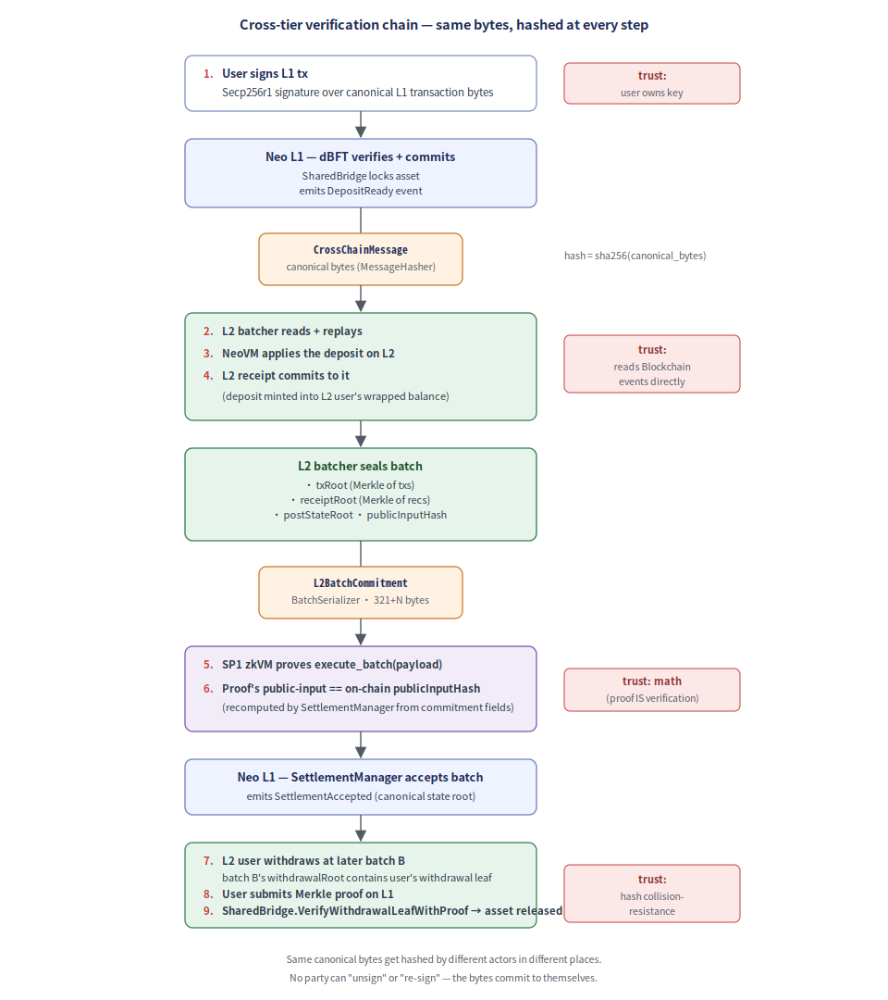

# Neo Elastic Network — Whitepaper

**Multi-L2 architecture on Neo 4 core with shared bridge, proof aggregation, and native cross-chain messaging.**

> This document is the formal technical reference for the Neo Elastic Network. The design
> is fully specified in [`doc.md`](./doc.md) (Chinese, authoritative); this whitepaper is
> the English-language formal write-up for external review and integrator onboarding.
> Implementation is tracked in [`IMPLEMENTATION_STATUS.md`](./IMPLEMENTATION_STATUS.md).

---

## Abstract

Neo Elastic Network is a multi-L2 stack that uses Neo 4 core as the L2 execution kernel,
unifies L2 chains under a shared L1 contract suite (NeoHub), and supports optional
proof aggregation and inter-L2 messaging through Neo Gateway. The design borrows ZKsync
Elastic Chain's *shared bridge / chain registry / proof aggregation* pattern and rebuilds
it on Neo's primitives — dBFT 2.0 finality, NEP-17 assets, NeoVM 2 / RISC-V execution, and
NeoFS data availability. Settlement progresses through three pluggable proof regimes —
multisig attestation, optimistic challenge, ZK validity — so chains can launch on the
weakest acceptable bar and tighten to ZK without changing the L2 stack or the L1 contracts.

---

## Table of contents

1. [Motivation](#1-motivation)
2. [System overview](#2-system-overview)
3. [L1 contract suite — NeoHub](#3-l1-contract-suite--neohub)
4. [L2 chain internals](#4-l2-chain-internals)
5. [Proof system](#5-proof-system)
6. [Asset model](#6-asset-model)
7. [Cross-chain messaging — Neo Connect](#7-cross-chain-messaging--neo-connect)
8. [Data availability](#8-data-availability)
9. [Neo Gateway — proof aggregation](#9-neo-gateway--proof-aggregation)
10. [Censorship resistance & forced inclusion](#10-censorship-resistance--forced-inclusion)
11. [Governance](#11-governance)
12. [Threat model](#12-threat-model)
13. [Phased rollout](#13-phased-rollout)
14. [Comparison to other rollup stacks](#14-comparison-to-other-rollup-stacks)
15. [Glossary](#15-glossary)

---

## 1. Motivation

Neo 4 core (the C# Neo node implementation) is a battle-tested execution kernel: dBFT 2.0
finality, native contracts, NEP-17 token standard, and a forthcoming NeoVM 2 instruction
set compatible with RISC-V. It can run a chain end-to-end. What it cannot do, on its own,
is be an L2 — there is no L1 settlement layer, no shared bridge, no proof verifier, no DA
layer, no batcher, no message router, no escape hatch. The Neo Elastic Network supplies
exactly those missing pieces, organized so that:

- **Many L2 chains can launch with one shared L1 footprint.** Each L2 reuses NeoHub for
  asset escrow, settlement, and message routing — no per-chain bridge, no per-chain
  verifier registry. This is the principal design lesson from ZKsync Elastic Chain.
- **Each L2 picks its own DA tier and proof regime** within governance-approved limits.
  RWA chains pay for L1 DA + ZK proofs; game chains can run on NeoFS DA + multisig
  attestation; users see the choice via on-chain *security labels*.
- **Chains can interoperate natively.** Neo Connect routes L1↔L2 and L2↔L2 messages
  through a single canonical message root, so a single user-facing transaction can
  legitimately span multiple L2s (a "cross-chain bundle").
- **Sequencer security is decoupled from execution security.** Even a single-operator
  sequencer can be ceremonially censorship-resistant by means of forced inclusion,
  bisection-game challenges, and explicit escape hatches.

The L1 contracts and the L2 plugin set are *finalized at the architecture level*; the
proof regime moves up the trust ladder one phase at a time without rewriting either.

---

## 2. System overview

<p align="center">
  
</p>

Three layers, each with one job:

| Layer            | Owns                                                                          | Does NOT own                          |
| ---------------- | ----------------------------------------------------------------------------- | ------------------------------------- |
| **L1**           | Canonical assets, settlement, message routing, governance, verifier registry  | Per-chain execution                   |
| **Gateway**      | Proof aggregation, global message root                                        | Custody — assets stay locked in L1    |
| **L2**           | Execution, batching, sequencing, local DA, proving                            | Independent gas issuance              |

The architectural invariant: **L2 chains can be many; assets, state verification, message
routing, and governance must be unified.**

---

## 3. L1 contract suite — NeoHub

NeoHub is the L1 contract suite shared by every L2. Conceptually it combines ZKsync's
BridgeHub, SharedBridge, VerifierRegistry, and MessageRouter into one suite. The 25 contract projects
contain 23 production contracts, one advisory structural fraud verifier, and one test-only external-bridge stub:

<p align="center">
  
</p>

- **`ChainRegistry`** — Register / configure / pause L2 chains. Each entry:
  `{chainId, operatorManager, verifier, bridgeAdapter, messageAdapter,
  securityLevel(0–3), daMode(0–3), gatewayEnabled, permissionlessExit,
  active}`.
- **`SharedBridge`** — Escrow canonical GAS / NEO / USDT / USDC / BTC / NEP-17. Lock-mint and
  burn-unlock rules. Withdrawal finalization off finalized
  `withdrawalRoot`.
- **`SettlementManager`** — Accept `L2BatchCommitment` (chainId,
  batchNumber, pre/postStateRoot, txRoot, receiptRoot, withdrawalRoot,
  l2ToL1MessageRoot, l2ToL2MessageRoot, daCommitment, publicInputHash,
  proofType, proof). Forward verification to `VerifierRegistry`.
- **`VerifierRegistry`** — Pluggable verifier dispatch by `ProofType`:
  `Multisig` (1), `Optimistic` (2), and `Zk` (3, routed through
  `ContractZkVerifier`). Gateway proof aggregation reuses these same proof
  types; there is no distinct `Aggregated` proof type.
- **`ContractZkVerifier`** — Deployable `ProofType.Zk` router. It validates
  the N4 commitment/proof envelope, verification-key id, and public-input hash
  boundary, then calls a registered terminal verifier contract for
  `verifyZkProof(...)`.
- **`Sp1Groth16Verifier`** — Immutable production SP1 terminal verifier. It pins
  the SP1 wrapper selector, recursion VK root, Groth16 verification key, successful
  exit code, and five-public-input layout; consumes the exact 356-byte SP1 proof;
  and evaluates the complete SP1 v6.1-compatible wrapper pairing equation used by SP1 6.2.x through
  Neo's current BN254 interops.
- **`MessageRouter`** — L1↔L2 and L2↔L2 message queues with
  `(chainId, nonce)` replay protection.
- **`TokenRegistry`** — Canonical L1↔L2 asset mapping:
  `{l1Asset, l2ChainId, l2Asset, assetType, mintBurn|lockMint, active}`.
- **`DARegistry`** — Record DA commitments per chain.
- **`GovernanceController`** — L2 admission policy, verifier upgrade,
  bridge emergency control, DA security-level registry.
- **`EmergencyManager`** — Pause individual chains; expose escape hatch.
- **`ForcedInclusion`** — Anti-censorship queue (see §10).
- **`SequencerBond`** — Sequencer collateral; slashing target for missed
  forced-inclusion deadlines.
- **`SequencerRegistry`** — Active sequencer committee per chain;
  admission / exit lifecycle.
- **`OptimisticChallenge`** — Phase-3 challenge window; entry point for
  the bisection-game fraud-proof flow.
- **`GovernanceFraudVerifier`** — Advisory structural verifier for offline
  audit tooling. Decodes the canonical
  `FraudProofPayload` (v1 = 101 bytes fixed, v2 = 105+N bytes with
  disputed-tx witness), validates structural integrity, emits
  accept/reject events with reason codes, but cannot authorize revert/slash and
  is excluded from the production deployment bundle.
- **`RestrictedExecutionFraudVerifier`** — Versioned fraud verifier. V3
  — re-derives pre/post Merkle state roots on-chain from each storage
  proof's leaf-hash + siblings + leafIndex and checks they are internally
  consistent with the `PreStateRoot` / `ReplayedPostStateRoot` in the
  challenger-supplied payload header. All roots come from the same
  challenger payload: it does NOT read the sequencer's committed
  `SettlementManager` batch roots and does NOT re-execute the disputed tx,
  so it is not trustless. V3 is advisory-only and `OptimisticChallenge` rejects
  it before dispatch even with governance witness. V4 is a
  separate SettlementManager-bound permissionless profile: it binds chain,
  batch, committed roots, replay domain, semantic id, transaction proof,
  transcript, claim id, and storage witness, then executes exactly one
  existing-key Counter Increment transaction. It is trustless inside that
  declared profile; multi-transaction and general NeoVM fraud proofs fail closed.

All 25 contract projects type-check against `Neo.SmartContract.Framework`. The
`Neo.Hub.Deploy` tool emits a topologically-sorted, dependency-resolved 23-step
production deploy bundle; the advisory structural verifier and test-only stub are excluded.

The principle behind NeoHub is **one suite of L1 trust roots for all L2s**. A new L2 does
not deploy a new bridge or a new verifier; it registers in `ChainRegistry` and inherits the
existing contracts.

---

## 4. L2 chain internals

Each L2 chain runs Neo 4 core plus a plugin suite and a small set of on-L2 native contracts.

<p align="center">
  
</p>

A transaction's life on an L2 chain — from user submission, through dBFT
sequencing, batch execution, sealing, proving, L1 submission, and L1 finalization
— follows a 9-stage pipeline:

<p align="center">
  
</p>

### 4.1 Plugins (`Neo.Plugins.L2*`)

Eight node plugins extending `Neo.Plugins.Plugin`:

- **`Neo.Plugins.L2Batch`** — Hooks `Blockchain.Committed`; the sealing
  logic lives in a testable `BatchSealer`.
- **`Neo.Plugins.L2Settlement`** — Wires prover + settlement client;
  signs and submits sealed batches.
- **`Neo.Plugins.L2Bridge`** — Hosts `AssetRegistry` + deposit /
  withdrawal processors.
- **`Neo.Plugins.L2DA`** — Picks a DA writer by configured `DAMode`
  (in-memory, NeoFS-like, L1, External, DAC).
- **`Neo.Plugins.L2Prover`** — Hosts an `IL2Prover` for the configured
  `ProofType`.
- **`Neo.Plugins.L2Rpc`** — Implements 10 L2 RPC methods (see §6 of
  `doc.md`); incl. `getsecuritylabel` for the §16.2 5-dimension label.
- **`Neo.Plugins.L2Gateway`** — Phase-5 proof aggregation entry point.
- **`Neo.Plugins.L2Metrics`** — Telemetry composition root: shared
  `IL2Metrics` sink + Prometheus HTTP endpoints.

### 4.2 Native L2 contracts

Six **new** on-L2 native contracts, deployed identically on every L2:

- `L2BridgeContract` — mint / burn bridged assets; receives `MintInstruction` from the bridge plugin.
- `L2MessageContract` — emit / consume cross-chain messages.
- `L2BatchInfoContract` — exposes `chainId`, `batchNumber`, L1 finalized height to apps.
- `L2FeeContract` — sequencer / prover / DA fee management.
- `L2PaymasterContract` — stablecoin / sponsored fees.
- `L2SystemConfigContract` — config synced from NeoHub.

Plus four **adjusted** (not new) native contracts: `GAS` (bridge-controlled supply on L2),
`NEO` (bridged but governance stays on L1), `Oracle` (local or via L1 pull), `Policy` (local
fee control; bridge / security are NeoHub-controlled).

Total: **10** L2 native contracts (6 new + 4 adjusted), matching
`external/neo/src/Neo/SmartContract/Native/L2NativeContracts.cs` and the count cited elsewhere
in the docs.

### 4.3 Chain security levels

Each L2 declares a `securityLevel` byte (0–3) in its `ChainRegistry` config (doc.md §16.2).
The level both names the operating mode and sets the **minimum proof type** the
`SettlementManager` will accept for that chain's batches (a batch's `ProofType` must be `>=`
the level — see §5), so a chain cannot settle below its advertised security:

| `securityLevel` | Mode descriptor   | DA           | Min proof (`ProofType`) | Trust assumption                              |
| --------------- | ----------------- | ------------ | ----------------------- | --------------------------------------------- |
| `0` sidechain   | `SidechainMode`   | local        | `None`/`Multisig`       | Trust the sequencer committee                 |
| `1` settled     | `SidechainMode`   | local / L1   | `Multisig`              | Trust the settlement multisig                 |
| `2` optimistic  | `L2RollupMode`    | L1 / NeoFS   | `Optimistic`            | Trust the verifier (and the challenge window) |
| `3` validity    | `L2RollupMode` / `L2ValidiumMode` | L1 / NeoFS / DAC | `Zk` | Trust the verifier (ZK validity proof)        |

(`securityLevel` and `ProofType` share the same `0..3` ordering, which is what makes the
"`ProofType >= securityLevel`" check meaningful.) Users can read the chain's actual security
level via the `getsecuritylevel` RPC (`§14.1` of `doc.md`).

### 4.4 Durable state — `IL2KeyValueStore`

Six off-chain components carry state that must survive a restart: the keyed state
store, RPC withdrawal/message proofs, finalized message proofs, consumed forced-
inclusion nonces, sequencer committee membership (with mid-flight exit windows),
and DA payloads. An in-memory dict is fine for tests but unacceptable in production
— a sequencer mid-exit losing its `ExitsAtUnixSeconds` deadline on restart could
re-admit a sequencer that should be in cooldown, or fail to finalize an exit that
already passed its window.

Solution: an explicit `IL2KeyValueStore` abstraction (`Put` / `Get` / `Delete` /
`Contains` / `EnumeratePrefix` / `Count` / `IDisposable`) with two implementations:

- `InMemoryKeyValueStore` — `SortedDictionary<byte[], byte[]>` with lexicographic
  ordering. Devnet / test default.
- `RocksDbKeyValueStore` — RocksDB 10.10.1 with snappy compression. Production default.

Each stateful component takes an optional `IL2KeyValueStore` ctor overload and an
ownership flag; the bare default ctor still works (in-memory) for backwards
compatibility. Devnet's `--data-dir <path>` flag wires four of these stores
(state / rpc-proofs / sequencer / da) under one root automatically. See
[`docs/persistence.md`](docs/persistence.md) for the operator wiring recipes.

### 4.5 Invariant audit — `ChainAuditor` + `IAuditCheck`

Settlement gives canonical batches; proofs cryptographically bind state transitions; DA
keeps payloads recoverable. None of those individually answer the operator's day-2
question: *"is the chain still well-formed?"* `Neo.L2.Audit.ChainAuditor` composes a
sequence of `IAuditCheck` invariants and runs them over a batch sequence on a
periodic schedule. Six built-in checks ship:

- **`ContinuityCheck`** — inter-batch state-root continuity, monotonic batch numbers, non-overlapping block ranges.
- **`NoZeroProofCheck`** — flags batches with `ProofType.None` or empty proof bytes (soft-sealed but never proved).
- **`ProofValidityCheck`** — re-runs the cryptographic verifier against each commitment's public inputs.
- **`PublicInputHashConsistencyCheck`** — pins that the stored `PublicInputHash` matches what the commitment fields hash to (catches tampered submissions).
- **`BatchRangeCheck`** — intra-batch invariants (`firstBlock <= lastBlock`, `batchNumber >= 1`).
- **`DAAvailabilityCheck`** — pings each batch's `DACommitment` against the configured DA layer's `IsAvailableAsync`.

Failures bump `l2.audit.failures` for ops dashboards; the auditor catches buggy
custom checks (`Exception` thrown from `RunAsync`) and converts them to a failure
finding so one bad check doesn't abort the whole pass. Mixed-chainId batch lists
are rejected with `ArgumentException` upstream of the per-check pipeline.

---

## 5. Proof system

The settlement hot path — from L2 batch execution through proof generation,
L1 submission, and on-chain verification — is the canonical dataflow that
binds a chain's L2 state to its L1 trust roots:

<p align="center">
  
</p>

### 5.1 What gets proved

Proof targets are **not** the C# node binary. They are the deterministic L2 state-transition
function:

```
ApplyBatch(preStateRoot, orderedTxs, l1Messages, blockContext)
  → (postStateRoot, receiptRoot, withdrawalRoot, l2ToL1MessageRoot, l2ToL2MessageRoot)
```

Public inputs (committed in `L2BatchCommitment.publicInputHash`):

```
chainId, batchNumber, preStateRoot, postStateRoot, txRoot, receiptRoot,
withdrawalRoot, l2ToL1MessageRoot, l2ToL2MessageRoot, l1MessageHash,
daCommitment, blockContextHash
```

Witness: ordered txs, contract bytecode, storage read/write paths, native-contract state
witness, L1 messages consumed, DA data, execution trace.

### 5.2 Three-stage progression

```
Stage 0 — Multisig attestation  (production-usable from day 1)
Stage 1 — Optimistic + bisection-game (governance-arbitrated challenge flow)
Stage 2 — ZK validity proof    (NeoVM 2 / RISC-V via SP1)
```

The verifier registry on L1 dispatches by `ProofType`; the same `L2BatchCommitment` shape
carries any of the three. A chain progresses by changing its registered verifier — no L2
plugin code or L2 contract changes required.

- **Stage 0 — `AttestationVerifier`.** Producer: `AttestationProver` +
  `ISignerSet`. Status: production-ready; M-of-N secp256r1 over
  canonical public-input bytes.
- **Stage 1 — `OptimisticVerifier`.** Producer: `OptimisticProofPayload`
  + sequencer signature. Status: Stage-1 verifier; the shipped fraud
  verifiers are structural / governance-arbitrated (they validate payload
  structure and self-consistency, not self-contained cryptographic proofs
  that bind to the committed roots or re-execute). `BisectionGame` is an
  off-chain log-N narrowing of the disputed tx.
- **Stage 2 — `ContractZkVerifier` → `Sp1Groth16Verifier`.** Producer:
  `prove-batch daemon` (real, out-of-process) + `MockRiscVProver` (in-process
  test seam). The immutable terminal contract implements the complete
  five-public-input SP1 v6.1-compatible Groth16 wrapper used by SP1 6.2.x over Neo
  BN254 interops and accepts the exact 356-byte SP1 proof shape. The production
  deploy plan registers the program VK, binds the terminal verifier, permanently
  disables envelope-only SP1 acceptance, and only then enables the
  `ProofType.Zk` route. Current Neo VM tests cover artifact integrity, constants,
  rejection behavior, pairing dispatch, and cost. A Rust-produced positive
  proof verifies through both the terminal contract and production router;
  tampering with the VK, public-input hash, wrapper fields, or proof points fails closed.

Gateway proof aggregation (Phase 5) reuses the same registry and the existing proof types: a
round prover (`MultisigRoundProver` / `MerklePathRoundProver`) attests each aggregation round,
and the aggregate still settles under one of `Multisig` / `Optimistic` / `Zk`. There is no
distinct `ProofType.Aggregated`. The bundled SP1 6.2.1 Gateway guest verifies compile-time-VK-
locked compressed batch proofs and the canonical `NEO4GWR2` statement, while its host emits and
verifies the terminal 356-byte Groth16 artifact; the aggregate settles as `ProofType.Zk`.

---

## 6. Asset model

- **Canonical GAS lives only on Neo N3 / Neo 4 L1.** L2s cannot issue independent canonical
  GAS; what looks like GAS on an L2 is a bridge-locked representation.
- **L2 fees default to bridged GAS.** Paymasters in `L2PaymasterContract` allow stablecoin
  fees and sponsored transactions.
- **NEO can be bridged**, but governance power stays on L1 — voting is computed at L1.
- **NEP-17 tokens** are mapped 1:1 via `TokenRegistry`. Per-asset config: `lockMint` (lock
  on L1, mint on L2) or `mintBurn` (canonical asset minted on L2, burned to release on L1).

This is invariant across chains: there is no per-L2 fork of the asset model.

---

## 7. Cross-chain messaging — Neo Connect

Three flows, all routed through the same `MessageRouter` + `(chainId, nonce)` replay-protected envelope:

<p align="center">
  
</p>

### 7.1 L1 → L2

```
NeoHub.MessageRouter.enqueueL1ToL2Message(chainId, target, payload)
  → L2 watches the L1 queue
  → L2 includes the message in the next batch
  → L2BatchCommitment.l1MessageHash commits to the consumed-set
  → L2 native contract executes the message
```

### 7.2 L2 → L1

```
L2 contract emits message via L2MessageContract
  → message hash → L2BatchCommitment.l2ToL1MessageRoot
  → batch finalized on NeoHub.SettlementManager
  → user submits Merkle proof to NeoHub to consume the message on L1
```

### 7.3 L2 → L2

```
Source L2 emits via L2MessageContract
  → batch finalized on NeoHub or Gateway
  → Gateway's globalMessageRoot updated
  → relayer submits inclusion proof to target L2
  → target L2 native contract executes the message
```

### 7.4 Cross-chain bundle

A user-facing primitive: a single transaction whose effect spans multiple L2s. Internally
implemented as multiple coordinated messages plus a relayer; user sees one tx hash and one
sign-flow. Detailed in `doc.md` §10.4.

---

## 8. Data availability

Three tiers, on-chain labeled in `ChainRegistry.daMode`:

<p align="center">
  
</p>

| DA mode      | Cost   | Security                                   | Recommended for                       |
| ------------ | ------ | ------------------------------------------ | ------------------------------------- |
| `L1`         | high   | inherits L1 (Neo N3 / Neo 4)               | RWA, stablecoin, high-value DeFi      |
| `NeoFS`      | low    | NeoFS replication + L1-recorded commitment | game, social, enterprise              |
| `External`   | low    | user-trusts external DA layer              | ecosystem-specific (e.g. Celestia)    |
| `DAC`        | lowest | committee attestation only                 | approved-list chains; visibly labeled |

`MetricsEmittingDAWriter` wraps each DA backend with `mode`-tagged Prometheus metrics
(`l2.da.published`, `l2.da.publish_latency_ms`, `l2.da.publish_failures`) so operators can
compare DA backends on the same dashboard.

The `IDAWriter` contract is unchanged across modes; the DA mode determines which concrete
implementation gets injected at plugin-configure time.

---

## 9. Neo Gateway — proof aggregation

Phase 5 introduces an optional aggregation layer mirroring ZKsync Gateway. The Gateway:

<p align="center">
  
</p>

- Collects `L2BatchCommitment` plus proof from multiple L2 chains.
- Aggregates them via `BinaryTreeAggregator` over `IRoundProver`-implemented combine
  rounds (log-N rounds; `PassThroughRoundProver` is reference-only,
  `MultisigRoundProver` and `MerklePathRoundProver` are non-recursive options, and the
  bundled `neo-zkvm-gateway-{guest,host}` path recursively verifies compile-time-VK-locked
  SP1 compressed batch proofs before producing a terminal 356-byte Groth16 proof).
- Maintains the `globalMessageRoot` for L2-to-L2 messages.
- Submits one aggregated commitment to `SettlementManager.PublishGatewayGlobalRoot` with
  exact ordered `(chainId,batchNumber)` references. SettlementManager revalidates every
  constituent as currently finalized and Gateway-enabled, reconstructs the commitment root
  (duplicate-odd) and message root (promote-odd) from stored records with O(log 4096) memory,
  advances non-revertible per-chain watermarks, and atomically calls
  `MessageRouter.PublishGlobalRoot`. MessageRouter verifies the fixed backend/proof-system/
  Gateway-VK/replay-domain statement through its configured verifier; a Router fault rolls
  back every watermark. Direct operator publication cannot satisfy the SettlementManager
  contract witness.

The code path is complete and locally covered, including crash-safe daemon recovery,
deployment readback, root-policy edge cases, tamper rejection, and atomic rollback. Phase 5
remains partial until independent audit and executed production-config real-proof deployment
evidence exist; those evidence gates are not implied by local tests.

**Critical invariant: the Gateway does NOT custody assets.** Assets stay locked in
NeoHub.SharedBridge throughout; the Gateway moves only proofs and message roots.

---

## 10. Censorship resistance & forced inclusion

Sequencer censorship is the canonical L2 attack. Three layered defenses:

<p align="center">
  
</p>

1. **Forced inclusion queue** (`NeoHub.ForcedInclusion`, `Neo.L2.ForcedInclusion`,
   `Neo.L2.Censorship`). A user can post a tx directly to L1 and assert a deadline. The
   sequencer must include the tx in a batch before the deadline elapses. Missing the
   deadline produces a `CensorshipReport` (`Neo.L2.Censorship.CensorshipDetector`) usable
   to slash via `NeoHub.SequencerBond`.

2. **Sequencer bonds** (`NeoHub.SequencerBond`, `NeoHub.SequencerRegistry`). Every active
   sequencer committee member posts collateral; censorship reports slash the responsible
   member's bond.

3. **Escape hatch** (`NeoHub.EmergencyManager`). On confirmed sequencer-side liveness
   failure, governance can pause the L2. While paused, autonomous on-L1 payout exists
   only for withdrawals the sequencer ALREADY finalized, via
   `SharedBridge.EmergencyFinalizeWithdrawalWithProof` (verified against the batch
   `withdrawalRoot`). `EmergencyManager.EscapeHatchExit` over a state leaf does NOT move
   any funds: it records a replay-protected exit CLAIM (per `(chainId, leafHash)`) and
   emits an event; a never-finalized state-leaf exit yields a claim that governance /
   off-chain settlement releases escrow against. Full autonomous state-leaf payout
   direct from L1 is roadmap.

These three together mean: **no individual sequencer can permanently exclude a user's
transaction from a chain that is alive at all.**

---

## 11. Governance

Three layers:

| Layer       | Authority                                              | What it controls                                                              |
| ----------- | ------------------------------------------------------ | ----------------------------------------------------------------------------- |
| L1          | Neo Council (`GovernanceController`)                    | NeoHub upgrade, verifier registry, bridge upgrade, emergency pause, L2 admission policy |
| L2 local    | The L2's own governance contract                       | Sequencer committee, local fee policy, app-chain params, DA mode (within approved range) |
| App         | Each dApp / RWA issuer / stablecoin policy             | Per-app rules, KYC list, enterprise permissioning                              |

The L1 council and threshold are initialized in `GovernanceController._deploy` and can
later be replaced atomically through the proposal-bound, threshold-approved, timelocked
`RotateCouncil` action. Each rotation increments `councilEpoch`, invalidates every
proposal from the previous epoch, and is replay-protected per proposal id. The timelock
itself remains deployment-fixed and the contract has no `ContractManagement.Update`
path. There is no on-chain NEO-holder referendum; that mechanism remains roadmap.

Every L2 must publish security labels per `doc.md` §16.2: securityLevel
(`SecurityLevel` enum — Sidechain / Settled / Optimistic / Validity / Validium),
daMode (`DAMode` enum — L1 / NeoFS / External / DAC), gatewayEnabled (Phase-5
aggregation participation), sequencerModel (Centralized / DbftCommittee /
Decentralized), exitModel (Permissionless / Delayed / OperatorAssisted).
Users query the full set via `getsecuritylabel` (or each dimension singly via
`getsecuritylevel` / `getsequencerModel` / `getExitModel` / `getDAMode` /
`getGatewayEnabled` / `getPermissionlessExit` on the on-chain
`ChainRegistry`); UIs should surface them prominently.

---

## 12. Threat model

Ten threat classes, each with a named mitigation. Detailed in `doc.md` §17.

| #  | Threat                          | Primary mitigation                                                  |
| -- | ------------------------------- | ------------------------------------------------------------------- |
| 1  | Sequencer censorship            | Forced inclusion + bond slashing + escape hatch (§10)               |
| 2  | Invalid state root              | ZK validity proof (Phase 4) or optimistic challenge (Phase 3)       |
| 3  | Bridge exploit                  | Lock-mint vs burn-unlock invariants; rate limits; emergency pause   |
| 4  | Replay attack (cross-chain)     | `(chainId, nonce)` envelope on every message                        |
| 5  | DA unavailability               | Public DA security label in `ChainRegistry`; escape hatch on opacity |
| 6  | Malicious validator committee   | Sequencer bonds; rotate-out via `SequencerRegistry`                 |
| 7  | Prover bug                      | `VerifierRegistry` upgrade behind governance delay + security council veto |
| 8  | Verifier upgrade attack         | Same governance-delay + veto path as prover bugs                    |
| 9  | Message duplication             | `MessageRouter` per-pair `(chainId, nonce)` dedup                    |
| 10 | L2 contract bug                 | Local L2 emergency pause + `EmergencyManager` escape hatch           |

The codebase additionally enforces dozens of defensive invariants — see CHANGELOG iter
67 onward for the catalog. Examples: cross-batch withdrawal-nonce dedup, public-input
hash equality between prover and settler, signer-set deduplication before signature
verification, exception-typed metric tags so dashboards can separate contract violations
from network failures.

---

## 13. Phased rollout

Each phase shifts a chain's *security label* one rung up the trust ladder
— from sequencer-trusted sidechain through optimistic rollup to ZK
validity. The L1 contracts and L2 plugin set are stable across phases;
the *verifier* changes:

<p align="center">
  
</p>

Per `doc.md` §18:

| Phase | Goal                                | Security label (visible to users) |
| ----- | ----------------------------------- | --------------------------------- |
| 0     | Neo 4 sidechain PoC                 | sidechain                         |
| 1     | NeoHub v0 + SharedBridge            | connected sidechain               |
| 2     | Batch settlement                    | settled L2                        |
| 3     | Optimistic challenge window         | optimistic rollup                 |
| 4     | NeoVM 2 / RISC-V validity proof     | zk validity rollup                |
| 5     | Neo Gateway aggregation + L2-L2     | Neo Elastic Network               |
| 6     | Neo Stack CLI + templates           | (permissionless launch)            |

Each phase shifts the security label one rung up the trust ladder. The L1 contracts and
the L2 plugin set are stable across phases; the *verifier* changes.

---

## 14. Comparison to other rollup stacks

| Aspect                  | Neo Elastic Network              | ZKsync Elastic Chain    | OP Stack                      | Arbitrum Orbit                  |
| ----------------------- | -------------------------------- | ----------------------- | ----------------------------- | ------------------------------- |
| Execution kernel        | Neo 4 (NeoVM2 / RISC-V for L2; NeoVM only for legacy compatibility) | EraVM (zkEVM) | EVM (op-geth) | EVM (Nitro) |
| L1 settlement contracts | NeoHub (23 production + advisory structural verifier + test stub) | BridgeHub + SharedBridge + V.R. | OptimismPortal etc.    | RollupCore + Inbox              |
| Sequencer               | dBFT 2.0 committee (M-of-N)      | Centralized (with FCFS) | Centralized (decentralizing)  | Centralized (decentralizing)    |
| Proof regimes           | Multisig → Optimistic → ZK       | ZK (production)         | Optimistic (Cannon)           | Optimistic (BOLD challenge game) |
| Native interop          | L1↔L2 + L2↔L2 + bundles          | Native L2-L2 via Gateway | Superchain interop (early)   | Cross-chain Inbox messaging     |
| DA tiers                | L1 / NeoFS / External / DAC      | Validium + GW DA        | EthDA / AnyTrust              | AnyTrust + ETH DA               |
| Gas token               | Bridged GAS canonical            | Custom per chain        | ETH (no custom-base support yet) | Configurable                |
| Governance              | Neo Council (epoch-bound timelocked rotation; NEO-holder referendum is roadmap) | DAO + security council | Optimism Foundation + Council | Arbitrum DAO + Security Council |

The headline architectural choice is **borrowing Elastic Chain's shared-bridge pattern but
swapping in Neo's primitives** — dBFT 2.0 finality (single-block confirms with no MEV
auction needed at L2 level), NEP-17 (no need for per-chain ERC-20 deployments), NeoVM 2 /
RISC-V (smaller proving target than zkEVM), and NeoFS DA (cheaper than blob DA for non-L1
tiers).

This is architectural borrowing, not proof-stack identity. Neo N4's shipped
validity path is SP1 Groth16 over BN254 with a Neo contract verifier; ZKsync's
production proof stack uses its own Boojum/Plonk-family circuits and verifier
pipeline. The two systems therefore do not have a 1:1 proof-system implementation.

---

## 15. Glossary

| Term                       | Meaning                                                                                       |
| -------------------------- | --------------------------------------------------------------------------------------------- |
| **L2 chain**               | A rollup / sidechain / validium running Neo 4 core + the L2 plugin set, registered in NeoHub. |
| **NeoHub**                 | The 24-production-contract L1 suite shared by every L2, plus one test-only external bridge stub. |
| **Neo Gateway**            | Optional Phase-5 proof-aggregation + global-message-root layer.                               |
| **Neo Connect**            | The cross-chain messaging system (L1↔L2, L2↔L2, bundles).                                     |
| **L2BatchCommitment**      | The per-batch on-chain object: roots, public-input hash, proof type, proof bytes.             |
| **publicInputHash**        | `Hash256` over the canonical encoding of the batch's public inputs; tying proof to commitment. |
| **withdrawalRoot**         | Merkle root of withdrawal-leaf hashes; users prove inclusion to claim L1 assets.              |
| **l2ToL1MessageRoot / l2ToL2MessageRoot** | Per-class outbox Merkle roots committed in the batch.                          |
| **daCommitment**           | Hash committing to the batch's DA blob; bound by DA mode.                                     |
| **Forced inclusion**       | L1-side queue any user can post to; sequencer must include before deadline.                   |
| **Bisection game**         | Off-chain log-N narrowing optimization (`Neo.L2.Challenge.BisectionGame`) that converges to a disputed transaction index. `OptimisticChallenge.Challenge` is single-shot. Restricted v4 executes the exact one-transaction Counter profile on-chain; general multi-step NeoVM bisection/re-execution remains unsupported. |
| **Security label**         | Public on-chain claim of a chain's DA / proof / sequencer model; `getsecuritylevel` RPC.     |
| **Escape hatch**           | Operator-of-last-resort path for users to withdraw if the sequencer fails. Owned by `EmergencyManager`. |

---

For implementation specifics, see `IMPLEMENTATION_STATUS.md`. For the master spec, see
`doc.md`. For the narrative tour through the codebase, see
`docs/architecture-walkthrough.md`.
