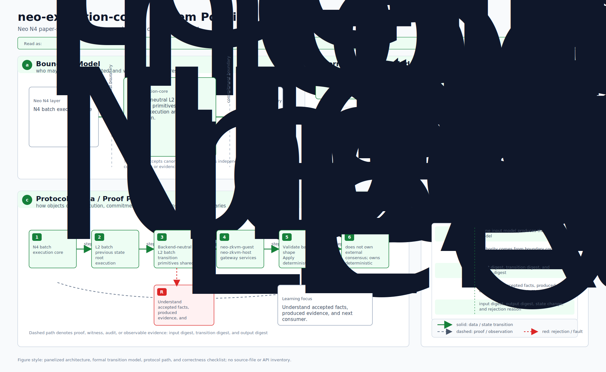
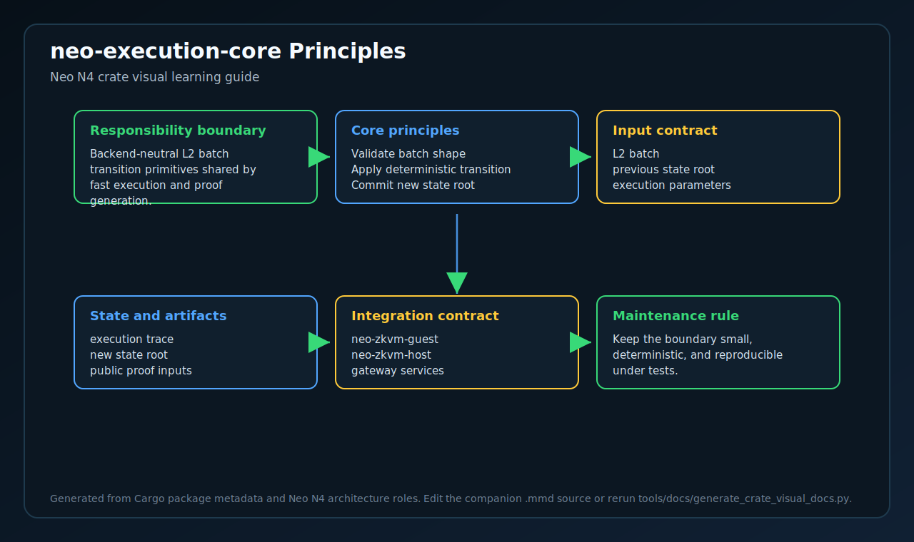
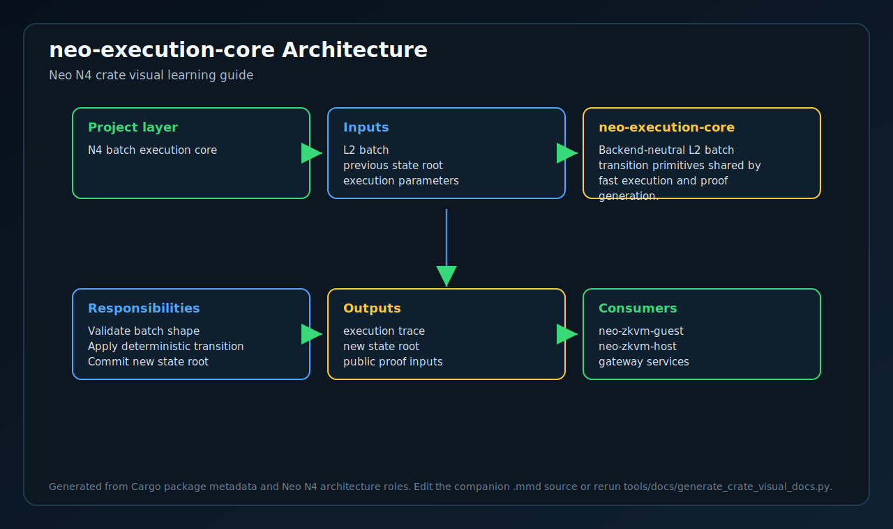
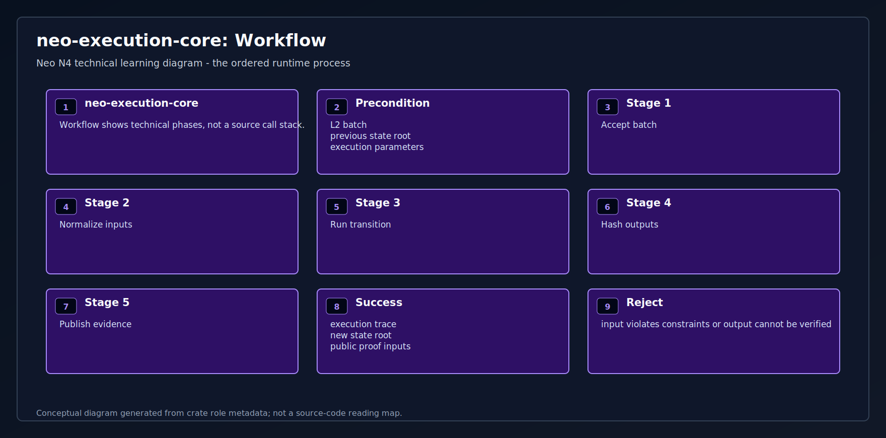
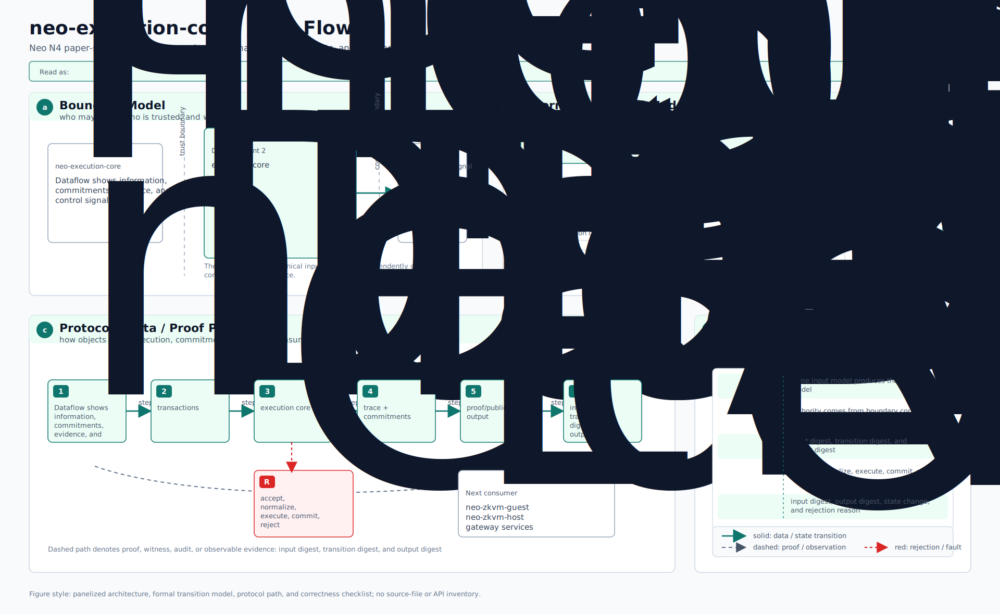
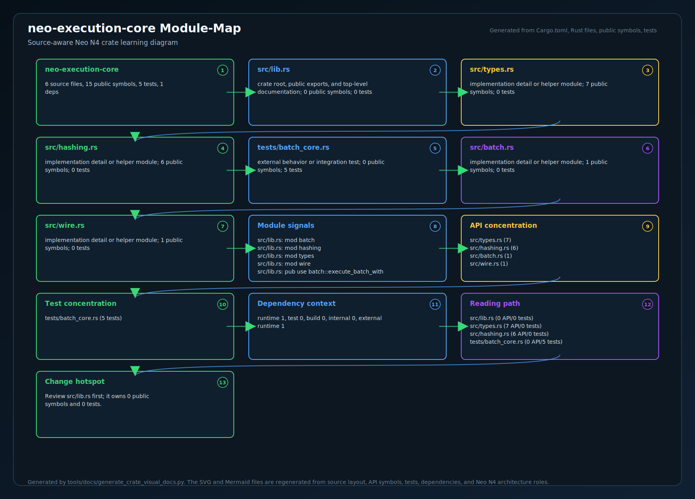
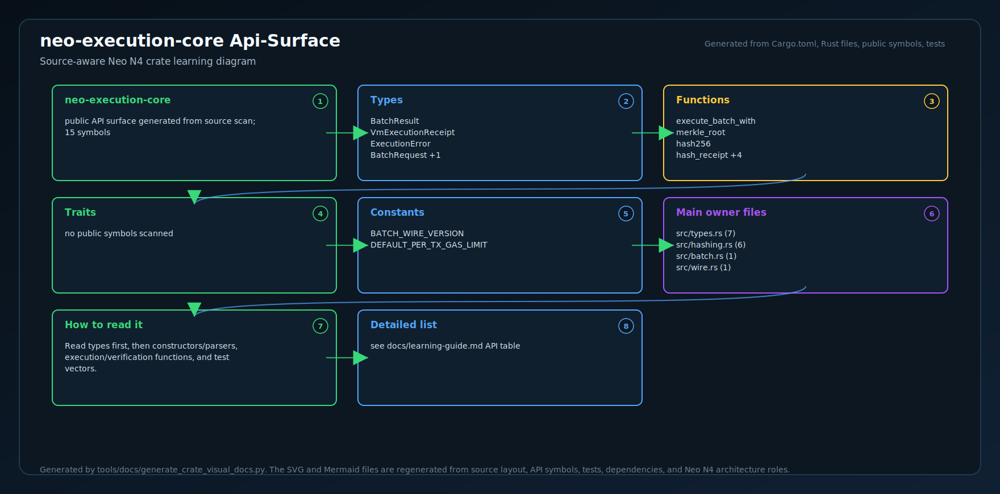
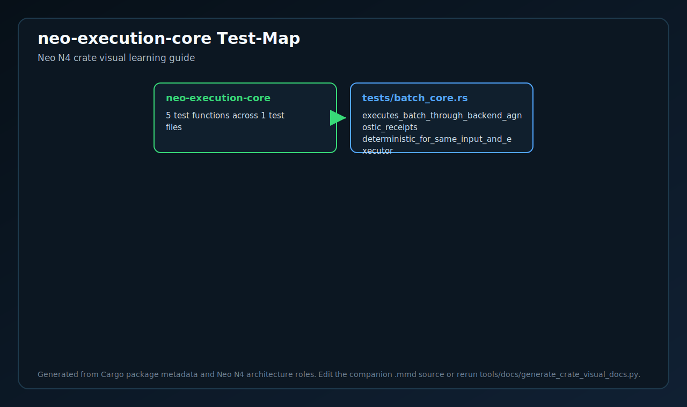
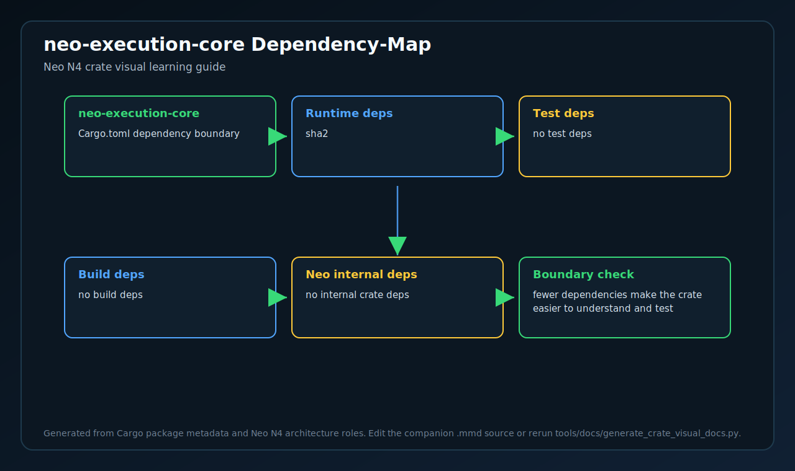

# neo-execution-core

Backend-agnostic Neo L2 batch execution primitives shared by prover and fast
execution adapters.

This crate is deliberately not a VM:

- no SP1 dependency;
- no PolkaVM dependency;
- no NeoVM opcode interpreter;
- `#![no_std]` with `alloc`, so it can be used by constrained guests later.

It owns only the deterministic batch contract that both execution paths must
agree on:

1. parse canonical `BatchExecutionRequest` bytes;
2. fold L1 messages into the running state root;
3. call a backend-supplied per-transaction executor;
4. commit the backend's `VmExecutionReceipt` into receipt/state roots;
5. compute `txRoot`, `receiptRoot`, `postStateRoot`, and `publicInputHash`.

## Backend model

The shared boundary is `VmExecutionReceipt`:

```rust
pub struct VmExecutionReceipt {
    pub state: u8,
    pub gas_consumed: u64,
    pub output_hash: [u8; 32],
}
```

The zkVM guest maps `neo_vm_guest::ProofOutput` into this shape. A
PolkaVM-backed RISC-V adapter should map `neo_riscv_abi::ExecutionResult` the
same way, after hashing its canonical ABI result bytes. The core never needs to
know which VM produced the receipt.

## Why PolkaVM stays outside

`external/neo-riscv-vm` is the PolkaVM-backed Neo RISC-V execution engine. It
is the fast execution path, benchmarking target, and parity oracle. This crate
does not link to PolkaVM because the same batch commitment logic must also run
inside SP1's zkVM guest. Keeping the boundary at `VmExecutionReceipt` prevents
the proving path from depending on a native PolkaVM host while still allowing
both backends to share the exact same batch folding rules.

## Tests

```bash
cargo test -p neo-execution-core
```

<!-- N4-CRATE-VISUAL-GUIDE:START -->

## Crate Visual Learning Guide

These diagrams are local to this crate. They explain `neo-execution-core` as an independent unit: where it sits in the Neo N4 stack, which boundary it owns, how its internal workflow runs, and how data moves through it.

For the full source-level explanation, read [docs/learning-guide.md](docs/learning-guide.md).

| View | Diagram | Source |
| --- | --- | --- |
| Position in Neo N4 |  | [Mermaid](docs/figures/position.mmd) |
| Technical principles |  | [Mermaid](docs/figures/principles.mmd) |
| Architecture |  | [Mermaid](docs/figures/architecture.mmd) |
| Workflow |  | [Mermaid](docs/figures/workflow.mmd) |
| Dataflow |  | [Mermaid](docs/figures/dataflow.mmd) |
| Module map |  | [Mermaid](docs/figures/module-map.mmd) |
| Public API surface |  | [Mermaid](docs/figures/api-surface.mmd) |
| Test evidence |  | [Mermaid](docs/figures/test-map.mmd) |
| Dependency map |  | [Mermaid](docs/figures/dependency-map.mmd) |

### Role in Neo N4

- **Layer:** N4 batch execution core
- **Purpose:** Backend-neutral L2 batch transition primitives shared by fast execution and proof generation.
- **Primary inputs:** L2 batch, previous state root, execution parameters
- **Primary outputs:** execution trace, new state root, public proof inputs
- **Downstream consumers:** neo-zkvm-guest, neo-zkvm-host, gateway services
- **Source files scanned:** 6
- **Public symbols scanned:** 15
- **Rust tests scanned:** 5

### Boundary and Responsibilities

- **Owns:** Validate batch shape, Apply deterministic transition, Commit new state root
- **Consumes:** L2 batch, previous state root, execution parameters
- **Produces:** execution trace, new state root, public proof inputs
- **Used by:** neo-zkvm-guest, neo-zkvm-host, gateway services

### Source Map Snapshot

| File | Why it matters | Public API | Tests |
| --- | --- | ---: | ---: |
| `src/lib.rs` | crate root, public exports, and top-level documentation | 0 | 0 |
| `src/types.rs` | implementation detail or helper module | 7 | 0 |
| `src/hashing.rs` | implementation detail or helper module | 6 | 0 |
| `tests/batch_core.rs` | external behavior or integration test | 0 | 5 |
| `src/batch.rs` | implementation detail or helper module | 1 | 0 |
| `src/wire.rs` | implementation detail or helper module | 1 | 0 |

### API Snapshot

| Kind | Representative symbols |
| --- | --- |
| Types | BatchResult <br> VmExecutionReceipt <br> ExecutionError <br> BatchRequest +1 |
| Functions | execute_batch_with <br> merkle_root <br> hash256 <br> hash_receipt +4 |
| Trait | no public symbols scanned |
| Constants | BATCH_WIRE_VERSION <br> DEFAULT_PER_TX_GAS_LIMIT |

### Learning Path

1. Start with the position diagram to understand why this crate exists and who calls it.
2. Read the technical principles diagram to identify the invariants and responsibility boundary.
3. Use the module map and API surface to identify the files and symbols to read first.
4. Follow the workflow, dataflow, test, and dependency diagrams before changing code.

<!-- N4-CRATE-VISUAL-GUIDE:END -->
