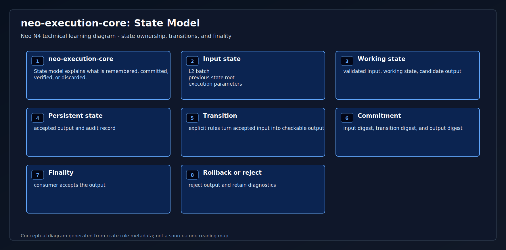
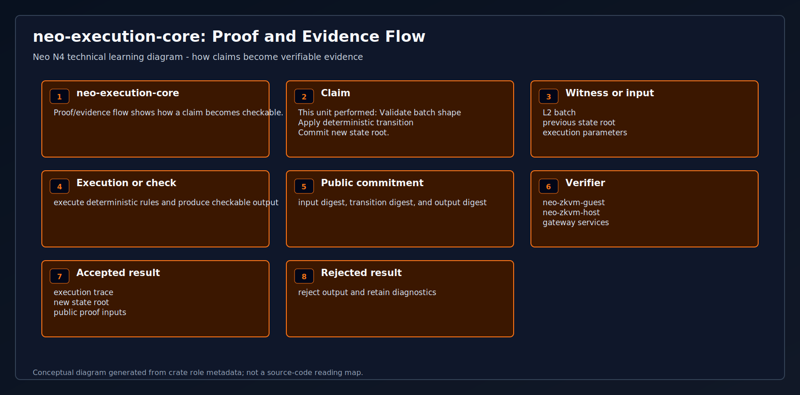
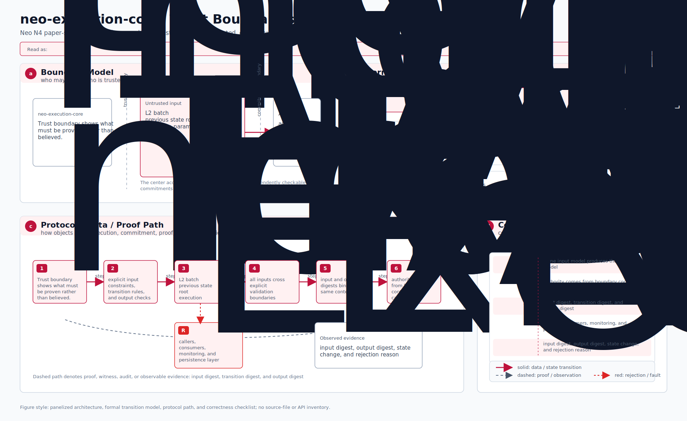
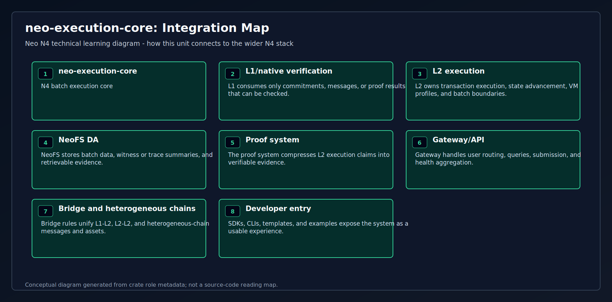
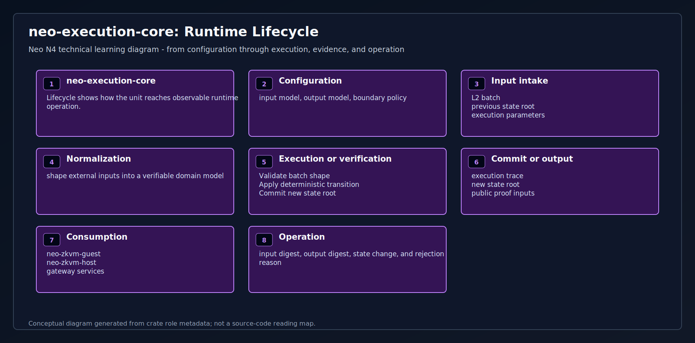

# neo-execution-core

Backend-agnostic Neo L2 batch execution primitives shared by prover and fast
execution adapters.

This crate is deliberately not an opcode VM:

- no SP1 dependency;
- no PolkaVM dependency;
- no NeoVM opcode interpreter;
- `#![no_std]` with `alloc`, so it can be used by constrained guests later.

It owns the canonical proof boundary shared by host and guest:

1. decode the existing `ProofWitnessArtifactV1` / `ExecutionPayloadV1` envelope;
2. decode complete Neo transactions, signer scopes/rules, attributes, and witnesses;
3. verify bounded `NEO4STW1` pre-state plus contract code/manifest bindings;
4. apply the restricted N4 genesis V1 deposit against the real native bridge/token layout;
5. validate backend-produced storage overlays and notifications;
6. derive native withdrawal/message roots from exact canonical event ABIs;
7. encode the frozen 105-byte receipt and `NEO4EFX1` effects;
8. recompute state, transaction, receipt, DA, context, and public-input hashes;
9. reject every host-supplied result, effect, or root that differs.

## Backend model

The shared boundary is `VmOutcome`: HALT/FAULT, actual gas, sorted full-key
storage deltas, and ordered full notification states. The core computes
`CanonicalReceiptV1` itself. A backend cannot provide a trusted receipt hash or
post-state root.

## Why PolkaVM stays outside

`external/neo-riscv-vm` remains the fast PolkaVM execution path. This crate
does not link to PolkaVM or SP1; the SP1 guest supplies the `neo-vm-rs`
stateful syscall provider while the core keeps all wire and commitment rules
backend-neutral.

## Tests

```bash
cargo test -p neo-execution-core
```

<!-- N4-CRATE-VISUAL-GUIDE:START -->
## Technical Visual Guide

These diagrams are local to this crate and explain `neo-execution-core` at the technical architecture level. They focus on system role, principles, data movement, workflow, state, proof/evidence, trust boundaries, integration, and runtime lifecycle.

Full technical explanation: [docs/learning-guide.md](docs/learning-guide.md).

| View | Diagram | Mermaid |
| --- | --- | --- |
| System Position |  | [Mermaid](docs/figures/position.mmd) |
| Technical Principles |  | [Mermaid](docs/figures/principles.mmd) |
| Conceptual Architecture |  | [Mermaid](docs/figures/architecture.mmd) |
| Workflow |  | [Mermaid](docs/figures/workflow.mmd) |
| Data Flow |  | [Mermaid](docs/figures/dataflow.mmd) |
| State Model |  | [Mermaid](docs/figures/state-model.mmd) |
| Proof and Evidence Flow |  | [Mermaid](docs/figures/proof-flow.mmd) |
| Trust Boundaries |  | [Mermaid](docs/figures/trust-boundaries.mmd) |
| Integration Map |  | [Mermaid](docs/figures/integration-map.mmd) |
| Runtime Lifecycle |  | [Mermaid](docs/figures/lifecycle.mmd) |

### Technical Role

- **Layer:** N4 batch execution core
- **Purpose:** Backend-neutral L2 batch transition primitives shared by fast execution and proof generation.
- **Inputs:** L2 batch | previous state root | execution parameters
- **Responsibilities:** Validate batch shape | Apply deterministic transition | Commit new state root
- **Outputs:** execution trace | new state root | public proof inputs
- **Consumers:** neo-zkvm-guest | neo-zkvm-host | gateway services

### Reading Order

1. Start with system position and conceptual architecture.
2. Read technical principles, trust boundaries, and state model to understand correctness.
3. Follow workflow and dataflow to see runtime movement.
4. Use proof/evidence flow, integration map, and lifecycle for operational understanding.
<!-- N4-CRATE-VISUAL-GUIDE:END -->
