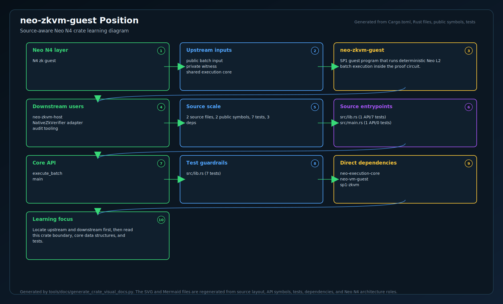
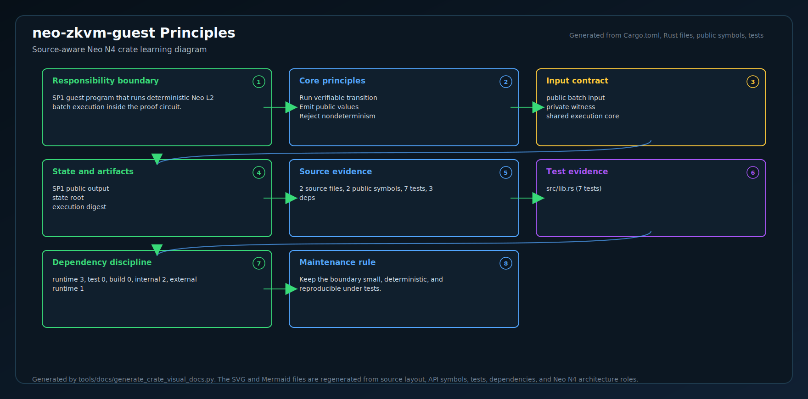
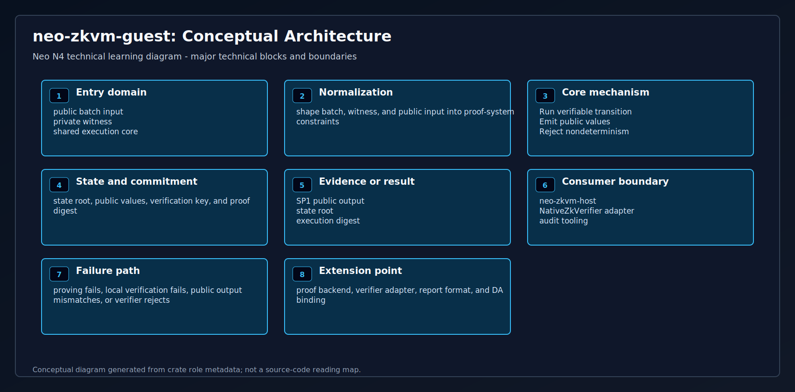
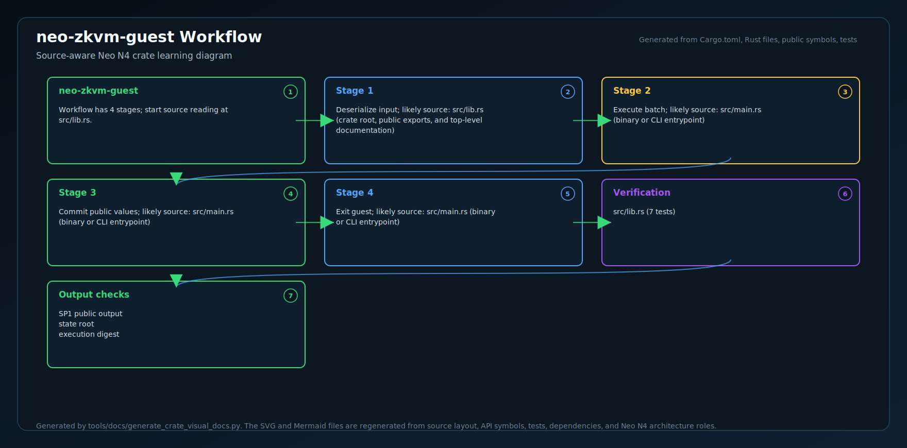
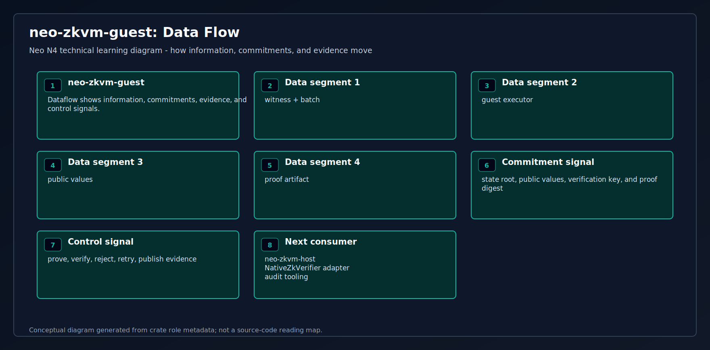
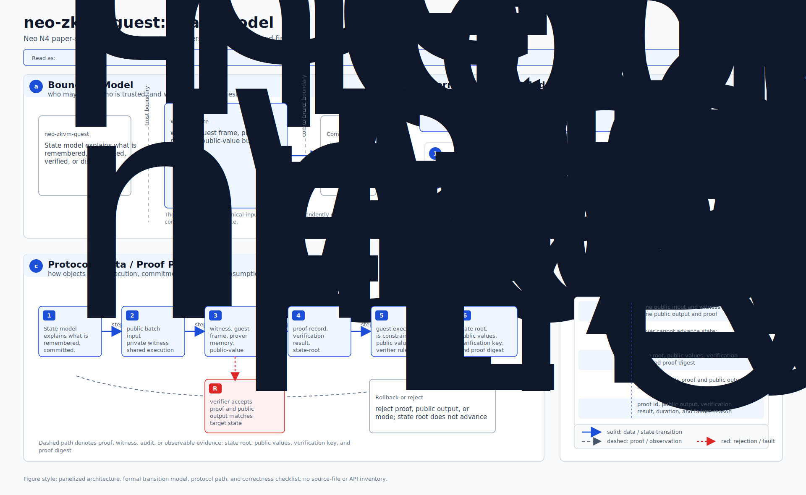
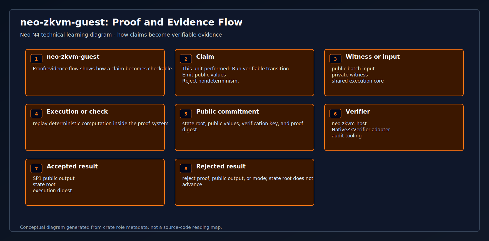
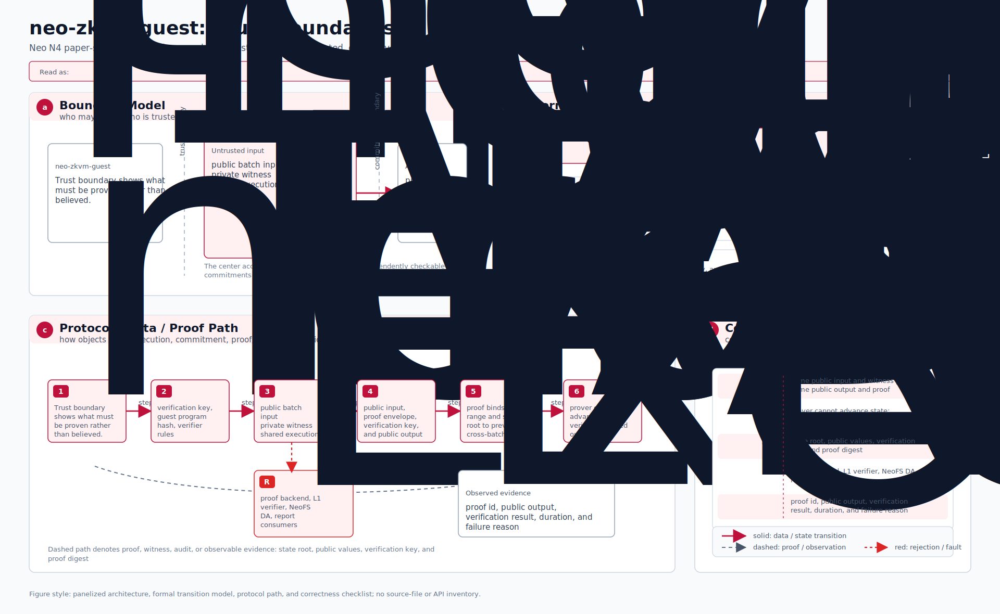
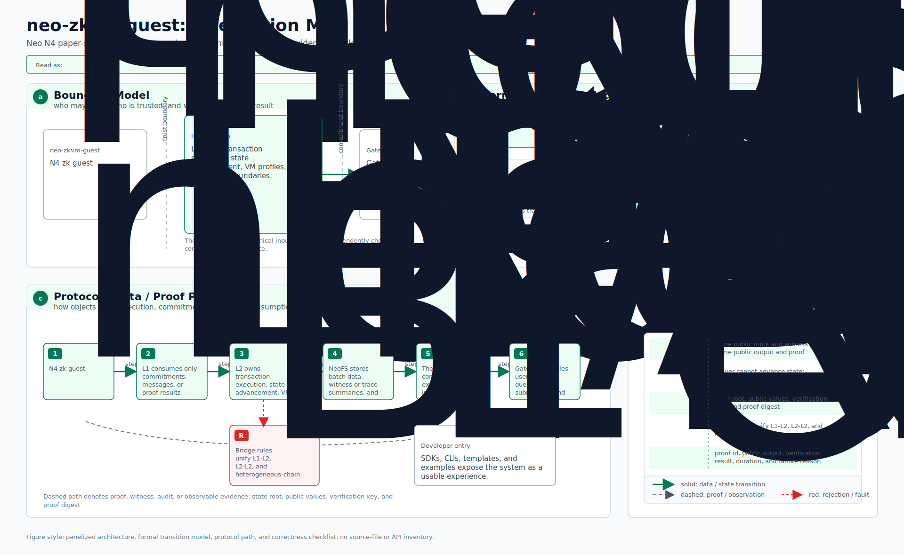
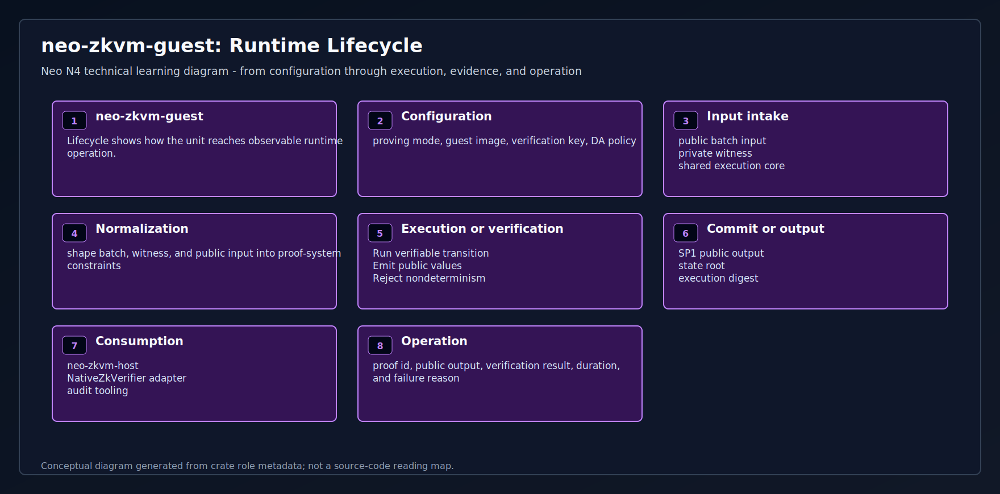

# neo-zkvm-guest

The Rust crate that compiles to a RISC-V ELF and runs inside the SP1 zkVM.
**This is the function the SP1 prover proves correct** — the deterministic
batch executor that any L2 chain running in Stage-2 (ZK validity) mode
points its prover at. The same crate also builds the host-native
`neo-zkvm-executor`; both entrypoints call the same execution core and VM runtime,
so the sequencer does not maintain a competing execution implementation.

## Position in the stack

```
[off-chain L2 sequencer]
         ↓ NEO4EXEC + complete pre-state NEO4STW1
[neo-zkvm-executor (same crate/runtime, SHA-256 pinned)]
         ↓ validated NEO4EXR1 + atomic complete post-state commit
         ↓ canonical ProofWitnessArtifactV1 bytes (*.batch.bin)
[bridge/neo-zkvm-host  (prove-batch daemon)]
         ↓ loads neo-zkvm-guest (this crate) into SP1 zkVM
         ↓ decodes full Neo transactions + verifies state/code/manifest witness
         ↓ runs tx.Script through neo-vm-rs with stateful syscalls
         ↓ produces ZK proof + verifying-key bytes + public-input commitment
[L1 NeoHub.VerifierRegistry]
         ↓ verifies proof
[L1 NeoHub.SettlementManager]
         ✓ batch finalized
```

What gets proven: the guest verifies the complete pre-state and deployed
contract bindings, decodes each full canonical Neo transaction, and executes
`tx.Script` with the vendored `external/neo-vm-rs` interpreter. The syscall
provider exposes bounded storage overlays, contract calls, manifests, block
context, signer scopes, notifications, and production gas prices. HALT commits;
FAULT rolls back. Before transactions, the guest applies the restricted N4 genesis
deposit transition to the real native L2Bridge/TokenManagement keys. It also proves
the pinned `L2Message.emitMessage` and `L2Bridge.initiateWithdrawal` paths and derives
outbox roots from their exact canonical events. Other native/consensus behavior fails closed.

## Build

Requires Linux or macOS with the SP1 toolchain (`cargo prove`) and Docker. SP1 does
not currently ship native Windows support; on Windows, build the guest
under WSL2 or on a Linux/macOS prover host:

```bash
# 1. Install SP1 (one-time, Linux/macOS):
curl -L https://sp1up.succinct.xyz | bash
sp1up

# 2. Build the guest ELF:
cd bridge/neo-zkvm-guest
export SP1_DOCKER_IMAGE=ghcr.io/succinctlabs/sp1@sha256:14d3c46eff7492f87e429bfbf618e3d33499ba7515b15c36eeb1bcaebc9f7b7f
cargo prove build --docker --locked
# → produces target/elf-compilation/docker/riscv64im-succinct-zkvm-elf/release/neo-zkvm-guest
```

Without the SP1 toolchain, `cargo build` (default features) compiles the
crate as a host binary — useful for unit-testing the pure execution
functions on the host:

```bash
cargo test
# → host-mode shared-core and guest execution/tamper tests

# Build the production host-native executor used by the C# settlement stack:
cargo build --release --locked -p neo-zkvm-guest --bin neo-zkvm-executor
# → target/release/neo-zkvm-executor
```

Record the release binary's SHA-256 in an independently reviewed/signed operator
manifest. `Sp1StatefulBatchExecutor` copies and hashes the binary for every isolated
invocation and executes only the digest-matched copy.

## Wire format

The SP1 RISC-V entrypoint input is exactly the repository's existing `ProofWitnessArtifactV1`
(`NEO4PWIT`, V1). Its `ExecutionPayloadV1` contains transaction and block/L1
context bytes. Its non-empty `NEO4STW1` section contains sorted complete
pre-state plus contract scripts/manifests. `NEO4EFX1`, execution result, and
public inputs are untrusted claims that the guest recomputes byte-for-byte.

Its output is a success tag plus the 32-byte `publicInputHash` committed via
`sp1_zkvm::io::commit`.
This binds into the proof's public outputs and is what the on-chain
verifier compares against `L2BatchCommitment.PublicInputHash`.

The host-native `neo-zkvm-executor` instead accepts three explicit paths:

```text
--payload <canonical NEO4EXEC>
--state-witness <complete canonical pre-state NEO4STW1>
--output <create-new canonical NEO4EXR1>
```

`NEO4EXR1` binds the exact two request byte strings by `Hash256`, the fixed
SP1 stateful NeoVM V1 semantic, every execution root and gas value, complete
`NEO4EFX1`, complete post-state `NEO4STW1`, the settlement public-input hash,
and a domain-separated trailing content `Hash256`. The C# caller validates all
bindings before atomically replacing state. This native output is not a proof;
the resulting `NEO4PWIT` must still be proved and verified on L1.

N4 genesis V1 permits only its bounded native/syscall profile and an immutable
deployed-contract descriptor set during a transition. Unsupported behavior fails
closed. Expanding the profile requires a coordinated versioned guest, native
executor, VK, verifier-route, and cross-language vector upgrade.

## What this crate does

1. Delegates artifact, transaction, state, receipt, effect, and root protocols to `neo-execution-core`.
2. Executes each decoded `tx.Script` through `neo-vm-rs` with the stateful N4 V1 syscall provider.
3. Recomputes the post-state and all host claims, then commits only the verified public-input hash.

## End-to-end proving

`cargo prove build --docker --locked` requires SP1 plus Docker
(several GB of cross-compile bits, install via `sp1up`). Once built,
`bridge/neo-zkvm-host/tests/end_to_end.rs` runs the guest in real SP1's
zkVM and asserts the public-input hash matches host-mode execution
byte-for-byte. Two `#[ignore]`-gated tests exercise real CPU proof
generation + verification + a tampered-hash negative test (~3.5 min
combined) — see `bridge/neo-zkvm-host/README.md`.

Operators who deploy Stage-2 chains use the same immutable image and
`cargo prove build --docker --locked` on their prover infrastructure to
produce the matching guest ELF, then run
`prove-batch daemon --watch <queue-dir>` to consume sealed batches as
they arrive. See `docs/launching-an-l2.md` § "Prover deployment" for the
operator runbook.

<!-- N4-CRATE-VISUAL-GUIDE:START -->
## Technical Visual Guide

These diagrams are local to this crate and explain `neo-zkvm-guest` at the technical architecture level. They focus on system role, principles, data movement, workflow, state, proof/evidence, trust boundaries, integration, and runtime lifecycle.

Full technical explanation: [docs/learning-guide.md](docs/learning-guide.md).

| View | Diagram | Mermaid |
| --- | --- | --- |
| System Position |  | [Mermaid](docs/figures/position.mmd) |
| Technical Principles |  | [Mermaid](docs/figures/principles.mmd) |
| Conceptual Architecture |  | [Mermaid](docs/figures/architecture.mmd) |
| Workflow |  | [Mermaid](docs/figures/workflow.mmd) |
| Data Flow |  | [Mermaid](docs/figures/dataflow.mmd) |
| State Model |  | [Mermaid](docs/figures/state-model.mmd) |
| Proof and Evidence Flow |  | [Mermaid](docs/figures/proof-flow.mmd) |
| Trust Boundaries |  | [Mermaid](docs/figures/trust-boundaries.mmd) |
| Integration Map |  | [Mermaid](docs/figures/integration-map.mmd) |
| Runtime Lifecycle |  | [Mermaid](docs/figures/lifecycle.mmd) |

### Technical Role

- **Layer:** N4 zk guest
- **Purpose:** SP1 guest program that runs deterministic Neo L2 batch execution inside the proof circuit.
- **Inputs:** public batch input | private witness | shared execution core
- **Responsibilities:** Run verifiable transition | Emit public values | Reject nondeterminism
- **Outputs:** SP1 public output | state root | execution digest
- **Consumers:** neo-zkvm-host | NativeZkVerifier adapter | audit tooling

### Reading Order

1. Start with system position and conceptual architecture.
2. Read technical principles, trust boundaries, and state model to understand correctness.
3. Follow workflow and dataflow to see runtime movement.
4. Use proof/evidence flow, integration map, and lifecycle for operational understanding.
<!-- N4-CRATE-VISUAL-GUIDE:END -->
