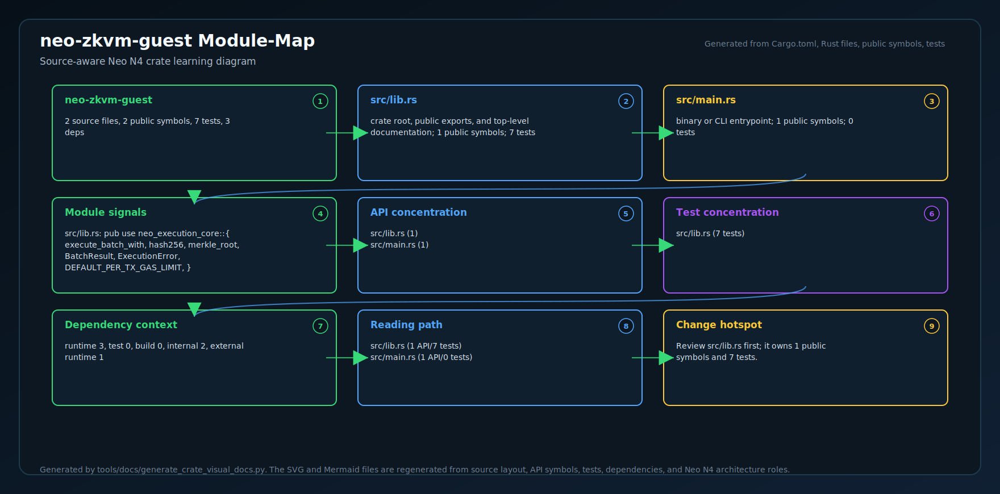
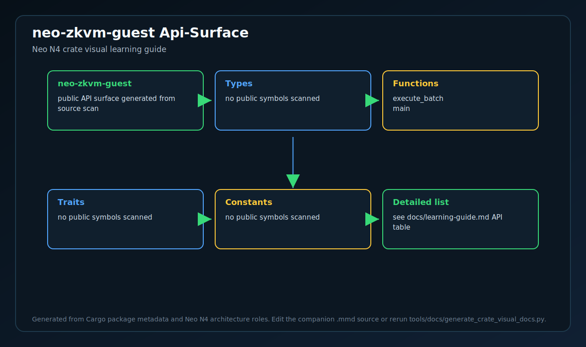
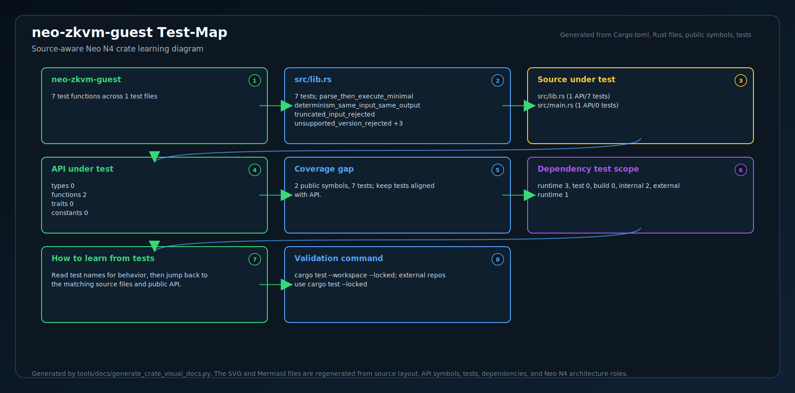
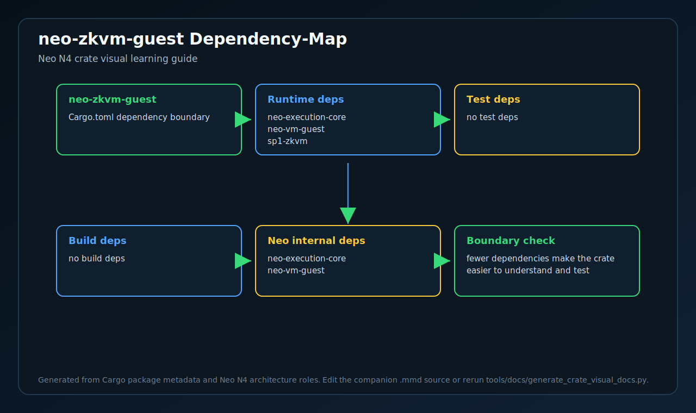
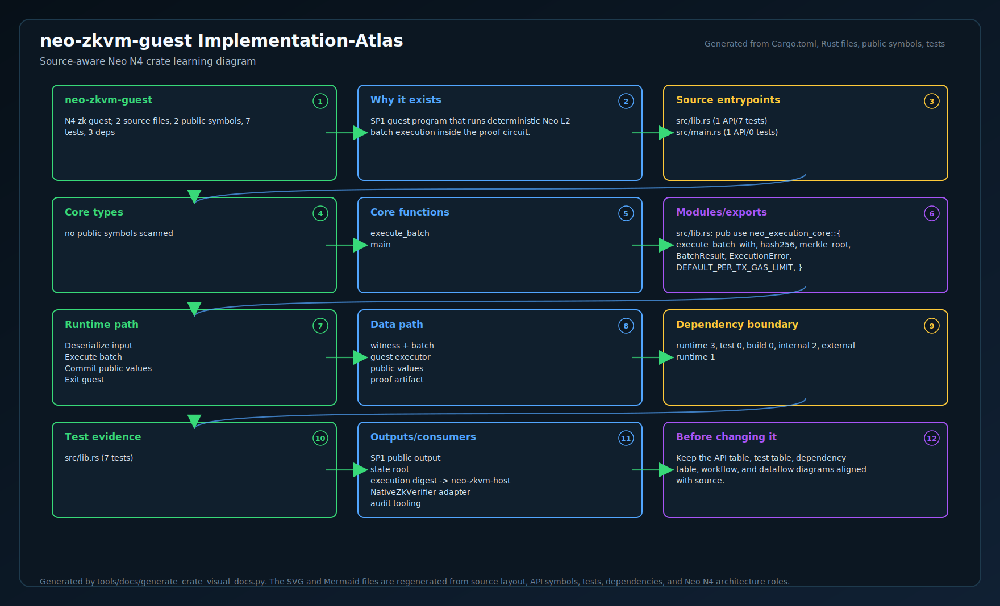

# neo-zkvm-guest

The Rust crate that compiles to a RISC-V ELF and runs inside the SP1 zkVM.
**This is the function the SP1 prover proves correct** — the deterministic
batch executor that any L2 chain running in Stage-2 (ZK validity) mode
points its prover at.

## Position in the stack

```
[off-chain L2 sequencer]
         ↓ canonical BatchExecutionRequest bytes (*.batch.bin in queue dir)
[bridge/neo-zkvm-host  (prove-batch daemon)]
         ↓ loads neo-zkvm-guest (this crate) into SP1 zkVM
         ↓ runs neo_vm_guest::execute on every tx → real Neo N3 VM
         ↓ produces ZK proof + verifying-key bytes + public-input commitment
[L1 NeoHub.VerifierRegistry]
         ↓ verifies proof
[L1 NeoHub.SettlementManager]
         ✓ batch finalized
```

What gets proven: each tx in the batch is loaded as a Neo N3 VM script and
executed by `neo_vm_guest::execute` (vendored from
`external/neo-zkvm/crates/neo-vm-guest`, which contains the full Neo N3
VM in pure Rust — opcodes, eval stack, gas accounting, native contracts,
storage). The proof attests to actual VM execution outcomes — halt or
fault, gas consumed, top-of-stack result — not a hash of the input bytes.
Canonical batch parsing, L1 message folding, tx/receipt Merkle roots,
state-root folding, and public-input hashing live in
`bridge/neo-execution-core`, which has no SP1 or PolkaVM dependency.

## Build

Requires Linux or macOS with the SP1 toolchain (`cargo prove`). SP1 does
not currently ship native Windows support; on Windows, build the guest
under WSL2 or on a Linux/macOS prover host:

```bash
# 1. Install SP1 (one-time, Linux/macOS):
curl -L https://sp1up.succinct.xyz | bash
sp1up

# 2. Build the guest ELF:
cd bridge/neo-zkvm-guest
cargo prove build
# → produces target/elf-compilation/riscv64im-succinct-zkvm-elf/release/neo-zkvm-guest
```

Without the SP1 toolchain, `cargo build` (default features) compiles the
crate as a host binary — useful for unit-testing the pure execution
functions on the host:

```bash
cargo test
# → 7 guest tests + 5 shared-core tests in the top-level workspace
```

## Wire format

`BatchExecutionRequest` (canonical bytes, all little-endian):

```
[1B  version=1]
[4B  chainId]
[8B  batchNumber]
[32B preStateRoot]
[32B daCommitment]
[4B  l1MessageCount]
  [(4B msgLen)(msgBytes)]*l1MessageCount
[4B  txCount]
  [(4B txLen)(txBytes)]*txCount
```

Output: 32-byte `publicInputHash` committed via `sp1_zkvm::io::commit`.
This binds into the proof's public outputs and is what the on-chain
verifier compares against `L2BatchCommitment.PublicInputHash`.

## What this crate does

1. Delegates canonical batch parsing and root folding to `neo-execution-core`.
2. **Executes each tx through real Neo N3 VM** via `neo_vm_guest::execute`,
   folding the resulting `ProofOutput` (state, gas, top-of-stack, error)
   into a backend-neutral `VmExecutionReceipt`.
3. Commits the shared core's public-input bundle hash to the SP1 output stream.

## End-to-end proving

`cargo prove build` step requires SP1's RISC-V toolchain installed
(several GB of cross-compile bits, install via `sp1up`). Once built,
`bridge/neo-zkvm-host/tests/end_to_end.rs` runs the guest in real SP1's
zkVM and asserts the public-input hash matches host-mode execution
byte-for-byte. Two `#[ignore]`-gated tests exercise real CPU proof
generation + verification + a tampered-hash negative test (~3.5 min
combined) — see `bridge/neo-zkvm-host/README.md`.

Operators who deploy Stage-2 chains run `cargo prove build` once on
their prover infrastructure to produce the matching guest ELF, then run
`prove-batch daemon --watch <queue-dir>` to consume sealed batches as
they arrive. See `docs/launching-an-l2.md` § "Prover deployment" for the
operator runbook.

<!-- N4-CRATE-VISUAL-GUIDE:START -->

## Crate Visual Learning Guide

These diagrams are local to this crate. They explain `neo-zkvm-guest` as an independent unit: where it sits in the Neo N4 stack, which boundary it owns, how its internal workflow runs, and how data moves through it.

For the full source-level explanation, read [docs/learning-guide.md](docs/learning-guide.md).

| View | Diagram | Source |
| --- | --- | --- |
| Position in Neo N4 |  | [Mermaid](docs/figures/position.mmd) |
| Technical principles |  | [Mermaid](docs/figures/principles.mmd) |
| Architecture |  | [Mermaid](docs/figures/architecture.mmd) |
| Workflow |  | [Mermaid](docs/figures/workflow.mmd) |
| Dataflow |  | [Mermaid](docs/figures/dataflow.mmd) |
| Module map |  | [Mermaid](docs/figures/module-map.mmd) |
| Public API surface |  | [Mermaid](docs/figures/api-surface.mmd) |
| Test evidence |  | [Mermaid](docs/figures/test-map.mmd) |
| Dependency map |  | [Mermaid](docs/figures/dependency-map.mmd) |
| Implementation atlas |  | [Mermaid](docs/figures/implementation-atlas.mmd) |

### Role in Neo N4

- **Layer:** N4 zk guest
- **Purpose:** SP1 guest program that runs deterministic Neo L2 batch execution inside the proof circuit.
- **Primary inputs:** public batch input, private witness, shared execution core
- **Primary outputs:** SP1 public output, state root, execution digest
- **Downstream consumers:** neo-zkvm-host, NativeZkVerifier adapter, audit tooling
- **Source files scanned:** 2
- **Public symbols scanned:** 2
- **Rust tests scanned:** 7

### Boundary and Responsibilities

- **Owns:** Run verifiable transition, Emit public values, Reject nondeterminism
- **Consumes:** public batch input, private witness, shared execution core
- **Produces:** SP1 public output, state root, execution digest
- **Used by:** neo-zkvm-host, NativeZkVerifier adapter, audit tooling

### Source Map Snapshot

| File | Why it matters | Public API | Tests |
| --- | --- | ---: | ---: |
| `src/lib.rs` | crate root, public exports, and top-level documentation | 1 | 7 |
| `src/main.rs` | binary or CLI entrypoint | 1 | 0 |

### API Snapshot

| Kind | Representative symbols |
| --- | --- |
| Types | no public symbols scanned |
| Functions | execute_batch <br> main |
| Trait | no public symbols scanned |
| Constants | no public symbols scanned |

### Learning Path

1. Start with the position diagram to understand why this crate exists and who calls it.
2. Read the technical principles diagram to identify the invariants and responsibility boundary.
3. Use the module map and API surface to identify the files and symbols to read first.
4. Follow the workflow, dataflow, test, and dependency diagrams before changing code.
5. Use the implementation atlas as the compact source-reading map when you want one dense view instead of separate technical views.

<!-- N4-CRATE-VISUAL-GUIDE:END -->
