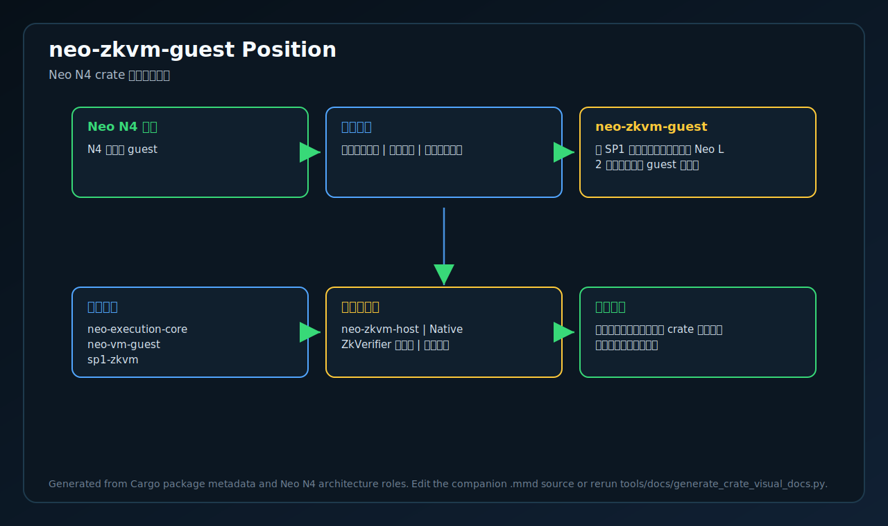
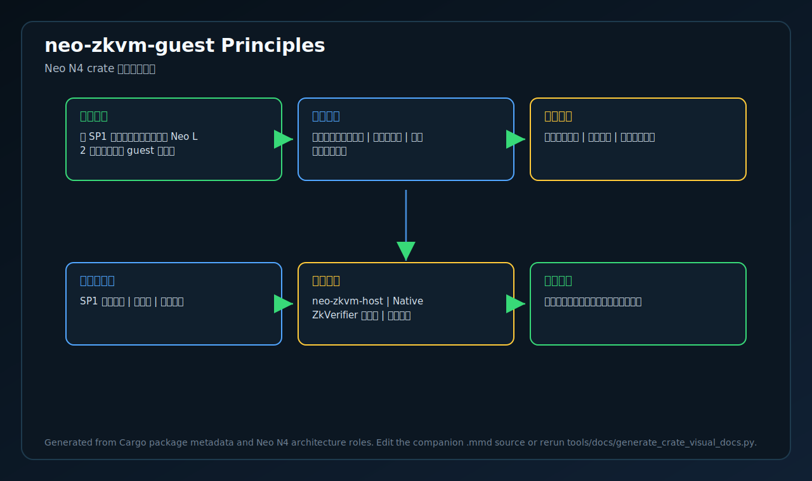
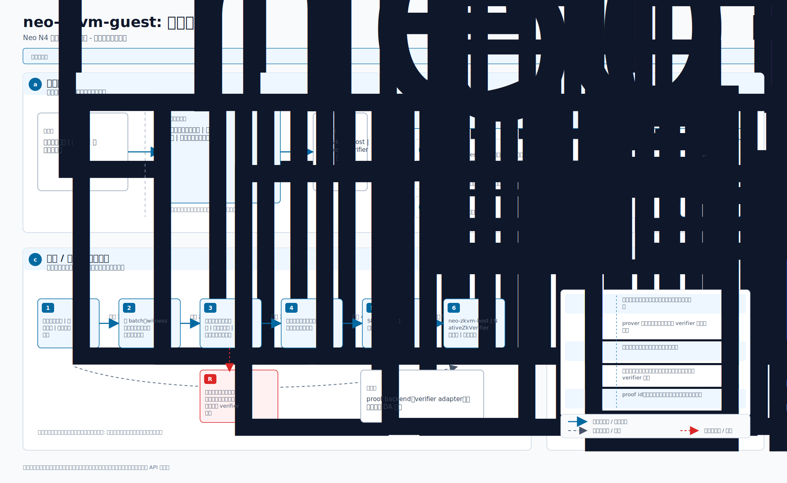
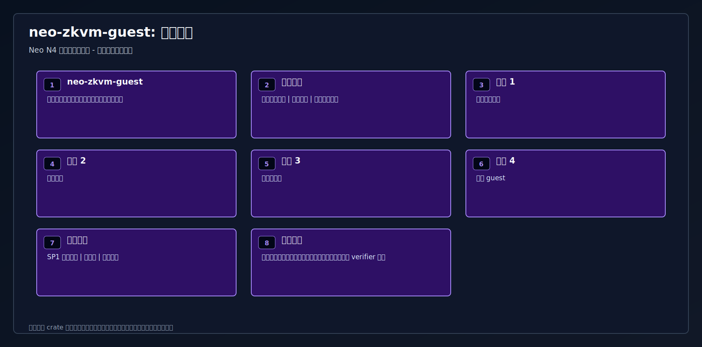
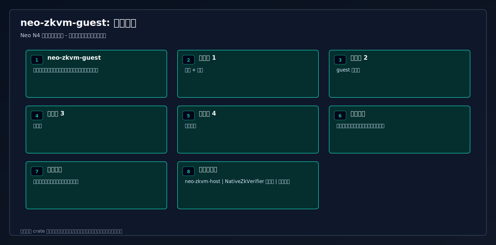
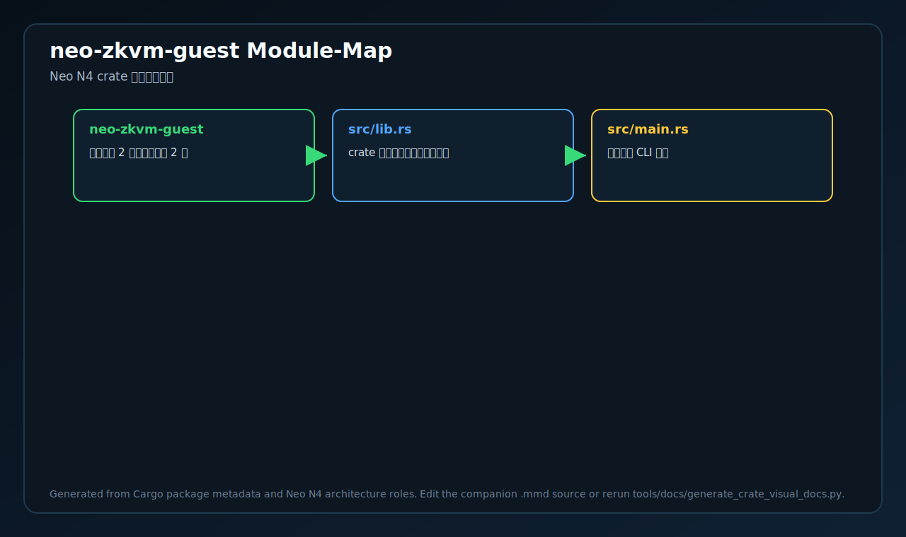
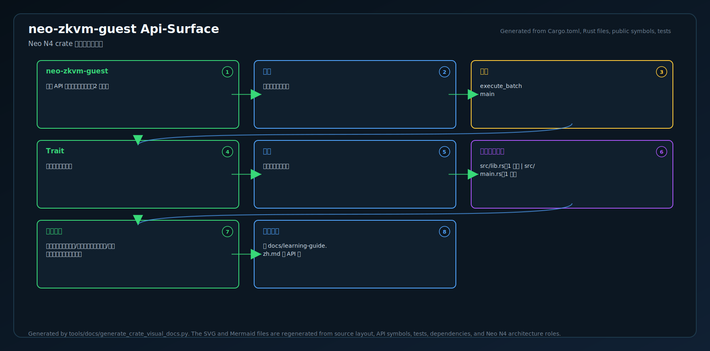
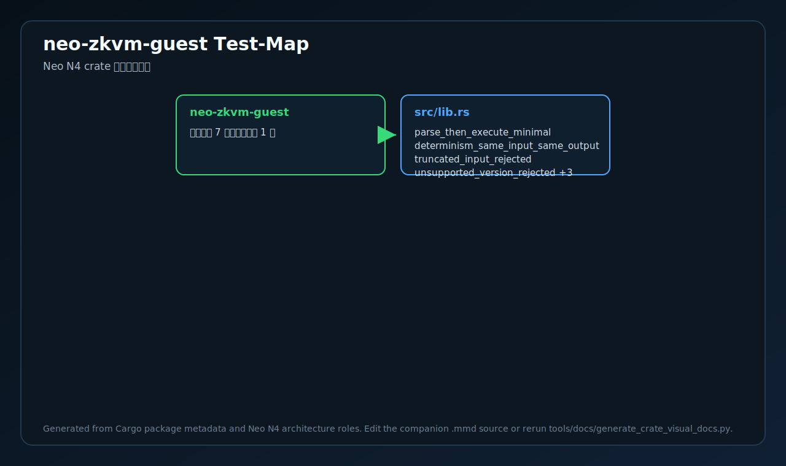
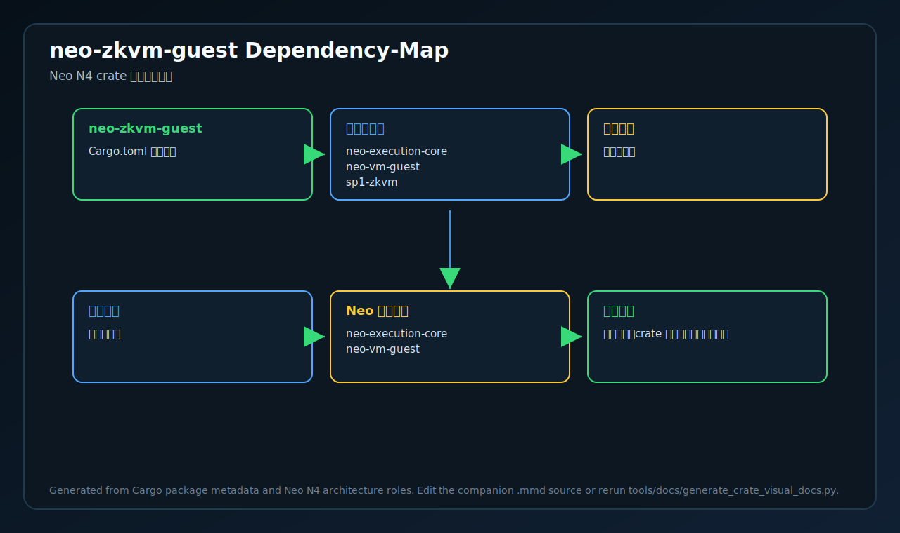
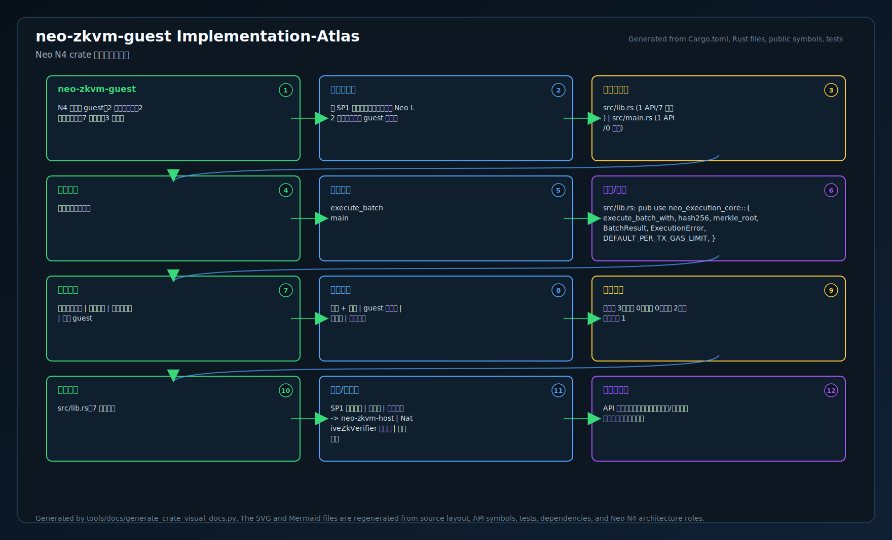

# neo-zkvm-guest

<!-- N4-CRATE-VISUAL-GUIDE-ZH:START -->

## 可视化学习指南

这些图是 `neo-zkvm-guest` 自己目录下的 crate 专属学习资料，用来说明它在 Neo N4 中的位置、自己负责的技术边界、内部工作流，以及数据如何流经它。

完整的源码级解释见 [docs/learning-guide.zh.md](docs/learning-guide.zh.md)。

| 视图 | 图片 | 源文件 |
| --- | --- | --- |
| 在 Neo N4 中的位置 |  | [Mermaid](docs/figures/position.zh.mmd) |
| 技术原理 |  | [Mermaid](docs/figures/principles.zh.mmd) |
| 架构 |  | [Mermaid](docs/figures/architecture.zh.mmd) |
| 工作流 |  | [Mermaid](docs/figures/workflow.zh.mmd) |
| 数据流 |  | [Mermaid](docs/figures/dataflow.zh.mmd) |
| 模块图 |  | [Mermaid](docs/figures/module-map.zh.mmd) |
| 公开 API 图 |  | [Mermaid](docs/figures/api-surface.zh.mmd) |
| 测试证据图 |  | [Mermaid](docs/figures/test-map.zh.mmd) |
| 依赖图 |  | [Mermaid](docs/figures/dependency-map.zh.mmd) |
| 实现全景图 |  | [Mermaid](docs/figures/implementation-atlas.zh.mmd) |

### 在 Neo N4 中的作用

- **层级:** N4 零知识 guest
- **目的:** 在 SP1 证明环境中运行确定性 Neo L2 批处理执行的 guest 程序。
- **主要输入:** 公开批次输入、私有见证、共享执行核心
- **主要输出:** SP1 公开输出、状态根、执行摘要
- **下游使用者:** neo-zkvm-host、NativeZkVerifier 适配器、审计工具
- **扫描到的源码文件:** 2
- **扫描到的公开符号:** 2
- **扫描到的 Rust 测试:** 7

### 边界与职责

- **本 crate 负责:** 运行可验证状态转换、输出公开值、拒绝非确定性行为
- **本 crate 消费:** 公开批次输入、私有见证、共享执行核心
- **本 crate 产出:** SP1 公开输出、状态根、执行摘要
- **主要被谁使用:** neo-zkvm-host、NativeZkVerifier 适配器、审计工具

### 源码地图快照

| 文件 | 为什么重要 | 公开 API | 测试 |
| --- | --- | ---: | ---: |
| `src/lib.rs` | crate 根、公开导出和顶层文档 | 1 | 7 |
| `src/main.rs` | 二进制或 CLI 入口 | 1 | 0 |

### API 快照

| 类型 | 代表符号 |
| --- | --- |
| 类型 | 未扫描到公开符号 |
| 函数 | execute_batch   main |
| Trait | 未扫描到公开符号 |
| 常量 | 未扫描到公开符号 |

### 学习路径

1. 先看位置图，明确这个 crate 为什么存在、上游是谁、下游是谁。
2. 再看技术原理图，理解它的核心不变量、职责边界和维护规则。
3. 然后看模块图和 API 图，确定先读哪些文件、哪些符号。
4. 最后看工作流、数据流、测试证据图和依赖图，再进入源码会更容易理解。
5. 如果希望一张图看完整体，就看实现全景图；它把源码入口、API、数据流、测试、依赖和修改检查点放在一起。

<!-- N4-CRATE-VISUAL-GUIDE-ZH:END -->
