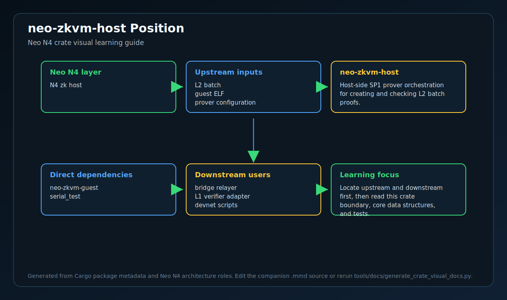
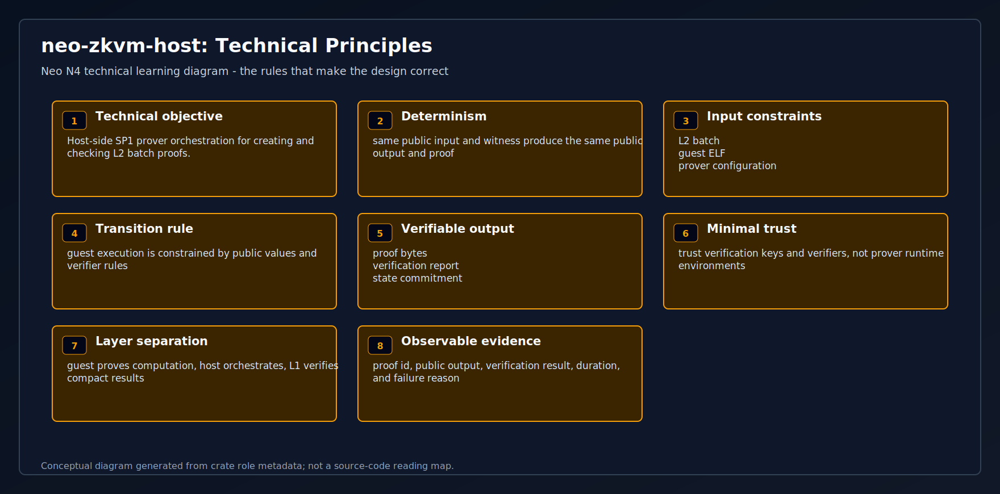
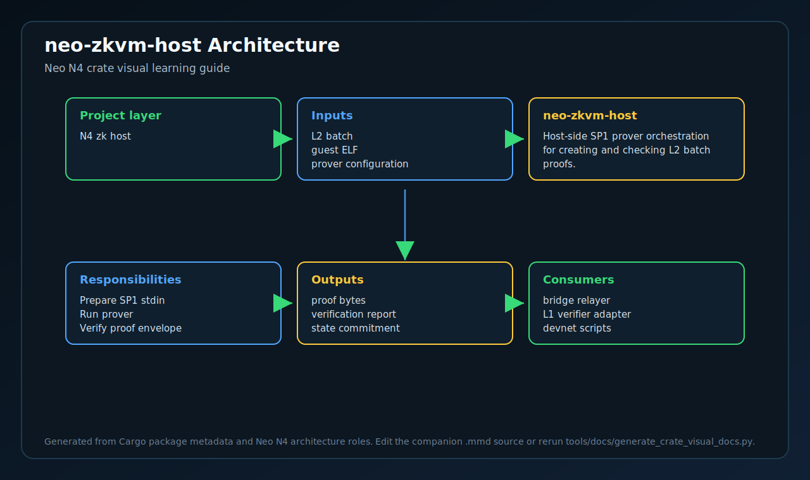
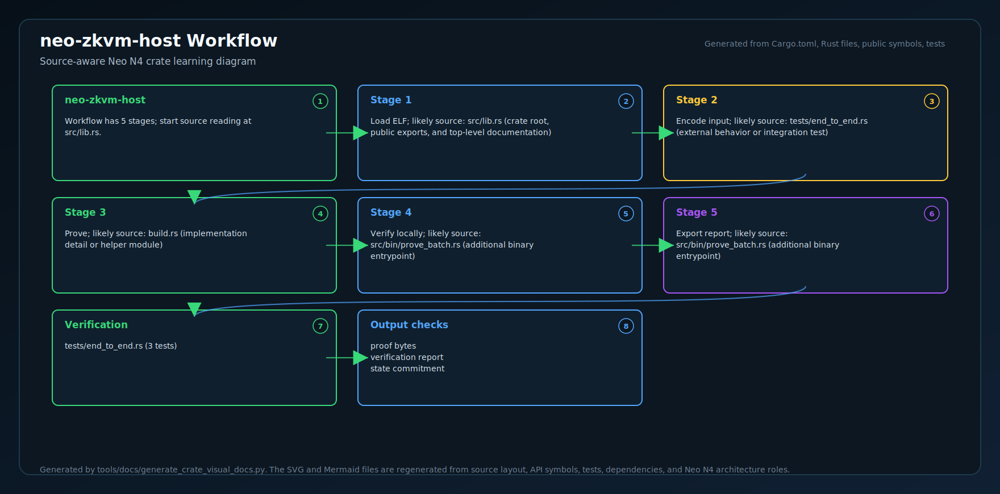
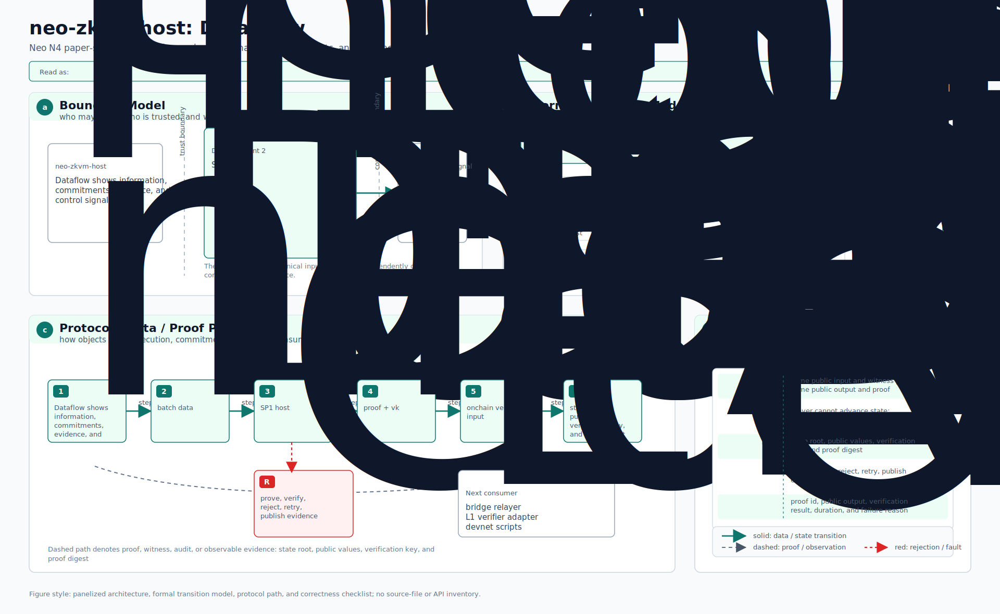
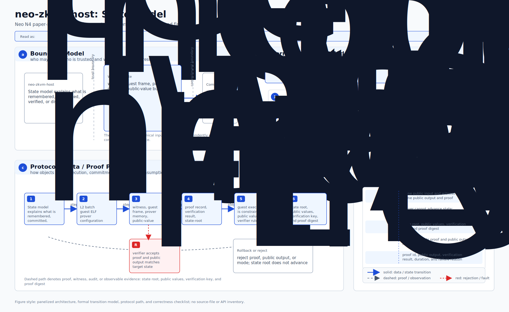
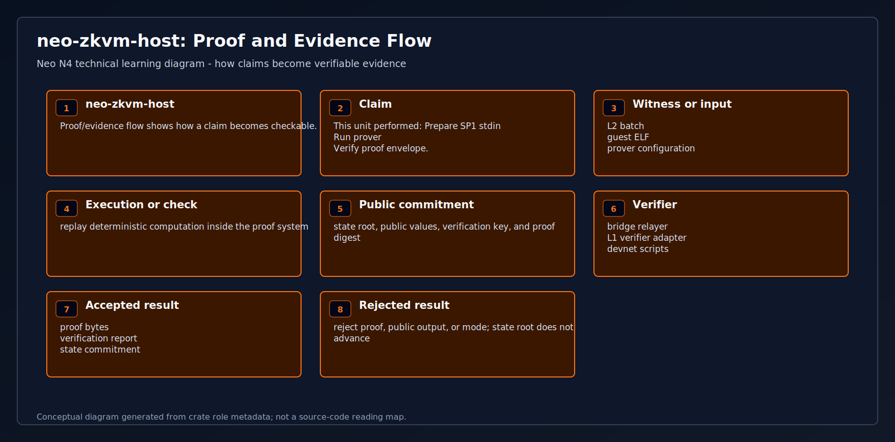
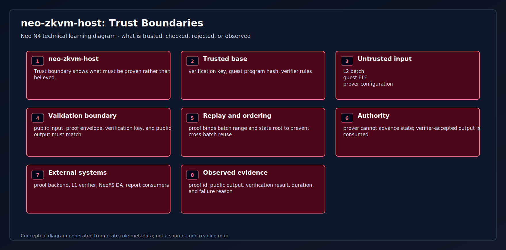
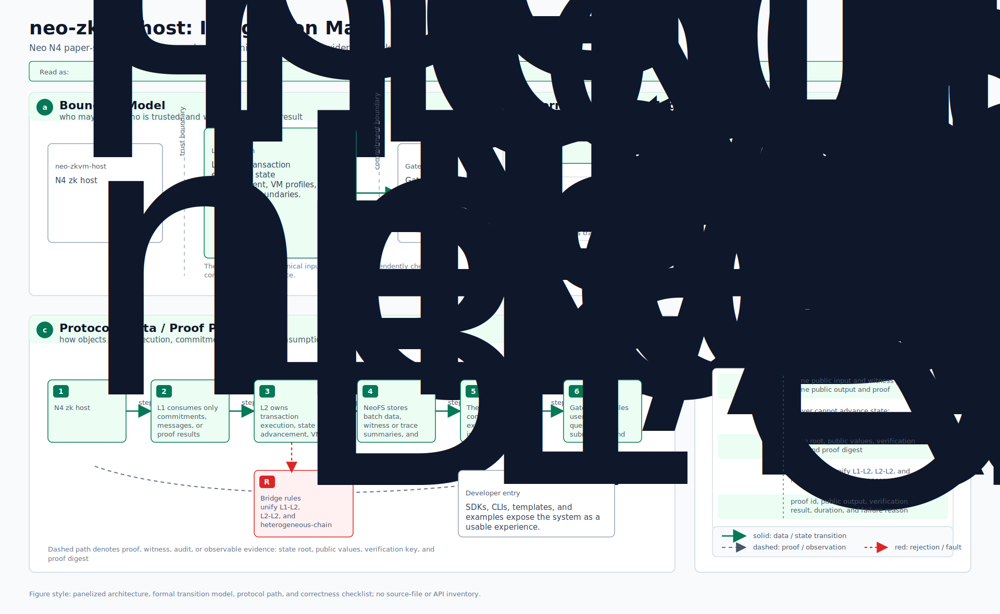
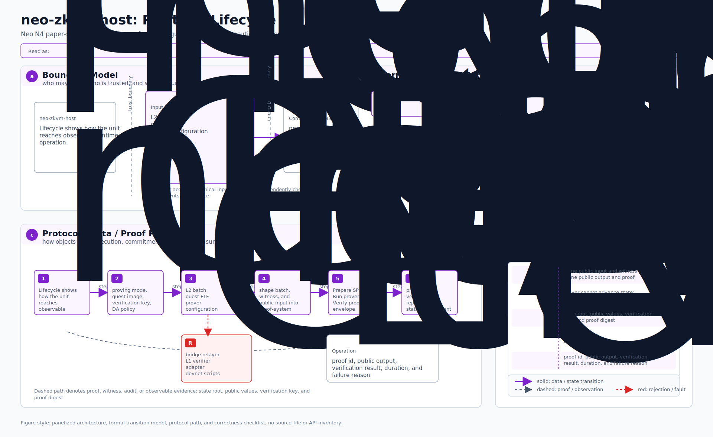

# neo-zkvm-host

The SP1 **host** runtime that loads the compiled `neo-zkvm-guest` RISC-V
ELF, runs it through SP1's zkVM with a canonical `ProofWitnessArtifactV1`
payload, and produces (a) the public-input commitment that L1 settlement
checks against, (b) the cryptographic ZK validity proof itself.

This is the production proving path for any L2 running in Stage-2
(RISC-V ZK validity) mode.

## Position in the stack

```
[off-chain L2 batch builder]
         ↓ canonical ProofWitnessArtifactV1 bytes
[neo-zkvm-host:  this crate]
   • execute()  → run guest in zkVM, return public-input hash
   • prove()    → real CPU proof + verifying-key bytes
   • verify()   → off-chain pre-submission proof check
         ↓ proof + vk
[L1 NeoHub.VerifierRegistry]  → verifies on-chain
[L1 NeoHub.SettlementManager] → finalizes batch
```

The `bridge/neo-zkvm-guest/` crate is the function being proved (compiled
to a RISC-V ELF by `cargo prove build`). This crate is the orchestrator
that runs that ELF inside SP1's zkVM and exposes a clean three-function
public API to the rest of the framework (and to operator scripts).

**What's being proved**: the guest decodes complete Neo transactions, verifies
the bounded pre-state/code/manifest witness, executes `tx.Script` through
`neo-vm-rs` with stateful production-priced syscalls, commits HALT overlays,
rolls back FAULT effects, and recomputes every receipt/root/public input.

## Build

Requires Linux or macOS with the SP1 toolchain (`sp1up` → installs
`cargo prove` and the RISC-V succinct target). SP1 does not currently
ship native Windows support; on Windows, run the prover under WSL2 or a
Linux/macOS prover host. `build.rs` invokes `cargo prove build` against
the sibling guest crate on every build, so the embedded ELF stays synced
with the guest source. Cached ELFs are disabled by default; set
`NEO_ZKVM_ALLOW_CACHED_ELF=1` only for host-only development that
intentionally does not execute or prove the guest.

```bash
# 1. Install SP1 (one-time, Linux/macOS or WSL2):
curl -L https://sp1up.succinct.xyz | bash
sp1up

# If WSL2 cannot reach GitHub because Windows is using a localhost
# proxy, point WSL at the Windows host gateway first. Replace 7890 with
# the local proxy port shown in Windows Internet Settings.
HOST_IP=$(ip route | awk '/default/ {print $3}')
export http_proxy=http://$HOST_IP:7890
export https_proxy=http://$HOST_IP:7890

# 2. protoc is required by sp1-sdk's transitive deps. Some Linux distros
#    ship an outdated version missing `google/protobuf/empty.proto`. If
#    you hit "empty.proto: file not found" while building sp1-sdk, copy
#    the include dir from the vendored protobuf into your local include:
#
#    mkdir -p ~/.local/include && cp -R \
#      ~/.cargo/registry/src/index.crates.io-*/protoc-bin-vendored-linux-x86_64-*/include/google \
#      ~/.local/include/
#    export CPATH=~/.local/include

# 3. Build:
cargo prove build
cargo build --release -p neo-zkvm-host
```

## Library API (`src/lib.rs`)

```rust
pub fn execute(request_bytes: &[u8]) -> Result<ZkExecutionResult, String>
```

Runs the guest inside SP1's zkVM (no proving — just deterministic
execution). Cheap. Used in development and as the "did the script
HALT?" sanity check before producing a real proof.

```rust
pub fn prove(request_bytes: &[u8]) -> Result<ProofResult, String>
```

Generates a real ZK proof for the batch — the on-chain settlement
artifact. Returns the proof bytes (bincode `SP1ProofWithPublicValues`),
the verifying-key bytes (bincode `SP1VerifyingKey`, stable per guest
ELF), and the 32-byte public-input commitment. Substantially slower
than `execute`: minutes per batch on a beefy CPU.

```rust
pub fn verify(
    proof_bytes: &[u8],
    vk_bytes: &[u8],
    expected_public_input_hash: &[u8; 32],
) -> Result<(), String>
```

Mirror of the on-chain dispatch path: deserialize, check the
public-input commitment matches expectation (cheap, catches replay
before burning verifier cycles), then run SP1's cryptographic
verifier. Off-chain prover infrastructure should call this before
submission so it never wastes L1 gas on bad proofs.

## CLI: `prove-batch`

Operator-facing entrypoint:

```text
prove-batch <hex-encoded ProofWitnessArtifactV1>            # execute only (fast)
prove-batch --prove <hex> [--out proof.bin]                 # generate ZK proof (slow)
```

The `--prove` mode writes both `proof.bin` (the proof) and `proof.vk`
(the verifying key) to disk; submit both to L1 via
`NeoHub.SettlementManager.SubmitBatch`.

## Tests

```bash
# Daily debug suite (skips SP1 execute/prove cost; release gates below cover it):
cargo test -p neo-zkvm-host

# Default release suite (~1 min — runs the guest in zkVM execute path
# and cross-checks public-input hash byte-for-byte against host run):
cargo test --release -p neo-zkvm-host

# Slow tests (real proof generation + verification + tampered-hash
# negative test — ~4 min wall time, gated behind --ignored so the
# default loop stays fast):
cargo test --release -p neo-zkvm-host -- --ignored --nocapture
```

The execute/prove tests use committed stateful and native-transition golden artifacts, so
divergence between fresh zkVM execution, host execution, and proven execution
is caught without a script-only fallback.

The 2026-05-17 WSL2 audit run with SP1 `6.2.1` completed the default
release test in about 14 seconds after dependencies were built. The
ignored proof tests generated a real proof in about 42 seconds, verified
it in about 14 seconds, and finished the proof-positive plus tampered-hash
negative suite in about 96 seconds on the audit host.

<!-- N4-CRATE-VISUAL-GUIDE:START -->
## Technical Visual Guide

These diagrams are local to this crate and explain `neo-zkvm-host` at the technical architecture level. They focus on system role, principles, data movement, workflow, state, proof/evidence, trust boundaries, integration, and runtime lifecycle.

Full technical explanation: [docs/learning-guide.md](docs/learning-guide.md).

| View | Diagram | Mermaid |
| --- | --- | --- |
| System Position |  | [Mermaid](docs/figures/position.mmd) |
| Technical Principles |  | [Mermaid](docs/figures/principles.mmd) |
| Conceptual Architecture |  | [Mermaid](docs/figures/architecture.mmd) |
| Workflow |  | [Mermaid](docs/figures/workflow.mmd) |
| Data Flow |  | [Mermaid](docs/figures/dataflow.mmd) |
| State Model |  | [Mermaid](docs/figures/state-model.mmd) |
| Proof and Evidence Flow |  | [Mermaid](docs/figures/proof-flow.mmd) |
| Trust Boundaries |  | [Mermaid](docs/figures/trust-boundaries.mmd) |
| Integration Map |  | [Mermaid](docs/figures/integration-map.mmd) |
| Runtime Lifecycle |  | [Mermaid](docs/figures/lifecycle.mmd) |

### Technical Role

- **Layer:** N4 zk host
- **Purpose:** Host-side SP1 prover orchestration for creating and checking L2 batch proofs.
- **Inputs:** L2 batch | guest ELF | prover configuration
- **Responsibilities:** Prepare SP1 stdin | Run prover | Verify proof envelope
- **Outputs:** proof bytes | verification report | state commitment
- **Consumers:** bridge relayer | L1 verifier adapter | devnet scripts

### Reading Order

1. Start with system position and conceptual architecture.
2. Read technical principles, trust boundaries, and state model to understand correctness.
3. Follow workflow and dataflow to see runtime movement.
4. Use proof/evidence flow, integration map, and lifecycle for operational understanding.
<!-- N4-CRATE-VISUAL-GUIDE:END -->
