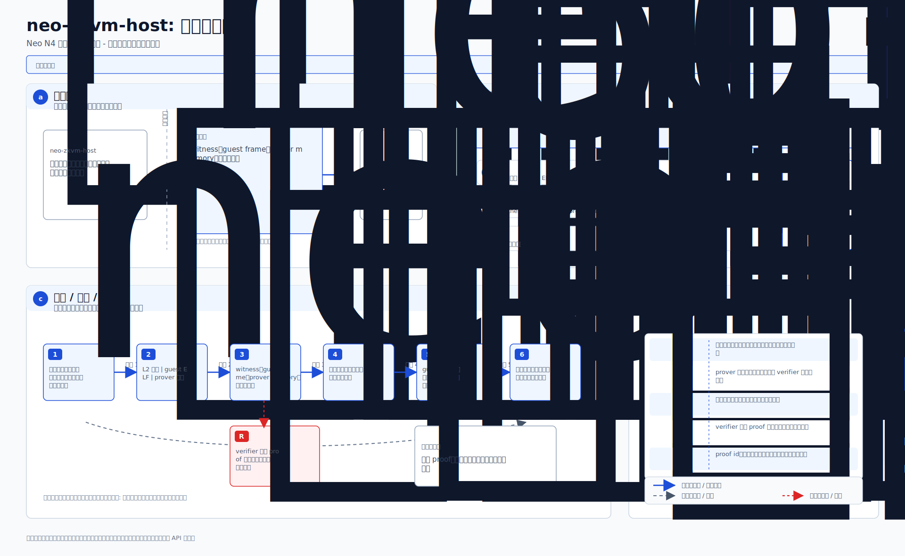
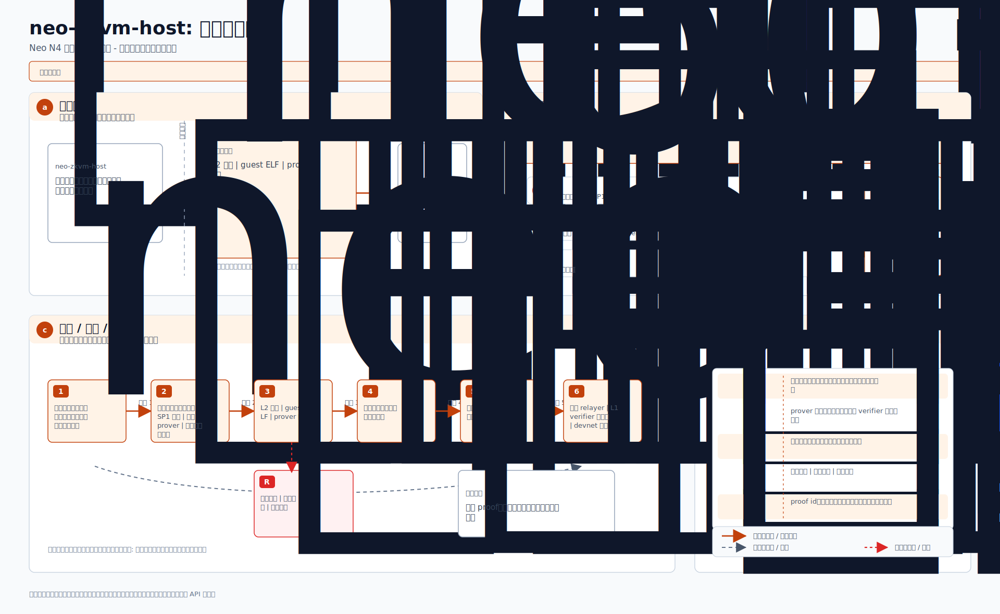
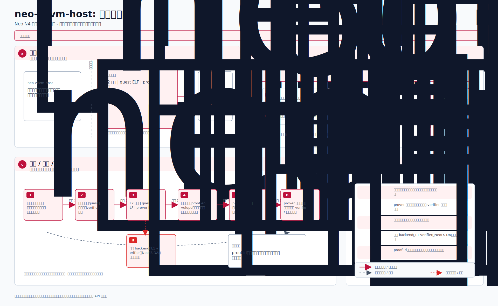
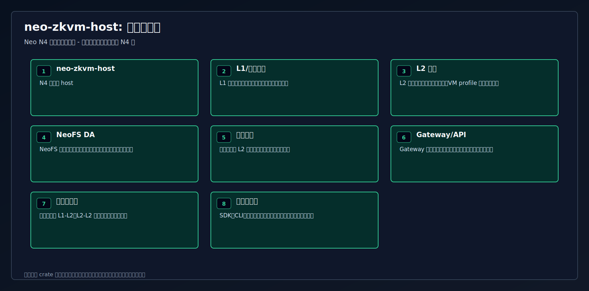
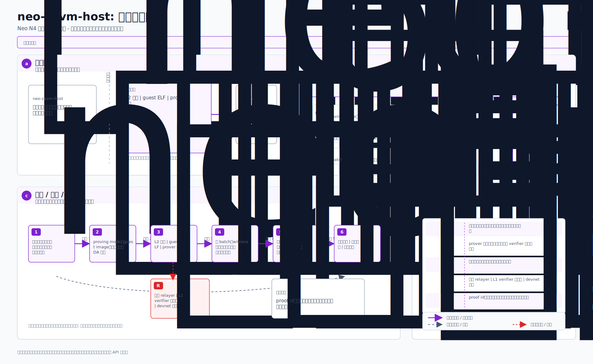

# neo-zkvm-host

<!-- N4-CRATE-VISUAL-GUIDE-ZH:START -->
## 技术可视化指南

这些图都放在本 crate 目录下，用技术架构视角解释 `neo-zkvm-host`。重点是系统位置、技术原理、数据移动、工作流、状态、证明/证据、信任边界、集成关系和运行生命周期。

完整技术解释见 [docs/learning-guide.zh.md](docs/learning-guide.zh.md)。

| 视图 | 图 | Mermaid |
| --- | --- | --- |
| 系统位置图 |  | [Mermaid](docs/figures/position.zh.mmd) |
| 技术原理图 |  | [Mermaid](docs/figures/principles.zh.mmd) |
| 概念架构图 |  | [Mermaid](docs/figures/architecture.zh.mmd) |
| 工作流图 |  | [Mermaid](docs/figures/workflow.zh.mmd) |
| 数据流图 |  | [Mermaid](docs/figures/dataflow.zh.mmd) |
| 状态模型图 |  | [Mermaid](docs/figures/state-model.zh.mmd) |
| 证明与证据流图 |  | [Mermaid](docs/figures/proof-flow.zh.mmd) |
| 信任边界图 |  | [Mermaid](docs/figures/trust-boundaries.zh.mmd) |
| 集成关系图 |  | [Mermaid](docs/figures/integration-map.zh.mmd) |
| 运行生命周期图 |  | [Mermaid](docs/figures/lifecycle.zh.mmd) |

### 技术角色

- **层级:** N4 零知识 host
- **目的:** 负责创建和检查 L2 批次证明的 SP1 宿主编排层。
- **输入:** L2 批次 | guest ELF | prover 配置
- **职责:** 准备 SP1 输入 | 运行 prover | 校验证明封装
- **输出:** 证明字节 | 验证报告 | 状态承诺
- **消费方:** 桥接 relayer | L1 verifier 适配器 | devnet 脚本

### 阅读顺序

1. 先看系统位置图和概念架构图。
2. 再看技术原理图、信任边界图和状态模型图，理解为什么这样设计是正确的。
3. 然后看工作流图和数据流图，理解运行时如何移动。
4. 最后看证明/证据流、集成关系和生命周期，理解系统如何进入真实运行。
<!-- N4-CRATE-VISUAL-GUIDE-ZH:END -->

## 可复现生产构建

生产构建必须使用 Docker，并锁定经审计的 SP1 6.2.1 amd64 镜像 digest；禁止用宿主机
原生 ELF 更新程序 VK。`build.rs` 会强制执行 `--docker --locked`。只有明确不执行、
不证明 guest 的 host-only 开发场景，才可设置 `NEO_ZKVM_ALLOW_CACHED_ELF=1`。
build script 只读取共享 Docker ELF 一次，用同一 byte snapshot 同时校验 SHA-256 与 VK，
再写入 Cargo 独立 `OUT_DIR` 的只读 `0400` 文件并仅嵌入该副本，从而消除并行 guest build
在校验与 `include_bytes!` 之间替换共享 target ELF 的竞态。

如果 Docker 客户端配置注入了 loopback HTTP/HTTPS proxy，共享构建支持会生成不含凭据
的临时 Docker 配置：保留当前 context，移除容器无法访问的 loopback proxy，同时不改写
可达的企业代理。这样容器内 Cargo 不会错误访问宿主机 `127.0.0.1` 代理。

```bash
export SP1_DOCKER_IMAGE=ghcr.io/succinctlabs/sp1@sha256:14d3c46eff7492f87e429bfbf618e3d33499ba7515b15c36eeb1bcaebc9f7b7f
export SP1_GNARK_IMAGE=ghcr.io/succinctlabs/sp1-gnark@sha256:be8555f1ad90870acd8c6ec7fd3ba0b1a2133ea9cddf25e130665aa651129e54

# macOS + Colima：SP1 Groth16 wrapper 会把临时 witness/output 文件 bind-mount
# 到 Docker。必须把 TMPDIR 放在 Colima 可共享的用户/仓库目录下；默认
# /var/folders 在 Colima VM 内不可见，否则 Docker 会把 /witness 创建成目录。
mkdir -p "$PWD/target/sp1-tmp"
export TMPDIR="$PWD/target/sp1-tmp"

cargo prove build --docker --locked
cargo build --release -p neo-zkvm-host

# 重新生成 Rust/C# 共用的精确链上 verifier release vector：
cargo run --release -p neo-zkvm-host \
  --example generate_groth16_release_vector --locked
```

## 生产证明队列

```bash
prove-batch daemon \
  --watch /var/lib/neo-l2/batches \
  --archive /var/lib/neo-l2/proven \
  --max-queue-bytes 17179869184 \
  --max-queue-tasks 64
```

文件队列属于机密持久状态。Unix queue/archive 目录为 owner-only `0700`，工件为 `0600`；
symlink、外来 owner 或更宽权限均 fail closed。watch+archive 默认硬上限为 16 GiB 和 64 个
content-addressed task，并在每次证明前检查。证明完成后不能立即或按 TTL 删除；只有 .NET
settlement pipeline 已持久记录 `SettlementFinalized` 并原子发布内容一致的
`<artifact-content-hash>.proof.ack`，daemon 才校验 ack、幂等删除 request/proof/VK/
public-values/result/archive，最后删除 ack。
