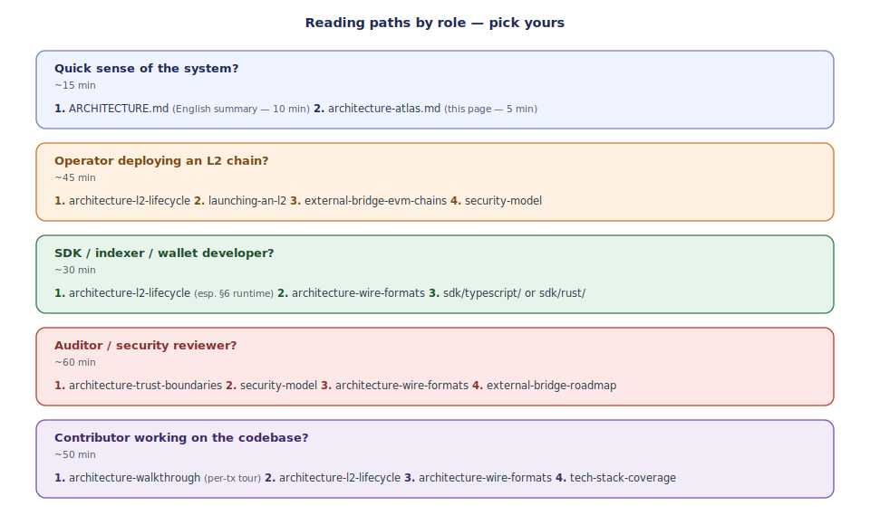
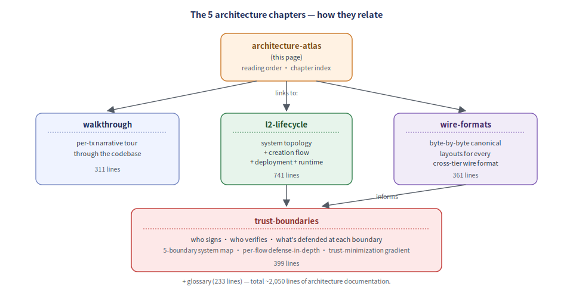

# Architecture atlas

> Where to start reading the Neo Elastic Network architecture
> documentation, depending on what you need to know.

The architecture is documented across **multiple chapters**, each
addressing a different question. Pick the one that matches your
goal — or read all of them in order for a complete picture.

## Reading order by role

  

## The 5 architecture chapters

  

### Chapter summaries

| Chapter                                                          | What it answers                                              | Lines |
|------------------------------------------------------------------|--------------------------------------------------------------|-------|
| [architecture-walkthrough.md](./architecture-walkthrough.md)     | How does a single transaction flow through the system?       | 311   |
| [architecture-l2-lifecycle.md](./architecture-l2-lifecycle.md)   | How does an L2 chain get created, deployed, and connected?   | 741   |
| [architecture-wire-formats.md](./architecture-wire-formats.md)   | What bytes cross which boundaries, and why?                  | 361   |
| [architecture-trust-boundaries.md](./architecture-trust-boundaries.md) | Who trusts what, and how is each trust assumption enforced? | 399   |
| [architecture-glossary.md](./architecture-glossary.md)           | What does each term / contract / plugin / CLI tool mean?     | 233   |

Total: ~2050 lines of architecture documentation, plus the
`tech-stack-coverage.md` reference for what's vendored vs
implemented and `security-model.md` for the threat-list view.

## How the chapters relate

Each chapter answers a different question, but they share the
same vocabulary and reference the same components. A claim made
in one chapter can be cross-checked against the others:

| If you read this chapter and want more detail on...      | Look at this chapter                                            |
|----------------------------------------------------------|-----------------------------------------------------------------|
| The byte layout of a `BatchCommitment` mentioned in *l2-lifecycle* | [wire-formats §2](./architecture-wire-formats.md#2-l2batchcommitment--sealed-batch-321--n-bytes) |
| Who verifies the proof submitted in *l2-lifecycle* §6    | [trust-boundaries §2](./architecture-trust-boundaries.md#boundary-c-batcher--l1-settlementmanager-the-load-bearing-boundary) |
| The exact sequence of cross-tier hash recomputation      | [trust-boundaries §3](./architecture-trust-boundaries.md#3-cross-tier-verification-chain) |
| Why a particular wire format has a specific shape        | [wire-formats §1 + §7](./architecture-wire-formats.md#1-why-canonical-wire-formats) |
| What a particular `neo-stack` subcommand does            | [l2-lifecycle §9](./architecture-l2-lifecycle.md#9-component-cross-reference) + [launching-an-l2.md](./launching-an-l2.md) |
| The threat model + concrete mitigations                  | [security-model.md](./security-model.md)                        |

## Other architecture-relevant docs

These are referenced from the atlas but not part of it directly —
they go deeper on specific topics:

| Doc                                                              | Topic                                                       |
|------------------------------------------------------------------|-------------------------------------------------------------|
| [external-bridge-roadmap.md](./external-bridge-roadmap.md)       | Phase B/C/D progression for the cross-foreign-chain bridge  |
| [external-bridge-evm-chains.md](./external-bridge-evm-chains.md) | Onboarding a new EVM chain in 5 steps                       |
| [persistence.md](./persistence.md)                               | `IL2KeyValueStore` + RocksDB durability story               |
| [telemetry.md](./telemetry.md)                                   | `IL2Metrics` + Prometheus exposition + `/metrics` endpoint  |
| [wallet-integration.md](./wallet-integration.md)                 | How operator wallets sign the structured plans              |
| [spec-gap-plan.md](./spec-gap-plan.md)                           | Remaining gaps vs `doc.md` master spec                      |
| [plan-application-engine-and-mpt.md](./plan-application-engine-and-mpt.md) | Phase-4 ApplicationEngine + MPT integration plan |
| [getting-started.md](./getting-started.md)                       | Quick-start for first-time users                            |

## The master spec

For authoritative definitions:

- [`doc.md`](../doc.md) — Chinese master spec (authoritative).
- [`ARCHITECTURE.md`](../ARCHITECTURE.md) — English §-by-§ summary of `doc.md`.
- [`WHITEPAPER.md`](../WHITEPAPER.md) — formal whitepaper.

The architecture chapters in this atlas implement what `doc.md`
specifies — when in doubt about a design choice, the spec is the
source of truth. (When the architecture chapters and the spec
disagree, that's a bug — please report.)
