# Architecture: L2 chain lifecycle

> Detailed walkthrough of how the Neo Elastic Network is structured,
> and how an L2 chain goes from "doesn't exist" to "registered,
> producing batches, connected to the shared bridge + cross-chain
> messaging".
>
> Companion to [`architecture-walkthrough.md`](./architecture-walkthrough.md)
> (which covers the *transaction* lifecycle within an L2) and
> [`launching-an-l2.md`](./launching-an-l2.md) (which is the
> operator-step-by-step guide). This document is the architecture
> view: what each step does, which components are touched, what
> wire data crosses which boundary.

## Table of contents

1. [System at a glance](#1-system-at-a-glance)
2. [The four tiers in detail](#2-the-four-tiers-in-detail)
3. [Anatomy of an L2 chain](#3-anatomy-of-an-l2-chain)
4. [Creation: from zero to registered](#4-creation-from-zero-to-registered)
5. [Deployment: contracts going on-chain](#5-deployment-contracts-going-on-chain)
6. [Runtime connection: how an L2 talks to L1](#6-runtime-connection-how-an-l2-talks-to-l1)
7. [Cross-L2 messaging](#7-cross-l2-messaging)
8. [External-chain bridge connection](#8-external-chain-bridge-connection)
9. [Component cross-reference](#9-component-cross-reference)

---

## 1. System at a glance

The Neo Elastic Network is **four tiers** of components plus the
off-chain infrastructure that connects them:

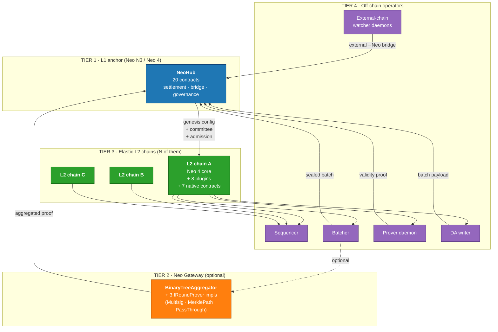

**What flows where:**

| Flow                         | From → To                                         | Wire format                                    |
|------------------------------|---------------------------------------------------|------------------------------------------------|
| Sealed batch + proof         | Batcher → NeoHub.SettlementManager                | `BatchSerializer` (canonical 32-byte fields)   |
| DA payload                   | DA writer → NeoFS / L1 / committee                | `IDAWriter` impl-specific                      |
| Cross-L2 message             | L2 sender → NeoHub.MessageRouter → L2 receiver    | `MessageHasher` canonical bytes                |
| L1→L2 deposit                | User → NeoHub.SharedBridge → L2NativeBridge       | `DepositPayload`                               |
| L2→L1 withdrawal             | L2 user → SettlementManager Merkle proof          | `WithdrawalRecord` + Merkle path               |
| External chain → Neo         | EVM/Solana → Watcher → ExternalBridgeEscrow       | `ExternalCrossChainMessage` (102B + payload)   |
| Aggregated proof (Phase 5)   | Gateway → SettlementManager                       | `BinaryTreeAggregator` round proofs            |

---

## 2. The four tiers in detail

### Tier 1: NeoHub (L1)

The L1 anchor. **20 contracts** grouped by concern:

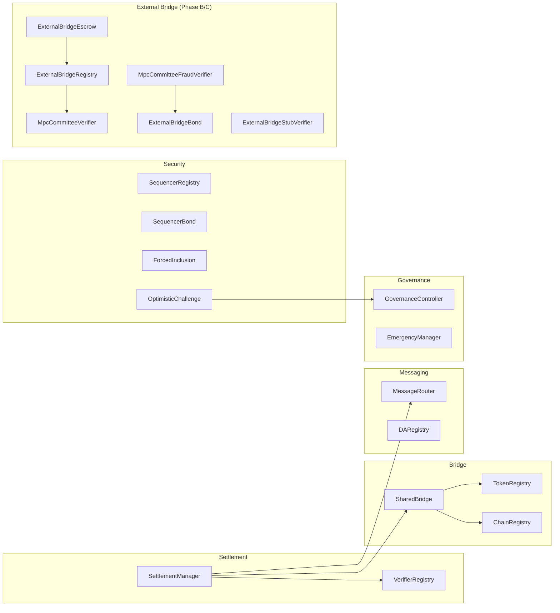

Lives at `contracts/NeoHub.*` — every contract type-checks via
`Neo.SmartContract.Framework`; CI compiles each with `nccs` and
verifies the `.nef` + `.manifest.json` artifacts.

### Tier 2: Neo Gateway (optional, Phase 5)

Aggregates many L2s' proofs into one settlement post on L1. Reduces
L1 gas cost when running >1 L2 chain.

- `BinaryTreeAggregator` — log-N round narrowing across N constituent batches.
- `IRoundProver` — 3 production impls + a recursive-ZK seam:
  - `MultisigRoundProver` — Secp256r1 threshold-attested rounds
  - `MerklePathRoundProver` — per-constituent inclusion proofs
  - `PassThroughRoundProver` — minimal-cost reference
  - SP1 Compress / Halo2 / Risc0 fold variants plug into the same trait

Optional: a single L2 doesn't need a Gateway. Multi-L2 deployments
that want lower per-batch L1 gas costs flip on `gatewayEnabled`
in the chain config.

### Tier 3: L2 chains

Each L2 = **Neo 4 core (the consensus + VM kernel) + 8 plugins +
7 native contracts**. Plugins live at `src/Neo.Plugins.L2*/`,
native contracts at `contracts/L2Native.*`. The Neo 4 core itself
is vendored as a git submodule at `external/neo`.

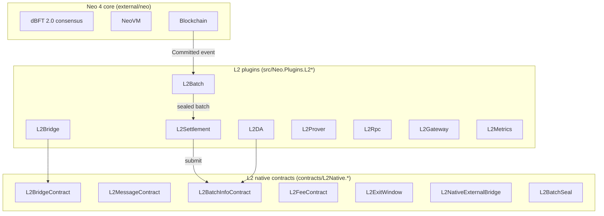

The 8 plugins + 7 native contracts implement the `doc.md` §5–§13
layered architecture (batch sealing / settlement / bridge / DA /
proving / RPC / gateway / metrics).

### Tier 4: Off-chain operators

Each L2 needs at least one of each:

| Operator        | What it does                                         | Source                                  |
|-----------------|------------------------------------------------------|-----------------------------------------|
| Sequencer       | dBFT 2.0 consensus member; produces L2 blocks        | `Neo.L2.Sequencer/`                     |
| Batcher         | Subscribes to `Blockchain.Committed`, seals batches, submits to L1 | `Neo.L2.Batch/` + `Neo.Plugins.L2Batch` |
| Prover daemon   | SP1 zkVM proves the batch (Phase 4)                  | `bridge/neo-zkvm-host/` (Rust binary)   |
| DA writer       | Publishes batch payload to NeoFS / L1 / committee    | `Neo.L2.DA*` + injected `IDAWriter`     |
| External-chain watcher | (External bridge only) relays events from EVM/Solana → Neo | `watchers/neo-bridge-watcher-*/` |

---

## 3. Anatomy of an L2 chain

Every L2 chain is fully described by **four artifacts**:

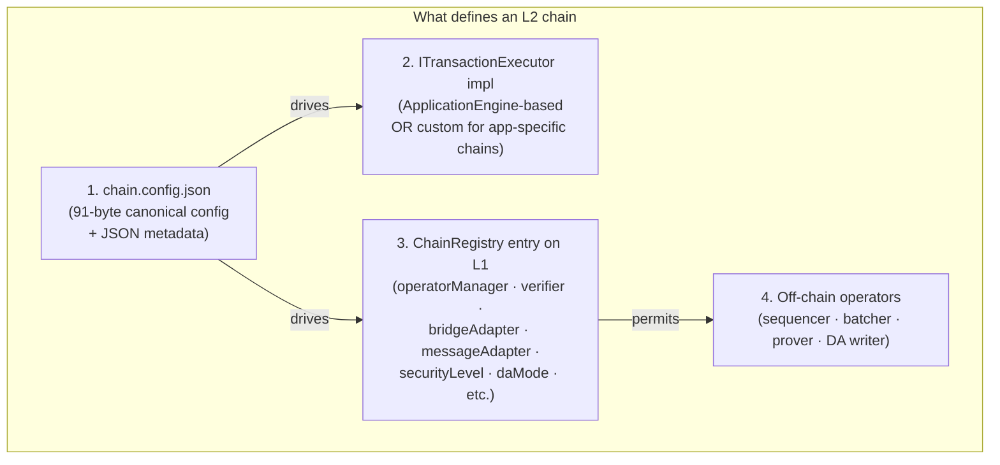

### The §16.2 chain config dimensions

The chain config carries 5 dimensions. Operators pick values per
chain; the same NeoHub L1 supports any combination:

| Dimension       | Values (range)                | Meaning                                                |
|-----------------|-------------------------------|--------------------------------------------------------|
| `securityLevel` | 0 · 1 · 2 · 3                 | 0 = sidechain (lowest); 3 = full ZK rollup (highest)   |
| `daMode`        | InMemory · External · L1 · DAC| where the batch payload goes                           |
| `sequencerModel`| Solo · Committee · Permissionless | how blocks are produced                            |
| `exitModel`     | Optimistic · Permissionless · ZkValidity | how withdrawals settle                       |
| `gatewayEnabled`| bool                          | whether this L2 batches into the shared Gateway        |

Encoded as a 91-byte canonical wire format via `L2ChainConfigSerializer`
(see `Neo.L2.Abstractions/L2ChainConfigSerializer.cs`).

### Templates

`neo-stack list-templates` ships 4 starting points:

| Template      | securityLevel | daMode    | exitModel       | gatewayEnabled |
|---------------|---------------|-----------|-----------------|----------------|
| `rollup`      | 2             | L1        | Optimistic      | true           |
| `zk-rollup`   | 3             | L1        | ZkValidity      | true           |
| `validium`    | 2             | DAC       | Optimistic      | true           |
| `sidechain`   | 1             | InMemory  | Permissionless  | false          |

---

## 4. Creation: from zero to registered

The full lifecycle of a chain from `git clone` to its first sealed
batch landing on L1:

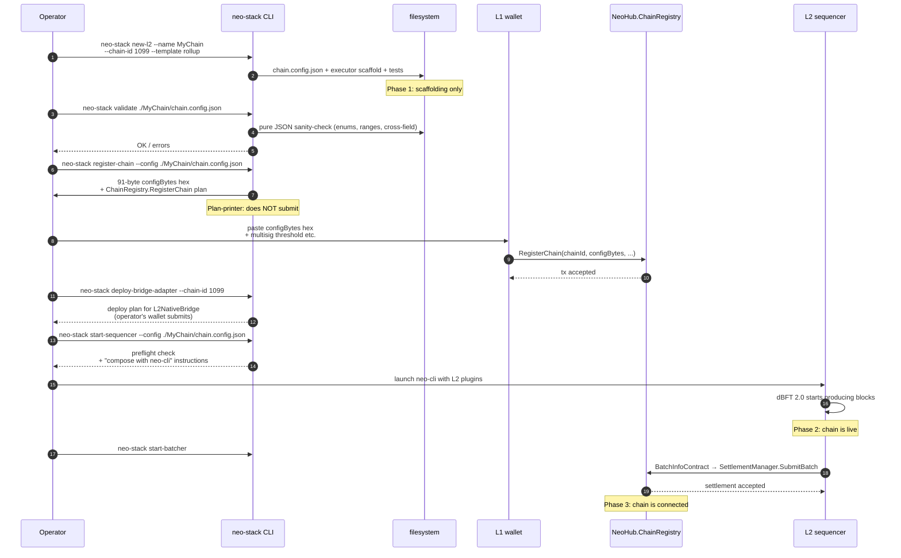

Three phases:

| Phase | What's true after this phase                                      |
|-------|-------------------------------------------------------------------|
| 1     | Local files exist; chain has an identity but no on-chain presence |
| 2     | NeoHub knows the chain; sequencer is producing L2 blocks          |
| 3     | L2 batches land on L1; bridge + messaging work end-to-end         |

### The `new-l2` composite

The `neo-stack new-l2 --name X --chain-id Y --template Z` command
strings together three lower-level operations. What gets generated:

```
./MyChain/
├── chain.config.json              ← 91-byte-encodable canonical config
├── MyChainExecutor/
│   ├── MyChainExecutor.csproj
│   ├── src/
│   │   ├── MyChainExecutor.cs     ← ITransactionExecutor stub
│   │   ├── MyChainStateSeam.cs    ← state-store binding
│   │   └── MyChainTxBuilder.cs    ← deposit/message tx helpers
│   └── README.md
├── MyChainExecutor.UnitTests/     ← --with-tests
│   ├── MyChainExecutor.UnitTests.csproj
│   └── *.Tests.cs                 ← 3 starter tests
└── data/  logs/  Plugins/         ← node working dirs
```

The `MyChainExecutor` scaffold is a starting point for chains that
need custom transaction semantics (e.g., RWA chain with KYC checks,
DEX chain with built-in matching). Chains that just need standard
NeoVM + NEP-17 don't need to customize — they use the
`ApplicationEngineTransactionExecutor` shipped in `src/Neo.L2.Executor/`.

### The 3-phase admission policy

Permissionless chain registration is gated through `[plan: §16.1-admission]`
— the L2 chain registry has 3 tiers:

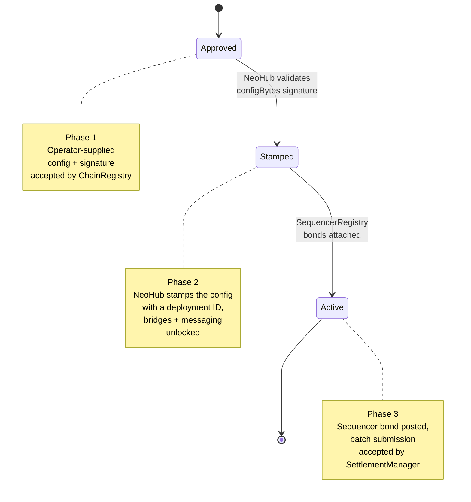

---

## 5. Deployment: contracts going on-chain

Which contracts go where, in what order:

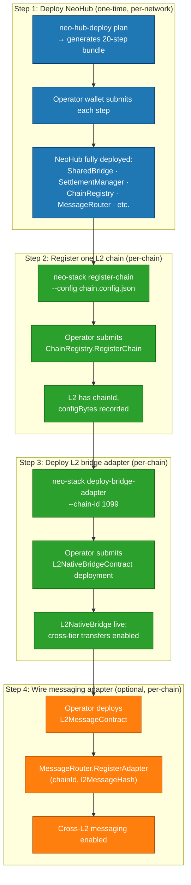

Every command emits a structured plan rather than submitting directly
— the framework never holds private keys. Operators paste the
generated hex/UInt160 args into their wallet of choice (NeoLine,
Neon, NEP-6, Ledger, KMS-driven custom signer). See
[`docs/wallet-integration.md`](./wallet-integration.md) for the
patterns.

### Contract addresses an L2 needs to know

After deployment, an L2's config carries 4 NeoHub UInt160 references:

```toml
# In the L2's runtime config (separate from chain.config.json):
neo_hub_chain_registry      = 0x...  # ChainRegistry
neo_hub_settlement_manager  = 0x...  # SettlementManager
neo_hub_shared_bridge       = 0x...  # SharedBridge
neo_hub_message_router      = 0x...  # MessageRouter (if cross-L2 enabled)
```

Plus its own L2-side contracts:
```toml
l2_native_bridge_hash       = 0x...  # this L2's L2NativeBridgeContract
l2_native_message_hash      = 0x...  # this L2's L2MessageContract
l2_batch_info_hash          = 0x...  # this L2's L2BatchInfoContract
```

---

## 6. Runtime connection: how an L2 talks to L1

Once deployed, an L2 chain is "connected" via three independent
channels — each runs on its own cadence:

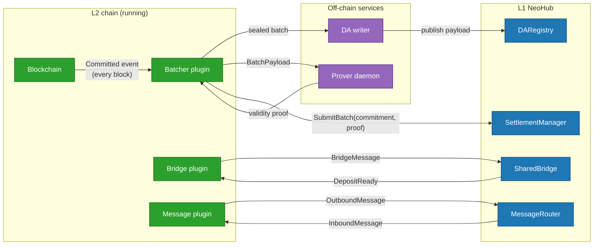

### Channel 1 — Settlement (the hot path)

For every L2 block:

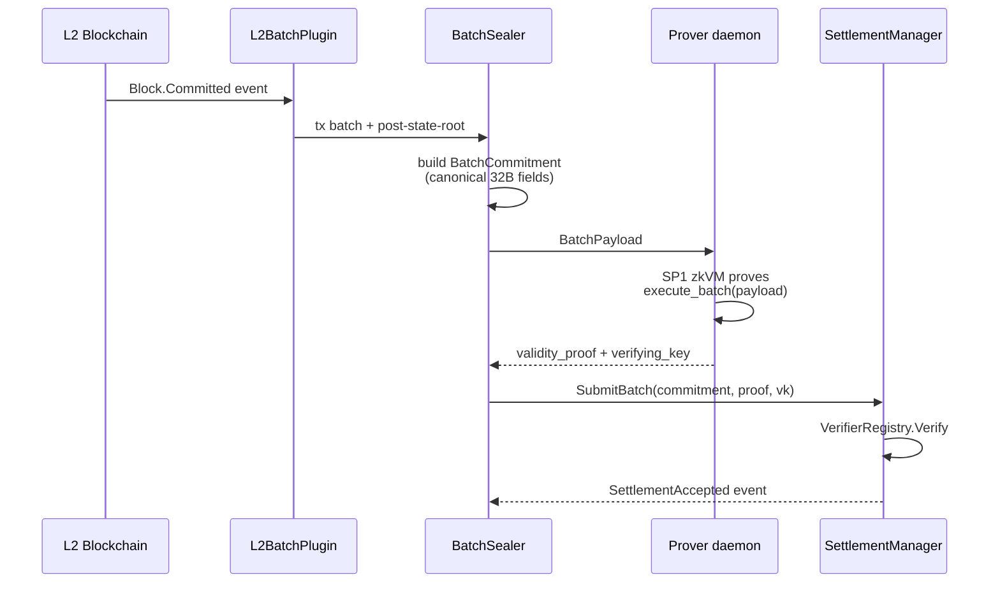

Wire format: `BatchSerializer` (`Neo.L2.Batch/`) — 32-byte fields
in canonical order. See `architecture-walkthrough.md` § "transaction
lifecycle" for the per-tx zoom-in.

### Channel 2 — Bridge (asset transfers)

```mermaid
sequenceDiagram
    participant U as L1 user
    participant SB as NeoHub.SharedBridge
    participant L2BR as L2BridgeContract
    participant L2U as L2 user

    Note over U,L2U: L1 → L2 deposit
    U->>SB: Deposit(chainId, asset, amount, recipient)
    SB->>SB: Lock asset, emit DepositReady event
    Note over SB: L2 batcher polls events
    SB-->>L2BR: DepositReady picked up
    L2BR->>L2BR: Mint wrapped asset, credit recipient
    L2BR->>L2U: balance bump

    Note over U,L2U: L2 → L1 withdrawal
    L2U->>L2BR: Withdraw(asset, amount, recipient)
    L2BR->>L2BR: Burn wrapped asset, emit WithdrawalReady
    Note over L2BR,SB: Withdrawal record sealed in next batch;<br/>after batch finalizes on L1, recipient claims
    L2U->>SB: ClaimWithdrawal(batchId, leafIdx, merkleProof)
    SB->>SB: VerifyWithdrawalLeafWithProof
    SB->>U: release asset
```

Wire format: `DepositPayload` for L1→L2, `WithdrawalRecord` +
Merkle path for L2→L1. Both encoders live in `Neo.L2.Bridge/`.

### Channel 3 — Cross-L2 messaging (optional)

See [§7](#7-cross-l2-messaging) below.

---

## 7. Cross-L2 messaging

When `gatewayEnabled = true` and `messageAdapter` is configured,
L2-A can send a message to L2-B without touching L1 manually:

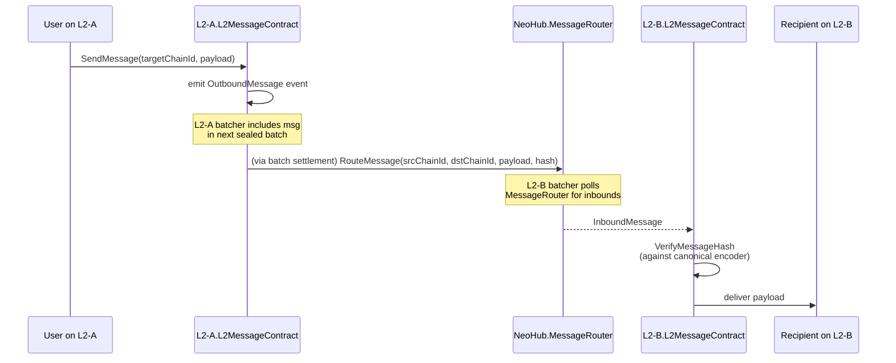

`MessageHasher` (`Neo.L2.Messaging/`) is the canonical encoder —
both endpoints recompute the hash from the wire bytes; the
contract never trusts an off-wire hash. End-to-end the message
crosses 3 trust boundaries (L2-A consensus → L1 settlement →
L2-B consensus); each boundary independently verifies the hash.

---

## 8. External-chain bridge connection

Cross-foreign-chain bridge (Phase B/C, `doc.md` §11.3) lets an
external chain (Eth/EVM family / Solana / Tron) deposit + withdraw
through the same SharedBridge surface. Architecturally:

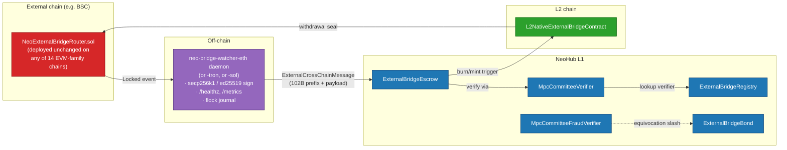

**One contract serves the entire EVM family.** The same
`NeoExternalBridgeRouter.sol` deploys unchanged on Ethereum / BSC /
Polygon / Arbitrum / Optimism / Base / Avalanche / Linea / zkSync /
Scroll / Mantle / Fantom / Celo / Tron — its constructor takes
`externalChainId` from the canonical 16-slot family-bank allocation
in `watchers/neo-bridge-watcher-eth/src/chains.rs`. See
[`external-bridge-evm-chains.md`](./external-bridge-evm-chains.md)
for the 5-step onboarding runbook.

The watcher daemon (production-ready: graceful SIGTERM, `/healthz`,
`/metrics`, flock-based concurrent-instance detection,
`min_confirmations` reorg buffer, `--preflight` validation) lives
at `watchers/neo-bridge-watcher-eth/`. K8s + systemd manifests in
[`deploy/`](../watchers/neo-bridge-watcher-eth/deploy/).

---

## 9. Component cross-reference

Which `neo-stack` subcommand touches which component:

| Subcommand               | Touches (L1)                      | Touches (filesystem)             | Touches (L2)              |
|--------------------------|-----------------------------------|----------------------------------|---------------------------|
| `create-chain`           | —                                 | `chain.config.json`              | —                         |
| `init-l2`                | —                                 | `data/`, `logs/`, `Plugins/`     | —                         |
| `register-chain`         | `ChainRegistry.RegisterChain`     | —                                | —                         |
| `deploy-bridge-adapter`  | `SharedBridge.RegisterAdapter`    | —                                | `L2NativeBridgeContract`  |
| `start-sequencer`        | (preflight only)                  | reads config                     | dBFT 2.0 starts           |
| `start-batcher`          | `SettlementManager.SubmitBatch`   | reads config                     | `L2BatchPlugin` runs      |
| `start-prover`           | (no L1 contact)                   | reads config                     | `L2ProverPlugin` runs     |
| `submit-batch`           | `SettlementManager.SubmitBatch`   | reads batch payload              | —                         |
| `validate`               | —                                 | `chain.config.json` JSON checks  | —                         |
| `scaffold-executor`      | —                                 | `<Name>Executor.csproj` + tests  | —                         |
| `new-l2`                 | composite of create + init + scaffold | composite                    | —                         |
| `list-templates`         | —                                 | prints to stdout                 | —                         |

### Operator deploy planner

For NeoHub itself (one-time, per-network):

```bash
# Generate the 20-step ordered bundle:
dotnet run --project tools/Neo.Hub.Deploy -- plan

# Verify the bundle's invariants:
dotnet run --project tools/Neo.Hub.Deploy -- verify

# Each step is a structured operator-plan: {contract, method, args}.
# The operator's wallet executes them in order.
```

For external-bridge committee setup (per-foreign-chain):

```bash
dotnet run --project tools/Neo.External.Bridge.Cli -- committee-blob \
    --pubs-file watchers.pubs    # one pub33 hex per line
# Outputs: Neo blob (hex) + matching Eth address list

dotnet run --project tools/Neo.External.Bridge.Cli -- deploy-bundle \
    --external-chain-id 0xE0000030 \
    --verifier <UInt160> --registry <UInt160> --escrow <UInt160> \
    --eth-router 0x... --threshold 4 \
    --committee-blob 0x... --eth-addresses 0x...,0x...,...
# Outputs: ordered checklist for both Neo + Eth wallets.
```

---

## See also

- [`ARCHITECTURE.md`](../ARCHITECTURE.md) — English summary of `doc.md` (§-by-§).
- [`WHITEPAPER.md`](../WHITEPAPER.md) — formal whitepaper.
- [`doc.md`](../doc.md) — master Chinese spec (authoritative).
- [`architecture-walkthrough.md`](./architecture-walkthrough.md) — narrative tour
  of the codebase, including the per-transaction lifecycle.
- [`launching-an-l2.md`](./launching-an-l2.md) — operator-step-by-step guide
  for running an L2 (this doc covers the architecture; that one covers commands).
- [`external-bridge-roadmap.md`](./external-bridge-roadmap.md) — Phase B/C
  cross-foreign-chain bridge.
- [`external-bridge-evm-chains.md`](./external-bridge-evm-chains.md) — onboarding
  a new EVM chain in 5 steps.
- [`security-model.md`](./security-model.md) — threat model + mitigations.
- [`tech-stack-coverage.md`](./tech-stack-coverage.md) — what's vendored vs reimplemented.
