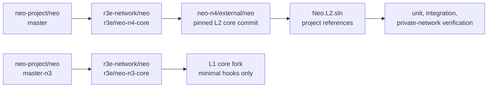
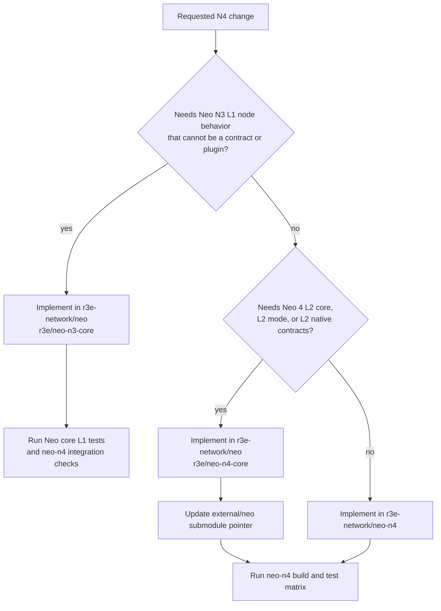

# Neo Core Fork Policy

Neo N4 uses maintained r3e Neo core fork branches rather than building directly
from `neo-project/neo`. The fork has separate ownership boundaries for the L1
anchor core and the L2 execution core.

## Repositories

| Repository | Role |
| --- | --- |
| `r3e-network/neo-n4` | Elastic-network integration repo. Owns contracts, L2 libraries, plugins, tools, SDKs, docs, and tests. |
| `r3e-network/neo` | Maintained Neo core fork. Owns unavoidable core deltas such as L2 native contracts, ChainMode, execution-kernel hooks, and consensus/RPC changes. |
| `neo-project/neo` | Read-only upstream source. Used for review and controlled syncs only. Do not push here. |

## Core Branch Matrix

| Layer | Upstream base | r3e maintained branch | Used for |
| --- | --- | --- | --- |
| L1 core | `neo-project/neo` `master-n3` | `r3e/neo-n3-core` | Neo N3 L1 anchor node behavior and minimal core hooks that cannot be implemented as deployed contracts or plugins. |
| L2 core | `neo-project/neo` `master` | `r3e/neo-n4-core` | Neo 4 L2 execution kernel, L2 mode, L2 native contracts, execution hooks, RPC/consensus deltas. |

The `external/neo` submodule in this repo intentionally points at the L2 core
branch:

```text
url    = https://github.com/r3e-network/neo.git
branch = r3e/neo-n4-core
```

The L1 core branch exists in the same `r3e-network/neo` fork, but it is not the
default submodule checkout for `neo-n4`. L1 core changes should be made on
`r3e/neo-n3-core`; L2 core changes should be made on `r3e/neo-n4-core`.

## Dependency Flow



## Change Placement



## Native Contract Boundary

N4 L2 system contracts are L2 core protocol surfaces and must live on
`r3e/neo-n4-core` under
`external/neo/src/Neo/SmartContract/Native/`. They are registered by
`NativeContract` and exist at genesis on every N4 L2 chain. They must not be
reintroduced as DevPack projects under `contracts/L2Native.*`, added to
`Neo.L2.sln`, or deployed later through `Neo.Hub.Deploy`.

The current L2 native set is:

- `L2SystemConfigContract`
- `L2BatchInfoContract`
- `L2MessageContract`
- `L2BridgeContract`
- `L2FeeContract`
- `L2PaymasterContract`
- `L2NativeExternalBridgeContract`
- `L2AccountAbstraction`
- `BridgedNep17Contract`
- `L2InteropVerifier`

NeoHub L1 contracts are a different boundary: they are deployed L1 contracts,
not Neo core native contracts. They mirror ZKsync's L1
Bridgehub/shared-bridge ecosystem while keeping the Neo N3 L1 node as close to
upstream as possible. The canonical NeoHub implementation lives in
`contracts/NeoHub.*` in `r3e-network/neo-n4`; `neo-hub-deploy` emits the
production deployment bundle and post-deploy wiring hints.

`r3e/neo-n3-core` must not register NeoHub business contracts under
`NativeContract` or keep a `src/Neo/SmartContract/Native/NeoHub` implementation.
Use the L1 core fork only for behavior that cannot be expressed as:

- a deployable NeoHub contract;
- a Neo node plugin;
- an SDK, CLI, watcher, relayer, or operator service;
- a controlled configuration or RPC extension.

If a future requirement appears to need L1 core support, first design the
contract/plugin version. Only move a narrow hook into `r3e/neo-n3-core` after
documenting why a deployed contract or plugin cannot satisfy the requirement.

Use the fork for changes that cannot be implemented cleanly as a plugin,
library, contract, SDK, or operator tool in `neo-n4`. Typical fork-owned work
includes:

- Minimal L1 node behavior that must exist inside the Neo N3 L1 node and cannot
  be implemented as a deployed contract or plugin.
- L2-aware native contracts and native-contract policy gates.
- `ChainMode` and activation hooks.
- Core execution-kernel hooks needed by deterministic L2 state transition.
- Consensus/RPC behavior that must exist inside Neo core.

Keep the change in `neo-n4` when it can live in L2 plugins, NeoHub contracts,
watchers, SDKs, CLIs, docs, or integration harnesses without modifying Neo core.

## Sync Procedure

Use this flow when refreshing the L2 core branch from upstream:

```bash
cd external/neo
git remote -v
git fetch upstream master
git switch r3e/neo-n4-core
git merge upstream/master
git push origin r3e/neo-n4-core

cd ../..
git add external/neo
dotnet test Neo.L2.sln /p:NuGetAudit=false
```

Use this flow when refreshing the L1 core branch from upstream:

```bash
cd external/neo
git fetch upstream master-n3
git switch r3e/neo-n3-core
git merge upstream/master-n3
git push origin r3e/neo-n3-core
git switch r3e/neo-n4-core
```

If either merge is not fast-forward, resolve it inside `r3e-network/neo`, run
the appropriate Neo core tests there first, then update the `neo-n4` submodule
pointer only for L2-core changes.

## Push Safety

Local `external/neo` should be configured with:

```text
origin   https://github.com/r3e-network/neo.git
upstream https://github.com/neo-project/neo.git
upstream push URL disabled
```

Do not push to `neo-project/neo`. All core commits go to `r3e-network/neo`:
L1 commits on `r3e/neo-n3-core`, and L2 commits on `r3e/neo-n4-core`.
