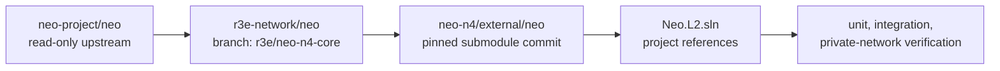
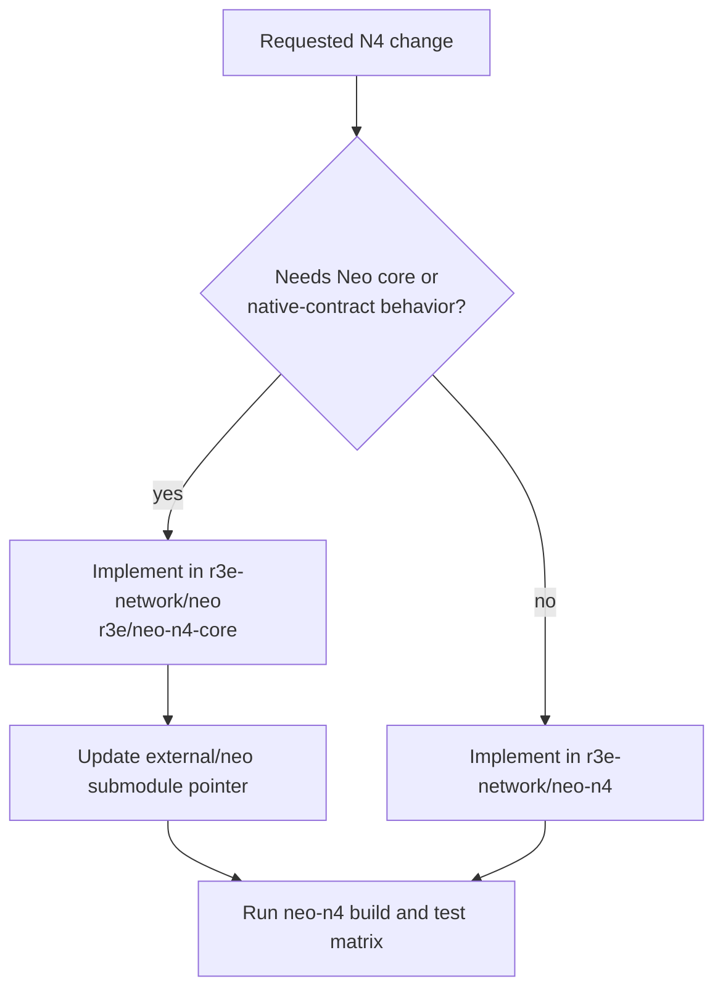

# Neo Core Fork Policy

Neo N4 uses a maintained Neo core fork rather than building directly from
`neo-project/neo`.

## Repositories

| Repository | Role |
| --- | --- |
| `r3e-network/neo-n4` | Elastic-network integration repo. Owns contracts, L2 libraries, plugins, tools, SDKs, docs, and tests. |
| `r3e-network/neo` | Maintained Neo core fork. Owns N4-required native contracts, ChainMode, execution-kernel hooks, and consensus/RPC core deltas. |
| `neo-project/neo` | Read-only upstream source. Used for review and controlled syncs only. Do not push here. |

The `external/neo` submodule in this repo points at:

```text
url    = https://github.com/r3e-network/neo.git
branch = r3e/neo-n4-core
```

## Dependency Flow



## Change Placement



## Native Contract Boundary

N4 L2 system contracts are core protocol surfaces and must live in
`r3e-network/neo` under `external/neo/src/Neo/SmartContract/Native/`.
They are registered by `NativeContract` and exist at genesis on every N4 L2
chain. They must not be reintroduced as DevPack projects under
`contracts/L2Native.*`, added to `Neo.L2.sln`, or deployed later through
`Neo.Hub.Deploy`.

The current native set is:

- `L2SystemConfigContract`
- `L2BatchInfoContract`
- `L2MessageContract`
- `L2BridgeContract`
- `L2FeeContract`
- `L2PaymasterContract`
- `L2NativeExternalBridgeContract`
- `L2AccountAbstraction`
- `BridgedNep17Contract`
- `L2InteropVerifier`

NeoHub L1 contracts are a different boundary: they are the L1 anchor contracts
that mirror ZKsync's L1 Bridgehub/shared-bridge ecosystem. They remain
deployable L1 contracts unless the Neo L1 itself is intentionally forked and
the full NeoHub surface is migrated into that L1 core.

Use the fork for changes that cannot be implemented cleanly as a plugin, library,
contract, SDK, or operator tool in `neo-n4`. Typical fork-owned work includes:

- L2-aware native contracts and native-contract policy gates.
- `ChainMode` and activation hooks.
- Core execution-kernel hooks needed by deterministic L2 state transition.
- Consensus/RPC behavior that must exist inside Neo core.

Keep the change in `neo-n4` when it can live in L2 plugins, NeoHub contracts,
watchers, SDKs, CLIs, docs, or integration harnesses without modifying Neo core.

## Sync Procedure

Use this flow when refreshing the fork from upstream:

```bash
cd external/neo
git remote -v
git fetch upstream master
git switch r3e/neo-n4-core
git merge upstream/master
git push origin r3e/neo-n4-core

cd ../..
git add external/neo
dotnet test Neo.L2.sln /p:NuGetAudit=false
```

If the merge is not fast-forward, resolve it inside `r3e-network/neo`, run the
Neo core tests there first, then update the submodule pointer in `neo-n4` and run
the `neo-n4` matrix.

## Push Safety

Local `external/neo` should be configured with:

```text
origin   https://github.com/r3e-network/neo.git
upstream https://github.com/neo-project/neo.git
upstream push URL disabled
```

Do not push to `neo-project/neo`. All N4 core commits go to
`r3e-network/neo`, normally on `r3e/neo-n4-core`.
