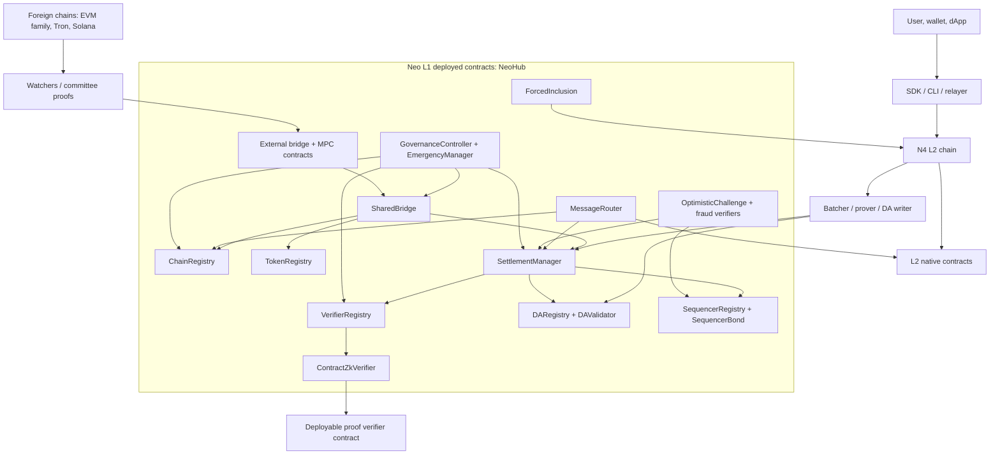
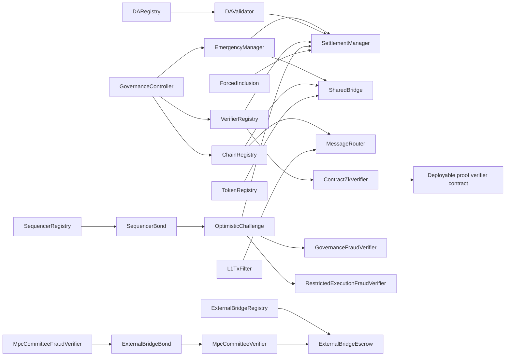
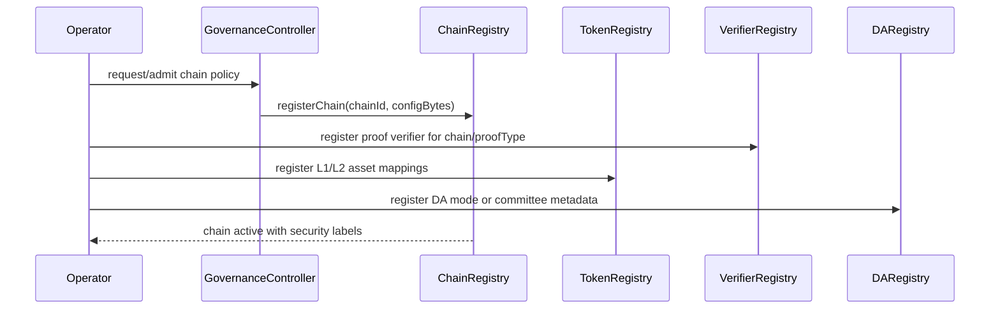
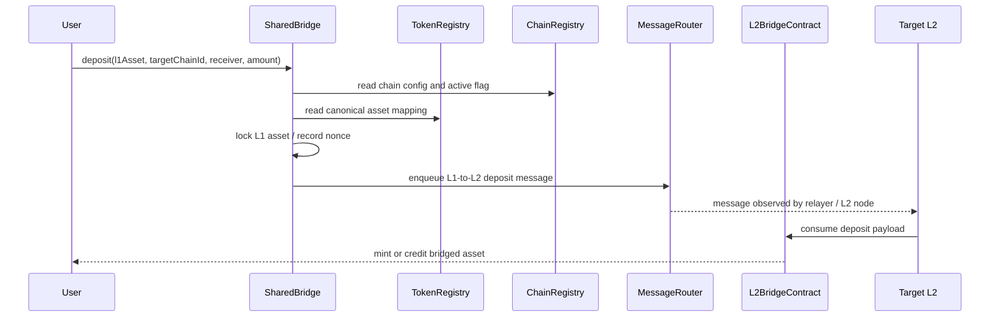
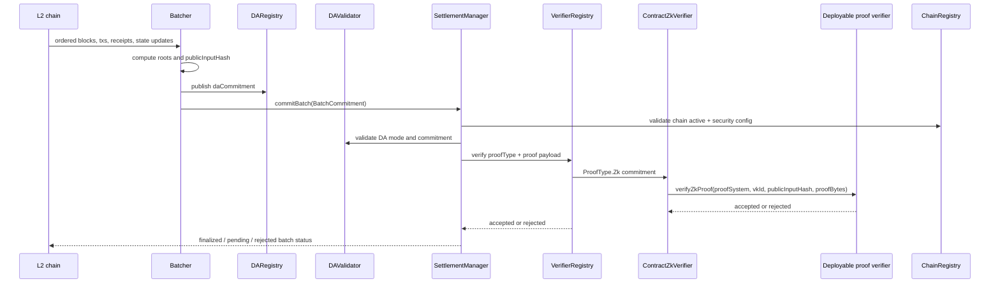
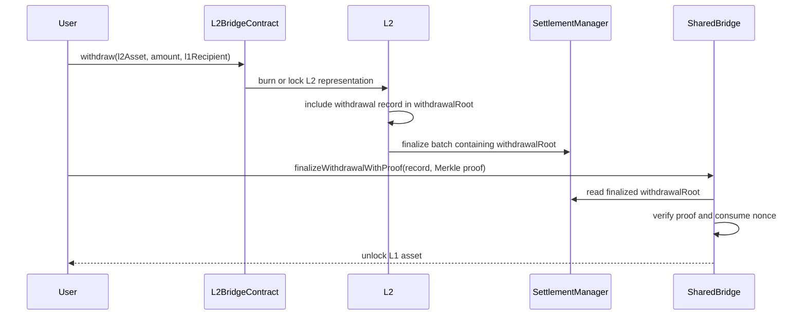
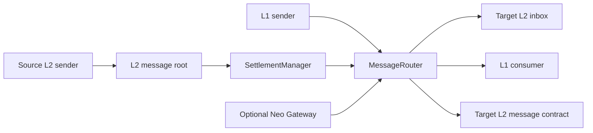
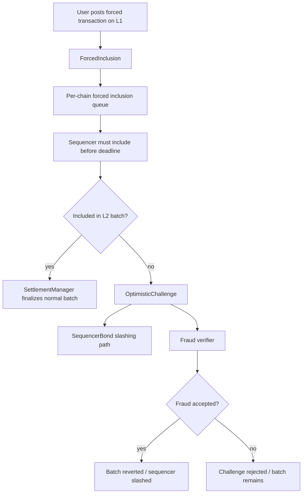
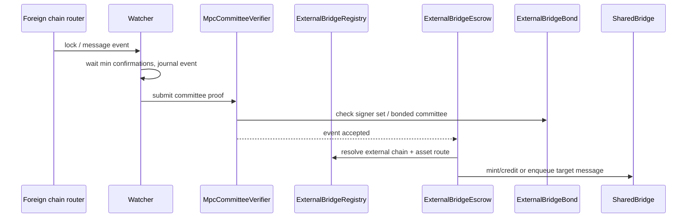
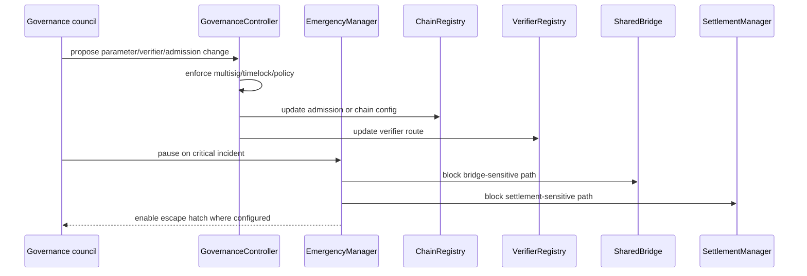

# NeoHub architecture and workflows

NeoHub is the L1 anchor surface for the Neo Elastic Network. It is the place
where L2 chains become canonical: chains are registered, assets are escrowed,
batches are finalized, withdrawals are proven, messages are routed, sequencers
are bonded, and emergency or governance actions are enforced.

This document explains how NeoHub works as a system, how data moves through it,
and how each NeoHub contract participates in the main workflows.

## 1. Production boundary

The repository contains `contracts/NeoHub.*` projects as the canonical
deployable L1 contract bundle. NeoHub is not an L1 native-contract set; the
production target is deployed contracts plus optional node plugins, with only
minimal L1 core hooks in the `r3e-network/neo` fork when a hook cannot be
implemented as a contract or plugin:

- `r3e/neo-n3-core`: L1 core branch, based on upstream `master-n3`. It should
  stay close to upstream and must not register NeoHub business contracts as
  `NativeContract` instances.
- `r3e/neo-n4-core`: L2 execution-kernel branch, based on upstream `master`.
  L2 native contracts and the NeoVM2/RISC-V execution profile live here.

Current status:

- 24 `contracts/NeoHub.*` projects exist in `neo-n4`.
- 23 are production NeoHub contracts; `ExternalBridgeStubVerifier` is test-only.
- 23 are deployed by the production NeoHub deploy plan.
- `ContractZkVerifier` is a deployable NeoHub contract. It validates the
  N4 proof envelope and dispatches proof-system math to a governance-registered
  deployable verifier contract, keeping L1 core changes optional rather than
  required.
- L1 integration is through deployed contracts, node plugins, SDKs, CLIs,
  watchers, relayers, and operator services before considering any L1 core hook.

## 2. System view

The important design rule is that NeoHub owns L1 truth, not L2 execution. L2s
execute transactions and produce roots. NeoHub checks the roots, proof mode,
chain registration, bridge state, and security policy before accepting those
roots as final.

## 3. Contract planes

| Plane | Contracts | What the plane owns |
| --- | --- | --- |
| Chain identity | `ChainRegistry` | L2 admission, chain config, active/paused status, gateway flag, DA/security labels. |
| Asset registry | `TokenRegistry` | Canonical L1 asset to L2 asset mappings and token metadata. |
| Bridge custody | `SharedBridge` | L1 escrow, deposit messages, withdrawal finalization, withdrawal proof checks. |
| Settlement | `SettlementManager`, `VerifierRegistry`, `ContractZkVerifier` | Batch commitment validation, proof dispatch, ZK verifier-router dispatch to a deployable verifier contract, root finalization, batch status. |
| Data availability | `DARegistry`, `DAValidator` | DA commitments, DA mode validation, committee/DAC attestations. |
| Messaging | `MessageRouter`, `L1TxFilter` | L1-to-L2 queues, L2-to-L1 consumption, global roots, optional enqueue filtering. |
| Sequencer security | `SequencerRegistry`, `SequencerBond` | Active sequencers, bond accounting, slashing, exit windows. |
| Censorship resistance | `ForcedInclusion` | L1-posted forced transactions and inclusion deadlines. |
| Challenge/fraud | `OptimisticChallenge`, `GovernanceFraudVerifier`, `RestrictedExecutionFraudVerifier` | Fraud acceptance, challenge windows, restricted re-execution proof validation. |
| Governance/safety | `GovernanceController`, `EmergencyManager` | Admission policy, upgrade controls, pause/resume, escape hatch. |
| External bridge | `MpcCommitteeVerifier`, `MpcCommitteeFraudVerifier`, `ExternalBridgeRegistry`, `ExternalBridgeEscrow`, `ExternalBridgeBond`, `ExternalBridgeStubVerifier` | Foreign-chain event verification, committee bonding, external escrow. Stub verifier is test-only. |

## 4. Core data objects

| Object | Producer | Consumer | Why it matters |
| --- | --- | --- | --- |
| `L2ChainConfig` | Operator / governance | `ChainRegistry`, SDKs, explorers | Defines chain id, operators, verifier, bridge/message adapters, security level, DA mode, gateway mode, exit model, active flag. |
| `BatchCommitment` | L2 batcher | `SettlementManager`, verifiers, auditors | Canonical summary of L2 state transition: pre/post roots, tx root, receipt root, withdrawal root, message roots, DA commitment, public input hash, proof. |
| `DA commitment` | DA writer / batcher | `DARegistry`, `DAValidator`, auditors | Lets L1 and users know where batch data is available and under which DA trust model. |
| `Proof payload` | Prover / committee / challenger | `VerifierRegistry`, fraud verifiers | Establishes whether the submitted batch should be accepted or rejected under the configured proof mode. |
| `Deposit payload` | `SharedBridge` | L2 bridge native contract | Carries L1 escrow event into the target L2 mint/credit path. |
| `Withdrawal record` | L2 bridge native contract | `SharedBridge` | Included in the batch withdrawal root; users prove inclusion to unlock L1 escrow. |
| `Cross-chain message` | L1, L2, or external watcher | `MessageRouter`, L2 message contract, external bridge | Replay-protected message envelope with source/target chain ids and nonce. |
| `Fraud proof payload` | Challenger | `OptimisticChallenge`, fraud verifier | Shows that a finalized or pending batch is invalid under the selected fraud verifier. |

## 5. Contract dependency graph

Read the graph as control/data dependency, not strict call order. The runtime
flow below shows the order in which contracts are normally touched.

## 6. L2 registration workflow

Registration is the first load-bearing step. A chain cannot safely accept
deposits, finalize batches, or consume messages until:

1. `ChainRegistry` has a non-zero active config.
2. `VerifierRegistry` knows which verifier handles the chain's proof mode.
3. `TokenRegistry` maps the assets the bridge may move.
4. `DARegistry` and `DAValidator` can evaluate the chain's DA mode.
5. Governance/emergency policy has a known owner or council path.

## 7. Deposit data flow

Deposit invariants:

- Asset custody remains on L1 in `SharedBridge`.
- Chain id and nonce are part of the message hash, so deposits cannot replay on
  another L2.
- `TokenRegistry` controls whether the asset is canonical, bridged, active, and
  mapped to the target L2 asset representation, including exact L1/L2 decimal
  metadata. NEO is the special platform mapping: L1 NEO stays indivisible
  (`decimals = 0`), while each L2 receives built-in decimal NEO (`decimals = 8`).
- `L1TxFilter` can restrict which L1-to-L2 messages are accepted for a chain.

## 8. Batch settlement data flow

Settlement is the load-bearing boundary. `SettlementManager` does not execute
the L2 batch. It enforces that the batch was produced by an admitted chain,
uses the configured DA/proof mode, and has a proof path that NeoHub accepts.
Once accepted, the post-state root, withdrawal root, and message roots become
the L1 source of truth for bridge and messaging claims.

For `ProofType.Zk`, the proof path is deliberately split. `VerifierRegistry`
routes the commitment to `ContractZkVerifier`, which checks the N4 batch
commitment layout, the RISC-V proof payload envelope, the registered
verification-key id, and the public-input hash boundary. It then calls the L1
deployable verifier contract ABI `verifyZkProof(...)` for proof-system math. This keeps
NeoHub deployable and upgradeable, lets each proof system evolve independently,
and leaves native/precompile acceleration as an optional plugin implementation of
the same verifier ABI rather than a required L1 dependency.

## 9. Withdrawal data flow

Withdrawal invariants:

- Withdrawals are only valid against a finalized `withdrawalRoot`.
- The proof includes chain id, batch number, recipient, asset, amount, and nonce.
- `SharedBridge` must consume the withdrawal once and only once.
- If the batch is challenged and reverted, the withdrawal root must no longer be
  accepted for new claims.

## 10. Message routing data flow

`MessageRouter` is the canonical message index. It handles:

- L1-to-L2 enqueue: L1 contracts or users enqueue messages for a target L2.
- L2-to-L1 consume: users prove a message was included in a finalized L2 root.
- L2-to-L2 route: source L2 message roots can be aggregated through Gateway or
  proven directly depending on the chain configuration.
- Replay protection: source chain, target chain, nonce, message type, sender,
  receiver, and payload are part of the canonical hash.

## 11. Forced inclusion and challenge workflow

The security stack is layered:

- `ForcedInclusion` gives users an L1 escape route when an L2 sequencer censors
  transactions.
- `SequencerRegistry` determines which sequencers are active for a chain.
- `SequencerBond` holds slashable value and controls exit windows.
- `OptimisticChallenge` coordinates challenges over submitted batches.
- `GovernanceFraudVerifier` verifies structural v1/v2 fraud payloads used by
  governance arbitration.
- `RestrictedExecutionFraudVerifier` keeps v3 storage-proof payloads governance-only;
  v4 reads the committed SettlementManager header and executes the declared
  single-transaction Counter semantic before permissionless slashing.

## 12. External bridge data flow

The external bridge plane is intentionally separate from normal L2 settlement:
foreign chains do not produce Neo L2 batches. Watchers observe foreign-chain
events, committee proofs authenticate them, and NeoHub routes the accepted event
into the same asset/message model used by Neo L2s.

## 13. Governance and emergency workflow

The emergency path is intentionally narrow. It should stop unsafe state
transitions or bridge operations, not silently rewrite history. Recovery should
be visible through events and operator runbooks.

## 14. Per-contract reference

| Contract | Primary job | Key inputs | Key outputs/events | Normal callers |
| --- | --- | --- | --- | --- |
| `ChainRegistry` | Store canonical L2 chain configuration and active state. | `chainId`, `configBytes`, governance owner. | Chain registered/paused/resumed; security labels become queryable. | Governance, operator tooling, settlement/bridge/message readers. |
| `TokenRegistry` | Store canonical asset mapping between L1 assets and L2 representations. | L1 asset, L2 chain id, L2 asset, asset type, mode, active flag. | Mapping registered/updated; bridge can resolve asset route. | Governance/operator, `SharedBridge`. |
| `DARegistry` | Record DA commitments by chain and batch. | `chainId`, `batchNumber`, `daCommitment`, DA mode. | Commitment recorded; commitment queryable during settlement/audit. | Batcher/DA writer, `SettlementManager`. |
| `DAValidator` | Validate DA mode-specific attestations and commitment shape. | DA committee metadata, commitment, batch context. | DA accepted/rejected. | `SettlementManager`, operator setup. |
| `L1TxFilter` | Optional per-chain policy hook for L1-to-L2 enqueues. | Sender, receiver, message type, payload, chain config. | Accepted/rejected enqueue decision. | `MessageRouter`. |
| `VerifierRegistry` | Map proof types to verifier contracts. | `proofType`, verifier hash, governance owner. | Verifier registered/updated; proof dispatch result. | `SettlementManager`, governance. |
| `ContractZkVerifier` | Validate `ProofType.Zk` commitment/proof envelopes and dispatch proof-system work to deployable verifier contracts. | Batch commitment bytes, proof-system tag, verification-key id, public-input hash, verifier contract hash. | ZK proof accepted/rejected; verification keys, verifier contracts, and envelope-only mode registered/removed. | `VerifierRegistry`, governance/operator. |
| `SettlementManager` | Validate and finalize L2 batch commitments. | `BatchCommitment`, DA commitment, proof payload, chain config. | Batch committed/finalized/reverted; roots stored for bridge/message proofs. | Batcher, gateway, challenge system. |
| `SharedBridge` | Custody L1 assets and finalize withdrawals. | Deposits, withdrawal records, Merkle proofs, asset mappings. | Deposit enqueued; withdrawal finalized; consumed proof marker. | Users, relayers, L2 bridge adapters. |
| `MessageRouter` | Route replay-protected L1/L2 messages. | Message envelope, source/target chain ids, nonce, roots/proofs. | L1-to-L2 enqueued; L2-to-L1 consumed; global root published. | Users, L2 nodes, relayers, settlement/gateway. |
| `EmergencyManager` | Pause/resume critical NeoHub operations and expose escape hatch controls. | Council/owner witness, pause scope, settlement/bridge references. | Paused/resumed/escape hatch events. | Security council, governance. |
| `GovernanceController` | Control admission, verifier upgrades, protocol parameters, and bridge/governance wiring. | Governance proposal, owner/council witness, target config. | Parameter changed, verifier route changed, chain admission changed. | Governance council, operator tooling. |
| `SequencerBond` | Hold slashable sequencer value and process slashing/withdrawal windows. | Chain id, sequencer, amount, slasher, exit request. | Bond deposited/slashed/withdrawn; active balance. | Sequencers, `OptimisticChallenge`, governance. |
| `SequencerRegistry` | Track active sequencers and committee membership per chain. | Chain id, sequencer account, metadata, activation/exit action. | Sequencer registered/removed/exit-started. | Governance/operator, settlement/challenge readers. |
| `ForcedInclusion` | Store user-posted forced transactions and inclusion deadlines. | Chain id, sender, transaction bytes, deadline policy. | Forced transaction queued/consumed/expired. | Users, L2 sequencer, challenge tooling. |
| `OptimisticChallenge` | Run optimistic fraud challenge flow over disputed batches. | Chain id, batch number, challenger, fraud payload, verifier. | Challenge opened/accepted/rejected; batch status updated. | Challengers, settlement, sequencer bond. |
| `GovernanceFraudVerifier` | Validate structural v1/v2 fraud payloads for governance-mediated challenges. | Versioned fraud payload, claimed/replayed roots, optional witness. | FraudProofAccepted or FraudProofRejected with reason code. | `OptimisticChallenge`, governance challenge path. |
| `RestrictedExecutionFraudVerifier` | Validate governance-only structural v3 or committed-root-bound executable restricted v4. | V3 evidence, or v4 chain/batch/root/transcript/claim/tx/storage witness. | False for honest/invalid/unsupported claims; true only for a wrong committed Counter transition. | `OptimisticChallenge`; v4 single-tx Counter profile, not general NeoVM. |
| `MpcCommitteeVerifier` | Verify external-chain committee signatures and signer threshold. | External event hash, committee signatures, signer metadata. | External event accepted/rejected. | Watchers, `ExternalBridgeEscrow`. |
| `MpcCommitteeFraudVerifier` | Challenge or slash incorrect external committee attestations. | Fraud proof over committee-signed external event. | Fraud accepted/rejected; slashing path enabled. | Challengers, `ExternalBridgeBond`. |
| `ExternalBridgeRegistry` | Register foreign chains, asset routes, and bridge adapters. | External chain id, foreign asset/router, Neo asset/chain route. | External route registered/updated. | Operator/governance, `ExternalBridgeEscrow`. |
| `ExternalBridgeEscrow` | Hold or release assets for foreign-chain bridge events. | Verified external event, route, recipient, amount. | External deposit/withdrawal/message consumed. | Watchers, external bridge relayers, `SharedBridge`. |
| `ExternalBridgeBond` | Bond and slash external bridge committee members. | Committee member, bond amount, fraud/slash request. | Bond deposited/slashed/withdrawn. | Committee members, fraud verifier, governance. |
| `ExternalBridgeStubVerifier` | Test-only verifier used for local scaffolding and negative tests. | Stub event/proof data. | Deterministic test result. | Unit/integration tests only. Not in production deploy bundle. |

## 15. How to read NeoHub during an audit

Use this order when auditing or changing NeoHub:

1. Start with `ChainRegistry`, because every flow is scoped by `chainId` and
   chain security labels.
2. Read `SettlementManager` and `VerifierRegistry`, because they define which
   roots are accepted as L1 truth.
3. Read `SharedBridge` and `MessageRouter`, because they consume finalized roots
   and expose the user-facing bridge/message surface.
4. Read `DARegistry` and `DAValidator`, because invalid DA assumptions weaken
   settlement even if proof dispatch is correct.
5. Read `SequencerRegistry`, `SequencerBond`, `ForcedInclusion`, and
   `OptimisticChallenge`, because they determine censorship and fraud recovery.
6. Read `GovernanceController` and `EmergencyManager`, because upgrade and pause
   authority can override normal liveness assumptions.
7. Read the external bridge contracts last, because they add a separate trust
   domain: foreign-chain finality plus committee attestation.

For byte-level layouts, cross-check
[`architecture-wire-formats.md`](./architecture-wire-formats.md). For trust
assumptions, cross-check
[`architecture-trust-boundaries.md`](./architecture-trust-boundaries.md). For
core fork and deployed-contract boundary rules, cross-check
[`core-fork-policy.md`](./core-fork-policy.md).
