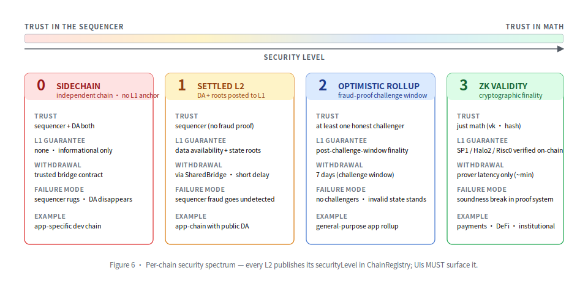

# Security Model

> Operator-facing summary of the Neo Elastic Network's security guarantees, threat
> model, and the user-visible labels that surface a chain's actual trust assumptions.
> The full threat model is in `doc.md` §17 and the formal write-up is in
> `WHITEPAPER.md` §12.

---

## Reporting boundary

[`SECURITY.md`](../SECURITY.md) is authoritative for disclosure routing. Report
N4 and R3E-authored changes to the private `r3e-network/neo-n4` channel. Report
unmodified upstream Neo behavior directly to the Neo Project; changes maintained
in the `r3e-network/neo` fork remain in R3E scope.

---

## What L1 guarantees

For any L2 chain registered in `NeoHub.ChainRegistry`:

- **Asset escrow integrity.** Canonical assets (GAS / NEO / USDT / USDC /
  BTC / NEP-17) live in
  `NeoHub.SharedBridge`. No L2 can mint, burn, or move escrowed assets except by
  finalizing a `withdrawalRoot` through the registered verifier.
- **Settlement determinism.** A `L2BatchCommitment` accepted by `SettlementManager`
  has been verified by the `IL2ProofVerifier` registered in `VerifierRegistry` for
  that chain's `ProofType`. The verifier additionally checks
  `commitment.PublicInputHash == hash(publicInputs)` — preventing a malicious
  prover from signing different inputs than the commitment claims.
- **ZK verifier boundary.** `ProofType.Zk` routes through the deployable
  `NeoHub.ContractZkVerifier` router. The router validates the commitment/proof
  envelope and registered verification-key id, then calls the registered
  terminal verifier for `verifyZkProof(...)`. The production SP1 route binds the
  immutable `Sp1Groth16Verifier` as its deployable verifier contract. It accepts
  the exact 356-byte SP1 proof, reconstructs five public inputs, and evaluates the complete SP1
  v6.1-compatible Groth16 wrapper pairing equation used by SP1 6.2.x using Neo's current BN254
  interops. The production deployment permanently disables envelope-only
  acceptance, freezes the exact SP1 program VK and terminal route with
  `LockProofSystemConfiguration`, then enables the `ProofType.Zk` route.
- **Replay safety.** Every cross-chain message carries `(chainId, nonce)` and is
  deduped per-pair in `NeoHub.MessageRouter`.
- **Withdrawal finality.** Funds leave `SharedBridge` only on inclusion proofs
  against a *finalized* `withdrawalRoot`. Pre-finalization batches cannot release
  L1 assets.
- **Escape hatch.** `EmergencyManager.EscapeHatchExit*` lets a user prove a
  state-tree leaf against the chain's last finalized state root (while the network
  is paused) and records a one-time, replay-protected **exit claim** — it moves no
  funds. A withdrawal the sequencer already finalized is paid out autonomously via
  `SharedBridge.EmergencyFinalizeWithdrawalWithProof` (verified against the batch
  `withdrawalRoot`). For a withdrawal that was *never* finalized, the recorded
  state-leaf claim is settled by governance / off-chain settlement to release
  escrow; fully autonomous payout directly from an arbitrary state leaf is roadmap
  (a generic leaf does not bind a canonical asset/amount/recipient tuple the bridge
  could pay out on its own).

## What L1 does NOT guarantee (per chain, until the chain reaches Phase 4)

- **State-root validity for chains in Phase 0–2.** Until ZK validity proofs are
  online, an L2 in Phase 0 (sidechain) is trust-the-sequencer; Phase 1–2 chains
  are trust-the-multisig; Phase 3 chains are trust-the-challenge-window.
- **Sequencer liveness.** The sequencer can stall a chain. Forced inclusion +
  bond slashing make stall expensive; escape hatch makes it eventually unwindable.

The right way to think about this: **L1 verifies what the registered verifier
verifies.** Phase 4 can provide cryptographic state-transition validity when the
registered circuit, VK, terminal verifier, and deployment wiring are all correct. Phase 3
(optimistic) makes it as trusted as the bisection-game challenge window. Phase
0–2 stack governance (Neo Council, sequencer bonds) on top of multisig.
For the production SP1 Phase 4 path, `VerifierRegistry` points at
`ContractZkVerifier`, which is bound to the immutable `Sp1Groth16Verifier`.
Both contracts, the pinned SP1 circuit/VK, and Neo's BN254 interops are part of
the L1 trusted computing base. The current VM suite accepts a Rust-produced
positive proof through the terminal and router and rejects tampered VK,
public-input, wrapper-field, and proof-point bindings under a pinned fee ceiling.

---

## Per-chain security labels

  

`ChainRegistry` requires every L2 to publish on-chain its security profile:

| Field             | Meaning                                                                    |
| ----------------- | -------------------------------------------------------------------------- |
| `securityLevel`   | `0` sidechain · `1` settled L2 · `2` optimistic rollup · `3` ZK validity   |
| `daMode`          | `1` NeoFS DA by default/recommended · `0` L1 DA · `2` external DA · `3` DAC |
| `gatewayEnabled`  | Whether the chain settles via Neo Gateway (Phase 5)                        |
| `permissionlessExit` | Whether `EmergencyManager` can be invoked unilaterally by users         |

Users read this via the `getsecuritylevel` RPC. UIs MUST surface these labels
prominently — particularly DAC chains (label them as such, no marketing
sugar-coating).

A simple operator rule: **if a wallet UX hides the security label, the chain's
security claim is downgraded to whatever the worst label could be.**

---

## Threats and mitigations

| #  | Threat                          | Primary mitigation                                                       | Code reference                          |
| -- | ------------------------------- | ------------------------------------------------------------------------ | --------------------------------------- |
| 1  | Sequencer censorship            | Forced inclusion + permissionless pause + finalized-dBFT-attributed governance slashing + escape hatch | `Neo.L2.ForcedInclusion`, `Neo.L2.Censorship` |
| 2  | Invalid state root              | ZK validity proof (Phase 4) or optimistic challenge (Phase 3)            | `Neo.L2.Proving.RiscVZk`, `Neo.L2.Challenge` |
| 3  | Bridge exploit                  | Lock-mint vs burn-unlock invariants; per-chain escrow accounting (a chain's withdrawals can never exceed its own deposits); on-chain proof↔state binding in `SettlementManager`; emergency pause | `NeoHub.SharedBridge` (`GetLockedBalance`), `NeoHub.SettlementManager`, `EmergencyManager` |
| 4  | Replay attack (cross-chain)     | `(chainId, nonce)` envelope + per-pair dedup                             | `NeoHub.MessageRouter`, `Neo.L2.Messaging.L1MessageInbox` |
| 5  | DA unavailability               | Public DA security label in `ChainRegistry`; escape hatch on opacity     | `NeoHub.DARegistry`, `EmergencyManager` |
| 6  | Malicious validator committee   | Sequencer bonds; rotate-out via `SequencerRegistry`                      | `NeoHub.SequencerBond`, `NeoHub.SequencerRegistry` |
| 7  | Prover bug                      | `VerifierRegistry` upgrade behind governance delay + security council veto | `NeoHub.VerifierRegistry`, `NeoHub.GovernanceController` |
| 8  | Verifier upgrade attack         | Same governance-delay + veto path as #7                                  | `NeoHub.GovernanceController`           |
| 9  | Message duplication             | `MessageRouter` per-pair `(chainId, nonce)` dedup                         | `NeoHub.MessageRouter`                  |
| 10 | L2 contract bug                 | Local L2 emergency pause + `EmergencyManager` escape hatch               | `NeoHub.EmergencyManager`               |

The codebase enforces a much wider catalog of defensive invariants beyond the
threat-model 10. A non-exhaustive list of the structural ones (each with a
pinning regression test):

- **Cross-batch withdrawal-nonce dedup.** A user cannot reuse a `(sender, nonce)`
  withdrawal across batches even after `WithdrawalProcessor.SealBatch` clears the
  in-flight set.
- **Public-input hash equality at the prover boundary.** `L2SettlementPlugin`
  rejects a proof whose `publicInputHash` differs from the settler's computed
  hash, before submitting to L1 — preventing wasted L1 round-trips.
- **Pinned native SP1 execution boundary.** Production C# execution requires an
  independently reviewed non-zero SHA-256 for `neo-zkvm-executor`. Every invocation
  copies the source executable into an isolated directory while hashing it and executes
  only that digest-matched copy, closing mutable-path and replace-between-check/use
  ambiguity. Shell command construction is not used.
- **Validate-before-atomic-state-commit.** Canonical `NEO4EXR1` binds the exact
  `NEO4EXEC` request, complete pre-state `NEO4STW1`, execution semantic, all roots/gas,
  complete effects/post-state, and public-input hash. C# independently recomputes the
  request and settlement bindings, checks pre-state continuity, and compares/replaces the complete
  state with one `IAtomicL2KeyValueStore.CompareExchangeAll`; malformed output, concurrent-writer
  loss, timeout, digest mismatch, process failure, or state drift leaves the old state intact.
- **Settlement-confirmed prover retention.** The private content-addressed SP1 queue enforces
  `0700` directories, `0600` files, and byte/task backpressure. Proof evidence is pruned only after
  durable `SettlementObserved` produces a matching 32-byte acknowledgement; symlinks, broader
  permissions, foreign ownership, malformed acknowledgements, and TTL cleanup fail closed.
- **Explicit N4 genesis V1 semantic ceiling.** The proven profile has bounded native and
  syscall support and forbids add/remove/replace changes to deployed contract descriptors
  in one transition. Unsupported behavior fails closed. This is a safety property, not a
  claim of general NeoVM/native-contract coverage; expanding it requires a coordinated
  versioned guest/VK/verifier upgrade.
- **Contract ZK verifier router.** `ContractZkVerifier` refuses non-ZK commitments,
  malformed `RiscVProofPayload` envelopes, unregistered verification keys, and
  missing terminal verifier contracts before delegating to `verifyZkProof(...)`.
  For the production SP1 route, the deploy plan binds the immutable
  `Sp1Groth16Verifier` and invokes the irreversible
  `DisableEnvelopeOnlyPermanently` gate, then freezes the exact VK and terminal
  with `LockProofSystemConfiguration` before registering the ZK route. Private
  devnets may use envelope-only mode only on a separate, deliberately unlocked
  deployment.
- **Executable-profile gate on `OptimisticChallenge.Challenge`.** Closes a
  bond-drain attack window: `Challenge` will only invoke a `fraudVerifier`
  contract hash that is allowlisted and whose exact chain, semantic id, replay
  domain, and generation are registered as an executable v4 profile. Without
  both gates, an attacker could deploy a yes-verifier and drain a sequencer's
  bond. The production planner registers only `RestrictedExecutionFraudVerifier`
  v4; advisory v1/v2/v3 artifacts are never registered and governance cannot
  override the executable-profile requirement.
- **Governance proposal payload binding.** Every `*ViaProposal` method
  (`SetImmutableFlagViaProposal`, `RegisterVerifierViaProposal`,
  `UpgradeVerifierViaProposal`, `RegisterCommitteeViaProposal`) canonically
  encodes its action args and asserts byte-equality against the stored
  proposal payload via `GovernanceController.MatchesProposalPayload`. Council
  members vote on the EXACT bytes the execution call will reproduce — an
  approved proposal can NOT be repurposed with different action args.
- **Council-key loss recovery while quorum survives.** A complete council
  rotation is itself an epoch-bound, threshold-approved, timelocked proposal.
  If one signer in a 2-of-3 council becomes unavailable, the two remaining
  signers propose and approve `BuildRotateCouncilAction`, wait the configured
  timelock, and call `RotateCouncil` with the complete old-member snapshot and
  the exact proposed replacement set. The unavailable key does not participate;
  after rotation every old-epoch proposal expires and removed keys lose authority
  immediately. This path intentionally has no owner bypass. If fewer than the
  configured threshold remain available, operators must stop governance actions
  and follow a separately reviewed emergency-governance migration rather than
  weakening the on-chain quorum.
- **Withdrawal-leaf chainId domain separation.** The
  `SharedBridge.ComputeWithdrawalLeafHash` and off-chain
  `MessageHasher.HashWithdrawal` preimages both prepend a 4-byte LE chainId
  so an inclusion proof from one L2's withdrawal root can never replay
  against another L2 — even if the rest of the tuple coincidentally matches.
- **MPC committee duplicate-signer rejection.** `MpcCommitteeVerifier`
  tracks signer indices in a seenBitmap so an attacker cannot count the
  same committee member twice toward the threshold (also the load-bearing
  defense against ECDSA signature malleability — any low-S/high-S
  re-signature from the same signer hits the duplicate-signer assert
  before Neo's CryptoLib verifier is even called).
- **Empty-proof rejection at prove time.** A non-`None` `ProofType` paired with
  empty `Proof` bytes is rejected at the prove boundary, not waited-for at audit
  time.
- **Strict length match in decoders.** Trailing bytes after the documented
  payload are rejected; without this, an attacker could append padding that L1
  hashes but L2 strips, creating a malleability surface.
- **Enum-byte validation at decode.** Proof-type / DA-mode / etc. discriminants
  are bounds-checked before cast, preventing undefined enum values from
  silently propagating downstream.
- **Defensive copy on stored bytes.** Stores that retain payloads (`InMemoryL2RpcStore`,
  `InMemoryMessageRouter`, `KeyedStateStore`, `InMemoryDAWriter`) clone on insert and
  on iteration, so caller buffer reuse can't silently corrupt records.
- **Signer-set deduplication BEFORE signature verification.** Without this, a
  malicious prover could submit `MaxSigners=256` copies of one valid signature
  and force 256 redundant ECDSA verifications before the duplicate check fires.
- **Subscriber-failure isolation on plugin events.** A throwing `OnBatchSealed`
  subscriber is contained per-subscriber so it can't surface its exception to
  Neo's `Blockchain.Committed` and destabilize block import.
- **Metric-sink isolation from business state.** A throwing `IL2Metrics`
  implementation cannot leave committed state with the caller seeing an exception;
  every business-state call site uses `MetricsExtensions.SafeIncrementCounter`
  + try/catch wrapping. Worst-case bug found: a metric throw after
  `SubmitBatchAsync` succeeded would re-queue an already-on-L1 commitment in a
  retry loop — fixed.
- **JSON-RPC response-id validation.** `JsonRpcClient.CallAsync` rejects a
  response whose `id` doesn't match the request's, per JSON-RPC 2.0 §5.

See `CHANGELOG.md` from iter 67 onward for the full catalog with one-paragraph
rationale per defense.

---

## Reserved chain ids

`chainId = 0` is reserved as the **L1 sentinel**. The convention is encoded in
`L2Outbox.L1ChainId` and enforced at every external mutator across the contract
suite — `RegisterChain`, `EnqueueForcedTransaction`, `Deposit`, `FinalizeWithdrawal`,
`SequencerRegistry.Register`, `SequencerBond.Deposit`, `MessageRouter.EnqueueL1ToL2`,
`OptimisticChallenge.OpenWindow`, `EmitMessage` (L2 native), and the `L2SystemConfig` /
`L2MessageContract` `_deploy` paths. Off-chain sites also reject it via
`ChainIdValidator.ValidateL2`.

Why so many enforcement points: the L2 routing layer interprets `chainId == 0` as
"this message goes to L1." A registered L2 with `chainId = 0` would silently
misroute every L2→L2 message as L2→L1, dropping them at the gateway and breaking
every other chain in the network. Defense-in-depth here means both the deploy-time
admission gate (`ChainRegistry`) and every individual contract that takes a
chainId rejects 0 — so an operator misconfig only ever produces a clear error
at the contract entry point, never silent misrouting.

---

## Operator checklist

Before launching an L2:

- [ ] Set `securityLevel` honestly. If you're a Phase-2 chain (no challenge
      window yet), don't label as `optimistic rollup`.
- [ ] Use `daMode=NeoFS` for the canonical N4 DA path. If you explicitly use
      L1, external DA, or DAC, label it honestly; UIs should warn on DAC.
- [ ] Wire the metrics plugin. The `Neo.Plugins.L2Metrics` plugin hosts an
      `IL2Metrics` sink + `MetricsHttpServer` exposing `/metrics`, `/healthz`,
      `/readyz`. Attach Prometheus and dashboard from `docs/telemetry.md`.
- [ ] Audit the deploy bundle. `Neo.Hub.Deploy plan` produces a deterministic,
      dependency-resolved sequence of L1 deploys; review every step against the
      `ChainRegistry` config you intend to register.
- [ ] For production SP1 settlement, verify the post-deploy action order:
      register the program VK, bind `Sp1Groth16Verifier`, permanently disable
      envelope-only acceptance, freeze the exact VK/terminal configuration, then
      route `ProofType.Zk`. The local positive proof-vector gate is green; do not
      advertise `securityLevel=3` for a public network until that exact reviewed
      NEF/VK pair is deployed and the same positive/negative smoke vectors are recorded.
- [ ] Persist the bootstrapped non-zero SP1 genesis root outside the mutable state DB,
      pin `neo-zkvm-executor` by a reviewed release SHA-256, use an atomic RocksDB-backed
      state store, and verify the configured prover queue/VK/semantic match the same guest.
      Never derive the trusted digest or initial root by silently adopting whatever is on
      disk at restart.
- [ ] Run the in-process devnet (`tools/Neo.L2.Devnet`) end-to-end before
      pointing the plugins at a live Neo network.
- [ ] Configure the audit framework. `Neo.L2.Audit.ChainAuditor` accepts a
      sequence of `IAuditCheck` implementations; the default suite
      (`ContinuityCheck`, `ProofValidityCheck`, `NoZeroProofCheck`,
      `PublicInputHashConsistencyCheck`, `BatchRangeCheck`,
      `DAAvailabilityCheck`) catches the typical "drifted state" modes within
      minutes of a bad batch. The devnet runner shows the canonical wiring.

---

## Reporting issues

Security issues in this repository should be reported to the R3E Network
private vulnerability reporting channel or security mailbox before public
disclosure. Follow [`SECURITY.md`](../SECURITY.md), which is the authoritative
disclosure policy for `r3e-network/neo-n4`; do not route Neo N4 findings to the
read-only `neo-project/neo` upstream.
