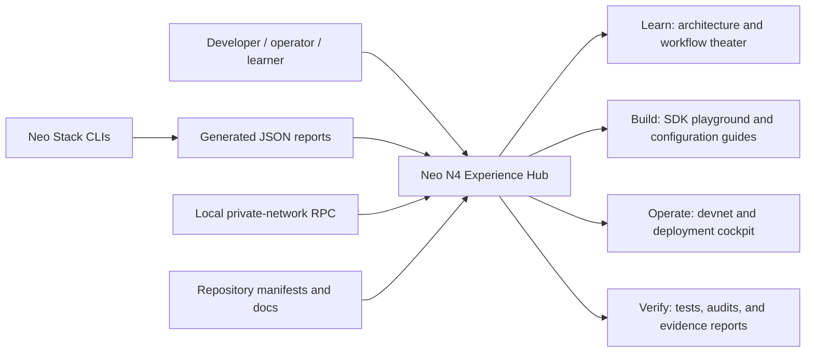
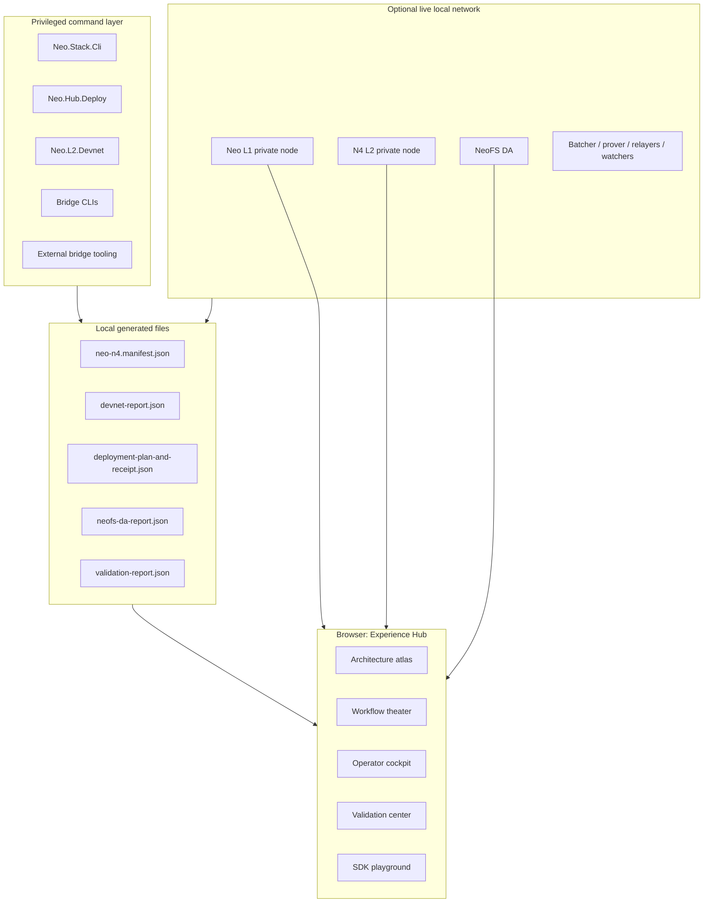
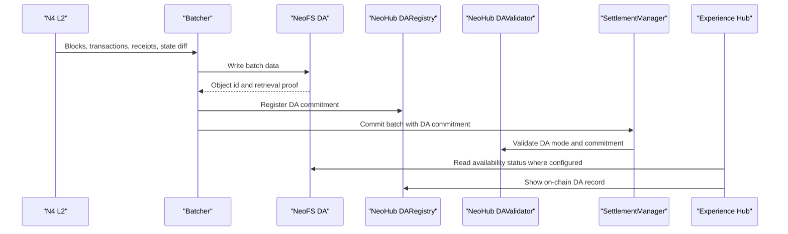
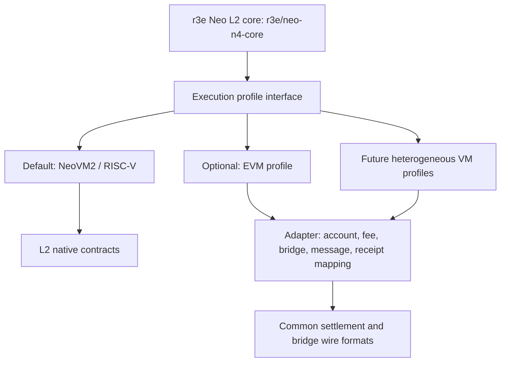
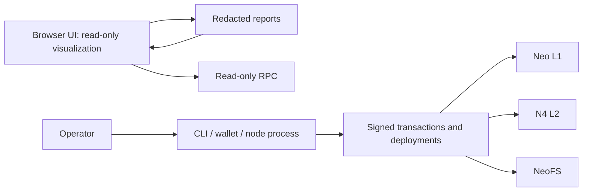

# Neo N4 Unified Experience Hub Design

Status: approved design direction, not yet implemented.

Decision date: 2026-05-19.

Approved direction: Approach C, the Unified Experience Hub.

Audience priority: developers and operators first, with a learner-friendly entry layer.

Chinese version: `docs/zh/superpowers/specs/2026-05-19-neo-n4-unified-experience-hub-design.md`.

## 1. Problem

Neo N4 already contains the major architecture pieces: NeoHub deployable L1
contracts, L2 native contracts in the r3e Neo core fork, a NeoFS data
availability path, a contract-deployed ZK verifier adapter, bridge tooling,
devnet tooling, SDKs, tests, architecture documents, and a static interactive
runtime theater.

The problem is that a new developer or operator still has to understand those
pieces from many files and commands. The desired product experience should make
Neo N4 easy to understand, run, validate, audit, and explain without weakening
the production architecture or moving privileged actions into a browser.

## 2. Goals

- Provide one coherent local-first experience for learning, building,
  operating, and verifying Neo N4.
- Make the architecture visible: L1 NeoHub contracts, deployable L1 ZK verifier contract,
  NeoFS DA, Gateway, bridge, L2 execution, native L2 contracts, and optional VM
  profiles.
- Guide operators through private-network setup, deployment rehearsal, bridge
  drills, DA validation, ZK verification checks, and report generation.
- Give developers SDK playgrounds and exact data-flow explanations for
  deposits, withdrawals, batch settlement, message routing, and external
  bridges.
- Keep security boundaries clear: browser UI reads reports and RPC state; CLI,
  wallets, and node processes perform privileged operations.
- Preserve the current architecture decision that NeoHub is a deployed L1
  contract bundle plus plugins/tooling, not an L1 native-contract set.
- Treat NeoFS as the first-class DA path for Neo N4.
- Keep NeoVM2/RISC-V as the canonical default L2 VM. Additional VMs, such as
  EVM, are pluggable N4 L2 execution profiles, not NeoX.
- Maintain English and Chinese documentation parity for every new user-facing
  document and diagram.

## 3. Non-goals

- Do not make NeoHub an L1 native-contract set.
- Do not put private keys, deployment signing, or governance signing in the
  browser UI.
- Do not bypass `tools/Neo.Stack.Cli`, `tools/Neo.Hub.Deploy`,
  `tools/Neo.L2.Devnet`, bridge CLIs, or existing SDK boundaries.
- Do not claim real public testnet or mainnet readiness from a private local
  rehearsal alone.
- Do not frame optional EVM support as NeoX. It belongs to the Neo Stack / N4
  L2 execution-profile model.

## 4. Current Anchors

The design must build on the repository as it exists today:

| Area | Existing anchor |
| --- | --- |
| Runtime learning | `docs/interactive-runtime/index.html`, `docs/interactive-runtime/simulator.js`, `docs/interactive-runtime.md` |
| Architecture docs | `docs/neohub-architecture-and-workflows.md`, `docs/architecture-l1-vs-l2.md`, `docs/architecture-l2-lifecycle.md`, `docs/architecture-trust-boundaries.md`, `docs/architecture-wire-formats.md` |
| L1 contract boundary | `contracts/NeoHub.*`, `tools/Neo.Hub.Deploy`, `docs/core-fork-policy.md` |
| L2 core boundary | `external/neo` pinned to `r3e-network/neo` branch `r3e/neo-n4-core` |
| Operator tooling | `tools/Neo.Stack.Cli`, `tools/Neo.L2.Devnet`, `tools/Neo.L2.Explore`, `tools/Neo.L2.Bridge.Cli`, `tools/Neo.External.Bridge.Cli` |
| SDK and playground surface | `sdk/typescript`, `sdk/web-explorer` |
| Documentation parity | `docs/zh` mirrors the English docs |

## 5. Product Shape

The Unified Experience Hub is a local-first web application launched or fed by
repo tooling. It should have four top-level workspaces:

1. Learn
2. Build
3. Operate
4. Verify

The first implementation should be static-friendly and runnable without cloud
services. When live state is available, it can connect to local devnet RPC and
read generated report files. When live state is not available, it should still
teach the architecture from embedded manifests and deterministic examples.



## 6. Information Architecture

### 6.1 Learn

Learn explains the system before asking users to run commands.

Required views:

- Architecture map: L1, L2, NeoFS DA, bridge, Gateway, deployable ZK verifier contract,
  SDKs, watchers, and optional VM profiles.
- Workflow theater: deposit, batch settlement, DA publication, ZK proof,
  withdrawal, L2-to-L2 messaging, external-chain bridge, challenge and
  recovery.
- Contract explorer: per-contract NeoHub role, callers, storage, events, and
  associated workflow steps.
- Glossary overlay: inline definitions for chain id, batch root, withdrawal
  root, DA commitment, proof type, sequencer, forced inclusion, and gateway.
- Chinese/English switch or mirrored routes.

### 6.2 Build

Build is for developers integrating with Neo N4.

Required views:

- SDK playground for chain discovery, asset mapping, deposits, withdrawals,
  message envelopes, and report parsing.
- Platform asset map showing decimalized L2 NEO/GAS and common platform tokens
  such as USDT, USDC, and BTC.
- VM profile map: canonical NeoVM2/RISC-V profile first; optional execution
  profiles, such as EVM, shown as pluggable N4 L2 profiles.
- Configuration validator for `chain.config.json`, verifier routes, DA mode,
  bridge routes, asset mappings, and security labels.

### 6.3 Operate

Operate is for running a private network and rehearsing deployment.

Required views:

- Private-network dashboard: L1 node, L2 node, NeoFS DA service, batcher,
  prover, bridge relayer, watcher, and faucet status.
- Deployment wizard: plan, compile, deploy, wire, verify, export report.
- NeoFS DA cockpit: DA object id, namespace/bucket, commitment, availability
  status, retention policy, and validation result.
- Bridge drill console: deposit, inclusion, settlement, withdrawal, replay
  protection, and failure drills.
- Incident controls view: pause state, forced inclusion queue, challenge
  status, emergency runbook links.

### 6.4 Verify

Verify is for production-readiness evidence.

Required views:

- Unit, integration, smoke, contract compile, SDK, and frontend test results.
- Private-network deployment rehearsal report.
- Security checklist and threat-model evidence.
- ZK verifier path evidence: `ContractZkVerifier` envelope checks plus
  deployable verifier contract dispatch status.
- Documentation consistency checks: English/Chinese doc parity and diagram
  coverage.
- CI readiness panel that distinguishes local evidence from real GitHub Actions
  results.

## 7. Runtime Architecture

The UI should be a read-only control surface over generated state. Privileged
state changes remain in CLIs, wallets, node processes, and contracts.



## 8. Data Contracts

The hub should consume stable JSON report schemas. These schemas should be
versioned, redacted, and test-covered.

| Report | Producer | Consumer | Purpose |
| --- | --- | --- | --- |
| `neo-n4.manifest.json` | repo tooling | Hub, docs tests | Lists modules, contracts, tools, docs, diagrams, workflows, and source links. |
| `chain-config-report.json` | `Neo.Stack.Cli validate` | Build, Verify | Normalized chain config, security labels, DA mode, verifier routes, gateway mode, asset mappings. |
| `deployment-plan.json` | `Neo.Hub.Deploy plan` | Operate, Verify | What will be deployed, contract hashes to expect, wiring actions, required witnesses. |
| `deployment-receipt.json` | `Neo.Hub.Deploy verify` | Operate, Verify | What was deployed, hashes, network, block heights, post-deploy checks. |
| `devnet-report.json` | `Neo.L2.Devnet` | Operate, Verify | Node status, RPC endpoints, service health, smoke-test evidence. |
| `neofs-da-report.json` | DA tooling or devnet | Learn, Operate, Verify | DA object ids, commitments, retrieval checks, retention policy, and validation result. |
| `bridge-drill-report.json` | bridge CLIs | Operate, Verify | Deposit, inclusion, settlement, withdrawal, failure, and replay-protection evidence. |
| `validation-report.json` | test harness | Verify | Build, unit, integration, SDK, frontend, security, localization, and docs consistency results. |

Report requirements:

- Include `schemaVersion`, `repoCommit`, `generatedAt`, `tool`, `network`, and
  `redaction` fields.
- Never include private keys, mnemonic phrases, raw signing material, or
  long-lived credentials.
- Preserve exact hashes, block heights, contract hashes, chain ids, asset ids,
  proof ids, DA commitments, and transaction ids.
- Include enough failure details for debugging without leaking secrets.

## 9. NeoFS DA Placement

NeoFS must be visible as the default DA story, not a footnote.



The UI must show:

- Which DA mode is configured for the chain.
- Whether NeoFS write and read checks passed.
- The DA commitment included in the batch commitment.
- The DA registry record and validation result.
- The risk if DA is unavailable, stale, or only committee-attested.

## 10. VM Profile Model

The canonical L2 execution profile is NeoVM2/RISC-V. It is not replaced by the
experience hub. The hub should make the VM model understandable and extensible.



Rules:

- The default L2 profile remains NeoVM2/RISC-V.
- Optional profiles must adapt into common N4 settlement, bridge, message,
  asset, receipt, and DA formats.
- Optional profiles must be documented as N4 Layer-2 execution profiles, not
  NeoX.
- The hub should visualize optional profiles as extension points until the
  implementation exists.

## 11. Asset Experience

The hub must explain platform-wide assets clearly.

Required displays:

- L1 NEO: `decimals = 0`, indivisible on L1.
- L2 NEO: decimalized built-in platform asset, normally `decimals = 8`.
- L1/L2 GAS: shown with chain-specific canonical mapping.
- USDT, USDC, BTC and future well-known assets: shown as platform-wide asset
  routes, with canonical origin, bridge mode, decimals, and chain availability.
- L1-to-L2 and L2-to-L2 transfer paths should be shown as the same asset model
  with different source and target chains.

## 12. Security Model

The hub must be safe by default.

Security rules:

- Browser never stores private keys, mnemonics, governance credentials, or
  deployment signing keys.
- Signing happens through wallets, CLIs, or controlled operator processes.
- Local web server binds to localhost by default.
- Reports are redacted before the UI reads them.
- The UI distinguishes read-only state, simulated examples, local private
  network evidence, and real public network evidence.
- A report from an untrusted directory must not be treated as authoritative.
- External links and generated diagrams must not execute arbitrary scripts.
- Live RPC calls are read-only unless a future signed-action design is
  separately reviewed.

Security boundary:



## 13. Implementation Placement

Recommended placement:

- `docs/experience-hub/` for the local-first web experience, so it can be
  embedded by docs and opened without a remote service.
- `docs/interactive-runtime/` remains the workflow theater module and can be
  imported or linked from the hub.
- `sdk/web-explorer/` can remain the lightweight SDK explorer or be absorbed
  after feature parity is reached.
- `tools/Neo.Stack.Cli` gains report-export and hub-launch commands.
- Domain tools emit their own reports instead of the UI scraping logs.
- `tests/experience-hub/` covers frontend data parsing, scenario state
  machines, report schema fixtures, and accessibility smoke tests.

Do not put the primary experience inside `external/neo`. That repository is the
Neo core fork boundary.

## 14. Phased Plan

### Phase 1: Experience foundation

- Add versioned report schemas and fixtures.
- Add a repo manifest generator.
- Add the Experience Hub shell with Learn, Build, Operate, Verify navigation.
- Import or link the existing interactive runtime theater.
- Add English and Chinese documentation entries.

### Phase 2: Learn and Build

- Build the architecture explorer and workflow replay.
- Add NeoHub contract explorer using generated manifest data.
- Add SDK playground examples for asset mapping, deposit, withdrawal, messages,
  and report parsing.
- Add the VM profile explainer with NeoVM2/RISC-V as default.

### Phase 3: Operate

- Add devnet status ingestion from `Neo.L2.Devnet`.
- Add NeoFS DA cockpit.
- Add deployment plan and deployment receipt views from `Neo.Hub.Deploy`.
- Add bridge drill report views.

### Phase 4: Verify

- Add validation report ingestion.
- Add docs localization and diagram parity checks.
- Add security evidence views.
- Add frontend tests across desktop and mobile viewports.

### Phase 5: Production polish

- Add exportable audit packets.
- Add CI artifacts that publish read-only experience reports.
- Add strict schema compatibility checks.
- Add progressive live-RPC health checks for private networks.

## 15. Acceptance Criteria

The implementation is acceptable when:

- A new user can open one hub and understand how Neo N4 works before running a
  command.
- A developer can find the right SDK and wire-format example for each major
  workflow.
- An operator can start a private network, generate reports, inspect NeoFS DA
  evidence, and run bridge drills from guided commands.
- The UI clearly separates simulation, local private-network evidence, and real
  public network evidence.
- NeoHub remains deployable L1 contracts plus tooling; it is not modeled as L1
  native contracts.
- NeoFS DA appears in architecture, workflow, report, and verification views.
- NeoVM2/RISC-V is the default execution profile, while future VMs are modeled
  as pluggable N4 L2 execution profiles.
- English and Chinese docs are updated together.
- Automated tests cover report parsers, workflow simulations, and core UI
  smoke paths.

## 16. Verification Plan

Minimum verification for the first implementation:

```bash
node --test tests/interactive-runtime/simulator.test.mjs
dotnet test Neo.L2.sln /p:NuGetAudit=false
```

Additional verification once the hub is implemented:

- Frontend unit tests for report parsing and workflow state machines.
- Browser smoke tests for desktop and mobile viewports.
- Accessibility checks for navigation, contrast, keyboard use, and chart text.
- Fixture tests for redaction and schema compatibility.
- Private-network rehearsal that produces `devnet-report.json`,
  `neofs-da-report.json`, `deployment-receipt.json`, `bridge-drill-report.json`,
  and `validation-report.json`.

## 17. Risks and Mitigations

| Risk | Mitigation |
| --- | --- |
| UI becomes a second source of truth | UI reads generated manifests and reports; CLIs and contracts remain authoritative. |
| Browser accidentally becomes an operator wallet | Browser is read-only; signing stays in CLI/wallet/process boundaries. |
| Static examples drift from code | Generate manifests from source and test examples against fixtures. |
| NeoFS DA is under-explained | Make NeoFS DA a first-class workspace in Learn, Operate, and Verify. |
| Optional VM profiles confuse users | Show NeoVM2/RISC-V as default and label other VMs as optional N4 L2 execution profiles. |
| Documentation parity drifts | Add English/Chinese doc parity checks to the validation report. |
| Scope grows into multiple products | Keep one hub shell and phased modules; avoid separate dashboards until there is a proven need. |

## 18. Open Decisions for Implementation Planning

These are planning decisions, not blockers for this design:

- Whether the first UI should be plain static TypeScript or a Vite app.
- Whether `docs/experience-hub/` should replace `sdk/web-explorer/` after
  feature parity or only link to it.
- Exact command names for report export and hub launch.
- Exact JSON schema filenames and locations.
- Whether Playwright should live under a new test project or reuse existing
  Node test conventions.

## 19. Design Review

This design is intentionally product-facing but keeps the protocol boundaries
unchanged. It improves comprehension and operational verification without
moving L1 NeoHub logic into native contracts, without weakening the NeoFS DA
path, and without treating the browser as a signing surface.
