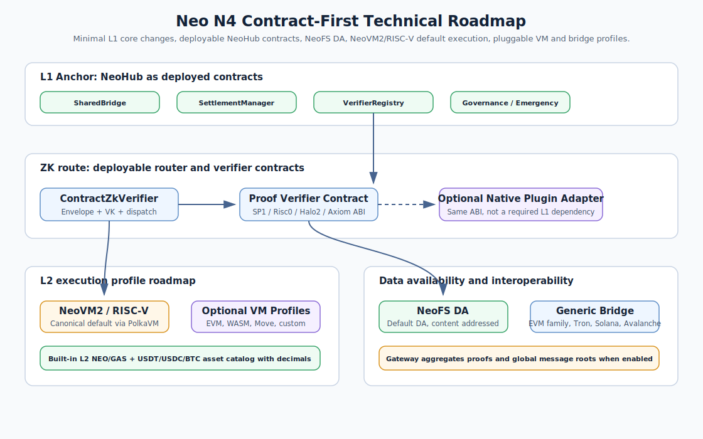

# Neo N4 Technical Roadmap

This roadmap is the current implementation direction for Neo N4. The core
principle is **contract-first L1 integration**: keep NeoHub as deployed L1
contracts, keep L1 core changes minimal, and make native/precompile acceleration
an optional plugin path rather than a required dependency.

  

## 1. L1 Strategy

- NeoHub is a deployable L1 contract suite under `contracts/NeoHub.*`.
- `r3e-network/neo` remains the Neo core fork, with `r3e/neo-n3-core` tracking
  upstream `master-n3` for L1 core and `r3e/neo-n4-core` tracking upstream
  `master` for the L2 execution kernel.
- NeoHub business logic must not be registered as L1 native contracts.
- L1 core hooks are reserved for capabilities that cannot reasonably be shipped
  as contracts, plugins, SDKs, relayers, or operator services.

## 2. ZK Verification Route

- `ContractZkVerifier` is the default `ProofType.Zk` target in
  `VerifierRegistry`.
- It validates the N4 batch commitment envelope, `RiscVProofPayload` version,
  proof-system tag, registered verification-key id, public-input hash boundary,
  and proof-size limits.
- Production chains register a deployable verifier contract per proof system
  using `RegisterProofVerifier(proofSystem, verifier, allowed)`.
- Private devnets and staged integrations can explicitly enable
  `SetEnvelopeOnlyAllowed(proofSystem, true)` while a real verifier contract is
  being integrated.
- Native or precompile acceleration can still exist, but only as an optional
  implementation behind the same deployable verifier ABI:
  `verifyZkProof(byte proofSystem, byte[] verificationKeyId, byte[] publicInputHash, byte[] proofBytes)`.

## 3. L2 Execution

- NeoVM2/RISC-V is the canonical L2 execution profile.
- The RISC-V executor is backed by the PolkaVM-based `external/neo-riscv-vm`
  integration.
- Other VM ecosystems, including EVM, WASM, Move, and custom VMs, should be
  modeled as pluggable N4 L2 execution profiles. They are not NeoX.
- VM profiles connect at the executor/profile boundary and must preserve the
  same L1 settlement, bridge, message, DA, and security labels.

## 4. Data Availability

- NeoFS is the default DA layer.
- L1 DA, external DA, and DAC modes remain explicit alternatives surfaced
  through `ChainRegistry`, `DARegistry`, `DAValidator`, SDKs, and UI labels.
- Operator evidence should include content identifiers, replication policy,
  proof-of-storage/read checks, and the DA mode used by each batch.

## 5. Asset Model

- L1 NEO remains indivisible with `decimals = 0`.
- Every N4 L2 exposes decimal NEO with `decimals = 8`.
- L2 GAS remains 8-decimal, USDT/USDC are 6-decimal, and BTC is 8-decimal.
- The platform asset catalog is shared across L2s so L1-to-L2 and L2-to-L2
  transfers can preserve user expectations without custom per-chain wrappers.
- Withdrawals back to L1 reject lossy fractional exits, especially fractional
  L2 NEO that cannot map to indivisible L1 NEO.

## 6. Interoperability

- The external bridge must stay generic and chain-id driven.
- EVM-family chains, including Avalanche, should reuse the same watcher/router
  model unless a chain needs a distinct signature or event-verification profile.
- Tron and Solana remain separate profiles because their signing and runtime
  details differ from EVM-family chains.
- Gateway aggregation is optional and should aggregate proofs and global message
  roots without taking asset custody away from NeoHub.

## 7. Production Gates

- All contract artifacts must compile and match the deploy planner.
- Unit, smoke, integration, private-network, and selected public-testnet drills
  must publish redacted evidence under `docs/audit/`.
- Documentation, diagrams, and implementation names must agree: default NeoHub
  contracts are deployed contracts, L2 system contracts are Neo core native
  contracts, and native ZK acceleration is optional.
- New English documentation or figures require Chinese counterparts under
  `docs/zh/`.
