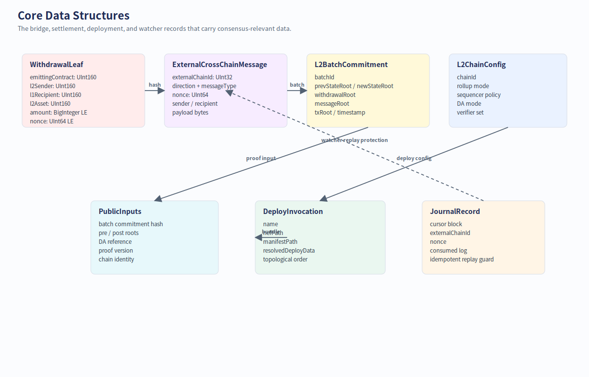
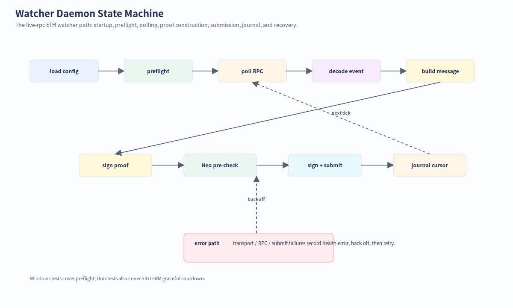
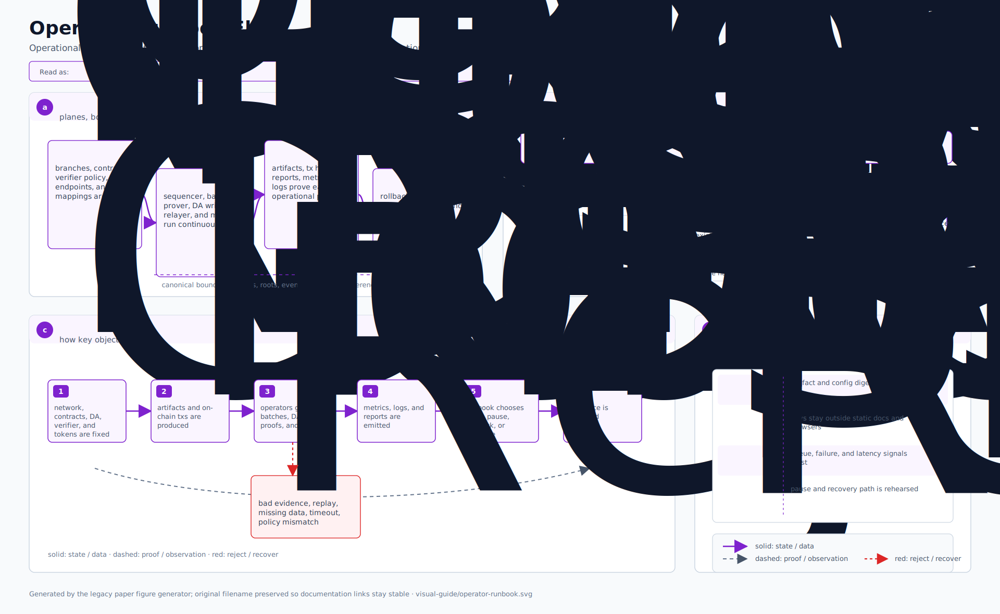

# Visual guide / 可视化导览

这页把 Neo N4 的系统、模块、流程、数据结构和验证面压缩成一组可直接阅读的 SVG 图。适合给新贡献者、运维者、审计者和钱包/SDK 集成方快速建立上下文。

## How to read this page

- 想先理解“有哪些参与方”：看 **System context**。
- 想找代码：看 **Code module map** 和 **Source to artifact map**。
- 想理解桥：看 **Deposit flow**、**Withdrawal flow**、**External bridge data flow**。
- 想上线：看 **Deployment pipeline** 和 **Operator runbook flow**。
- 想审计：看 **Core data structures**、**Trust boundary map**、**Verification matrix**。

## System Context


## Code Module Map


## L1 To L2 Deposit Flow


## L2 To L1 Withdrawal Flow


## Batch Settlement Lifecycle


## External Bridge Data Flow


## Production Deployment Pipeline


## Core Data Structures



## Trust Boundary Map


## Watcher Daemon State Machine



## Verification Matrix


## Operator Runbook Flow



## Source To Artifact Map


## Regenerating

The figures are generated from:

```powershell
docs/figures/visual-guide/generate.ps1
```

Run it from the repository root when the architecture changes.
