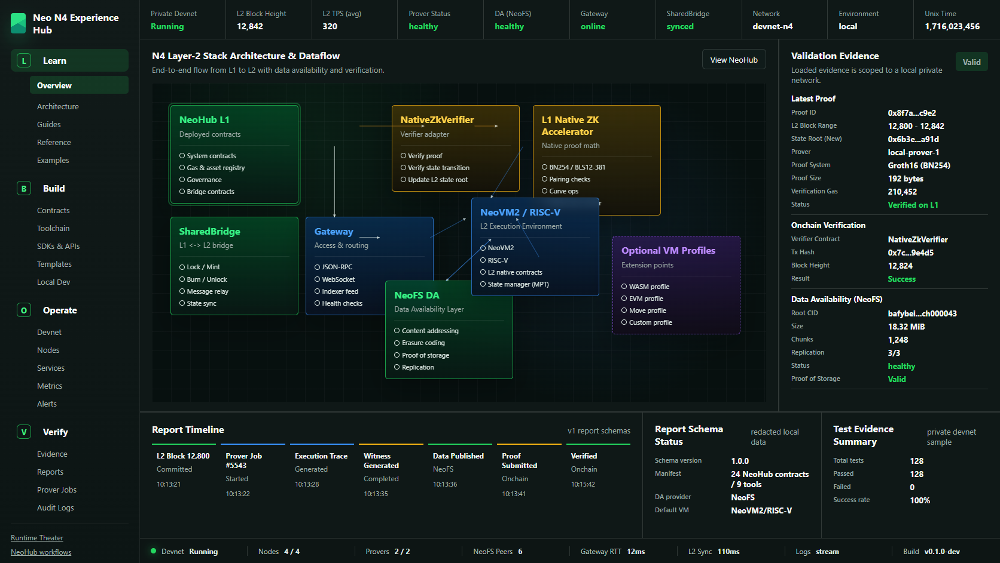
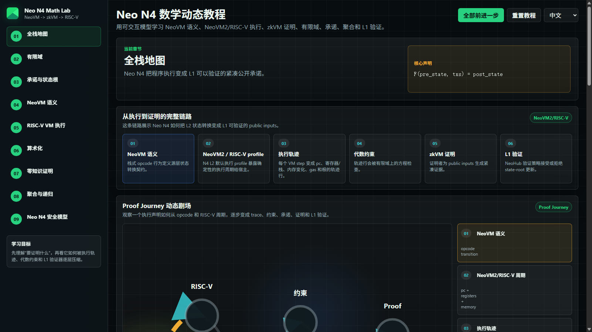
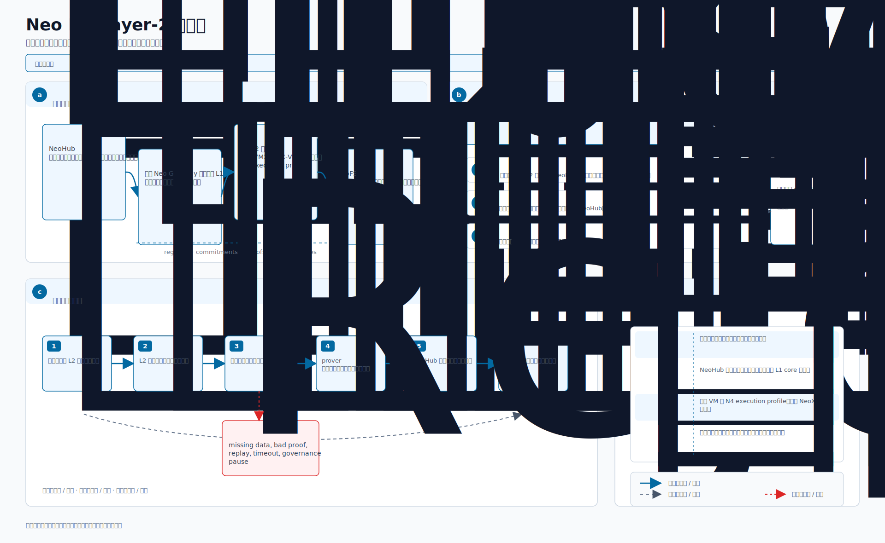
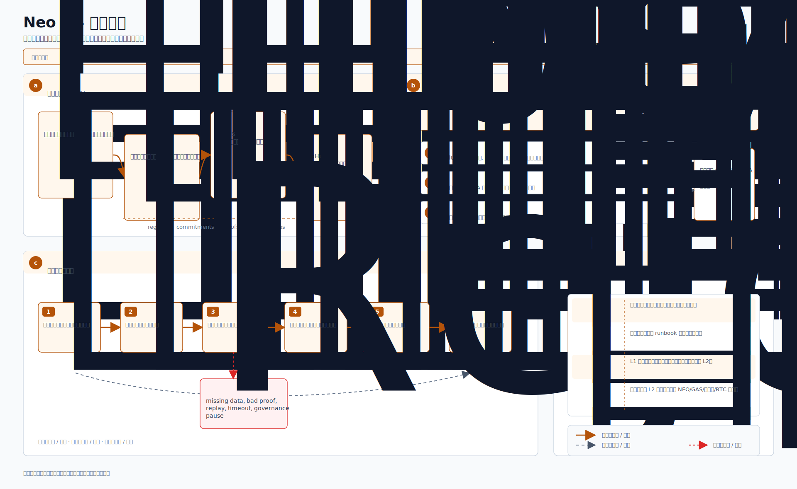
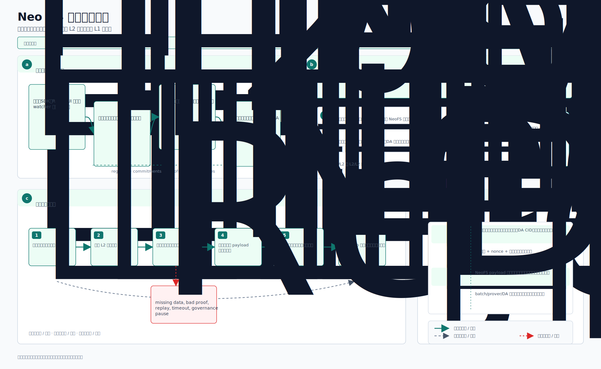
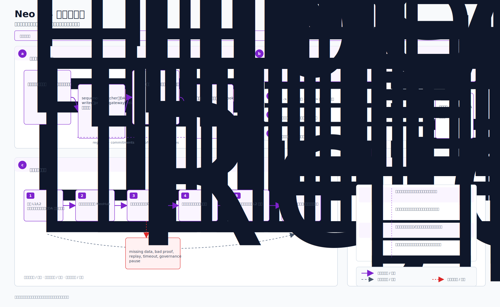
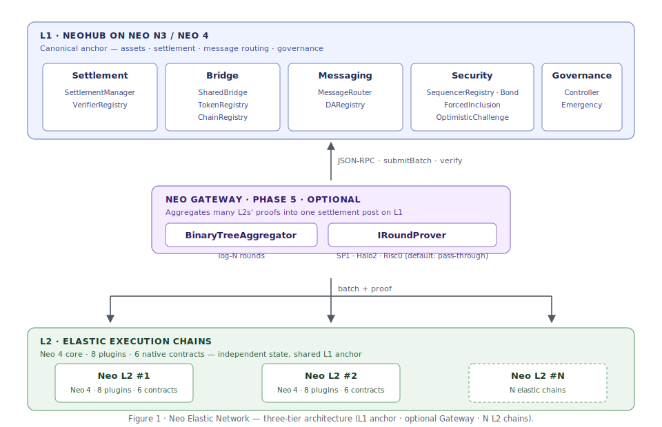

# Neo Elastic Network(`neo4`)—— 中文文档

[](https://github.com/r3e-network/neo-n4/actions/workflows/build.yml)

> 本目录是英文架构文档(`docs/`)的中文版镜像 —— 与英文版一一对应。
> 当两者发生冲突时,[`doc.md`](../../doc.md)(中文母版规范)为权威。

> [!IMPORTANT]
> **独立实现,不是 Neo 4 官方版本。** 本仓库是一份独立实现的多 L2 弹性网络架构,
> 构建在 Neo 栈之上 —— **未受 Neo Global Development(NGD)、Neo 基金会或
> [`neo-project`](https://github.com/neo-project) 组织背书、关联或维护。**
> 本仓中的"Neo 4"指的是被用作 L2 执行内核的*目标 core*;权威的 Neo 4 协议
> 路线图归 Neo 项目所有。代码面向生产部署 L2 链而工程化 —— 完整的密码学原语、
> 真实的持久化、全面的测试覆盖、以及有文档的运维接缝。出身归出身,请像看待
> 任何第三方公链协议实现那样对待它:阅读[安全模型](security-model.md)、
> 主网使用前进行审计、并按你的部署需求接入有文档的生产接缝
> (运维密钥/HSM 策略、真实 NeoFS 适配器、dBFT 共识选择器)。

`neo4` 是 **Neo Elastic Network** 的整合仓 —— 一个使用
[`r3e-network/neo`](https://github.com/r3e-network/neo) Neo core fork 作为 L2 执行
内核的系统。该 fork 现在维护两条 r3e 分支：`r3e/neo-n3-core` 跟踪上游
`master-n3`，用于 L1 core 工作；`r3e/neo-n4-core` 跟踪上游 `master`，用于
L2 执行内核与 native contract 改动。每条 L2 链都会锚定到
Neo N3 / Neo 4 L1 上的统一可部署 L1 合约套件(**NeoHub**),并通过可选的
**Neo Gateway** 层聚合证明与 L2 间消息。NeoHub 以合约部署，并在需要时通过
插件/服务扩展；它不是 L1 原生合约集合。

本架构借鉴了 ZKsync Elastic Chain 的*共享桥 / 链注册表 / 证明聚合*模式,在 Neo 栈
上重新构建:dBFT 2.0 终结性、NEP-17 资产、NeoVM2/RISC-V 执行、NeoFS 数据可用性。

平台资产在 L2 边界做规范化。L1 NEO 保持不可分割(`decimals = 0`),L1 GAS 保持
8 位小数；每条 N4 L2 都内置同一套 NEO、GAS、USDT、USDC、BTC 目录资产。USDT/USDC
固定为 6 位小数，BTC 固定为 8 位小数，NEO 在 L2 上使用 8 位小数表示。L2 原生桥会在
`TokenRegistry` 映射里记录 L1/L2 两侧 decimals,对充值/提款做精确缩放,并拒绝无法
精确回到 L1 的零碎提款，例如非整数 L1 NEO 退出。

---

## 目录

1. [体验中心预览](#体验中心预览)
2. [论文式核心图](#论文式核心图)
3. [架构鸟瞰](#架构鸟瞰)
4. [仓里有什么](#仓里有什么)
5. [分阶段状态](#分阶段状态)
6. [快速上手](#快速上手)
7. [文档地图(中文)](#文档地图中文)
8. [术语对照](#术语对照)
9. [License](#license)

---

## 体验中心预览

静态版 [`Neo N4 Experience Hub`](../experience-hub/index.html) 是理解架构的
可视化驾驶舱。它把测试和私有 devnet 演练使用的同一套脱敏 report schema
渲染成可交互视图,覆盖 NeoHub 可部署合约、`ContractZkVerifier`、L1 可部署 ZK 验证器合约、NeoVM2/RISC-V L2 执行、可选 N4 L2 execution profile,以及作为
数据可用性层的 NeoFS。

<p align="center">
  
</p>

该预览刻意采用本地优先边界:私有 devnet 证据会和公开 testnet/mainnet 证据分开标记,
浏览器界面不暴露签名、部署或任何带敏感信息的控制面。

如果需要学习执行和证明背后的数学基础，可以打开静态
[`Neo N4 Math Lab`](./interactive-math.md)。它用交互控件解释有限域、承诺、
NeoVM 栈转换、NeoVM2/RISC-V 周期、zkVM 算术化、证明验证、聚合和 N4 安全检查。

<p align="center">
  
</p>

---

## 论文式核心图

这四张图是建议的新读者入口：先把 Neo N4 当作协议架构理解，而不是先按源码目录理解。

<table>
  <tr>
    <td width="50%" align="center">
      <strong>架构</strong><br>
      
    </td>
    <td width="50%" align="center">
      <strong>技术原理</strong><br>
      
    </td>
  </tr>
  <tr>
    <td width="50%" align="center">
      <strong>数据流</strong><br>
      
    </td>
    <td width="50%" align="center">
      <strong>工作流</strong><br>
      
    </td>
  </tr>
</table>

---

## 架构鸟瞰

<p align="center">
  
</p>

架构分三层:

- **L1(Neo N3 / Neo 4 上的 NeoHub)** —— 规范锚。24 个可部署合约分到 6 个关注点:
  *Settlement*、*Bridge*、*Messaging*、*Security*、*Governance*、*External Bridge*。
  持有资产、负责结算、消息路由与治理。`ContractZkVerifier` 仍是可部署 NeoHub 合约,
  但会把proof-system 验证工作交给 L1 可部署验证器合约。
- **Neo Gateway(Phase 5,可选)** —— 把多条 L2 的证明聚合为 L1 上的单次结算
  提交。`BinaryTreeAggregator` 在 log-N 轮内归约;`IRoundProver` 出货 3 份生产级
  实现(`MultisigRoundProver`、`MerklePathRoundProver`、`PassThroughRoundProver`)。
- **L2 链(弹性,N 条)** —— Neo 4 core 作执行内核,每条链 8 个 L2 插件,10 个 L2
  原生合约。状态独立、L1 锚共享。

完整的英文架构精炼版见 [`ARCHITECTURE.md`](../../ARCHITECTURE.md);正式技术文档见
[`WHITEPAPER.md`](../../WHITEPAPER.md);权威中文主规格见 [`doc.md`](../../doc.md)。

新读者建议从 [`architecture-atlas.md`](./architecture-atlas.md) 开始,它会根据角色
(运维 / SDK 开发 / 审计 / 贡献者)推荐阅读路径。

---

## 仓里有什么

- **链下库(16)** —— `Neo.L2.{Abstractions, Audit, Batch, Bridge,
  Censorship, Challenge, Executor, Executor.RiscV, ForcedInclusion,
  Messaging, Persistence, Proving, Sequencer, Settlement.Rpc, State,
  Telemetry}`(App SDK 在 `Neo.L2.Sdk`,单独计入下文 App SDK 行)。
- **持久化后备(2)** —— `InMemoryKeyValueStore`(测试)·
  `RocksDbKeyValueStore`(生产默认)—— 见
  [`persistence.md`](./persistence.md)。
- **节点插件(8)** —— `Neo.Plugins.L2{Batch, Bridge, DA, Gateway,
  Metrics, Prover, Rpc, Settlement}`。
- **智能合约(25 个 NeoHub + 10 个 L2 原生)** —— 25 个 NeoHub L1 合约项目(23 个生产合约 + 1 个仅审计用 `GovernanceFraudVerifier` + 1 个测试 stub，包含 `ContractZkVerifier` 与 immutable `Sp1Groth16Verifier`) + 10 个 L2 原生合约(均经
  `Neo.SmartContract.Framework` 类型检查)。
- **CLI 工具(7)** —— `neo-stack`、`neo-l2-devnet`、`neo-hub-deploy`、
  `neo-l2-explore`、`neo-bridge`、`neo-l2-faucet`、`neo-external-bridge`。
- **应用 SDK(4)** —— `src/Neo.L2.Sdk/`(.NET)· `sdk/typescript/`
  (`@neo-n4/sdk`)· `sdk/rust/`(`neo-n4-sdk`)· `sdk/python/`(`neo-n4-sdk`)——
  共享相同的十方法线上协议、四类错误模型，以及
  [`sdk-conformance.md`](./sdk-conformance.md) 所述的离线/真实节点一致性测试。
- **Web 应用(1)** —— `sdk/web-explorer/index.html` —— 单文件静态 UI:
  Explore + Bridge + Faucet + Audit。
- **Rust 证明者/核心(3)** —— `bridge/neo-execution-core/`(后端无关的批次解析、
  receipt/state 折叠、Merkle root、public-input hash, 无 SP1/PolkaVM 依赖)·
  `bridge/neo-zkvm-host/`(sp1-sdk 6.2.1 证明者 + `prove-batch daemon`)·
  `bridge/neo-zkvm-guest/`(被证明的函数)。
- **Submodule(4)** —— `external/neo`(`r3e-network/neo` fork，L2 分支 `r3e/neo-n4-core`；同一 fork 内的 L1 core 分支为 `r3e/neo-n3-core`)、`external/neo-devpack-dotnet`、
  `external/neo-riscv-vm`、`external/neo-zkvm`。
- **测试(37 个 .NET 测试工程 + 跨语言门禁)** —— solution 动态发现当前用例，加 TypeScript、Rust SDK/core/watchers/zkVM、Python SDK、Node 体验层、vendored `neo-zkvm` / `neo-riscv-vm`、Solidity、Solana 和 SP1 发布证明门禁。

---

## 分阶段状态

按 [`doc.md` §18](../../doc.md):

| 阶段 | 目标                                | 状态  | 证据                                                       |
| ---- | ----------------------------------- | :---: | ---------------------------------------------------------- |
| 0    | 侧链 PoC                             | ✅   | MVP 集成测试端到端通过                                    |
| 1    | NeoHub v0 + 共享桥                   | ✅   | 25 个 NeoHub 项目全部编译；部署计划器输出 23 个生产步骤(15 核心 + ContractZkVerifier + Sp1Groth16Verifier + executable-v4 fraud verifier + 5 外链桥)，结构性验证器被排除 |
| 2    | 批次结算                             | ✅   | 真实 `KeyedStateStore` 在跨批次得到连续性验证             |
| 3    | 乐观挑战窗口                         | 🟡   | 只有精确注册的 executable v4 可改变状态；通用 NeoVM fraud proof 仍不支持并 fail closed |
| 4    | NeoVM 2 / RISC-V ZK Validity 证明    | ✅   | N4 L2 执行已落在 NeoVM2/RISC-V:`src/Neo.L2.Executor.RiscV` 绑定 `external/neo-riscv-vm` 的 PolkaVM 宿主;`neo-l2-devnet --executor riscv` 即标准路径。SP1 证明守护进程见 `bridge/neo-zkvm-host`(`prove-batch` CLI),真实 CPU 证明由 `#[ignore]` 发布关口测试验证。 |
| 5    | Neo Gateway 证明聚合                 | 🟡   | binding/outbox/链上 route 已交付；recursive Gateway SP1 prover/guest 与 proof-bound 生产 RPC publication 仍缺失 |
| 6    | Neo Stack CLI / 模板                 | ✅   | 12 个子命令可用                                          |

图例:✅ 完成 · 🟡 大量脚手架 + 测试 · 🔴 stub。

按工程的覆盖详情:[`IMPLEMENTATION_STATUS.md`](../../IMPLEMENTATION_STATUS.md)。

> **L1 信任模型 —— 今天结算实际验证的是什么。** 上表跟踪的是架构完备度,而非链上
> 有效性证明验证。neo4 复刻了 ZKsync 弹性链的*拓扑*,并在**链下**(Rust/SP1,
> `external/neo-zkvm`)运行真实的 ZK 验证,但它**尚未在仓库内提供链上有效性证明
> 验证器**。链上,一个结算批次信任以下之一:`ProofType.Multisig`(Stage 0)下的真实
> secp256r1 委员会;`ProofType.Optimistic`(Stage 1,相对 ZKsync 纯有效性 rollup 的
> 分歧)下的乐观欺诈证明窗口;或 `ProofType.Zk`(Stage 2)下由运维方注册的验证器合约
> (本仓库未附带),否则 `ContractZkVerifier` 仅校验证明*信封*——并在 devnet
> `envelope-only` 模式下不做任何密码学校验。完整的按 `ProofType` 拆解见
> [`docs/zksync-comparison.md` → **L1 信任模型**](./zksync-comparison.md)。

---

## 快速上手

**要求** .NET 10 SDK(`dotnet --version` 必须报 `10.0.x`)。
[`r3e-network/neo`](https://github.com/r3e-network/neo) Neo core fork 作为 git
submodule 引入到 `external/neo`,并跟踪 `r3e/neo-n4-core` 分支。L1 core 工作使用
基于上游 `master-n3` 的 `r3e/neo-n3-core`；L2 core 工作使用基于上游 `master`
的 `r3e/neo-n4-core`。`neo-project/neo` 作为只读上游用于受控同步,不是本仓库的
直接构建依赖。

```bash
git clone --recurse-submodules https://github.com/r3e-network/neo-n4
cd neo-n4

# 类型检查 + 跑全部测试(约 10 秒)
dotnet test Neo.L2.sln /p:NuGetAudit=false

# 启动一条新 L2 链
dotnet run --project tools/Neo.Stack.Cli -- list-templates
dotnet run --project tools/Neo.Stack.Cli -- new-l2 \
    --name MyChain --chain-id 1099 --template rollup

# Devnet 端到端预览
dotnet run --project tools/Neo.L2.Devnet -- 5 --metrics-port 9090
dotnet run --project tools/Neo.L2.Devnet -- 5 --data-dir /tmp/neo-l2-devnet

# 生成 NeoHub 部署 bundle
dotnet run --project tools/Neo.Hub.Deploy -- scaffold \
    --output deploy-plan.json
dotnet run --project tools/Neo.Hub.Deploy -- plan \
    --plan deploy-plan.json --output bundle.json
```

5 分钟教程见 [`getting-started.md`](./getting-started.md);完整流程见
[`launching-an-l2.md`](./launching-an-l2.md)。

---

## 文档地图(中文)

| 文档                                                                  | 受众               | 用途                                                                  |
| ----------------------------------------------------------------------- | ------------------ | --------------------------------------------------------------------- |
| [`README.md`](./README.md)(本文)                                       | 所有人              | `neo4` 是什么、怎么跑。                                              |
| [`SUMMARY.md`](./SUMMARY.md)                                            | 所有人              | mdBook 用的目录索引。                                                |
| [`getting-started.md`](./getting-started.md)                            | 新贡献者            | clone → 测试 → 跑 devnet,5 分钟。                                  |
| [`technical-roadmap.md`](./technical-roadmap.md)                        | 架构师、审稿人      | 合约优先路线：NeoHub、ZK 验证路由、NeoFS DA、VM profile、资产与互操作。 |
| [`launching-an-l2.md`](./launching-an-l2.md)                            | L2 运维者           | 5 步上线一条 L2 链。                                                |
| [`architecture-atlas.md`](./architecture-atlas.md)                       | 所有人              | 架构地图,从角色推荐阅读路径。                                       |
| [`crate-visual-guide.md`](./crate-visual-guide.md)                       | 开发者、审计者  | Rust crate 逐项可视化索引，覆盖架构、工作流和数据流图。             |
| [`neohub-architecture-and-workflows.md`](./neohub-architecture-and-workflows.md) | 工程师、运维、审计者 | NeoHub 架构、数据流、工作流图以及每个 NeoHub 合约的职责矩阵。 |
| [`architecture-walkthrough.md`](./architecture-walkthrough.md)          | 工程师              | 把 `doc.md` 每节映射到代码的叙事导览。                              |
| [`architecture-l2-lifecycle.md`](./architecture-l2-lifecycle.md)        | 工程师              | L2 链生命周期(创建 → 部署 → 运行 → 退出)。                       |
| [`architecture-l1-vs-l2.md`](./architecture-l1-vs-l2.md)                 | 工程师              | L1 与 L2 职责划分 + 决策树。                                        |
| [`architecture-wire-formats.md`](./architecture-wire-formats.md)        | 集成方              | 字节级线协议格式。                                                  |
| [`architecture-trust-boundaries.md`](./architecture-trust-boundaries.md) | 审稿人              | 5 大信任边界 + 验证职责。                                           |
| [`architecture-glossary.md`](./architecture-glossary.md)                 | 所有人              | 术语表 + 组件目录。                                                  |
| [`tech-stack-coverage.md`](./tech-stack-coverage.md)                    | 审稿人              | 5 层栈覆盖矩阵。                                                    |
| [`telemetry.md`](./telemetry.md)                                        | 运维者              | 指标目录、接线样例、Prometheus exposition 格式。                     |
| [`security-model.md`](./security-model.md)                              | 运维者、审稿人       | L1 保证、威胁 → 缓解表、运维 checklist。                           |
| [`persistence.md`](./persistence.md)                                    | 运维者              | RocksDB 后备的持久状态接线。                                        |
| [`wallet-integration.md`](./wallet-integration.md)                      | 运维者              | NEP-6 / Ledger / NeoLine / Neon / KMS 接入模式。                   |
| [`external-bridge-roadmap.md`](./external-bridge-roadmap.md)            | 集成方              | 外链桥 4 阶段路线图。                                                |
| [`external-bridge-evm-chains.md`](./external-bridge-evm-chains.md)      | 运维者              | 接入新 EVM 链的 5 步 runbook。                                      |
| [`spec-gap-plan.md`](./spec-gap-plan.md)                                | 审稿人              | doc.md § 空白闭合追踪。                                              |
| [`plan-application-engine-and-mpt.md`](./plan-application-engine-and-mpt.md) | 工程师 | ApplicationEngine + Merkle 状态根计划。                             |

---

## 术语对照

为保持中英文术语一致,使用以下对照表(与 [`doc.md`](../../doc.md) 的用法对齐):

| 英文 | 中文 |
|------|------|
| L1 anchor | L1 锚定层 |
| canonical(wire format / bytes) | 规范(线协议格式 / 字节) |
| settlement | 结算 |
| bridge | 桥 |
| escrow | 托管 |
| messaging | 消息传递 |
| sequencer | 排序器 |
| batcher | 批处理器 |
| prover(daemon) | 证明守护进程 |
| DA writer | DA 写入器 |
| watcher(daemon) | 中继器(守护进程) |
| committee | 委员会 |
| slash / slashable | 罚没 / 可罚没 |
| forced inclusion | 强制纳入 |
| optimistic challenge | 乐观挑战 |
| trust boundary | 信任边界 |
| economic security | 经济安全 |
| reorg | 重组 |
| min_confirmations | 最小确认数 |
| chain config | 链配置 |
| chain id | 链 ID |
| §16.2 dimensions | §16.2 维度 |
| executor | 执行器 |
| native contract | 原生合约 |
| plugin | 插件 |
| cursor | 游标 |
| nonce | 序号 / nonce |
| Merkle proof | Merkle 证明 |
| public input hash | public input 哈希 |
| stamp | 盖章 |
| admission | 准入 |
| genesis | 创世 |

## 与英文版的对应规则

- **目录结构镜像**:每个 `docs/<name>.md` 对应 `docs/zh/<name>.md`。
- **图表镜像**:中文版指向 `../figures/architecture/` 下的同名 SVG。SVG 内文字
  翻译,几何不变。
- **链接相对路径**:中文版章节之间互相链接使用 `./` 前缀;指向英文母版(如
  `doc.md`)使用 `../../` 前缀。
- **代码 / 配置 / 命令**:所有代码块、TOML 字段名、CLI 参数、合约名都保持原文
  (不翻译),与英文版一致。
- **同步原则**:英文版有更新时,中文版应在合理时间内同步。

---

## License

MIT —— 见 [`LICENSE`](../../LICENSE)。
