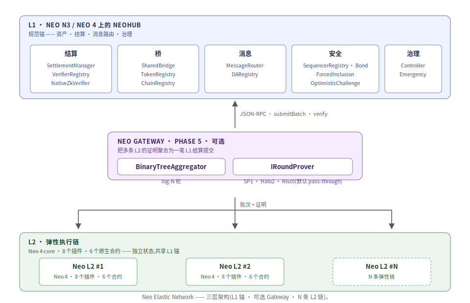
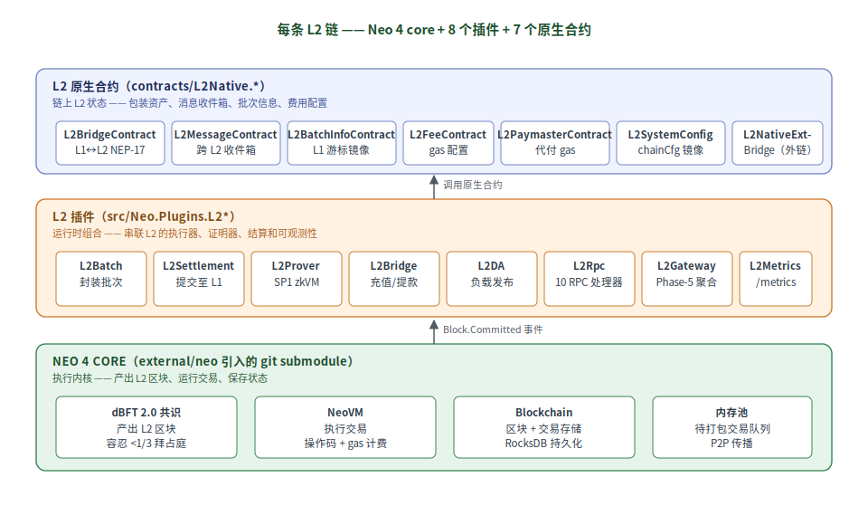
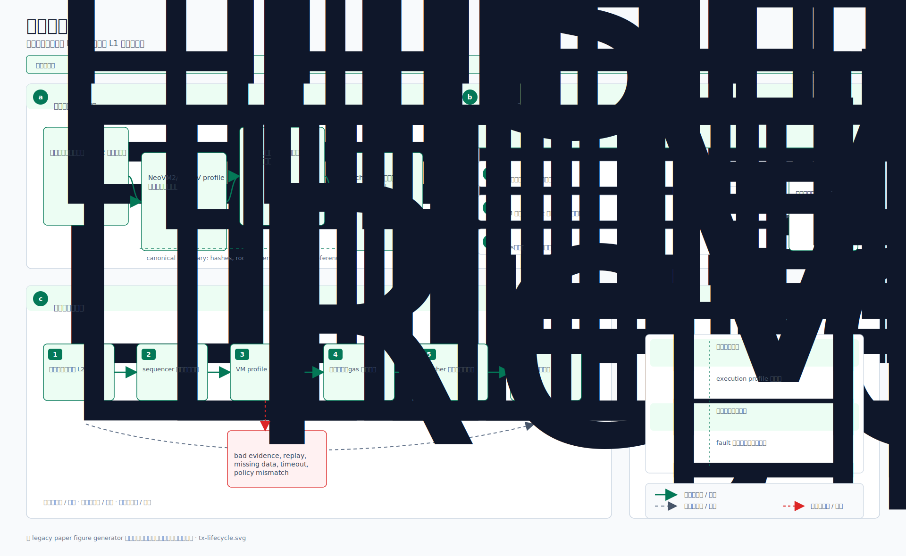
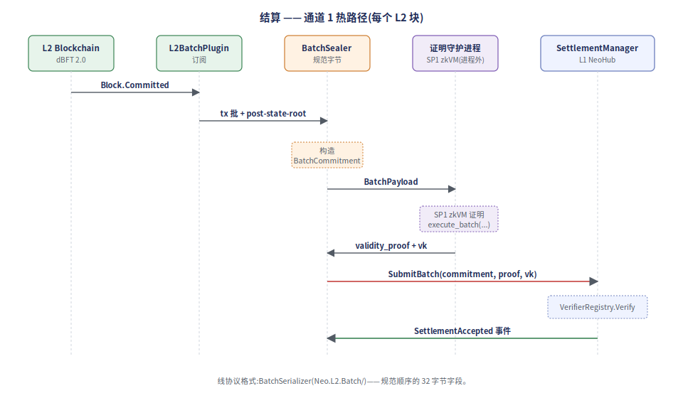
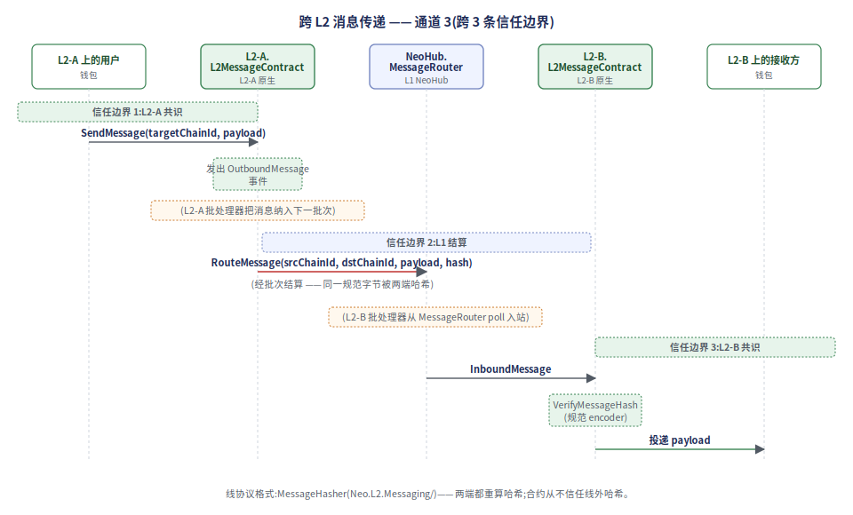
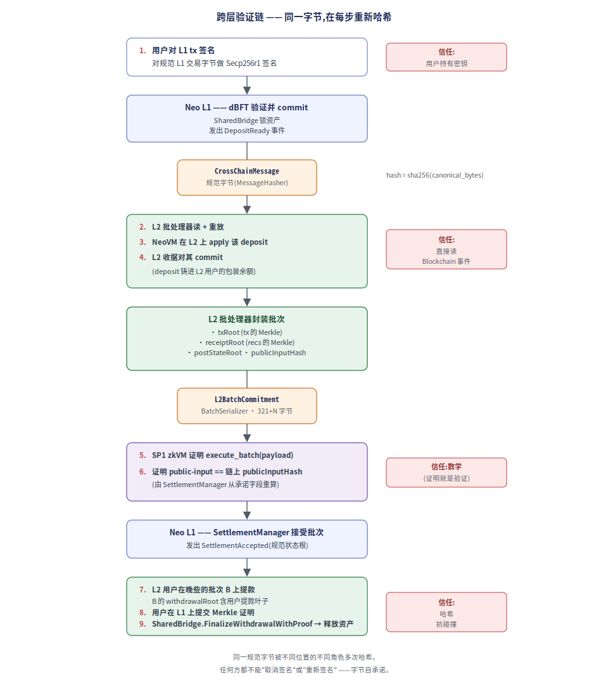
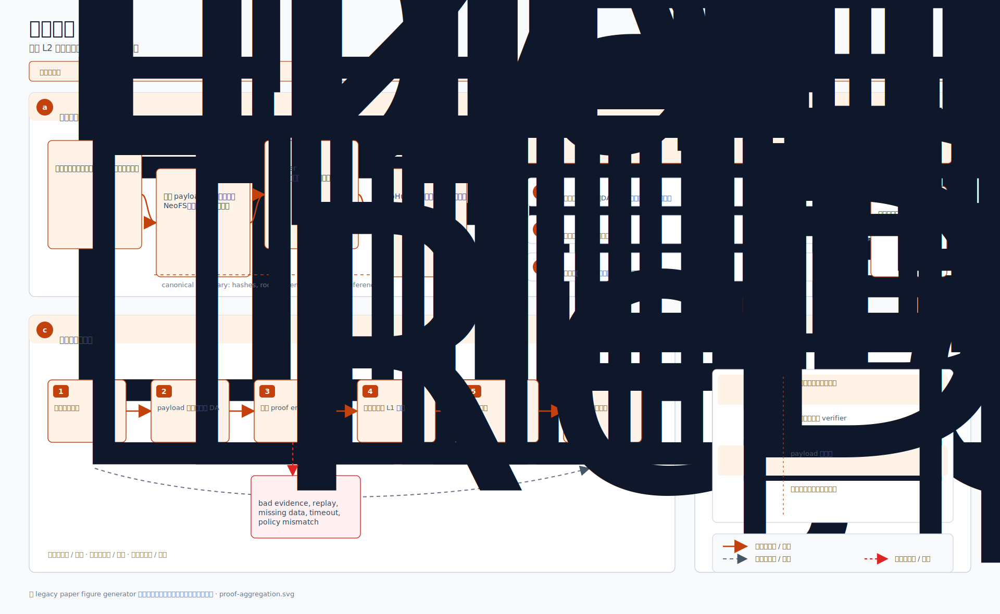
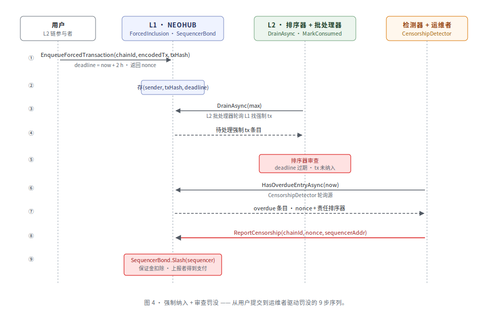
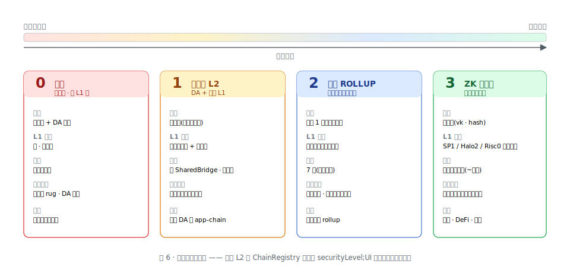

# Neo Elastic Network —— 白皮书

**基于 Neo 4 core 的多 L2 架构,带共享桥、证明聚合、原生跨链消息传递。**

> 本文是 Neo Elastic Network 的正式技术参考。完整设计在 [`doc.md`](../../doc.md)
> (中文,权威);本白皮书是面向外部审阅与集成方上手的英文正式书写;本中文版
> 是该英文白皮书的对应翻译。实现进度见
> [`IMPLEMENTATION_STATUS.md`](../../IMPLEMENTATION_STATUS.md)。

---

## 摘要

Neo Elastic Network 是一个多 L2 栈,以 Neo 4 core 作为 L2 执行内核,把多条 L2
链统一在共享的 L1 合约套件(NeoHub)之下,并支持经 Neo Gateway 的可选证明
聚合与 L2 间消息。设计借鉴 ZKsync Elastic Chain 的*共享桥 / 链注册表 / 证明
聚合*模式,在 Neo 的原语之上重建 —— dBFT 2.0 终结性、NEP-17 资产、
NeoVM 2 / RISC-V 执行、NeoFS 数据可用性。结算经三档可插拔证明体系演进 ——
多签 attestation、乐观挑战、ZK 有效性 —— 因此每条链可以从最弱可接受门槛上线,
并在不改 L2 栈或 L1 合约的前提下收紧到 ZK。

---

## 目录

1. [立项动机](#1-立项动机)
2. [系统概览](#2-系统概览)
3. [L1 合约套件 —— NeoHub](#3-l1-合约套件--neohub)
4. [L2 链内部](#4-l2-链内部)
5. [证明系统](#5-证明系统)
6. [资产模型](#6-资产模型)
7. [跨链消息 —— Neo Connect](#7-跨链消息--neo-connect)
8. [数据可用性](#8-数据可用性)
9. [Neo Gateway —— 证明聚合](#9-neo-gateway--证明聚合)
10. [抗审查与强制纳入](#10-抗审查与强制纳入)
11. [治理](#11-治理)
12. [威胁模型](#12-威胁模型)
13. [分阶段上线](#13-分阶段上线)
14. [与其他 rollup 栈的对比](#14-与其他-rollup-栈的对比)
15. [词汇表](#15-词汇表)

---

## 1. 立项动机

Neo 4 core(Neo 节点的 C# 实现)是一个久经沙场的执行内核:dBFT 2.0 终结性、
原生合约、NEP-17 代币标准,以及即将到来的、与 RISC-V 兼容的 NeoVM 2 指令集。
它能端到端跑一条链。它单独做不了 L2 —— 没有 L1 结算层、没有共享桥、没有证明
verifier、没有 DA 层、没有批处理器、没有消息路由、没有逃生通道。Neo Elastic
Network 提供的正是这些缺失件,并且组织成:

- **多条 L2 链可以以一份共享 L1 footprint 上线。** 每条 L2 复用 NeoHub 来做
  资产托管、结算、消息路由 —— 没有按链的桥,也没有按链的 verifier registry。
  这是借鉴自 ZKsync Elastic Chain 的核心设计课。
- **每条 L2 在治理批准的范围内自选 DA 档与证明体系。** RWA 链愿意为 L1 DA +
  ZK 证明付费;游戏链可以跑在 NeoFS DA + 多签 attestation 上;用户经链上
  *安全标签*看清这种选择。
- **链之间可以原生互通。** Neo Connect 通过单一规范消息根路由 L1↔L2 与 L2↔L2
  消息,因此一笔面向用户的 tx 可以合法地跨多条 L2(一个"跨链 bundle")。
- **排序器安全和执行安全解耦。** 即使是单一运营者排序器,也能通过强制纳入、
  二分挑战游戏、显式逃生通道,在仪式上具备抗审查性。

L1 合约和 L2 插件集 *在架构层面已经定型*;证明体系按一阶段一阶段地沿信任阶梯
向上爬,既不重写 L1 合约,也不重写 L2 插件。

---

## 2. 系统概览

<p align="center">
  
</p>

三层,每层只干一件事:

| 层级             | 拥有                                                                       | 不拥有                                |
| ---------------- | -------------------------------------------------------------------------- | ------------------------------------- |
| **L1**           | 规范资产、结算、消息路由、治理、verifier registry                          | 按链执行                              |
| **Gateway**      | 证明聚合、全局消息根                                                        | 资产托管 —— 资产仍锁在 L1             |
| **L2**           | 执行、批次、排序、本地 DA、证明                                            | 独立的 gas 增发                       |

架构不变量:**L2 链可以多;资产、状态验证、消息路由、治理必须统一。**

---

## 3. L1 合约套件 —— NeoHub

NeoHub 是每条 L2 共享的 L1 合约套件。概念上,它把 ZKsync 的 BridgeHub、
SharedBridge、VerifierRegistry、MessageRouter 合并成一个套件。23 个合约:

<p align="center">
  
</p>

- **`ChainRegistry`** —— 注册 / 配置 / 暂停 L2 链。每条记录:
  `{chainId, operatorManager, verifier, bridgeAdapter, messageAdapter,
  securityLevel(0–3), daMode(0–3), gatewayEnabled, permissionlessExit,
  active}`。
- **`SharedBridge`** —— 托管规范 GAS / NEO / NEP-17。lock-mint 与
  burn-unlock 规则。提款基于已最终化的 `withdrawalRoot`。
- **`SettlementManager`** —— 接受 `L2BatchCommitment`(chainId、
  batchNumber、pre/postStateRoot、txRoot、receiptRoot、withdrawalRoot、
  l2ToL1MessageRoot、l2ToL2MessageRoot、daCommitment、publicInputHash、
  proofType、proof)。把验证转发给 `VerifierRegistry`。
- **`VerifierRegistry`** —— 按 `ProofType` 分发的可插拔 verifier:
  `Multisig`、`Optimistic`、`ZkRiscV`、`Aggregated`。
- **`MessageRouter`** —— L1↔L2 与 L2↔L2 消息队列,带
  `(chainId, nonce)` 防重放。
- **`TokenRegistry`** —— 规范 L1↔L2 资产映射:
  `{l1Asset, l2ChainId, l2Asset, assetType, mintBurn|lockMint, active}`。
- **`DARegistry`** —— 按链记录 DA 承诺。
- **`GovernanceController`** —— L2 准入策略、verifier 升级、桥的紧急
  控制、DA 安全级 registry。
- **`EmergencyManager`** —— 暂停单条链;暴露逃生通道。
- **`ForcedInclusion`** —— 抗审查队列(见 §10)。
- **`SequencerBond`** —— 排序器抵押;错过强制纳入 deadline 时被罚没的
  目标。
- **`SequencerRegistry`** —— 每条链的活跃排序器委员会;准入 / 退出
  生命周期。
- **`OptimisticChallenge`** —— Phase-3 挑战窗口;二分挑战游戏
  fraud-proof 流程的入口。
- **`GovernanceFraudVerifier`** —— 治理仲裁式乐观链的参照
  fraud verifier。解码规范的 `FraudProofPayload`(v1 = 101 字节定长、
  v2 = 105+N 字节带争议 tx witness),校验结构完整性,发出
  accept/reject 事件供 council 审议。
- **`RestrictedExecutionFraudVerifier`** —— 无信任的 v3 fraud verifier
  —— 在链上从每个 storage 证明的叶 hash + sibling + leafIndex 重建
  pre/post Merkle 状态根,与 v1 header 的 `PreStateRoot` /
  `ReplayedPostStateRoot` 进行匹配。被接受的 v3 payload 不需
  council 仲裁即可被采信。

23 个合约都对 `Neo.SmartContract.Framework` 类型检查通过。`Neo.Hub.Deploy`
工具发出拓扑排序 + 依赖解析过的部署 bundle。

NeoHub 背后的原则是**所有 L2 共用一份 L1 信任根**。新加一条 L2 不部署新桥
也不部署新 verifier;它只在 `ChainRegistry` 注册,并继承既有合约。

---

## 4. L2 链内部

每条 L2 链跑 Neo 4 core,加上一组插件和一小套链上原生合约。

<p align="center">
  
</p>

一笔 tx 在 L2 链上的一生 —— 从用户提交、经 dBFT 排序、批次执行、封装、
证明、L1 提交、L1 最终化 —— 走 9 个阶段的流水线:

<p align="center">
  
</p>

### 4.1 插件(`Neo.Plugins.L2*`)

8 个节点插件,均扩展 `Neo.Plugins.Plugin`:

- **`Neo.Plugins.L2Batch`** —— 钩入 `Blockchain.Committed`;封装逻辑放在
  可测试的 `BatchSealer` 里。
- **`Neo.Plugins.L2Settlement`** —— 接好 prover + 结算客户端;签名并
  提交已封装批次。
- **`Neo.Plugins.L2Bridge`** —— 承载 `AssetRegistry` + 充值 / 提款
  处理器。
- **`Neo.Plugins.L2DA`** —— 按配置好的 `DAMode` 选 DA writer
  (in-memory、NeoFS-like、L1、External、DAC)。
- **`Neo.Plugins.L2Prover`** —— 为配好的 `ProofType` 承载一个
  `IL2Prover`。
- **`Neo.Plugins.L2Rpc`** —— 实现 10 个 L2 RPC 方法(见 `doc.md` §6);
  含 `getsecuritylabel` 用于 §16.2 5 维标签。
- **`Neo.Plugins.L2Gateway`** —— Phase-5 证明聚合入口。
- **`Neo.Plugins.L2Metrics`** —— 遥测合并根:共享的 `IL2Metrics` 槽 +
  Prometheus HTTP 端点。

### 4.2 L2 原生合约

6 个 L2 链上原生合约,在每条 L2 上以同一形式部署:

- `L2BridgeContract` —— 桥接资产的 mint / burn;从桥插件接收 `MintInstruction`。
- `L2MessageContract` —— 发出 / 消费跨链消息。
- `L2BatchInfoContract` —— 向 dApp 暴露 `chainId`、`batchNumber`、L1 已最终化高度。
- `L2FeeContract` —— 排序器 / 证明者 / DA 的费管理。
- `L2PaymasterContract` —— 稳定币 / 赞助式付费。
- `L2SystemConfigContract` —— 从 NeoHub 同步 config。

调整(非新增)的原生合约:`GAS`(L2 上供应受桥控制)、`NEO`(可桥但治理在 L1)、
`Oracle`(本地或经 L1 拉取)、`Policy`(本地费控制;桥 / 安全经 NeoHub)。

### 4.3 链模式

每条 L2 经 `ChainRegistry.securityLevel` 声明 4 种模式之一:

| 模式                 | DA          | 证明              | 信任假设                                |
| -------------------- | ----------- | ----------------- | --------------------------------------- |
| `SidechainMode`      | 本地        | 无 / 多签          | 信任排序器委员会                         |
| `L2RollupMode`       | L1 / NeoFS  | 乐观 / ZK         | 信任 verifier(以及挑战窗口)            |
| `L2ValidiumMode`     | DAC         | 乐观 / ZK         | 信任 DAC + verifier                     |
| `L1Mode`             | 自身        | 自身              | 信任 Neo N3 / Neo 4 L1 自身             |

这是链上的,所以用户能经 `getsecuritylevel` RPC(`doc.md` §14.1)读到链的
真实安全级别。

### 4.4 持久化状态 —— `IL2KeyValueStore`

6 个链下组件携带必须在重启后保留的状态:keyed state store、RPC 提款 / 消息
证明、已最终化消息证明、已用强制纳入 nonce、排序器委员会成员(含半途的退出
窗口)、DA payload。用内存字典做测试 OK,生产无法接受 —— 半途退出的排序器
重启后丢失 `ExitsAtUnixSeconds` deadline,可能把本应进入冷却的排序器再次
admit,或者卡死一个已经过期的退出。

方案:显式的 `IL2KeyValueStore` 抽象(`Put` / `Get` / `Delete` / `Contains` /
`EnumeratePrefix` / `Count` / `IDisposable`),两套实现:

- `InMemoryKeyValueStore` —— `SortedDictionary<byte[], byte[]>`,字典序排序。
  devnet / 测试默认。
- `RocksDbKeyValueStore` —— RocksDB 10.10.1,带 snappy 压缩。生产默认。

每个有状态组件都接受一个可选的 `IL2KeyValueStore` ctor 重载和一个所有权
flag;裸的默认 ctor 仍可用(内存版),向后兼容。Devnet 的 `--data-dir <path>`
flag 自动把 4 个 store(state / rpc-proofs / sequencer / da)接到一个根目录
下。运维接线方法见 [`docs/zh/persistence.md`](persistence.md)。

### 4.5 不变量审计 —— `ChainAuditor` + `IAuditCheck`

结算给出规范批次;证明对状态转移做密码学绑定;DA 让 payload 可恢复。这些
单独都不回答运维的"day-2"问题:*"链是不是还 well-formed?"*
`Neo.L2.Audit.ChainAuditor` 把一系列 `IAuditCheck` 不变量组合起来,按
固定周期对一段批次序列跑一遍。内置 6 项检查:

- **`ContinuityCheck`** —— 批次间的状态根连续、batchNumber 单调、block 范围不重叠。
- **`NoZeroProofCheck`** —— 标记带 `ProofType.None` 或空证明字节的批次(soft-sealed 但从未真正证明)。
- **`ProofValidityCheck`** —— 用密码学 verifier 重跑每条承诺的 public input。
- **`PublicInputHashConsistencyCheck`** —— 校验存储的 `PublicInputHash` 与承诺各字段哈希后的值一致(抓篡改提交)。
- **`BatchRangeCheck`** —— 批内不变量(`firstBlock <= lastBlock`、`batchNumber >= 1`)。
- **`DAAvailabilityCheck`** —— 用每个批次的 `DACommitment` 去问配好的 DA 层 `IsAvailableAsync`。

失败递增 `l2.audit.failures` 给运维仪表盘;auditor 抓住自定义检查的 bug(从
`RunAsync` 抛出的 `Exception`),把它们转成失败发现,所以一个坏检查不会让整轮
作废。混 chainId 的批次列表在按检查跑之前用 `ArgumentException` 拒绝。

---

## 5. 证明系统

结算热路径 —— 从 L2 批次执行到证明生成、L1 提交、链上验证 —— 是把
一条链的 L2 状态绑到 L1 信任根的规范数据流:

<p align="center">
  
</p>

### 5.1 证什么

证明目标**不是** C# 节点二进制。是确定性的 L2 状态转移函数:

```
ApplyBatch(preStateRoot, orderedTxs, l1Messages, blockContext)
  → (postStateRoot, receiptRoot, withdrawalRoot, l2ToL1MessageRoot, l2ToL2MessageRoot)
```

Public input(由 `L2BatchCommitment.publicInputHash` 承诺):

```
chainId, batchNumber, preStateRoot, postStateRoot, txRoot, receiptRoot,
withdrawalRoot, l2ToL1MessageRoot, l2ToL2MessageRoot, l1MessageHash,
daCommitment, blockContextHash
```

Witness:有序 tx、合约字节码、storage 读 / 写路径、原生合约状态 witness、
消耗的 L1 消息、DA 数据、执行 trace。

### 5.2 三阶段演进

```
Stage 0 —— 多签 attestation        (从 day 1 即可生产可用)
Stage 1 —— 乐观 + 二分挑战游戏     (fraud-proof 流程)
Stage 2 —— ZK 有效性证明           (NeoVM 2 / RISC-V,经 SP1)
```

L1 上的 verifier registry 按 `ProofType` 分发;同一份 `L2BatchCommitment` 形态
能承载三者中任一。一条链只通过更换注册 verifier 来演进 —— 不需要改 L2 插件
代码,也不需要改 L2 合约。

- **Stage 0 —— `AttestationVerifier`。**生产者:`AttestationProver` +
  `ISignerSet`。状态:生产可用;在规范 public-input 字节上的
  M-of-N secp256r1。
- **Stage 1 —— `OptimisticVerifier`。**生产者:`OptimisticProofPayload`
  + 排序器签名。状态:Stage-1 verifier;`BisectionGame` 做 log-N
  收敛到争议 tx。
- **Stage 2 —— `RiscVZkVerifier`。**生产者:`prove-batch daemon`
  (真,跨进程)+ `MockRiscVProver`(进程内测试 seam)。状态:真实
  Neo N3 VM 经 SP1 6.2.1 证明;端到端 queue → daemon → verify 流水线
  已验证。

聚合证明(Phase 5 Gateway)复用同一 registry —— `ProofType.Aggregated` 加上
backend tag 标识用了哪种递归方案。

---

## 6. 资产模型

- **规范 GAS 仅在 Neo N3 / Neo 4 L1 上活着。**L2 不能独立增发规范 GAS;L2 上看似
  GAS 的东西是桥锁定的表示。
- **L2 费默认是已桥接 GAS。**`L2PaymasterContract` 里的 paymaster 允许稳定币付费
  和赞助式 tx。
- **NEO 可被桥接**,但治理权留在 L1 —— 投票在 L1 计算。
- **NEP-17 代币**经 `TokenRegistry` 1:1 映射。每资产 config:`lockMint`(L1 锁、
  L2 mint)或 `mintBurn`(L2 mint 规范资产、burn 时在 L1 释放)。

这一点跨链不变:不存在按 L2 分叉的资产模型。

---

## 7. 跨链消息 —— Neo Connect

3 种流,都经同一 `MessageRouter` + `(chainId, nonce)` 防重放信封路由:

<p align="center">
  
</p>

### 7.1 L1 → L2

```
NeoHub.MessageRouter.enqueueL1ToL2Message(chainId, target, payload)
  → L2 监听 L1 队列
  → L2 在下一批次纳入消息
  → L2BatchCommitment.l1MessageHash 承诺已消费集合
  → L2 原生合约执行消息
```

### 7.2 L2 → L1

```
L2 合约经 L2MessageContract 发出消息
  → 消息哈希 → L2BatchCommitment.l2ToL1MessageRoot
  → 批次在 NeoHub.SettlementManager 上最终化
  → 用户向 NeoHub 提交 Merkle 证明在 L1 上消费消息
```

### 7.3 L2 → L2

```
源 L2 经 L2MessageContract 发出
  → 批次在 NeoHub 或 Gateway 上最终化
  → Gateway 的 globalMessageRoot 更新
  → 中继者向目标 L2 提交 inclusion 证明
  → 目标 L2 原生合约执行消息
```

### 7.4 跨链 bundle

面向用户的原语:一笔 tx,效果跨多条 L2。内部由多条协调消息加一个中继者实现;
用户看到一个 tx hash 和一次签名流。详见 `doc.md` §10.4。

---

## 8. 数据可用性

3 档,在 `ChainRegistry.daMode` 上链标注:

<p align="center">
  
</p>

| DA 模式      | 成本   | 安全                                       | 推荐用于                              |
| ------------ | ------ | ------------------------------------------ | ------------------------------------- |
| `L1`         | 高     | 继承 L1(Neo N3 / Neo 4)                    | RWA、稳定币、高价值 DeFi              |
| `NeoFS`      | 低     | NeoFS 复制 + L1 上记录的承诺                | 游戏、社交、企业                      |
| `External`   | 低     | 用户信任外部 DA 层                          | 生态特定(例如 Celestia)             |
| `DAC`        | 最低   | 委员会 attestation                          | 准入名单制链;**必须**显式标注        |

`MetricsEmittingDAWriter` 用 `mode` 标签包裹每个 DA 后备,导出 Prometheus 指标
(`l2.da.published`、`l2.da.publish_latency_ms`、`l2.da.publish_failures`),
让运维在同一仪表盘上对比 DA 后备。

`IDAWriter` 接口跨模式不变;DA 模式决定插件配置时注入哪个具体实现。

---

## 9. Neo Gateway —— 证明聚合

Phase 5 引入一个可选聚合层,镜像 ZKsync Gateway。Gateway:

<p align="center">
  
</p>

- 从多条 L2 收集 `L2BatchCommitment` + 证明。
- 通过 `BinaryTreeAggregator` 在 `IRoundProver` 实现的 combine 轮次上聚合
  (log-N 轮;默认 `PassThroughRoundProver` 是 hash 合并器;生产换成
  SP1 Compress、Halo2 fold 或 Risc-Zero accumulator)。
- 维护 L2-to-L2 的 `globalMessageRoot`。
- 把一份聚合后的承诺提交给 NeoHub。

**关键不变量:Gateway 不托管资产。**资产全程仍锁在 NeoHub.SharedBridge;
Gateway 只搬证明和消息根。

---

## 10. 抗审查与强制纳入

排序器审查是 L2 攻击的典型样态。3 道分层防御:

<p align="center">
  
</p>

1. **强制纳入队列**(`NeoHub.ForcedInclusion`、`Neo.L2.ForcedInclusion`、
   `Neo.L2.Censorship`)。用户可以把 tx 直接投到 L1 并指定 deadline。排序器必须
   在 deadline 过期前把 tx 纳入某个批次。错过 deadline 产出一份
   `CensorshipReport`(`Neo.L2.Censorship.CensorshipDetector`),可经
   `NeoHub.SequencerBond` 罚没排序器。

2. **排序器抵押**(`NeoHub.SequencerBond`、`NeoHub.SequencerRegistry`)。
   每个活跃排序器委员会成员都缴抵押;审查 report 罚没责任成员的抵押。

3. **逃生通道**(`NeoHub.EmergencyManager`)。排序器侧 liveness 失败被确认后,
   治理可以暂停 L2,允许直接基于最后一份已最终化状态根的 L1 提款证明。

这三者合在一起意味着:**任何单一排序器都不能从一条还活着的链上永久排除某用户的
交易。**

---

## 11. 治理

3 层:

| 层级       | 权威                                                  | 控制什么                                                                           |
| ---------- | ----------------------------------------------------- | ---------------------------------------------------------------------------------- |
| L1         | Neo Governance / 委员会 / NEO 持有人公投              | NeoHub 升级、verifier registry、桥升级、紧急暂停、L2 准入策略                      |
| L2 本地    | L2 自己的治理合约                                      | 排序器委员会、本地费策略、app-chain 参数、DA 模式(在批准范围内)                  |
| App        | 各 dApp / RWA 发行人 / 稳定币策略                     | 按 app 规则、KYC 名单、企业准入                                                    |

每条 L2 必须按 `doc.md` §16.2 公布安全标签:securityLevel(`SecurityLevel`
枚举 —— Sidechain / Settled / Optimistic / Validity / Validium)、daMode
(`DAMode` 枚举 —— L1 / NeoFS / External / DAC)、gatewayEnabled(Phase-5
聚合参与)、sequencerModel(Centralized / DbftCommittee / Decentralized)、
exitModel(Permissionless / Delayed / OperatorAssisted)。用户经
`getsecuritylabel` 查完整集合(或经链上 `ChainRegistry` 上的
`getsecuritylevel` / `getsequencerModel` / `getExitModel` / `getDAMode` /
`getGatewayEnabled` / `getPermissionlessExit` 单维度查);UI 应该把它们显眼
呈现。

---

## 12. 威胁模型

10 类威胁,每类有点名的缓解。详见 `doc.md` §17。

| #  | 威胁                            | 主要缓解                                                              |
| -- | ------------------------------- | --------------------------------------------------------------------- |
| 1  | 排序器审查                      | 强制纳入 + 抵押罚没 + 逃生通道(§10)                                  |
| 2  | 无效状态根                       | ZK 有效性证明(Phase 4)或乐观挑战(Phase 3)                          |
| 3  | 桥被攻击                         | lock-mint 与 burn-unlock 不变量;限速;紧急暂停                         |
| 4  | 重放攻击(跨链)                  | 每条消息上的 `(chainId, nonce)` 信封                                   |
| 5  | DA 不可用                       | `ChainRegistry` 的公开 DA 安全标签;在不透明时走逃生通道                  |
| 6  | 恶意验证人委员会                  | 排序器抵押;经 `SequencerRegistry` 轮换出局                              |
| 7  | Prover bug                      | `VerifierRegistry` 升级走治理延迟 + 安全委员会否决                      |
| 8  | Verifier 升级攻击                | 与 prover bug 同样的 治理延迟 + 否决路径                                 |
| 9  | 消息重复                         | `MessageRouter` 按 pair `(chainId, nonce)` 去重                         |
| 10 | L2 合约 bug                     | 本地 L2 紧急暂停 + `EmergencyManager` 逃生通道                          |

代码库另外强制了几十项防御性不变量 —— 详见 CHANGELOG iter 67 起的目录。
例子:跨批次提款 nonce 去重、prover 与 settler 之间的 public-input hash 相等、
签名校验前的 signer-set 去重、用 exception-typed 指标标签让仪表盘把合约违规与
网络故障分开。

---

## 13. 分阶段上线

每个阶段把链的*安全标签*沿信任阶梯向上一格 —— 从信任排序器的侧链,
经乐观 rollup,走到 ZK 有效性。L1 合约和 L2 插件集跨阶段稳定;变的是
*verifier*:

<p align="center">
  
</p>

按 `doc.md` §18:

| Phase | 目标                                | 安全标签(对用户可见)            |
| ----- | ----------------------------------- | ---------------------------------- |
| 0     | Neo 4 侧链 PoC                      | 侧链                               |
| 1     | NeoHub v0 + SharedBridge            | 已连侧链                           |
| 2     | 批次结算                             | 已结算 L2                           |
| 3     | 乐观挑战窗口                         | 乐观 rollup                        |
| 4     | NeoVM 2 / RISC-V 有效性证明          | ZK 有效性 rollup                   |
| 5     | Neo Gateway 聚合 + L2-L2            | Neo Elastic Network                |
| 6     | Neo Stack CLI + 模板                 | (无许可上链)                       |

每个阶段把安全标签沿信任阶梯向上一格。L1 合约和 L2 插件集跨阶段稳定;变的是
*verifier*。

---

## 14. 与其他 rollup 栈的对比

| 维度                  | Neo Elastic Network              | ZKsync Elastic Chain    | OP Stack                      | Arbitrum Orbit                  |
| --------------------- | -------------------------------- | ----------------------- | ----------------------------- | ------------------------------- |
| 执行内核              | Neo 4(NeoVM2 / RISC-V 作为 L2; NeoVM 仅作兼容路径) | EraVM(zkEVM) | EVM(op-geth) | EVM(Nitro) |
| L1 结算合约           | NeoHub(23 个合约)              | BridgeHub + SharedBridge + V.R. | OptimismPortal 等             | RollupCore + Inbox              |
| 排序器                | dBFT 2.0 委员会(M-of-N)         | 中心化(带 FCFS)         | 中心化(去中心化中)            | 中心化(去中心化中)              |
| 证明体系              | 多签 → 乐观 → ZK                  | ZK(生产)                | 乐观(Cannon)                  | 乐观(BOLD 挑战游戏)             |
| 原生互通              | L1↔L2 + L2↔L2 + bundle           | 经 Gateway 的原生 L2-L2 | Superchain interop(早期)     | 跨链 Inbox 消息                 |
| DA 档                 | L1 / NeoFS / External / DAC      | Validium + GW DA        | EthDA / AnyTrust              | AnyTrust + ETH DA               |
| Gas 代币              | 已桥接 GAS 为规范                 | 各链自定               | ETH(还不支持自定 base)       | 可配置                          |
| 治理                  | Neo Council + NEO 持有人公投      | DAO + 安全委员会         | Optimism 基金会 + 委员会       | Arbitrum DAO + 安全委员会        |

头部架构选择是**借鉴 Elastic Chain 的共享桥模式,但换上 Neo 的原语** ——
dBFT 2.0 终结性(单块确认,不需要 L2 级 MEV 拍卖)、NEP-17(不需要按链部署
ERC-20)、NeoVM 2 / RISC-V(比 zkEVM 更小的证明目标)、NeoFS DA(对非 L1 档比
blob DA 更便宜)。

---

## 15. 词汇表

| 术语                       | 含义                                                                                          |
| -------------------------- | --------------------------------------------------------------------------------------------- |
| **L2 链**                  | 一条 rollup / sidechain / validium,跑 Neo 4 core + L2 插件集,在 NeoHub 中注册。                |
| **NeoHub**                 | 由每条 L2 共享的 13 合约 L1 套件。                                                            |
| **Neo Gateway**            | 可选的 Phase-5 证明聚合 + 全局消息根 层。                                                      |
| **Neo Connect**            | 跨链消息系统(L1↔L2、L2↔L2、bundle)。                                                       |
| **L2BatchCommitment**      | 按批次的链上对象:各根、public-input hash、proof type、proof 字节。                            |
| **publicInputHash**        | 在批次的 public input 规范编码上做的 `Hash256`;把证明绑到承诺。                                |
| **withdrawalRoot**         | 提款叶哈希的 Merkle 根;用户用 inclusion 证明领 L1 资产。                                       |
| **l2ToL1MessageRoot / l2ToL2MessageRoot** | 按类的 outbox Merkle 根,在批次中承诺。                                       |
| **daCommitment**           | 对批次 DA blob 做的承诺哈希;由 DA 模式约束。                                                  |
| **强制纳入**                | 任何用户都能投递的 L1 侧队列;排序器须在 deadline 前纳入。                                     |
| **二分挑战游戏**            | Phase-3 fraud-proof 流程:log-N 收敛到一笔争议 tx 的 pre/post 状态。                            |
| **安全标签**                | 链对其 DA / 证明 / 排序器模型的公开链上声明;经 `getsecuritylevel` RPC 查询。                  |
| **逃生通道**                | 排序器失败时用户用以提款的最后手段路径。归 `EmergencyManager` 拥有。                           |

---

实现细节见 `IMPLEMENTATION_STATUS.md`。主规范见 `doc.md`。穿越代码库的叙事式
导览见 `docs/zh/architecture-walkthrough.md`。
