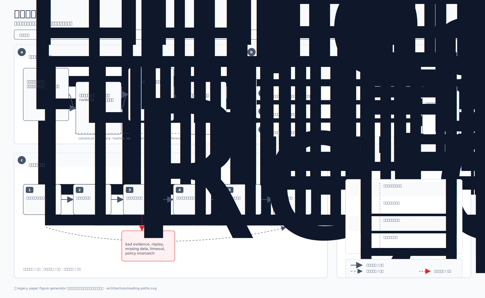

# 架构文档导航

> 根据你的需要，找到 Neo Elastic Network 架构文档体系中对应的章节。

架构文档分散在**多个章节**，每个章节回答一个特定问题。挑一个匹配
你的目标的章节阅读 —— 或按推荐顺序通读，获得完整画面。

## 按角色推荐阅读顺序

  

## 5 个架构章节

  

### 章节速览

| 章节                                                             | 解答的问题                                                   | 行数 |
|------------------------------------------------------------------|--------------------------------------------------------------|------|
| [architecture-walkthrough.md](../architecture-walkthrough.md)    | 一笔交易在系统里如何流动？                                   | 311  |
| [neohub-architecture-and-workflows.md](./neohub-architecture-and-workflows.md) | NeoHub 如何工作？每个 NeoHub 合约做什么？             | 330+ |
| [architecture-l2-lifecycle.md](../architecture-l2-lifecycle.md)  | L2 链如何创建、部署和连接？                                  | 741  |
| [architecture-wire-formats.md](../architecture-wire-formats.md)  | 哪些字节跨越哪些边界，为什么这么设计？                       | 361  |
| [architecture-trust-boundaries.md](../architecture-trust-boundaries.md) | 谁信任什么？每个信任假设如何被强制？                  | 399  |
| [architecture-glossary.md](../architecture-glossary.md)          | 每个术语 / 合约 / 插件 / CLI 工具是什么意思？                | 233  |

总计：约 2400 行架构文档，加上 `tech-stack-coverage.md`
（说明哪些是引入的、哪些是自研的）和 `security-model.md`
（威胁清单视角）作为参考。

## 章节之间的关系

每个章节回答一个不同的问题，但共享同一套术语，引用同一批组件。
某章里的论断可与其他章节交叉验证：

| 当你读完某章并想深入了解……                                        | 翻到这章                                                              |
|-------------------------------------------------------------------|-----------------------------------------------------------------------|
| *l2-lifecycle* 提到的 `BatchCommitment` 字节布局                   | [wire-formats §2](../architecture-wire-formats.md#2-l2batchcommitment--sealed-batch-321--n-bytes) |
| deposit、settlement、withdrawal 或 challenge 会触碰哪个 NeoHub 合约 | [neohub-architecture-and-workflows.md](./neohub-architecture-and-workflows.md) |
| *l2-lifecycle* §6 提到的证明的验证者                              | [trust-boundaries §2](../architecture-trust-boundaries.md#boundary-c-batcher--l1-settlementmanager-the-load-bearing-boundary) |
| 跨层哈希重计算的精确序列                                          | [trust-boundaries §3](../architecture-trust-boundaries.md#3-cross-tier-verification-chain) |
| 某个数据线格式为什么是这种形状                                    | [wire-formats §1 + §7](../architecture-wire-formats.md#1-why-canonical-wire-formats) |
| 某个 `neo-stack` 子命令的具体作用                                 | [l2-lifecycle §9](../architecture-l2-lifecycle.md#9-component-cross-reference) + [launching-an-l2.md](../launching-an-l2.md) |
| 威胁模型 + 具体缓解措施                                           | [security-model.md](../security-model.md)                             |

## 其他架构相关文档

这些被 atlas 引用但不属于核心 5 章 —— 它们深入特定主题：

| 文档                                                             | 主题                                                        |
|------------------------------------------------------------------|-------------------------------------------------------------|
| [external-bridge-roadmap.md](../external-bridge-roadmap.md)      | 跨外链桥的 Phase B/C/D 演进                                 |
| [external-bridge-evm-chains.md](../external-bridge-evm-chains.md)| 5 步上线一条新 EVM 链                                       |
| [persistence.md](../persistence.md)                              | `IL2KeyValueStore` + RocksDB 持久化                         |
| [telemetry.md](../telemetry.md)                                  | `IL2Metrics` + Prometheus 暴露 + `/metrics` 端点            |
| [wallet-integration.md](../wallet-integration.md)                | 运维钱包如何对结构化部署计划签名                            |
| [spec-gap-plan.md](../spec-gap-plan.md)                          | 与 `doc.md` 母版规范相比的剩余差距                          |
| [plan-application-engine-and-mpt.md](../plan-application-engine-and-mpt.md) | Phase-4 ApplicationEngine + MPT 集成计划         |
| [getting-started.md](../getting-started.md)                      | 新用户的快速上手                                            |

## 母版规范

权威定义的来源：

- [`specification/README.md`](./specification/README.md) —— 面向读者的 Neo N4 中文规格书与学习手册，推荐作为系统性长读入口。
- [`doc.md`](../../doc.md) —— 中文母版规范（权威）。
- [`ARCHITECTURE.md`](../../ARCHITECTURE.md) —— 英文 §-by-§ 摘要。
- [`WHITEPAPER.md`](../../WHITEPAPER.md) —— 正式白皮书。

本 atlas 的章节实现 `doc.md` 所规范的设计 —— 当某个设计选择有疑问
时，规范是最终来源。（当架构章节与规范冲突时，那是 bug —— 请报告。）
