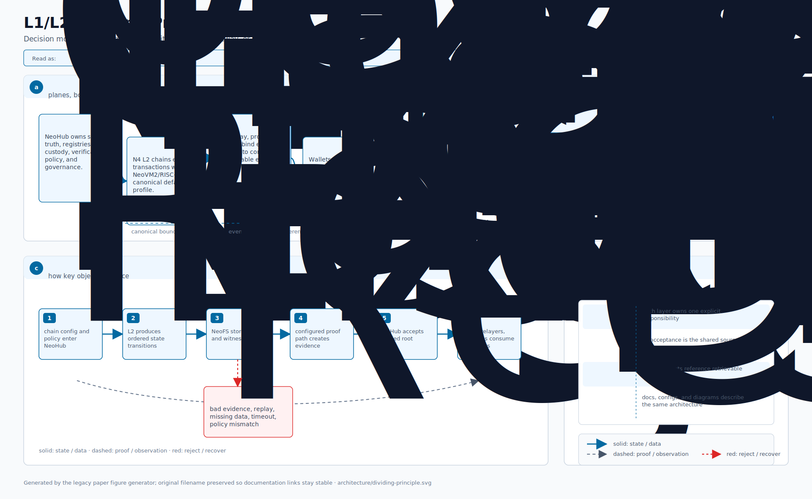
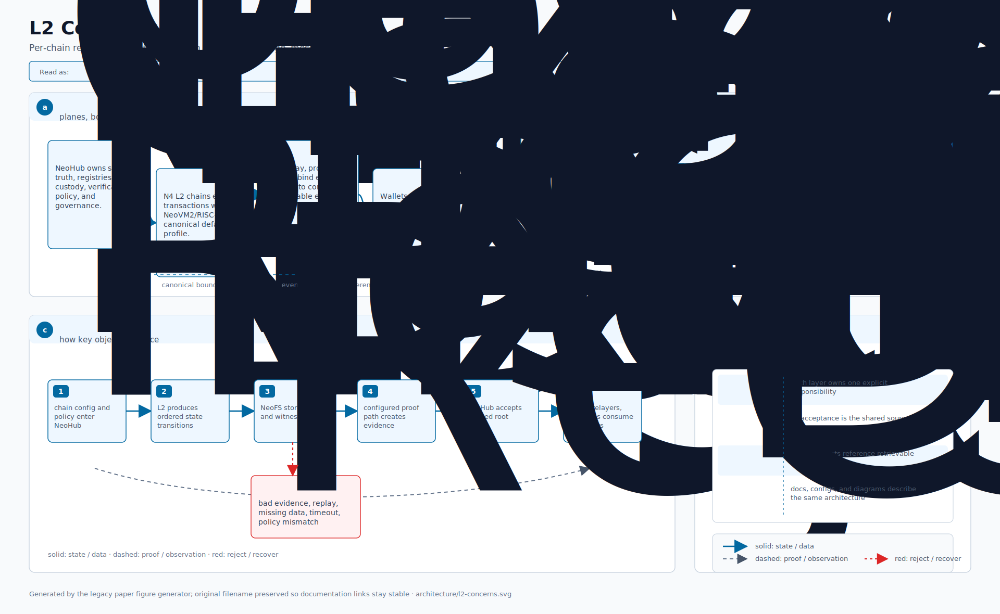
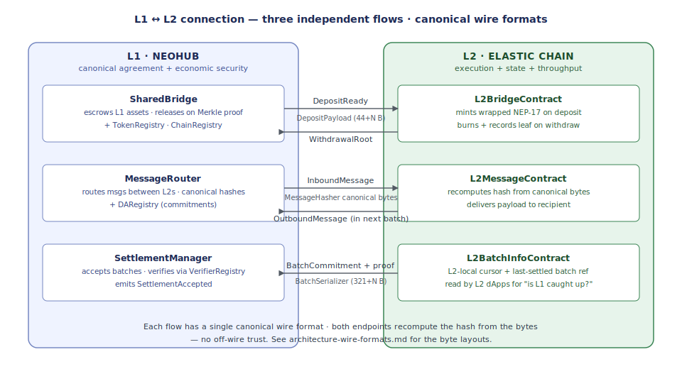
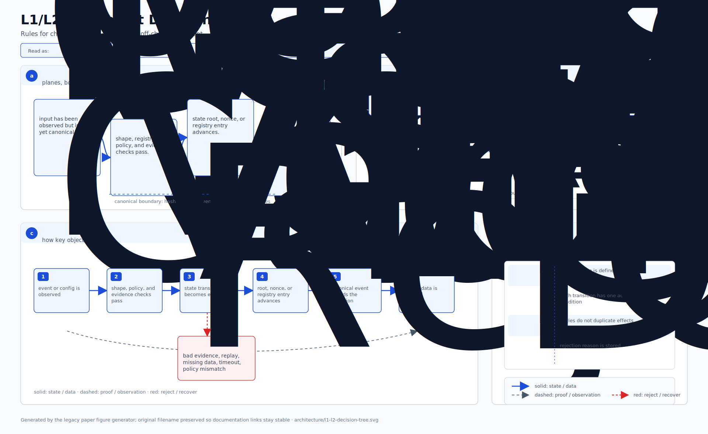

# 架构:L1 与 L2 的职责划分

> **原则:** 只把*必须*全局共识 + 经济安全保障的东西放到 L1;其它都放到能扩容的
> L2。
>
> 本文解释*为什么*每个组件位于其所在的层、指出当前几处边界仍模糊的位置,并列出
> 让划分更锐利的具体任务。

## 目录

1. [划分原则](#1-划分原则)
2. [L1 做什么(以及为什么必须由 L1 做)](#2-l1-做什么以及为什么必须由-l1-做)
3. [L2 做什么(以及为什么可以)](#3-l2-做什么以及为什么可以)
4. [二者之间的桥](#4-二者之间的桥)
5. [决策规则:新功能落到哪一层?](#5-决策规则新功能落到哪一层)
6. [按原则审计当前合约布局](#6-按原则审计当前合约布局)
7. [任务清单 —— 让边界更锐利](#7-任务清单--让边界更锐利)

---

## 1. 划分原则

  

一段状态或逻辑应当位于 **L1**,当且仅当至少满足以下其一:

1. **多个 L2 必须就此达成一致。** 跨 L2 不变量住在所有 L2 都能读到同一真相之处。
   (例:哪些 chain id 存在、哪些资产被识别、哪些证明合法。)
2. **它的安全性必须来自 L1 的经济安全。** 可罚没保证金、托管资产、紧急覆盖,
   都需要 L1 验证人集合在背后兜底。(例:排序器保证金、资产托管、治理。)
3. **它定义信任边界。** 什么作为合法批次 / 证明 / 提款被接受是*那个*信任决策;
   该决策必须在 L1 上做,否则就是循环。

其它一切 —— 执行、内存池、receipts、本地费用、应用特定逻辑 —— 在 **L2** 上跑,
因为 L1 无法扩容到此规模。

---

## 2. L1 做什么(以及为什么必须由 L1 做)

20 个生产 NeoHub 合约(加 1 个测试 stub)聚成 6 个关注点。每条都点出*把它强制放在
L1 的属性*:

  

**关于 L1 合约的关键观察:** 它们持有的是*承诺*与*权限*,而非批量状态。NeoHub 的
存储刻意稀疏 —— 注册表条目、余额、可罚没保证金账本、证明接受记录。L1 存储的代价
强制如此;信任模型要求如此。

---

## 3. L2 做什么(以及为什么可以)

每条 L2 链的 7 个原生 L2 合约 + 8 个插件聚集在*执行* + *批量状态* + *吞吐量瓶颈
工作*周围:

  

**关于 L2 的关键观察:** L2 持有**批量状态 + 重型执行**。桥 + 消息是 L2 上发生的事
的*摘要*,经证明 + 提交到 L1。任何用户 tx 的热路径都不触及 L1。

---

## 4. 二者之间的桥

L1↔L2 边界本身是被设计的接口。3 条流动跨过它:

  

**每条流动都有唯一规范线协议格式**(见[线协议格式章节](./architecture-wire-formats.md))。
两端都从字节重算哈希 —— 无线外信任。这就是让 L1↔L2 连接*最小信任*的关键,即使 L2
做了重活。

---

## 5. 决策规则:新功能落到哪一层?

设计新组件时按序自问:

  

一个有用的健全性检查:如果 (1) (2) (3) 你都能回答*否*,且吞吐量有界 —— 把它放到
L1 上多半是*过早中心化*。

---

## 6. 按原则审计当前合约布局

按 §5 的规则把每个 NeoHub 合约 + 每个 L2Native 合约过一遍:

- **`NeoHub.ChainRegistry`** L1 ✅ → L1 — 跨 L2 不变量(规则 1)
- **`NeoHub.SettlementManager`** L1 ✅ → L1 — 信任边界(规则 3)
- **`NeoHub.VerifierRegistry`** L1 ✅ → L1 — 信任边界(规则 3)
- **`NeoHub.SharedBridge`** L1 ✅ → L1 — 资产托管(规则 2 —— 资产在 L1)
- **`NeoHub.TokenRegistry`** L1 ✅ → L1 — 跨桥不变量(规则 1)
- **`NeoHub.MessageRouter`** L1 ✅ → L1 — 跨 L2 不变量(规则 1)
- **`NeoHub.DARegistry`** L1 ✅ → L1 — 跨 L2 不变量(规则 1)
- **`NeoHub.SequencerRegistry`** L1 ✅ → L1 — 跨 L2 不变量(规则 1)
- **`NeoHub.SequencerBond`** L1 ✅ → L1 — 可罚没经济安全(规则 2)
- **`NeoHub.ForcedInclusion`** L1 ✅ → L1 — 抗审查门(规则 3)
- **`NeoHub.OptimisticChallenge`** L1 ✅ → L1 — 信任边界 + 罚没(规则 2+3)
- **`NeoHub.GovernanceController`** L1 ✅ → L1 — 慢升级路径(规则 3)
- **`NeoHub.EmergencyManager`** L1 ✅ → L1 — 带外暂停(规则 3)
- **`NeoHub.GovernanceFraudVerifier`** L1 ✅ → L1 — Verifier 槽 —— 同 `VerifierRegistry`
- **`NeoHub.RestrictedExecutionFraudVerifier`** L1 ✅ → L1 — Verifier 槽
- **`NeoHub.MpcCommitteeVerifier`** L1 ✅ → L1 — 外链信任边界
- **`NeoHub.MpcCommitteeFraudVerifier`** L1 ✅ → L1 — 罚没 —— 同信任 + 经济安全论据
- **`NeoHub.ExternalBridgeRegistry`** L1 ✅ → L1 — 跨外链不变量
- **`NeoHub.ExternalBridgeEscrow`** L1 ✅ → L1 — 资产托管
- **`NeoHub.ExternalBridgeBond`** L1 ✅ → L1 — 可罚没经济安全
- **`NeoHub.ExternalBridgeStubVerifier`** L1 🟡 → 仅测试 — **应被 feature gate 限制为非生产用**

- **`L2Native.L2BridgeContract`** L2 ✅ → L2 — 按 L2 的 NEP-17 包装资产状态(规则 4)
- **`L2Native.L2MessageContract`** L2 ✅ → L2 — 按 L2 的 inbox/outbox
- **`L2Native.L2BatchInfoContract`** L2 ✅ → L2 — L1 批次状态在 L2 本地的视图
- **`L2Native.L2FeeContract`** L2 ✅ → L2 — L2 本地费用 config(规则 5)
- **`L2Native.L2PaymasterContract`** L2 ✅ → L2 — L2 应用特定(规则 5)
- **`L2Native.L2SystemConfigContract`** L2 ✅ → L2 — L1 chainConfig 在 L2 本地的镜像
- **`L2Native.ExternalBridgeContract`** L2 ✅ → L2 — 按 L2 的外链包装资产状态(规则 4)

**结论:**

✅ **21 个 NeoHub 合约中的 20 个被正确放到 L1** —— 每个都满足规则 1、2 或 3 至少
其一。

✅ **7 个 L2 原生合约都被正确放到 L2** —— 每个都是按链状态、无跨 L2 读需求。

🟡 **`ExternalBridgeStubVerifier` 在 L1 但仅供测试。** 生产 NeoHub 部署不应在
`ExternalBridgeRegistry` 中注册它。今天靠运维者自律,而非代码强制。

---

## 7. 任务清单 —— 让边界更锐利

具体、可执行、提升 L1/L2 划分的任务。大致按影响程度排序。

### 高优先级

- [ ] **把 `ExternalBridgeStubVerifier` gate 在生产部署之外。**
  在 `tools/Neo.Hub.Deploy/` 加 deploy-bundle 断言,拒绝在非测试网上注册 stub
  verifier。今天运维者可能误注册;唯一拦阻的是合约源码注释。

- [ ] **记录每个 NeoHub 合约的存储预算。** 按合约的 README 列出 storage key + 各
  自最大尺寸 + 摊到每 L2 批次的成本。L1 存储是稀缺资源;让按合约的预算可见,运维
  者就能看到未来某功能是否在 L1 上超支。

- [ ] **给 `chainConfig` 加一个 `governance-rationale` 字段。** 按链可配置的字符
  串,引用此 L2 为何选这套 `securityLevel` / `daMode` / `exitModel` 组合。强制
  运维者在注册时阐明设计,链上永久审计。

### 中优先级

- [ ] **在 `neo-stack validate` 加一项"L1 footprint"检查。** 该命令目前检查
  `chain.config.json` 的 JSON 健全性。扩展它估算每批次的 L1 gas
  (BatchSerializer 大小 + 证明验证成本 + 提款证明发布)以便部署前看到 L1 成本。

- [ ] **整合 3 个外链桥 stub 变体** —— `ExternalBridgeStubVerifier` +
  `MpcCommitteeVerifier` 中的纯测试路径 + watcher 的 `StubSignAndSend`。它们目前
  在不同 crate 里命名不同;一个统一的 `--testnet-only` feature flag 会让它们的
  非生产状态一致。

- [ ] **让 `L2NativeExternalBridgeContract` 的存储布局可从 L1 查询。** 当前架构
  不对称:L1 的 ExternalBridgeEscrow 持有已消耗 inbound 的规范记录,但审计按 L2
  铸造的 token 状态时运维者必须分别去查每条 L2 的 NEP-17 合约。在 L1 上加一个
  按 (L2, foreignAsset) 的累计铸造计数器(只读镜像)会有帮助。

### 低优先级(设计打磨)

- [ ] **把规则 (4) —— 吞吐量超 L1 容量 —— 升级为可度量阈值。** 今天它定性描述。
  挑一个明确上限(例如"预期稳态 ≥ 1 tx/秒 → L2"),让未来 PR 有清晰的取舍点。

- [ ] **按原则审计 L2 插件集合。** `L2Gateway` 今天按 L2,但 Phase 5 会跨 L2 共享
  聚合。未来是否需要一个 L1 合约存 gateway 的聚合状态?把权衡写下来。

- [ ] **从 `architecture-l2-lifecycle.md` 和 `architecture-trust-boundaries.md`
  反向链接到本文。** 当前生命周期 + 信任文档引用什么住哪儿,但不论证为什么这么
  分。本文填这块;其它文档应当链回来。

### 未来 / Phase D

- [ ] **L1 上的外链 ZK 轻客户端。** 取代外链桥委员会模型。R&D 重型 —— 把外链桥
  从"信任 = M-of-N 委员会"推到"信任 = 数学"。当前 6 合约接口刻意被设计成跨此
  迁移仍稳定(只换注册的 verifier —— 见
  [`external-bridge-roadmap.md`](./external-bridge-roadmap.md))。

- [ ] **L1 锚定、L2 驻留的应用注册表。** 让应用开发者注册"L2-A 上的此合约与
  L2-B 上的此合约是同一 dApp",这样跨 L2 消息可按应用身份路由,而不仅按 chain
  id。打破规则 4 的应用 id 存储;只要条目稀疏 + 抵御 spam 有保证金即可。

---

## 另请参阅

- [`architecture-l2-lifecycle.md`](./architecture-l2-lifecycle.md) —— 系统流 + 4 层拓扑。
- [`architecture-wire-formats.md`](./architecture-wire-formats.md) —— 跨越 L1↔L2 边界的字节。
- [`architecture-trust-boundaries.md`](./architecture-trust-boundaries.md) —— 谁验证每条跨层流动。
- [`architecture-glossary.md`](./architecture-glossary.md) —— 每个合约/插件/CLI 都在一处定义。
- [`launching-an-l2.md`](./launching-an-l2.md) —— 配置 L2 的运维视角。
- [`security-model.md`](./security-model.md) —— L1/L2 边界的威胁 + 缓解。
- [`doc.md`](../../doc.md) —— 主规格(权威)。
