# 架构:L2 链生命周期

> 详细走一遍 Neo Elastic Network 的结构,以及一条 L2 链如何从"不存在"走到"已注册、
> 产出批次、与共享桥 + 跨链消息接通"。
>
> 配套阅读 [`architecture-walkthrough.md`](./architecture-walkthrough.md)
> (那篇讲 L2 内一笔*交易*的生命周期)与
> [`launching-an-l2.md`](./launching-an-l2.md)(运维步骤指南)。本文是架构视角:
> 每步做什么、触及哪些组件、什么线协议数据跨越哪条边界。

## 目录

1. [系统鸟瞰](#1-系统鸟瞰)
2. [4 层细解](#2-4-层细解)
3. [L2 链的解剖](#3-l2-链的解剖)
4. [创建:从零到已注册](#4-创建从零到已注册)
5. [部署:合约上链](#5-部署合约上链)
6. [运行时连接:L2 怎么跟 L1 对话](#6-运行时连接l2-怎么跟-l1-对话)
7. [跨 L2 消息传递](#7-跨-l2-消息传递)
8. [外链桥接通](#8-外链桥接通)
9. [组件交叉索引](#9-组件交叉索引)

---

## 1. 系统鸟瞰

Neo Elastic Network 由**4 层**组件 + 把它们连起来的链下基础设施组成:

<p align="center">
  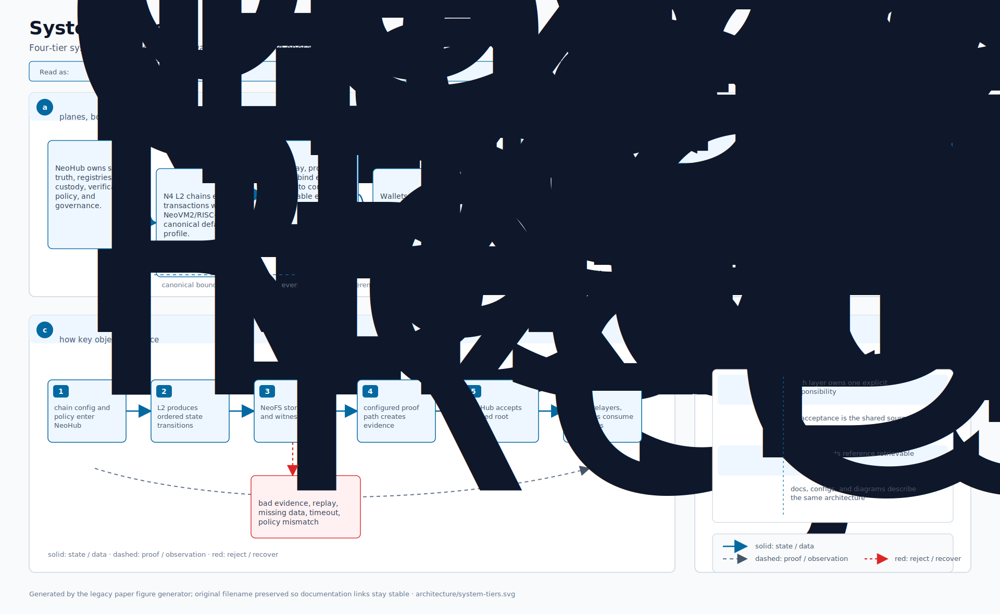
</p>

**什么从哪里流向哪里:**

- **已封装批次 + 证明** —— 批处理器 → NeoHub.SettlementManager。
  线协议格式:`BatchSerializer`(规范 32 字节字段)。
- **DA payload** —— DA writer → NeoFS / L1 / 委员会。线协议格式:
  `IDAWriter` 实现特有。
- **跨 L2 消息** —— L2 sender → NeoHub.MessageRouter → L2 receiver。
  线协议格式:`MessageHasher` 规范字节。
- **L1→L2 充值** —— 用户 → NeoHub.SharedBridge → Neo Core 原生 `L2BridgeContract`。
  线协议格式:`DepositPayload`。
- **L2→L1 提款** —— L2 用户 → SettlementManager Merkle 证明。
  线协议格式:`WithdrawalRecord` + Merkle 路径。
- **外链 → Neo** —— EVM/Solana → Watcher → ExternalBridgeEscrow。
  线协议格式:`ExternalCrossChainMessage`(102B + payload)。
- **聚合证明(Phase 5)** —— Gateway → SettlementManager。
  线协议格式:`BinaryTreeAggregator` 轮证明。

---

## 2. 4 层细解

### 第 1 层:NeoHub(L1)

L1 锚。**23 个生产合约 + 1 个仅测试 stub** 按关注点分组:

<p align="center">
  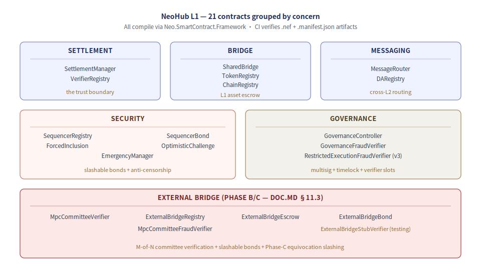
</p>

位于 `contracts/NeoHub.*` —— 每个合约都经 `Neo.SmartContract.Framework` 通过类型
检查;CI 用 `nccs` 编译每一个并校验 `.nef` + `.manifest.json` 工件。

**关键关系:**
- `SettlementManager` 消费由 `VerifierRegistry` 校验过的证明;`ProofType.Zk`
  会路由到 `ContractZkVerifier`,并通过 L1 可部署验证器合约 执行proof-system 验证工作;
  在每个被接受的批次上触发 `SharedBridge.FinalizeWithdrawalWithProof`。
- `SharedBridge` 经 `ChainRegistry` 查链 config,经 `TokenRegistry` 查 token
  元信息。
- `TokenRegistry` 同时存储 L1/L2 两侧 decimals。平台资产映射固定为:
  NEO 0→8、GAS 8→8、USDT/USDC 6→6、BTC 8→8。
- `OptimisticChallenge` 把 fraud-verifier 升级上提到带多签 + timelock 的
  `GovernanceController`。
- `ExternalBridgeEscrow` 经 `ExternalBridgeRegistry` 查带曲线 tag 的 verifier;
  `MpcCommitteeFraudVerifier` 罚没存放在 `ExternalBridgeBond` 的保证金。

### 第 2 层:Neo Gateway(可选,Phase 5)

把多 L2 的证明聚合为 L1 上的单次结算提交。运行 >1 条 L2 链时降低 L1 gas 成本。

- `BinaryTreeAggregator` —— 在 N 个成员批次上做 log-N 轮收敛。
- `IRoundProver` —— 3 份生产实现 + 一个递归-ZK 接缝:
  - `MultisigRoundProver` —— Secp256r1 阈值证明轮
  - `MerklePathRoundProver` —— 逐成员 包含证明
  - `PassThroughRoundProver` —— 最低成本参照
  - SP1 Compress / Halo2 / Risc0 fold 变体接进同一 trait

可选:单条 L2 不需要 Gateway。多 L2 部署若想要更低的按批次 L1 gas 成本,在链
config 里把 `gatewayEnabled` 翻为 true。

### 第 3 层:L2 链

每条 L2 = **Neo 4 core(共识 + VM 内核)+ 8 个插件 + 10 个原生合约**。插件位于
`src/Neo.Plugins.L2*/`,原生合约位于 `external/neo/src/Neo/SmartContract/Native/L2NativeContracts.cs`。Neo 4 core 自身作
为 git submodule 引入到 `external/neo`。

<p align="center">
  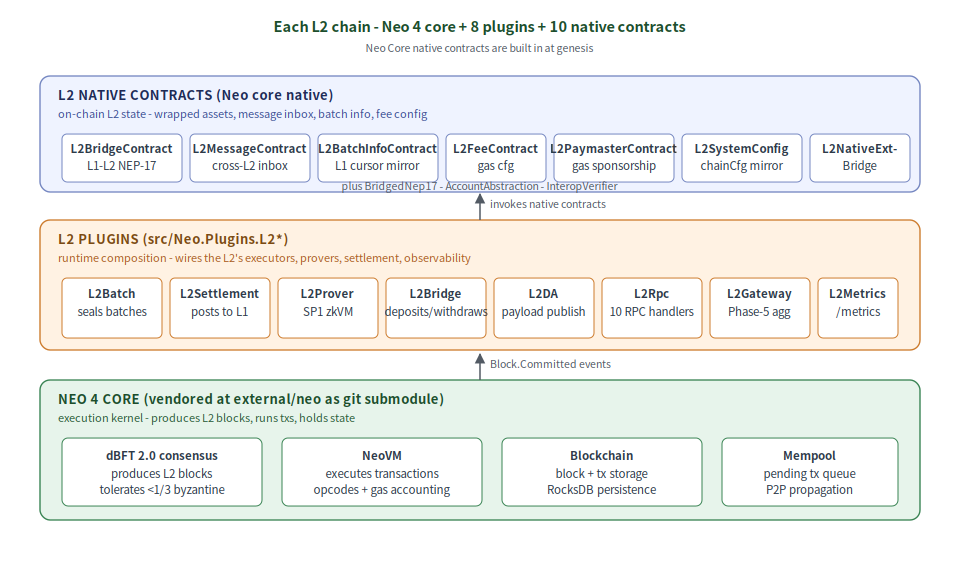
</p>

8 个插件 + 10 个原生合约实现 `doc.md` §5–§13 的分层架构(批次封装 / 结算 / 桥 /
DA / 证明 / RPC / gateway / metrics)。

### 第 4 层:链下运营者

每条 L2 至少需要以下各一份:

| 运营者          | 干什么                                                            | 源码                                    |
|-----------------|------------------------------------------------------------------|-----------------------------------------|
| 排序器           | dBFT 2.0 共识成员;产出 L2 区块                                  | `Neo.L2.Sequencer/`                     |
| 批处理器         | 订阅 `Blockchain.Committed`,封装批次,提交到 L1                 | `Neo.L2.Batch/` + `Neo.Plugins.L2Batch` |
| 证明守护进程     | SP1 zkVM 证明该批次(Phase 4)                                   | `bridge/neo-zkvm-host/`(Rust 二进制) |
| DA writer       | 把批次 payload 发到 NeoFS / L1 / 委员会                         | `Neo.L2.DA*` + 注入的 `IDAWriter`      |
| 外链 watcher     | (仅外链桥)中继 EVM/Solana 事件 → Neo                          | `watchers/neo-bridge-watcher-*/`        |

---

## 3. L2 链的解剖

每条 L2 链由**4 个工件**完整定义:

<p align="center">
  
</p>

### §16.2 链 config 维度

链 config 携带 5 个维度。运维者每条链自选;同一个 NeoHub L1 支持任意组合:

| 维度             | 取值(范围)                  | 含义                                                |
|-----------------|-------------------------------|----------------------------------------------------|
| `securityLevel` | 0 · 1 · 2 · 3                 | 0 = 侧链(最低);3 = 完整 ZK rollup(最高)         |
| `daMode`        | InMemory · External · L1 · DAC| 批次 payload 去哪儿                                 |
| `sequencerModel`| Solo · Committee · Permissionless | 区块怎么产出                                   |
| `exitModel`     | Optimistic · Permissionless · ZkValidity | 提款怎么结算                              |
| `gatewayEnabled`| bool                          | 此 L2 是否批入共享 Gateway                          |

经 `L2ChainConfigSerializer`(见 `Neo.L2.Abstractions/L2ChainConfigSerializer.cs`)
编码为 91 字节规范线协议格式。

### 模板

`neo-stack list-templates` 出货 4 个起步点:

| 模板          | securityLevel | daMode    | exitModel       | gatewayEnabled |
|---------------|---------------|-----------|-----------------|----------------|
| `rollup`      | 2             | L1        | Optimistic      | true           |
| `zk-rollup`   | 3             | L1        | ZkValidity      | true           |
| `validium`    | 2             | DAC       | Optimistic      | true           |
| `sidechain`   | 1             | InMemory  | Permissionless  | false          |

---

## 4. 创建:从零到已注册

链从 `git clone` 到首个封装批次落到 L1 的完整生命周期,以编号序列在角色间表示:

<p align="center">
  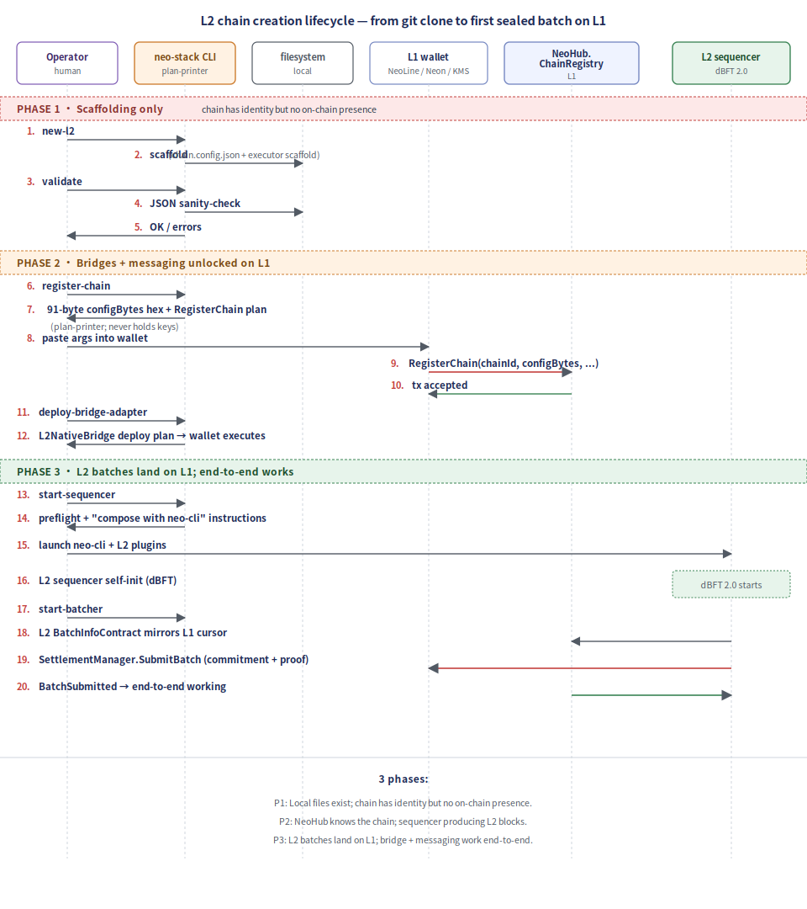
</p>

3 个阶段:

| 阶段 | 此阶段后什么为真                                                  |
|------|-------------------------------------------------------------------|
| 1    | 本地文件存在;链有身份但无链上存在                                |
| 2    | NeoHub 知道该链;排序器在产出 L2 块                              |
| 3    | L2 批次落到 L1;桥 + 消息传递端到端工作                           |

### `new-l2` 组合命令

`neo-stack new-l2 --name X --chain-id Y --template Z` 命令把 3 个低层操作串在
一起。生成什么:

<p align="center">
  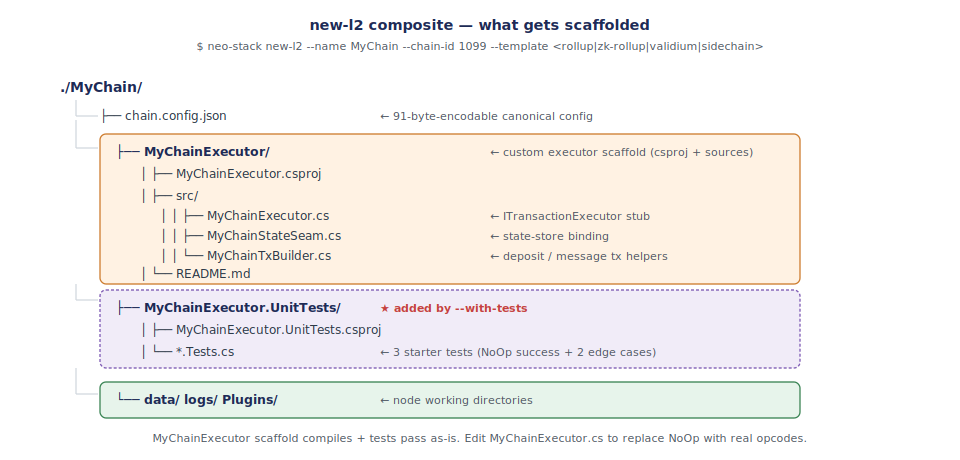
</p>

`MyChainExecutor` 脚手架是给需要自定义交易语义的链(例如 RWA 链带 KYC 检查、
DEX 链内置撮合)的起步点。只需要标准 NeoVM2/RISC-V + NEP-17 的链不用定制 —— 它们用
`src/Neo.L2.Executor.RiscV/` 里的 `RiscVTransactionExecutor`。
`ApplicationEngineTransactionExecutor` 只保留给 legacy NeoVM 兼容检查。

### 三阶段准入策略

无许可链注册经 `[plan: §16.1-admission]` 把关 —— L2 链注册表分 3 层:

<p align="center">
  
</p>

---

## 5. 部署:合约上链

哪些合约去哪儿、按什么顺序:

<p align="center">
  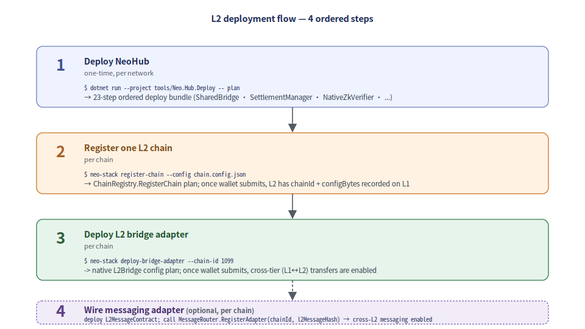
</p>

每条命令输出结构化计划而非直接提交 —— 框架永不持有私钥。运维者把生成的 hex /
UInt160 参数粘进自己挑的钱包(NeoLine、Neon、NEP-6、Ledger、KMS 驱动的自研签
名器)。模式见 [`docs/wallet-integration.md`](./wallet-integration.md)。

### L2 需要知道的合约地址

部署后,L2 的 config 携带 4 个 NeoHub UInt160 引用:

```toml
# 在 L2 的运行时 config 里(与 chain.config.json 分开):
neo_hub_chain_registry      = 0x...  # ChainRegistry
neo_hub_settlement_manager  = 0x...  # SettlementManager
neo_hub_shared_bridge       = 0x...  # SharedBridge
neo_hub_message_router      = 0x...  # MessageRouter(若启用跨 L2)
```

加上自身的 L2 侧合约:
```toml
l2_native_bridge_hash       = 0x...  # 此 L2 的 Neo Core 原生 L2BridgeContract
l2_native_message_hash      = 0x...  # 此 L2 的 L2MessageContract
l2_batch_info_hash          = 0x...  # 此 L2 的 L2BatchInfoContract
```

---

## 6. 运行时连接:L2 怎么跟 L1 对话

部署后,一条 L2 链经 3 条独立通道"接通"—— 各自按自己的节奏跑:

<p align="center">
  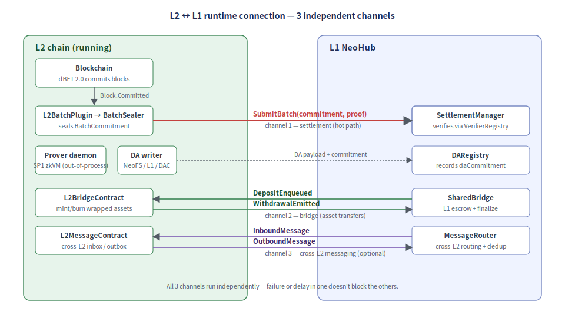
</p>

### 通道 1 —— 结算(热路径)

每个 L2 块:

<p align="center">
  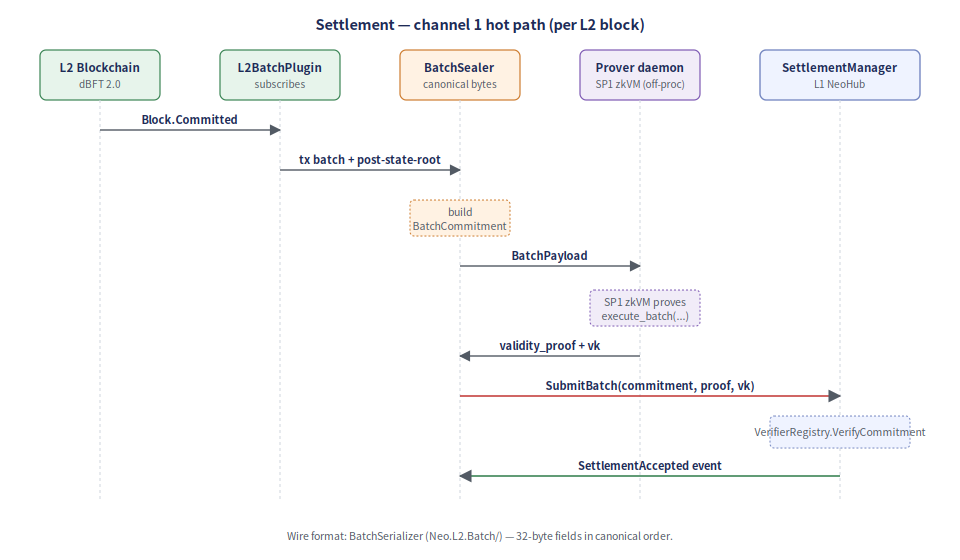
</p>

线协议格式:`BatchSerializer`(`Neo.L2.Batch/`)—— 规范顺序的 32 字节字段。
按 tx 的细节见 `architecture-walkthrough.md` 的"transaction lifecycle"。

### 通道 2 —— 桥(资产转移)

<p align="center">
  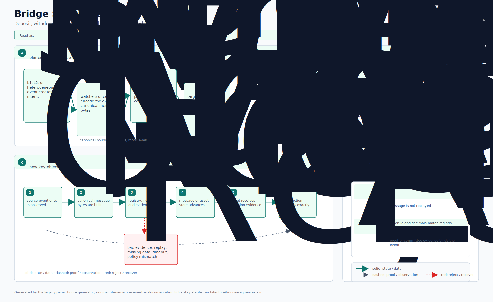
</p>

线协议格式:L1→L2 用 `DepositPayload`,L2→L1 用 `WithdrawalRecord` + Merkle 路径。
两个 encoder 都在 `Neo.L2.Bridge/`。

对平台资产而言,桥同时也是 decimals 边界。L1 的整枚 NEO 充值会先按 `10^8` 缩放,
再记入 L2 内置 NEO 表示；提款时做反向换算,金额必须能被 `10^8` 精确整除,否则
L2 bridge 会拒绝 burn,不会产生无法在 L1 表示的零碎 NEO 提款记录。GAS 保持 8→8,
USDT/USDC 保持 6→6,BTC 保持 8→8。由于这些平台 L2 asset id 在所有 L2 上保持一致,
跨 L2 转移可以在源 L2 burn/lock,经 NeoHub 或 Gateway 消息路径路由,再在目标 L2 铸造
同一目录资产,不需要应用层再做 symbol 重映射。

### 通道 3 —— 跨 L2 消息传递(可选)

见下文 [§7](#7-跨-l2-消息传递)。

---

## 7. 跨 L2 消息传递

当 `gatewayEnabled = true` 且 `messageAdapter` 已配置时,L2-A 可以无需手动触及
L1 即可向 L2-B 发消息:

<p align="center">
  
</p>

`MessageHasher`(`Neo.L2.Messaging/`)是规范 encoder —— 两端从线字节重算哈希;
合约从不信任线外哈希。端到端,消息跨 3 条信任边界(L2-A 共识 → L1 结算 → L2-B
共识);每条边界独立验证哈希。

---

## 8. 外链桥接通

跨外链桥(Phase B/C,`doc.md` §11.3)让外链(Eth/EVM 家族 / Solana / Tron)经
同一 SharedBridge 接口做充值 + 提款。架构上:

<p align="center">
  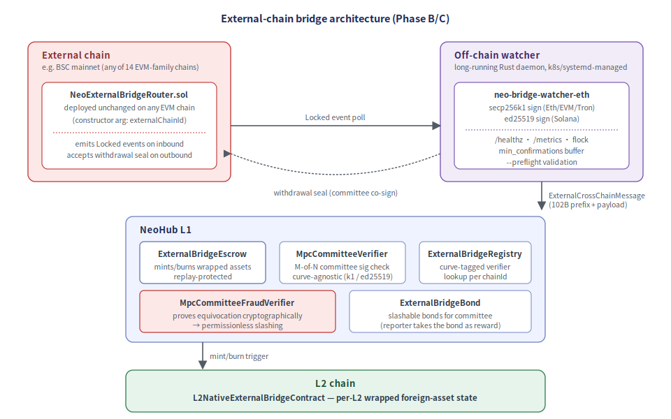
</p>

**一份合约服务整个 EVM 家族。** 同一份 `NeoExternalBridgeRouter.sol` 原样部署到
Ethereum / BSC / Polygon / Arbitrum / Optimism / Base / Avalanche / Linea /
zkSync / Scroll / Mantle / Fantom / Celo / Tron —— 它的构造函数从
`watchers/neo-bridge-watcher-eth/src/chains.rs` 中规范的 16 槽位家族 bank 分配
取 `externalChainId`。5 步接入 runbook 见
[`external-bridge-evm-chains.md`](./external-bridge-evm-chains.md)。

watcher 守护进程(生产就绪:graceful SIGTERM、`/healthz`、`/metrics`、基于
flock 的并发实例检测、`min_confirmations` reorg buffer、`--preflight` 校验)
位于 `watchers/neo-bridge-watcher-eth/`。k8s + systemd manifest 在
[`deploy/`](../../watchers/neo-bridge-watcher-eth/deploy/)。

---

## 9. 组件交叉索引

哪个 `neo-stack` 子命令触及哪个组件:

| 子命令                  | 触及(L1)                      | 触及(文件系统)                | 触及(L2)                |
|-------------------------|-----------------------------------|----------------------------------|---------------------------|
| `create-chain`          | —                                 | `chain.config.json`              | —                         |
| `init-l2`               | —                                 | `data/`、`logs/`、`Plugins/`     | —                         |
| `register-chain`        | `ChainRegistry.RegisterChain`     | —                                | —                         |
| `deploy-bridge-adapter` | `TokenRegistry.RegisterMapping`    | —                                | Neo Core 原生 `L2BridgeContract` |
| `start-sequencer`       | (仅 preflight)                   | 读 config                        | dBFT 2.0 启动             |
| `start-batcher`         | `SettlementManager.SubmitBatch`   | 读 config                        | `L2BatchPlugin` 跑        |
| `start-prover`          | (无 L1 接触)                     | 读 config                        | `L2ProverPlugin` 跑       |
| `submit-batch`          | `SettlementManager.SubmitBatch`   | 读 batch payload                 | —                         |
| `validate`              | —                                 | `chain.config.json` JSON 检查    | —                         |
| `scaffold-executor`     | —                                 | `<Name>Executor.csproj` + tests | —                         |
| `new-l2`                | create + init + scaffold 组合     | 组合                             | —                         |
| `list-templates`        | —                                 | 打印到 stdout                    | —                         |

### 运维部署计划器

NeoHub 自身(每个网络一次性):

```bash
# 生成 23 步有序 bundle:
dotnet run --project tools/Neo.Hub.Deploy -- plan

# 校验 bundle 不变量:
dotnet run --project tools/Neo.Hub.Deploy -- verify

# 每一步是结构化运维计划:{contract, method, args}。
# 运维者钱包按序执行。
```

外链桥委员会设置(每条外链):

```bash
dotnet run --project tools/Neo.External.Bridge.Cli -- committee-blob \
    --pubs-file watchers.pubs    # 一行一个 pub33 hex
# 输出:Neo blob(hex)+ 对应 Eth 地址列表

dotnet run --project tools/Neo.External.Bridge.Cli -- deploy-bundle \
    --external-chain-id 0xE0000030 \
    --verifier <UInt160> --registry <UInt160> --escrow <UInt160> \
    --eth-router 0x... --threshold 4 \
    --committee-blob 0x... --eth-addresses 0x...,0x...,...
# 输出:Neo + Eth 钱包都用得上的有序 checklist。
```

---

## 另请参阅

- [`ARCHITECTURE.md`](../../ARCHITECTURE.md) —— `doc.md` 的英文逐节摘要。
- [`WHITEPAPER.md`](../../WHITEPAPER.md) —— 正式白皮书。
- [`doc.md`](../../doc.md) —— 主中文规格(权威)。
- [`architecture-walkthrough.md`](./architecture-walkthrough.md) —— 代码库叙事
  导览,含按交易的生命周期。
- [`launching-an-l2.md`](./launching-an-l2.md) —— 跑 L2 的运维步骤指南
  (本文讲架构;那篇讲命令)。
- [`external-bridge-roadmap.md`](./external-bridge-roadmap.md) —— Phase B/C 跨
  外链桥。
- [`external-bridge-evm-chains.md`](./external-bridge-evm-chains.md) —— 5 步接
  入新 EVM 链。
- [`security-model.md`](./security-model.md) —— 威胁模型 + 缓解。
- [`tech-stack-coverage.md`](./tech-stack-coverage.md) —— 引入 vs 自实现。
