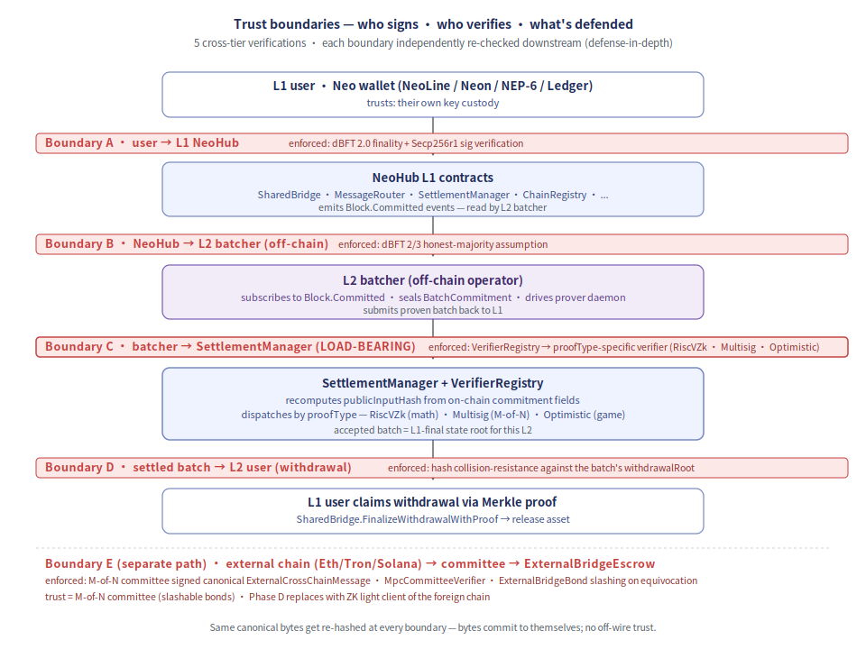
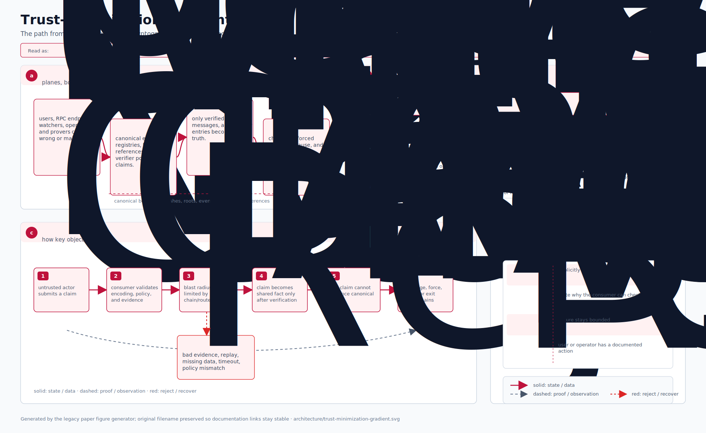

# 架构:信任边界

> 从信任视角看 Neo Elastic Network。把每条跨层流动映射到:谁签、谁验、信任什么、
> 防御什么。
>
> 配套阅读:
> - [`architecture-l2-lifecycle.md`](./architecture-l2-lifecycle.md) —— *流程*(事情发生在哪里)
> - [`architecture-wire-formats.md`](./architecture-wire-formats.md) —— *字节*(线协议上跨越的内容)
> - [`security-model.md`](./security-model.md) —— *威胁*(可能出错的事 + 缓解)
>
> 本文把三者串起来:在流动里的每条边界处,什么字节承载信任信号,以及接收方校验什么。

## 目录

1. [信任边界图](#1-信任边界图)
2. [每条边界信任什么](#2-每条边界信任什么)
3. [跨层验证链](#3-跨层验证链)
4. [按流动的纵深防御](#4-按流动的纵深防御)
5. [故障模式与检测](#5-故障模式与检测)
6. [信任最小化梯度](#6-信任最小化梯度)

---

## 1. 信任边界图

"信任边界"是字节从一个信任域跨到另一个信任域的任何位置。每条边界都有一个
**生产者**(签名 / 承诺这些字节)和一个**消费者**(验证它们)。纵深防御意味着多个消费
者各自独立重新验证 —— 这样作恶生产者无法蒙混过关。

  

系统中**有 5 条跨层边界**。每条边界的信任假设(谁签、谁验)不同,且每条边界都在
下游被独立重新检查 —— 纵深防御。

---

## 2. 每条边界信任什么

每条边界都问 3 个问题:信任假设是什么、谁承担信任、由什么机制强制执行。

### 边界 A:用户 → L1 NeoHub

| 问题             | 答案                                                            |
|------------------|-----------------------------------------------------------------|
| 信任什么?        | 用户的签名是对规范 L1 tx 的签名                                |
| 信任由谁承担?    | Neo 的 L1 共识(dBFT 2.0)                                     |
| 谁强制执行        | dBFT 2.0 终结性 + Secp256r1 签名验证                           |
| 故障模式          | 用户密钥被盗 → 未授权 tx                                       |
| 缓解              | 范围外(钱包安全是用户的责任)                                 |

### 边界 B:NeoHub → L2 批处理器

| 问题             | 答案                                                            |
|------------------|-----------------------------------------------------------------|
| 信任什么?        | 批处理器直接读 `Blockchain.Committed` 事件                     |
| 信任由谁承担?    | dBFT 2.0 终结性(Neo L1 已就事件 commit 达成一致)             |
| 谁强制执行        | dBFT 的 2/3 诚实多数假设                                       |
| 故障模式          | dBFT 停摆或 > 1/3 拜占庭 → 终结性卡住                          |
| 缓解              | 运维者跑自己的 RPC 节点;按 staleness 报警                     |

### 边界 C:批处理器 → L1 SettlementManager(承担信任的边界)

这条边界让 Neo Elastic Network "trust-minimized" —— L1 除了通过这条验证路径,无从
得知 L2 上发生了什么。每个字节都被检查。

| 问题             | 答案                                                            |
|------------------|-----------------------------------------------------------------|
| 信任什么?        | 链 config 选定的证明类型(security level 0-3)                |
| 信任由谁承担?    | 密码学验证器(ZK / ECDSA 阈值 / 乐观纠纷)                    |
| 谁强制执行        | `VerifierRegistry` → 按 proofType 的验证路径                   |
| 故障模式          | 证明非法 / 错的 public-input / proof type 不匹配               |
| 缓解              | 硬拒绝;提交者付 gas、批次未落地                              |

| 证明类型           | 信任假设                                                      |
|-------------------|---------------------------------------------------------------|
| `RiscVZk` (=1)    | SP1 zkVM 证明 —— 数学(证明就是验证)                         |
| `Multisig` (=0)   | M-of-N 委员会签了 BatchCommitment                            |
| `Optimistic` (=2) | 挑战窗口 + 二分博弈 —— 博弈论                                |

### 边界 D:已结算批次 → L2 用户(提款)

| 问题             | 答案                                                            |
|------------------|-----------------------------------------------------------------|
| 信任什么?        | 用户提款叶子的 Merkle 证明                                     |
| 信任由谁承担?    | 哈希抗碰撞 + 该批次的 `withdrawalRoot`                        |
| 谁强制执行        | `SharedBridge.VerifyWithdrawalLeafWithProof`                  |
| 故障模式          | 用户提交错的 leafIdx + 匹配证明但金额不对                      |
| 缓解              | Merkle 证明**必须**哈希到记录的 `withdrawalRoot`              |

### 边界 E:外链 → watcher → Neo escrow

跨外链桥(Eth/EVM 家族 / Tron / Solana → Neo)。和其它边界的信任模型不同 —— Neo 上
没有外链的密码学轻客户端,改用 M-of-N 委员会对外链事件做证明。

| 问题             | 答案                                                            |
|------------------|-----------------------------------------------------------------|
| 信任什么?        | M-of-N 委员会签了规范 `ExternalCrossChainMessage`             |
| 信任由谁承担?    | 委员会(可罚没保证金、等价签名可检测)                       |
| 谁强制执行        | `MpcCommitteeVerifier` 在规范字节上检查 M 个签名             |
| 故障模式          | 委员会等价签名 OR > N-M+1 共谋                              |
| 缓解              | Phase C:`MpcCommitteeFraudVerifier` 证明等价签名 +          |
|                  | 经 `ExternalBridgeBond` 罚没。Phase D(未来):ZK 轻客户端    |
|                  | 取代委员会。                                                  |

委员会模型显式是 **trust-minimized 但非 trustless** —— 见
[`security-model.md`](./security-model.md) 的梯度章节。

---

## 3. 跨层验证链

一笔 bridge 交易跨越 3-4 条信任边界,每步累积一次验证。同一组规范字节在每步被
重新哈希 + 重新验证:

  

**关键洞察:** 同一组 `canonical_bytes` 被不同位置的不同角色多次哈希。无论哪一方
编码这些字节,后续每个持有这些字节的角色都可以从头重新计算哈希。这意味着你不能
"取消签名"或"重新签名" —— 字节自承诺。

---

## 4. 按流动的纵深防御

每条跨层流动里,多个检查独立运行。单个作恶角色无法绕过全部检查:

- **L2 批次结算** — `proofType` 在已定义枚举范围 — `proof.length` ≤ 1 MiB — `publicInputHash` 由链上承诺字段重算,与证明声称的一致
- **L1→L2 充值** — `SharedBridge.Deposit` 要求资产已锁 + msg.value 匹配 — L2 批处理器重算规范消息哈希;不匹配则拒绝 — `L2NativeBridge` 校验消息中的 L2 chainId 与自己的一致
- **L2→L1 提款** — 提款叶子在批次 `withdrawalRoot` 中 — Merkle 证明哈希到 `withdrawalRoot` — `consumedWithdrawals[leafHash]` 已置;重放被拒
- **跨 L2 消息** — 源 L2 产出规范字节;`MessageRouter` 重算哈希 — 目标 L2 批处理器从线协议字节重算哈希 — `consumedInboundMessages[srcChain][nonce]` 已置
- **外链充值** — watcher 在线下签规范字节 — M-of-N 委员会阈值在链上检查 — `consumedInbound[chainId][nonce]` 已置;重放被拒
- **外链提款** — L2 把提款请求批入 — 委员会联签规范字节 — 外链 router 在字节上的 `ecrecover`(Eth)/ `verify_ed25519`(Solana)

每条检查相互独立 —— 一处的 bug 或被攻陷不会绕过其它的。(例如:如果证明者声称的
`publicInputHash` 与链上承诺漂移,即使该证明对**别的** public-input 合法,验证器也
会拒绝。)

---

## 5. 故障模式与检测

### 组件级故障

- **排序器(单)** — 崩溃 / 不响应 — 出块卡住;`forced inclusion` deadline 报警 — 运维重启;dBFT 多数仍能不带它达成终结性
- **dBFT 多数** — < 2/3 诚实 — 终结性卡住;无 `Block.Committed` 事件 — 人工介入;可能走治理投票
- **批处理器** — tick 中途崩溃 — `last_tick_success_unix` 过时 — watcher journal flock 在进程退出时解锁;重启
- **证明守护进程** — OOM / 崩溃 — `prove-batch` 非零退出;批次永不封装 — 运维重启;对 journal 幂等
- **DA writer** — 存储后备宕 — `da.publish_failures` counter 飙升 — 可插拔后备;回退到 L1 模式
- **外链 watcher** — RPC 提供方限流 — `watcher_last_error_unix` 近期 + retry backoff — 守护进程重试;运维可换 RPC URL
- **外链委员会成员** — 等价签名(对同一 nonce 签了两条不同消息) — `MpcCommitteeFraudVerifier` 接受等价签名证明 — 罚没保证金;reporter 拿奖励

### 密码学 / 跨层故障

- **证明被篡改** — `VerifierRegistry.Verify` — `BatchRejected: invalid proof`
- **`publicInputHash` 不匹配** — `SettlementManager`(从承诺重算) — `BatchRejected: public-input mismatch`
- **提款 Merkle 证明错** — `SharedBridge.VerifyWithdrawalLeafWithProof` — `WithdrawalRejected: bad merkle path`
- **外链委员会阈值未达** — `MpcCommitteeVerifier.VerifyInboundMessage` — `Committee threshold not met (got M-1, need M)`
- **外链 chainId 越界命名空间** — `ExternalBridgeEscrow.Receive` — `Reject: externalChainId not in 0xE0_xx_xx_xx`
- **重放尝试(deposit/withdrawal/message)** — 按 (chainId, nonce) 的重放保护 map — `Reject: nonce already consumed`

### 框架**无法**检测的事

这些需要运维侧的可观测性 + 报警:

- **L1 用户钱包被盗** —— 范围外;用户责任。
- **外链 reorg 比 `min_confirmations` 还深** —— 运维者按链 ID 自配;watcher 的
  确认 buffer 是防线,但够深的 reorg 仍能击穿。
- **外链在应用层被社工接受了一笔欺诈交易** —— 范围外;外链责任。

完整表见 [`security-model.md`](./security-model.md) 的"威胁与缓解"。

---

## 6. 信任最小化梯度

系统的不同部分位于信任最小化光谱的不同位置。运维者可选:

  

**运维者的选择。** 每条 L2 链经 §16.2 config 维度(`securityLevel`、`exitModel`
等,编码进 91 字节 `L2ChainConfig`)挑自己的位置。同一个 NeoHub L1 支持所有组合。

**外链桥目前位于 Multisig。** Phase D(未来)用外链的 ZK 轻客户端取代委员会 —— 把
外链桥从 Multisig 推到此梯度上的 ZkValidity。6 合约的外链桥架构
(MpcCommitteeVerifier / ExternalBridgeEscrow / ExternalBridgeBond /
MpcCommitteeFraudVerifier / ExternalBridgeStubVerifier /
ExternalBridgeRegistry)被设计成在迁移期间保持接口稳定 —— 只换 ChainRegistry
槽里的验证器。

---

## 另请参阅

- [`architecture-l2-lifecycle.md`](./architecture-l2-lifecycle.md) —— *流程*(创建/部署/连接)。
- [`architecture-wire-formats.md`](./architecture-wire-formats.md) —— *字节*(规范布局)。
- [`security-model.md`](./security-model.md) —— *威胁*(可能出错的事 + 缓解)。
- [`external-bridge-roadmap.md`](./external-bridge-roadmap.md) —— 跨外链桥的 Phase B/C/D 推进。
- [`doc.md`](../../doc.md) —— 主规格(权威)。
