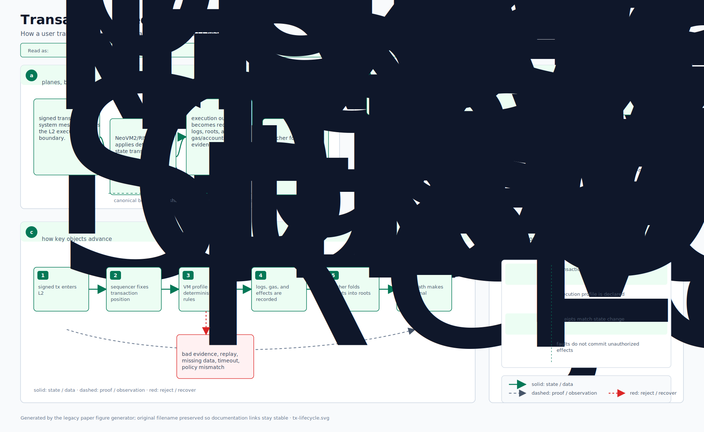
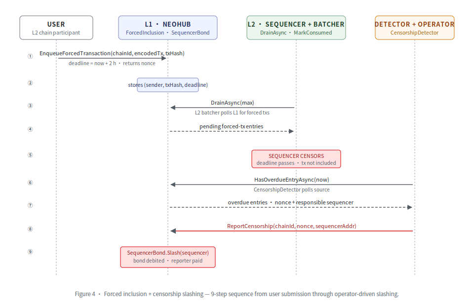
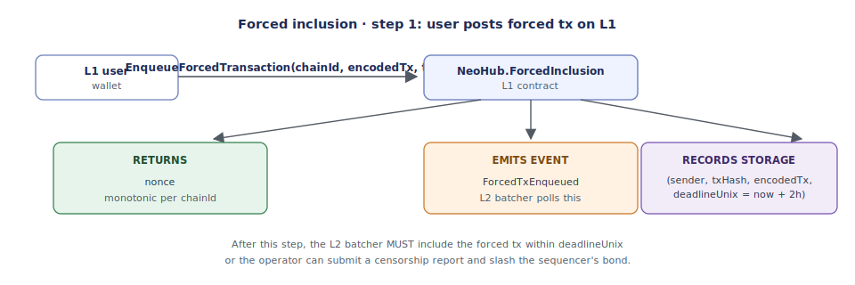
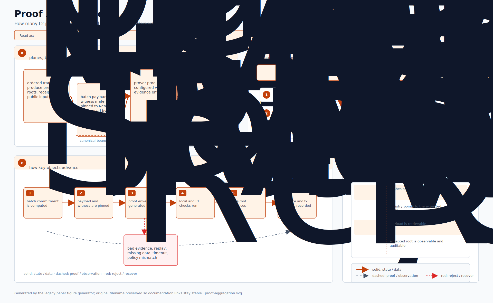
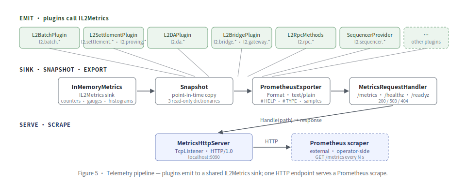

# 架构导览

> 沿代码库走一圈,把 `doc.md` 各节映射到具体文件。如果你只读一篇架构文档,就读这篇。

## 分层图

<p align="center">
  
</p>

## Walk #1:L2 链上一笔交易的一生

<p align="center">
  
</p>

这是热路径。用户提交一笔交易;我们把它从每个组件追到 L1 commit 落地为止。

### 1. 用户提交交易(链下)

用户对 tx 签名,经 RPC 推到 L2 内存池。标准 Neo 流程 —— neo 的 RpcServer 插件处理,
本步无 neo4 代码。

### 2. dBFT 排序器(committee 模式)

`Neo.Plugins.DBFTPlugin`(上游)选下个块的提议者。**谁能提议**由 L1 上的
`NeoHub.SequencerRegistry` 治理;L2 节点经
`Neo.L2.Sequencer.ISequencerCommitteeProvider` 拉活跃集合(生产接 L1-RPC 后备的实
现;测试用 `InMemorySequencerCommitteeProvider`)。

### 3. 出块 commit 钩子

`Neo.Plugins.L2Batch.L2BatchPlugin` 订阅 `Neo.Ledger.Blockchain.Committed`。每个
已 commit 的块被追加到 `Neo.L2.Batch.BatchBuilder`;插件在任一阈值踩到时封装:
`MaxBlocksPerBatch`、`MaxTransactionsPerBatch`、`MaxBatchAgeMillis`。

### 4. 批次执行器 + 状态演化

`Neo.L2.Executor.ReferenceBatchExecutor.ApplyBatchAsync`:
- 先经 `IL1MessageProcessor` 应用 L1 inbox 消息(充值等)。
- 经 `ITransactionExecutor` 按序遍历交易。
- 经 `Neo.L2.State.MerkleTree.ComputeRoot` 计算 `txRoot`、`receiptRoot`、
  `withdrawalRoot`、`l2ToL1MessageRoot`、`l2ToL2MessageRoot`。
- 经 `IPostStateRootOracle` 求 `postStateRoot`。出货的
  `KeyedStateRootOracle` 在该批次产生的有序 `(asset, holder) → balance`
  条目上返回真实的 Merkle 根。

证明边界文档化于 [`src/Neo.L2.Executor/SPEC.md`](../../src/Neo.L2.Executor/SPEC.md)。
该契约外的一切(P2P、RPC、内存池、插件、日志、钱包、磁盘 DB)**不**被证明。

### 5. 封装为 `L2BatchCommitment`

`Neo.L2.Batch.BatchBuilder.Seal` 把 `BatchExecutionResult` 加上证明字节打包为
`L2BatchCommitment` 记录。`Neo.L2.Batch.BatchSerializer.Encode` 产出
`NeoHub.SettlementManager` 将解码的规范 321 字节定长前缀 + 变长证明字节
(字节格式记在 `BatchSerializer` 的 XML 文档)。

### 6. 证明(今天是多签,Phase 4 是 ZK)

`Neo.Plugins.L2Settlement.L2SettlementPlugin.OnBatchSealed` 拿起封好的批次,交给
配置的 `IL2Prover`:

- **Stage 0(默认):** `Neo.L2.Proving.Attestation.AttestationProver` 对
  `BatchSerializer.EncodePublicInputs(...)` 收集验证人签名。今天即可生产用。
- **Stage 1(挑战窗口):** `OptimisticProofPayload` 携带排序器账户、排序器签名
  + bond 引用。验证器校验签名和 key/account 绑定;`NeoHub.SettlementManager`
  把批次标记为 `Challengeable` 并打开 `NeoHub.OptimisticChallenge`。
- **Stage 2(ZK):** 在 `bridge/neo-zkvm-host/` 跑的进程外 Rust 证明者
  (运行为 `prove-batch daemon --watch <queue-dir>`)。N4 的目标是
  NeoVM2/RISC-V 执行;legacy Neo N3 VM guest 仅作为兼容桥,
  PolkaVM-backed `external/neo-riscv-vm` 路径才是 L2 执行目标;
  SP1 6.2.1 证明该执行。.NET 证明者插件用 `MockRiscVProver` 仅供进程内测试 ——
  生产证明在守护进程里。

证明者输出进入 `L2BatchCommitment.Proof`,带匹配的 `ProofType`。

### 7. 提交到 L1

`Neo.L2.Settlement.Rpc.RpcSettlementClient.SubmitBatchAsync` 编码承诺并把它委派给
运维提供的 `SignAndSendAsync`,由后者构造、签名并发出
`NeoHub.SettlementManager.SubmitBatch(commitmentBytes, l1MessageHash, blockContextHash)`
交易。`l1MessageHash` / `blockContextHash` 参数是必需的:它们参与链上的
`publicInputHash` 绑定,由已注册的 verifier 校验。

### 8. L1 验证 + 最终化

`NeoHub.SettlementManager.SubmitBatch`:
- 解码承诺(对齐 `BatchSerializer` 字节布局)。
- 经 `ChainRegistry.IsActive` 确认链已注册 + 活跃。
- 强制批次号顺序。
- 把验证派发给 `VerifierRegistry.VerifyCommitment`,后者读 `proofType` 字节
  路由到正确的验证器(multisig / optimistic / zk)。
- 捕获 `withdrawalRoot`,以便 `SharedBridge.FinalizeWithdrawal` 后续证明个人
  提款。
- 把 multisig/ZK 批次标记为 `Pending`;把 optimistic 批次标记为
  `Challengeable` 并打开已配置的 `OptimisticChallenge` 窗口。

`NeoHub.SettlementManager.FinalizeBatch` 之后把批次推到 `Finalized`,设规范状态根,
并 bump `latestFinalizedBatch[chainId]`。`Challengeable` optimistic 批次只能在
挑战窗口过期后由 `OptimisticChallenge` 进入该路径。

### 9. 提款领取(很久之后)

用户调 `NeoHub.SharedBridge.FinalizeWithdrawal(chainId, withdrawalLeafHash,
emittingContract, l2Sender, l2Asset, withdrawalNonce, asset, recipient, amount)`。
SharedBridge 由这些字段重算完整的提款叶前像并验证 L1↔L2 资产映射,然后回调
`SettlementManager.VerifyWithdrawalLeaf` 检查叶子在最近最终化批次的 `withdrawalRoot`
中,然后释放规范资产。

## Walk #2:经强制纳入抗审查

<p align="center">
  
</p>

`doc.md` §15.4 + §17 写明了抗审查设计。具体怎么走:

### 1. 用户在 L1 上传强制 tx

<p align="center">
  
</p>

### 2. L2 批处理器 poll + 抽空

`Neo.L2.ForcedInclusion.IForcedInclusionSource.DrainAsync`(生产由 L1 RPC 后备,
测试由 `InMemoryForcedInclusionSource` 后备)返回按 nonce 排序的、批处理器必须
在下个批次中纳入的条目。纳入后,`MarkConsumedAsync` 把它们移除。

### 3. 如果排序器越过 deadline 审查

`Neo.L2.Censorship.CensorshipDetector` poll 该 source;当 `HasOverdueEntryAsync`
返回 true,它经 `ISequencerCommitteeProvider` 识别责任排序器,发出
`CensorshipReport[]`。

### 4. 运维提交报告

运维调 `NeoHub.ForcedInclusion.ReportCensorship(chainId, nonce, sequencerAddr)`。
按 `_deploy` 接线,`ForcedInclusion` 在 `SequencerBond` 中已注册为 slasher,所以
合约直接调 `SequencerBond.Slash(chainId, sequencer, amount, reporter)`。bond 被
扣减;reporter 收到酬劳(或资金归库)。

## Walk #3:多 L2 证明聚合(Phase 5)

<p align="center">
  
</p>

`Neo.Plugins.L2Gateway.BinaryTreeAggregator` 做 log(N) 轮的两两归约 ——
每轮在相邻兄弟上调用可替换的 `IRoundProver.Combine`。

`IRoundProver.Combine` 是可替换的热路径:

- `PassThroughRoundProver`:仅供参考的 Hash256 + 长度前缀拼接；生产链上发布会拒绝
  pass-through backend，不能把它当成有效性证明。
- `MultisigRoundProver`:Secp256r1 阈值证明轮次(生产实现,见
  `src/Neo.Plugins.L2Gateway/MultisigRoundProver.cs`)。
- `MerklePathRoundProver`:针对聚合 root 的逐成员包含证明(生产实现,同目录)。
- `Sp1RecursiveRoundProver` 固定 backend `0xC2`；终端递归证明内置于
  `bridge/neo-zkvm-gateway-guest` 与 `bridge/neo-zkvm-gateway-host`。guest 只验证
  编译期 batch VK 锁定、public values 精确等于 `0x00 || batch.PublicInputHash` 的
  SP1 compressed child，再 commit `0x00 || Hash256(binding170)`。Halo2/Risc0
  仍可作为替代 seam，但不是当前内置路径。

`AggregatedCommitment` 携带:
- 全部成员 `L2BatchCommitment`。
- L2→L2 消息根之上的 `GlobalMessageRoot`(用于 L2-to-L2 包含证明)。
- 聚合后的证明字节。
- `BackendId`,以便 L1 端验证正确路由。

发布路径不允许直接写 Router。RPC publisher 只查询 `MessageRouter` 做幂等 reconciliation，
随后把 aggregate 与严格排序的 12-byte `(chainId:uint32 LE,batchNumber:uint64 LE)` references
提交到 `SettlementManager.PublishGatewayGlobalRoot`。SettlementManager 要求每个 batch 当前仍
finalized 且已启用 Gateway，从 finalized records 重建精确 commitment/message roots，推进
每链不可回退 watermark，再在同一交易中调用 `MessageRouter.PublishGlobalRoot`。Router fault
会回滚 watermark；成功发布后，不得再回退低于已发布 watermark 的 batch。

## Walk #4:可观测性 —— 发出、快照、抓取

<p align="center">
  
</p>

横切的可观测层。每个做实质性工作的插件都向共享 `IL2Metrics` sink 发指标;一个 HTTP
端点服务结果。

组合根是 `Neo.Plugins.L2Metrics.L2MetricsPlugin`。运维者先构造它,再把每个 L2 插件
的 `WithMetrics()` setter 接到 `metricsPlugin.Metrics`。之后,每条 counter /
histogram / gauge 都通过单次 Prometheus 抓取可达:

- `l2.batch.sealed/seal_latency_ms/tx_count`(`L2BatchPlugin` → `BatchSealer`)
- `l2.settlement.submitted/submit_latency_ms/submit_failures` + `l2.proving.generated/latency_ms`(`L2SettlementPlugin`)
- `l2.da.published/publish_latency_ms/publish_failures`(`MetricsEmittingDAWriter`,按 mode 打标)
- `l2.bridge.deposits/withdrawals` + 拒绝变体(`Deposit/WithdrawalProcessor`)
- `l2.rpc.calls/latency_ms/failures`(`L2RpcMethods`,按 method 打标)
- `l2.gateway.aggregations/aggregation_rounds/aggregation_latency_ms/batches_aggregated`(`BinaryTreeAggregator`)
- `l2.sequencer.{registered,exits_started,exits_finalized,committee_size}`(`InMemorySequencerCommitteeProvider`)
- `l2.forced_inclusion.observed`、`l2.censorship.reports`、`l2.challenge.{fraud_proofs,bisection_rounds}`
- `l2.audit.runs/failures`(`ChainAuditor`,内建)
- `l2.messaging.emitted`(`L2Outbox`)

`MetricCatalog` 给每条指标存运维侧描述,`PrometheusExporter` 把它嵌入 `# HELP` 行,
让 exposition 自带说明。基于反射的完整性测试(`UT_MetricCatalog`)在新加
`MetricNames` 常量却没添 catalog 条目时让构建失败。组合根集成测试
(`UT_E2E_L2MetricsPlugin_CompositionRoot`)经一个 sink 驱动以上每个组件,断言每
个指标家族都出现在真实 HTTP 抓取中。

完整目录和接线样例见 [`telemetry.md`](./telemetry.md)。

## Walk #5:持久化状态 —— 默认 IL2KeyValueStore + RocksDB

Neo Elastic Network 的"L2 组件持有内存字典"模式在测试 + devnet 没问题,但生产里
不可接受:半途退出的排序器在重启时丢失 ExitsAtUnixSeconds deadline,可能把本应
冷却的排序器重新接受,或者无法完成已过窗口的退出。同样的正确性风险也存在于已
最终化的消息证明、提款证明、已消耗的强制纳入 nonce、DA 负载。

方案:显式 `IL2KeyValueStore` 抽象(`src/Neo.L2.Persistence/`),两份实现:

- `InMemoryKeyValueStore` —— 带 `ByteArrayComparer.Lexicographic` 的
  `SortedDictionary<byte[], byte[]>`。devnet / 测试默认。
- `RocksDbKeyValueStore` —— 基于 `RocksDB` NuGet 包(v10.10.1.649,
  命名空间 `RocksDbSharp`),Snappy 压缩。生产默认。

6 个 L2 组件接受 `IL2KeyValueStore` ctor 参数,带向后兼容的、把
`InMemoryKeyValueStore` 接好的默认 ctor:

| 组件 | 持久化什么 |
| --- | --- |
| `KeyedStateStore` | (asset, holder) → balance 条目 |
| `InMemoryL2RpcStore` | 提款 + 消息证明(其它内存字典可从 L1 重建) |
| `InMemoryMessageRouter` | 已最终化的消息证明 |
| `InMemoryForcedInclusionSource` | 已消耗的 nonce 集合 |
| `InMemorySequencerCommitteeProvider` | 委员会成员 + 退出窗口(write-through 字典) |
| `PersistentDAWriter` | 内容寻址的批次负载 |

devnet 的 `--data-dir <path>` 标志在一个根目录下自动接好其中四个(state、RPC
proof、sequencer、DA)—— 运维者两个命令就看到端到端持久化故事:

```bash
dotnet run --project tools/Neo.L2.Devnet -- 5 --data-dir /tmp/devnet1
dotnet run --project tools/Neo.L2.Devnet -- 0 --data-dir /tmp/devnet1
# → 委员会 + 状态 + DA 负载全部还原
```

测试既钉死按组件的重开行为,也钉死合并故事的集成测试
(`UT_E2E_Persistence_FullStack`),让把两个 store 误塞同目录或漏装某组件的 refactor
在测试套件里炸开,而不是在 devnet 重启时炸。运维接线 + 按组件的"X 丢了会出什么事"
表见 [`persistence.md`](./persistence.md)。

## Walk #6:不变量审计 —— `ChainAuditor` + 6 项检查

结算给规范批次;证明用密码学绑定状态转移;DA 让负载可恢复。但这些都不直接回答运维
者第二天的问题:*"链是否仍然 well-formed?"* 这就是 `Neo.L2.Audit.ChainAuditor` 的
位置 —— 它把一序列 `IAuditCheck` 不变量组合起来,在 ops 侧周期性 schedule 上跑批次
序列。失败 bump `l2.audit.failures` 给面板;报告按 check + batch 命名每个失败发现。

内建检查(devnet 接线全部 6 项):

| 检查 | 抓什么 |
| --- | --- |
| `ContinuityCheck` | 跨批次状态根连续性 + 单调批次号 + 不重叠的块区间 |
| `NoZeroProofCheck` | "soft-sealed 但从未证明"的批次 —— `ProofType.None` 或空证明字节 |
| `ProofValidityCheck` | 密码学验证器拒绝该证明对应的 public inputs |
| `PublicInputHashConsistencyCheck` | 已存的 `PublicInputHash` 与承诺字段哈希结果不匹配(篡改提交) |
| `BatchRangeCheck` | 批内不变量:`firstBlock <= lastBlock`、`batchNumber >= 1` |
| `DAAvailabilityCheck` | DA 层把证明承诺所绑定的负载丢了 |

每条检查成功时返回一条 summary `AuditFinding`,失败时按失败一条;auditor 捕获坏
的自定义 check(`RunAsync` 抛 `Exception`)并把它们转为失败发现,这样一个坏 check
不会中止整次 pass。混合 chainId 的批次列表在按 check 流水线上游被
`ArgumentException` 拒绝。

集成测试 `UT_E2E_AuditPipeline` 在真实 attestation 签名链上端到端演练 3 个场景:
健康(全 6 项过 + 指标计数)、`BatchRange` 违规(被正确细节抓住 + 计数器递增)、
DA-dropped(被 `DAAvailabilityCheck` 针对从未看到负载的 writer 专门抓到)。

## `doc.md` 各节在代码中的位置

- **§3.2 ChainRegistry** —— L2 准入注册表。`contracts/NeoHub.ChainRegistry/` + `Neo.L2.L2ChainConfig` 模型。
- **§3.2 SharedBridge** —— 资产托管。`contracts/NeoHub.SharedBridge/` + `Neo.L2.Bridge.*`。
- **§3.2 SettlementManager** —— 批次 ↦ 规范状态。`contracts/NeoHub.SettlementManager/` + `Neo.L2.Settlement.Rpc`。
- **§3.2 VerifierRegistry** —— 可插拔证明派发。`contracts/NeoHub.VerifierRegistry/` + `Neo.L2.Proving.VerifierRegistry`。
- **§3.2 MessageRouter** —— L1↔L2 / L2↔L2 消息传递。`contracts/NeoHub.MessageRouter/` + `Neo.L2.Messaging.*`。
- **§3.2 TokenRegistry** —— L1↔L2 资产映射。`contracts/NeoHub.TokenRegistry/` + `Neo.L2.AssetMapping`。
- **§3.2 DARegistry** —— DA 承诺存储。`contracts/NeoHub.DARegistry/`。
- **§3.2 GovernanceController** —— 委员会 + timelock。`contracts/NeoHub.GovernanceController/`。
- **§3.2 EmergencyManager** —— 暂停 + 逃生通道。`contracts/NeoHub.EmergencyManager/`。
- **§4 Neo Gateway** —— 证明聚合。`Neo.Plugins.L2Gateway` 加 `bridge/neo-zkvm-gateway-{guest,host}` SP1 递归终端证明。
- **§5 L2 链内部** —— 按 L2 的插件布局。`Neo.Plugins.L2Batch / L2Settlement / L2Bridge / L2DA / L2Prover / L2Rpc`。
- **§7.1 Sequencer / dBFT** —— 委员会选择。`contracts/NeoHub.SequencerRegistry/` + `Neo.L2.Sequencer`。
- **§7.2 Batcher** —— 块 ↦ 批次。`Neo.L2.Batch.BatchBuilder` + `Neo.Plugins.L2Batch.L2BatchPlugin`。
- **§7.3 StateRootGenerator** —— 按批次的根。`Neo.L2.State.*` + `Neo.L2.Executor.State.KeyedStateStore`。
- **§7.4 DAWriter** —— DA 层抽象。`Neo.L2.Abstractions.IDAWriter` + `Neo.Plugins.L2DA.*`。
- **§7.5 ProverAdapter** —— 3 阶段证明。`Neo.L2.Proving.Attestation / Optimistic / RiscVZk` + `bridge/neo-zkvm-host/`(进程外 Stage-2)。
- **§8 证明系统** —— 证明规格。`src/Neo.L2.Executor/SPEC.md`。
- **§9 代币 / GAS 模型** —— 桥接资产记账。`Neo.L2.Bridge.AssetRegistry` + Neo Core 原生 `L2BridgeContract`。
- **§10 Neo Connect** —— 跨链消息传递。`Neo.L2.Messaging.*` + Neo Core 原生 `L2MessageContract`。
- **§11 桥** —— SharedBridge 设计。`contracts/NeoHub.SharedBridge/` + `Neo.L2.Bridge.*`。
- **§12 数据可用性** —— DA 分级。`Neo.L2.DAMode` + `Neo.Plugins.L2DA.*`(含 `NeoFsLikeDAWriter`)。
- **§13 L2 原生合约** —— L2 上系统合约。`external/neo/src/Neo/SmartContract/Native/L2NativeContracts.cs`(10 个合约)。
- **§14.1 L2 RPC** —— RPC 方法面。`Neo.Plugins.L2Rpc.L2RpcMethods`(10 个方法,含 `getsecuritylabel`)。
- **§14.2 neo-stack CLI** —— 启动框架。`tools/Neo.Stack.Cli/`。
- **§15.1 Tx 流** —— 热路径。本文档 Walk #1。
- **§15.2 充值** —— L1→L2。`Neo.L2.Bridge.DepositProcessor` + Neo Core 原生 `L2BridgeContract.ApplyDeposit`。
- **§15.3 提款** —— L2→L1。`Neo.L2.Bridge.WithdrawalProcessor` + `NeoHub.SharedBridge.FinalizeWithdrawal`。
- **§15.4 强制纳入** —— 抗审查。`contracts/NeoHub.ForcedInclusion/` + `Neo.L2.ForcedInclusion` + `Neo.L2.Censorship`。
- **§15.5 紧急退出** —— 逃生通道。`contracts/NeoHub.EmergencyManager/`。
- **§16 治理** —— 三层治理。`contracts/NeoHub.GovernanceController/`(委员会、timelock、准入策略)。
- **§17 威胁模型** —— 缓解措施。分布在整个代码库;质押 + 罚没在 `SequencerBond`。
- **§18 分阶段铺开** —— Phase 0–6 计划。`IMPLEMENTATION_STATUS.md`(按阶段状态矩阵)。
- **§19 模块布局** —— 推荐结构。本仓的 `src/`、`contracts/`、`tools/` 布局。
- **§20 MVP** —— Phase-0 成功标准。`tests/Neo.L2.IntegrationTests/UT_Mvp_Phase0_Sidechain`。
- **§22 设计权衡** —— 已做的选择。本文 + `ARCHITECTURE.md`。
- **横切** —— 可观测性。`Neo.L2.Telemetry` + `Neo.Plugins.L2Metrics`;运维目录见 [`telemetry.md`](./telemetry.md)。
