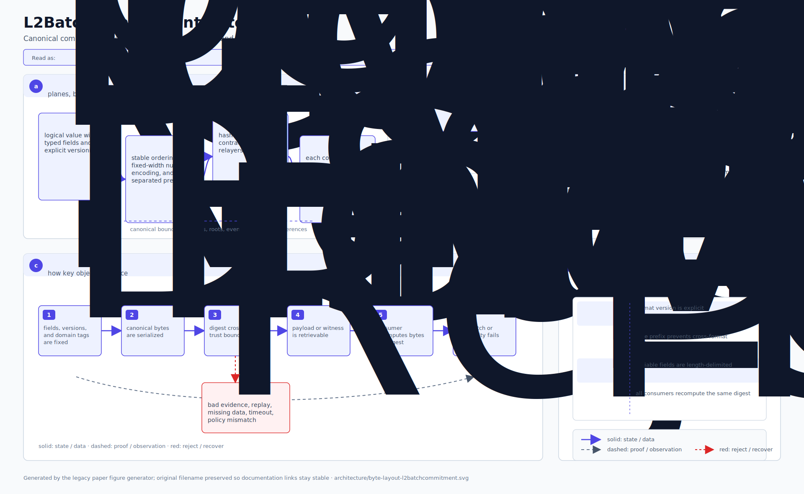
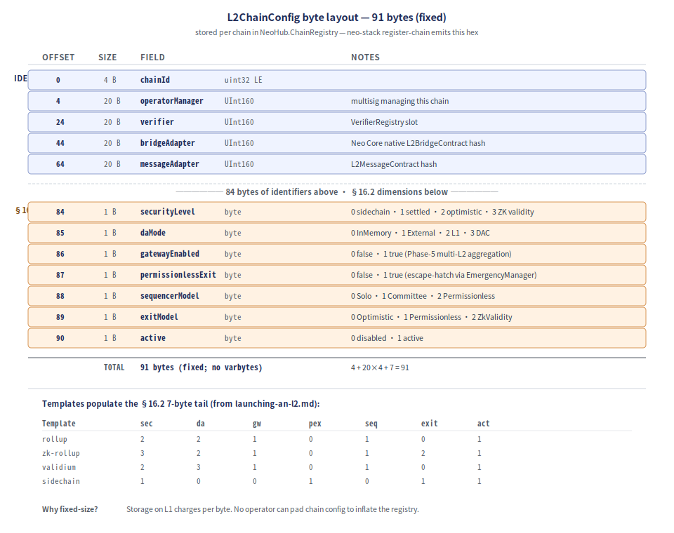
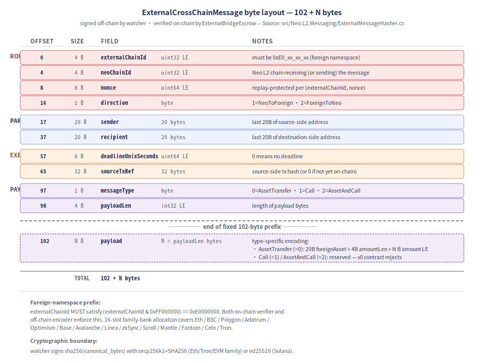
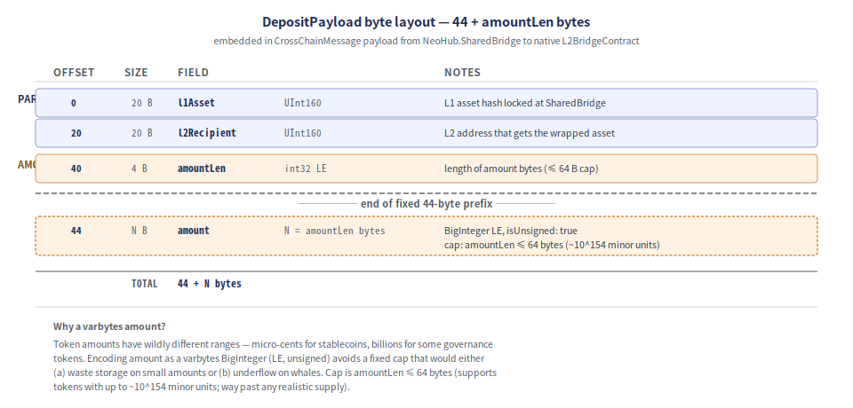

# 架构:线协议格式

> Neo Elastic Network 中跨越信任边界的字节级规范线协议格式。运维者排查跨层问题、
> 审计者校验签名、SDK 实现者构建线协议兼容,都需要这份参考。
>
> 配套阅读 [`architecture-l2-lifecycle.md`](./architecture-l2-lifecycle.md)
> (那篇讲*流程*;本篇讲*字节*)。

## 目录

1. [为什么需要规范线协议格式?](#1-为什么需要规范线协议格式)
2. [`L2BatchCommitment` —— 已封装批次(321 + N 字节)](#2-l2batchcommitment--已封装批次321--n-字节)
3. [`PublicInputs` —— 证明 public input 承诺(332 字节)](#3-publicinputs--证明-public-input-承诺332-字节)
4. [`L2ChainConfig` —— 注册表存储的链 config(91 字节)](#4-l2chainconfig--注册表存储的链-config91-字节)
5. [`ExternalCrossChainMessage` —— 外链桥(102 + N 字节)](#5-externalcrosschainmessage--外链桥102--n-字节)
6. [`DepositPayload` —— L1→L2 桥(44 + amountLen 字节)](#6-depositpayload--l1l2-桥44--amountlen-字节)
7. [通用约定](#7-通用约定)

---

## 1. 为什么需要规范线协议格式?

下面每种线协议格式都"规范":对任何给定值都有且仅有一种字节级编码。运维者依赖的两个
后果:

- **哈希确定性。** 跨层签名是对规范字节做签名(例如 watcher 的 secp256k1 签名是对
  `sha256(canonical_message_bytes)` 做)。两端都从线字节重算哈希;合约从不信任线
  外的哈希。任一端编码不同就会让所有签名失效。

- **线形态稳定性。** 今天落到 L1 的 tx,几年后仍能正确解析。没有 JSON 歧义(key
  顺序、空白、unicode 归一化)、没有 protobuf tag-number 漂移;字节按位置 + 定长或
  长度前缀。

所有多字节整数都是**小端序**(对齐 Neo 链上约定)。`UInt160` 和 `UInt256` 类型按
原始 20 / 32 字节 payload 编码;无长度前缀 —— 它们是定宽的。

---

## 2. `L2BatchCommitment` —— 已封装批次(321 + N 字节)

NeoHub `SettlementManager` 读取的线协议格式。每个封装好的 L2 批次在提交前都被
编码为这一布局。

源码:[`src/Neo.L2.Batch/BatchSerializer.cs`](../../src/Neo.L2.Batch/BatchSerializer.cs)。

  

**序列化时强制的防御限制:**
- `proof.Length ≤ 1,048,576`(1 MiB)—— 对齐 NeoHub 的防御限制。Encode 拒绝过大
  证明,而不是落地一个往返时才会失败的序列化 blob。
- `proofType` 必须在已定义枚举范围内;Encode 拒绝越界值(你不能经线协议偷渡未来
  的证明类型)。

---

## 3. `PublicInputs` —— 证明 public input 承诺(332 字节)

证明者把这些字节作为证明的 public input 承诺起来。L1 验证器从链上承诺字段重算这个
哈希,与证明声称的 public-input 比对。不一致 → 拒绝。

源码:同上文件,`PublicInputs` 段。

  

**为什么有两套不同布局?**
`L2BatchCommitment` 在面向公开字段里携带 `firstBlock` + `lastBlock`(块区间);
`PublicInputs` 改成携带 `l1MessageHash` + `blockContextHash`。块区间是给 L1 消费方
的元数据;消息+上下文哈希是证明者真正承诺的内容。两者共享同一 chainId +
batchNumber + 7 个相同的根哈希;L1 上的 publicInputHash 把它们绑在一起。

12 个字段 ×(主要是)32 字节的哈希让此格式即使从非 Rust / 非 C# 实现也容易逐字节
验证(对索引器、区块浏览器、报警工具有用)。

---

## 4. `L2ChainConfig` —— 注册表存储的链 config(91 字节)

`NeoHub.ChainRegistry` 按已注册链存储的字节。`neo-stack register-chain` 输出此 hex;
运维者钱包把它作为 `configBytes` 传给 `ChainRegistry.RegisterChain`。

源码:[`src/Neo.L2.Abstractions/Models/L2ChainConfigSerializer.cs`](../../src/Neo.L2.Abstractions/Models/L2ChainConfigSerializer.cs)。

  

**为什么定长?** L1 上存储按字节计费。定长让成本可预测 —— 任何运维者都不能填充
自己的链 config 把注册表撑大。"需要"额外字段(任意元数据)的 config 应当走运维者
提供的链下 manifest,而不是 L1 注册表条目。

**模板**(出自 [`launching-an-l2.md`](./launching-an-l2.md))填充末尾 7 字节:

| 模板          | sec | da | gw | pex | seq | exit | act |
|---------------|-----|----|----|-----|-----|------|-----|
| `rollup`      | 2   | 2  | 1  | 0   | 1   | 0    | 1   |
| `zk-rollup`   | 3   | 2  | 1  | 0   | 1   | 2    | 1   |
| `validium`    | 2   | 3  | 1  | 0   | 1   | 0    | 1   |
| `sidechain`   | 1   | 0  | 0  | 1   | 0   | 1    | 1   |

---

## 5. `ExternalCrossChainMessage` —— 外链桥(102 + N 字节)

链下 watcher 签的、链上 `ExternalBridgeEscrow` 验证的线协议格式。主要是外链
(Eth/EVM 家族 / Tron / Solana)→ Neo 方向;同一形态在反向用 `direction` 翻一下
即可。

源码:[`src/Neo.L2.Messaging/ExternalMessageHasher.cs`](../../src/Neo.L2.Messaging/ExternalMessageHasher.cs)。

  

**重放保护**按 `(externalChainId, nonce)`。链上 escrow 维护
`consumedInbound[chainId][nonce]` 集合;一旦 `(chainId, nonce)` tuple 落地成功,
后续提交相同 tuple 都会回滚。

**外链命名空间前缀。** `externalChainId` 必须满足
`(externalChainId & 0xFF000000) == 0xE0000000`。链上验证器和链下 encoder 都强制
此约束。
[`watchers/neo-bridge-watcher-eth/src/chains.rs`](../../watchers/neo-bridge-watcher-eth/src/chains.rs)
中的 16 槽位家族 bank 分配覆盖 Ethereum / BSC / Polygon / Arbitrum / Optimism /
Base / Avalanche / Linea / zkSync / Scroll / Mantle / Fantom / Celo / Tron ——
完整表见 [`external-bridge-evm-chains.md`](./external-bridge-evm-chains.md)。

**密码学边界。** Watcher 用 secp256k1+SHA256(Eth/Tron/EVM 家族)或 ed25519
(Solana)对 `sha256(canonical_bytes)` 做签名。Neo 的
`CryptoLib.VerifyWithECDsa(secp256k1SHA256)` 内部对同一字节做哈希再验证;Eth 的
`ecrecover` 直接吃 digest。两端同字节 → 同 digest。

---

## 6. `DepositPayload` —— L1→L2 桥(44 + amountLen 字节)

嵌入到从 `NeoHub.SharedBridge` 跑向 `L2NativeBridgeContract` 的 `CrossChainMessage`
的 `payload` 字段里。

源码:[`src/Neo.L2.Bridge/DepositPayload.cs`](../../src/Neo.L2.Bridge/DepositPayload.cs)。

  

**为什么 amount 是变长字节?** Token 金额范围相差悬殊 —— 稳定币的 micro-cents、
某些治理 token 的数十亿。把 amount 编码为变长 BigInteger(LE、unsigned)避免了
固定上限带来的(a)小金额浪费存储或(b)鲸鱼下溢。上限是 `amountLen ≤ 64 bytes`
(支持最多 ~10^154 minor unit 的代币;远超任何现实的供应量)。

---

## 7. 通用约定

| 约定                              | 为什么                                                                                              |
|-----------------------------------|----------------------------------------------------------------------------------------------------|
| 多字节整数小端序                  | 对齐 Neo 链上约定(`BinaryPrimitives.WriteUInt32LittleEndian` 等)                                |
| `UInt160` / `UInt256` 定宽         | 字节布局是类型的一部分;不做 varbytes 包装                                                       |
| 变长字节用长度前缀                | `int32 LE 长度` + 字节。解码可预分配;运维可扫描边界                                              |
| 哈希字段固定 32 字节               | 所有哈希 / 根 / 承诺。SHA256 / Keccak256 / RIPEMD160 输出零填充到 32B                            |
| 编码 + 解码两端做防御性上限       | 例如 proof ≤ 1 MiB、payload 受链 config 政策约束。阻止线上承载不可验证的尺寸                    |
| 先校验后解码                       | 解码先做长度检查,再解析。截断的记录永远到不了业务逻辑                                          |
| 全部线协议格式按字节规范          | 每个逻辑值一种字节编码。无 JSON / 无 protobuf / 无歧义                                            |

### 实现位置

| 线协议格式                | 源码                                                                  |
|---------------------------|-----------------------------------------------------------------------|
| `L2BatchCommitment`       | `src/Neo.L2.Batch/BatchSerializer.cs`                                 |
| `PublicInputs`            | `src/Neo.L2.Batch/BatchSerializer.cs`(同文件,另一个函数)             |
| `L2ChainConfig`           | `src/Neo.L2.Abstractions/Models/L2ChainConfigSerializer.cs`           |
| `ExternalCrossChainMessage` | `src/Neo.L2.Messaging/ExternalMessageHasher.cs` + `ExternalMessageBuilder.cs` |
| `DepositPayload`          | `src/Neo.L2.Bridge/DepositPayload.cs`                                 |
| `CrossChainMessage`       | `src/Neo.L2.Messaging/MessageBuilder.cs` + `MessageHasher`            |
| `WithdrawalRecord`        | `src/Neo.L2.Bridge/WithdrawalRecord.cs`                               |
| `MerkleProofSerializer`   | `src/Neo.L2.State/MerkleProofSerializer.cs`                           |
| `MultisigProofPayload`    | `src/Neo.L2.Proving/MultisigProofPayload.cs`                          |
| `RiscVProofPayload`       | `src/Neo.L2.Proving/RiscVProofPayload.cs`                             |
| `OptimisticProofPayload`  | `src/Neo.L2.Challenge/OptimisticProofPayload.cs`                      |
| `FraudProofPayload`       | `src/Neo.L2.Challenge/FraudProofPayload.cs`                           |

每一种都有匹配的对等性测试:
- `tests/Neo.L2.*.UnitTests/` 里的 .NET 单测钉死字节布局不变量。
- watcher:`watchers/neo-bridge-watcher-eth/tests/parity.rs` 钉死 Rust ↔ C# 字节
  级等价(同一规范字节在两种语言中哈希到同一 digest)。

---

## 另请参阅

- [`architecture-l2-lifecycle.md`](./architecture-l2-lifecycle.md) —— L2 链怎么
  创建/部署/连接(*流程*;本篇讲*字节*)。
- [`architecture-walkthrough.md`](./architecture-walkthrough.md) —— 按交易生命
  周期的叙事导览。
- [`external-bridge-evm-chains.md`](./external-bridge-evm-chains.md) ——
  `ExternalCrossChainMessage` 的 16 槽位外链命名空间分配 + 接入 runbook。
- [`security-model.md`](./security-model.md) —— 威胁模型;密码学边界讨论在 §3。
- [`doc.md`](../../doc.md) —— 主规格(权威)。
