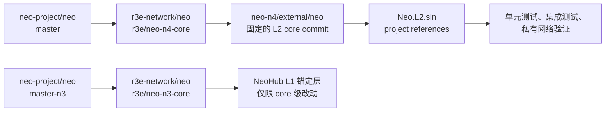
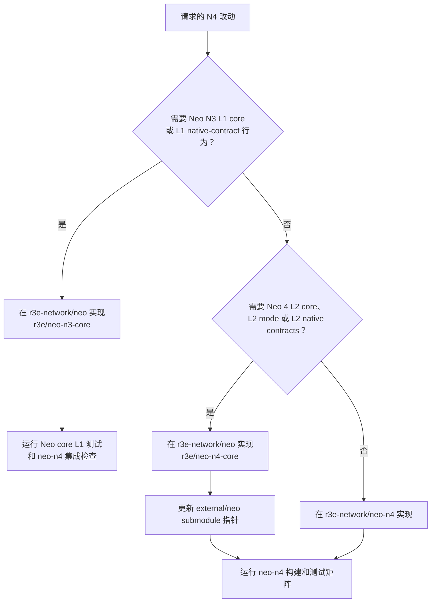

# Neo Core Fork Policy 中文版

Neo N4 不直接从 `neo-project/neo` 构建，而是在 `r3e-network/neo` 里维护
我们自己的 core 分支。L1 锚定层和 L2 执行内核必须分开维护，不能把两类改动混在
同一个分支里。

## 仓库职责

| 仓库 | 职责 |
| --- | --- |
| `r3e-network/neo-n4` | Elastic Network 集成仓库，负责合约、L2 库、插件、工具、SDK、文档和测试。 |
| `r3e-network/neo` | r3e 维护的 Neo core fork，负责必须进入 core 的 native contract、ChainMode、执行内核 hook、共识/RPC 改动。 |
| `neo-project/neo` | 只读上游，只用于审阅和受控同步，不向这里 push。 |

## Core 分支矩阵

| 层级 | 上游基线 | r3e 维护分支 | 用途 |
| --- | --- | --- | --- |
| L1 core | `neo-project/neo` `master-n3` | `r3e/neo-n3-core` | Neo N3 L1 锚定层行为、L1 native-contract 工作，以及未来把 NeoHub 迁入 L1 core 的实验。 |
| L2 core | `neo-project/neo` `master` | `r3e/neo-n4-core` | Neo 4 L2 执行内核、L2 mode、L2 native contracts、执行 hook、RPC/共识差异。 |

本仓库的 `external/neo` submodule **有意** 指向 L2 core 分支：

```text
url    = https://github.com/r3e-network/neo.git
branch = r3e/neo-n4-core
```

L1 core 分支也在同一个 `r3e-network/neo` fork 里，但它不是 `neo-n4` 的默认
submodule checkout。L1 core 改动放到 `r3e/neo-n3-core`；L2 core 改动放到
`r3e/neo-n4-core`。

## 依赖流



## 改动放置规则



## Native Contract 边界

N4 L2 system contracts 是 L2 core 协议面，必须位于 `r3e/neo-n4-core`：

```text
external/neo/src/Neo/SmartContract/Native/
```

它们由 `NativeContract` 注册，并在每条 N4 L2 的 genesis 时存在。它们不能重新以
`contracts/L2Native.*` DevPack 项目出现，不能加入 `Neo.L2.sln`，也不能由
`Neo.Hub.Deploy` 在链启动后部署。

当前 L2 native contract 集合：

- `L2SystemConfigContract`
- `L2BatchInfoContract`
- `L2MessageContract`
- `L2BridgeContract`
- `L2FeeContract`
- `L2PaymasterContract`
- `L2NativeExternalBridgeContract`
- `L2AccountAbstraction`
- `BridgedNep17Contract`
- `L2InteropVerifier`

NeoHub L1 contracts 属于另一条边界：它们是对标 ZKsync L1 Bridgehub/shared-bridge
生态的 L1 锚定合约。现在的生产目标已经调整为：把 NeoHub L1 生产面迁入
`r3e/neo-n3-core`，作为 L1 core native contracts 维护。`neo-n4` 里的
`contracts/NeoHub.*` DevPack 项目在迁移完成前继续保留，作用是 parity/reference
源码、部署演练夹具和行为对照，不再作为最终生产形态。

当前 `r3e/neo-n3-core` 的 L1 native 迁移状态：

- 已 native 化并通过 Neo core 测试：`NeoHubChainRegistryContract`、
  `NeoHubTokenRegistryContract`、`NeoHubDARegistryContract`、
  `NeoHubL1TxFilterContract`、`NeoHubVerifierRegistryContract`、
  `NeoHubMessageRouterContract`、`NeoHubSettlementManagerContract`、
  `NeoHubDAValidatorContract`、`NeoHubSharedBridgeContract`、
  `NeoHubEmergencyManagerContract`、`NeoHubGovernanceControllerContract`、
  `NeoHubSequencerBondContract`、`NeoHubSequencerRegistryContract`、
  `NeoHubForcedInclusionContract`、`NeoHubOptimisticChallengeContract`。
- 在声称 NeoHub 已完全 L1-native 之前仍需迁移：`GovernanceFraudVerifier`、`RestrictedExecutionFraudVerifier`、
  `MpcCommitteeVerifier`、`MpcCommitteeFraudVerifier`、
  `ExternalBridgeRegistry`、`ExternalBridgeEscrow`、`ExternalBridgeBond`。

在所有生产 NeoHub 合约都有 native counterpart、注册测试、行为测试以及
`neo-n4` parity/integration 覆盖之前，不要删除 `contracts/NeoHub.*`，也不要把
运维文档改成“已经全量 native”。

必须进入 fork 的典型改动包括：

- 必须存在于 Neo N3 L1 节点内部的 L1 core/native-contract 行为。
- L2-aware native contracts 和 native-contract policy gates。
- `ChainMode` 和激活 hook。
- 确定性 L2 state transition 所需的 core execution-kernel hooks。
- 必须位于 Neo core 内部的共识/RPC 行为。

如果改动可以放在 L2 plugins、NeoHub contracts、watchers、SDK、CLI、文档或集成
harness 里，就应留在 `neo-n4`，不要塞进 Neo core。

## 同步流程

同步 L2 core 分支：

```bash
cd external/neo
git remote -v
git fetch upstream master
git switch r3e/neo-n4-core
git merge upstream/master
git push origin r3e/neo-n4-core

cd ../..
git add external/neo
dotnet test Neo.L2.sln /p:NuGetAudit=false
```

同步 L1 core 分支：

```bash
cd external/neo
git fetch upstream master-n3
git switch r3e/neo-n3-core
git merge upstream/master-n3
git push origin r3e/neo-n3-core
git switch r3e/neo-n4-core
```

如果任一 merge 不是 fast-forward，先在 `r3e-network/neo` 内解决冲突并运行对应
Neo core 测试。只有 L2 core 发生变更时，才需要回到 `neo-n4` 更新
`external/neo` submodule 指针。

## Push 安全

本地 `external/neo` 应配置为：

```text
origin   https://github.com/r3e-network/neo.git
upstream https://github.com/neo-project/neo.git
upstream push URL disabled
```

不要 push 到 `neo-project/neo`。所有 core commits 都进入 `r3e-network/neo`：
L1 commit 放 `r3e/neo-n3-core`，L2 commit 放 `r3e/neo-n4-core`。
