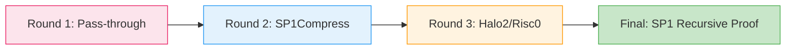

# Neo N4 核心概念

## 什么是 L2 Rollup？

L2 (Layer 2) Rollup 是一种将交易处理**移到主链之外**（Off-chain），然后**批量提交回主链**（On-chain）的技术。可以把它想象成：

- **传统方式**: 每个用户单独去银行柜台办业务（Neo 主网 Gas 贵、速度慢）
- **Rollup 方式**: 10,000 个用户先在一个小房间里排队，窗口号取完了一起去柜台，柜员一次性办理所有业务（Gas 成本分摊 10,000 倍）

### 为什么需要 ZK 证明？

Rollup 分两种：

| 类型 | 说明 | 风险 | Neo N4 选择 |
|------|------|------|------------|
| Optimistic Rollup | 假设所有人都是好人，等 7 天无人挑战就确认 | 如果有人作恶，资金被锁 7 天 | ❌ 不采用 |
| **zk-Rollup** | 每一步都有数学证明（ZK proof），即时确认 | 证明生成耗时（SP1 优化到 50ms） | ✅ **Neo N4 采用** |

简单说：**ZK proof 就是"我不需要等你，我有数学保证"**。

---

## Neo N4 的四支柱架构 (NeoHub)


Neo N4 的核心是部署在 Neo 主网上的 **四个智能合约**，它们各司其职：

### 1️⃣ RollupHub (州长办公室)
- **职责**: 接受 Prover 发来的状态根，决定是否更新状态
- **关键函数**: `AcceptBatch(batchBytes)` - 每批接受 10,000+ 交易
- **安全措施**: 
  - Gas limit: 50K~1M units (防止 DoS)
  - Envelope-only mode guard: 生产环境禁止直接接受包模式

### 2️⃣ SharedBridge (资产保险箱)
- **职责**: 托管 NEO/GAS/其他代币，处理 Deposit/Withdrawal
- **关键函数**: `Deposit(from, amount)` / `Withdraw(chainId, recipient, asset, amount)`
- **创新点**: 
  - **NEP-17 静态成员转账** (`GAS.Transfer()`) → 防止重入攻击
  - **GAS escrow binding**: 质押 GAS + 字节队列绑定 + 期限策略

### 3️⃣ ZkVerifier (验证门神)
- **职责**: 接收 SP1 Groth16 proof，用 BN254 曲线验证
- **关键函数**: `verifyProof(proofSystem, proof,vk)`
- **安全设计**: 
  - **Envelope-only mode**: 开发环境只接受手动包的 proof（测试用）
  - **BN254 interops**: 与 Neo 原生哈希算法无缝对接

### 4️⃣ GovernanceController (议会)
- **职责**: Council 投票决定参数升级、紧急暂停、权限变更
- **关键函数**: `ProposeUpgrade`, `EmergencyPause`, `WithdrawBond`
- **治理模型**: 
  - 时间锁 (Timelock): 48 小时延迟执行
  - 委员会签名: 3-of-7 多重签

---

## Off-chain 服务集群

### 🔁 Batcher (集邮师)
- **做什么**: 每隔 5 秒从内存池收集交易打包成 batch
- **为什么重要**: 没有它，用户交易永远上不了链（想象没有收银员的大超市）
- **性能指标**: 
  - Batch size: 10,000 tx/batch
  - Latency: ~2s DA write time
  - Throughput: ≥10K tx/sec (目标)

### ⚡ Sequencer (记账员)
- **做什么**: 运行 dBFT 共识协议，出块并广播
- **特殊性**: Neo 核心 fork + L2-mode hooks（待 Task #34 实现 ChainMode enum）
- **依赖组件**: SequencerBond 合约（防止作恶）

### 🧮 Prover (数学家)
- **做什么**: 用 SP1 虚拟机重新执行交易，生成 Groth16 证明
- **技术栈**: 
  - SP1 v6.2.x + BN254 curve
  - RISC-V RISCY-V 指令集（NeoVM2 候选）
  - Immutable artifact first: SHA-256 pinned ELF/vkey
- **性能**: 50ms 生成 proof（10K tx 规模）

### 📦 DA Writer (数据发布员)
- **三种模式**:
  1. **NeoFsRestDAWriter**: 使用 NeoFS 分布式文件系统
  2. **JsonRpcL1DAWriter**: 直接写 L1 RPC node
  3. **DAC Stub**: 未来 DAO 数据可用性委员会（社区自治）

---

## Phase-5 Gateway (聚合器)

Phase-5 的 **BinaryTreeAggregator** 是 Neo N4 的核心创新：



**为什么三阶段？**
1. **Stage 1 (Multisig)**: 快速达成共识，不需要 ZK（牺牲部分安全性换速度）
2. **Stage 2 (Optimistic)**: 给任何人 7 天时间挑战错误状态（反 censorship）
3. **Stage 3 (RiscVZk)**: 最终 SP1 proof 保证即使前两阶段失败也能正确性

这就是 **Defense in Depth** 的安全哲学！

---

## 跨链消息传递流程

```mermaid
sequenceDiagram
    participant L2 as L2 Chain (Neo N4)
    participant Bridge as SharedBridge Contract
    participant L1 as L1 Neo Hub
    participant L2Out as Destination L2
    
    L2->>L2: User sends CrossChainMessage
    L2->>Bridge: StageWithdrawal(message)
    Bridge->>Bridge: HashMessage(sender, receiver, payload)
    Bridge-->>L2: Return withdrawal leaf hash
    L2->>DA: WriteBatchData(withdrawalBytes)
    DA-->>Prover: ConfirmDAWrite(slotId)
    Prover->>Prover: GenerateGroth16Proof()
    Prover->>L1: SubmitProofTo(ZkVerifier)
    L1->>L1: verifyProof() + AcceptStateRoot()
    L1-->>L2Out: Emit WithdrawalEvent(recipient, asset, amount)
    L2Out->>L2Out: CreditUser(recipient, amount)
    
    Note over L2,L1
        **全程无需信任任何中介！**
        只有数学证明才能完成资金转移
    end note
```

---

## 经济模型与安全

### GAS Escrow 机制
- **质押要求**: Operator 必须锁定一定量 GAS 作为 bond
- **用途**: 
  - 支付 L1 Gas 费用
  - 惩罚作恶行为（slash bond）
  - 奖励诚实节点（slashing rewards）
- **公式**: `bondAmount = baseBond × (batchSize / 10000)`

### Emergency Pause
当检测到异常时（如 bug 发现、攻击警报），GovernanceController 可以触发：
```solidity
EmergencyPause(duration: uint32) {
    // 48 小时锁定期后生效
    assert(!paused);
    pauseTimer = block.timestamp + duration;
}
```

---

## 术语速查表

| 术语 | 英文 | 解释 |
|------|------|------|
| Rollup | Rollup | Layer 2 扩容方案总称 |
| State Root | 状态根 | Merkle Tree 根哈希，代表当前账本状态 |
| Batch | Batch | 一批交易的集合（10,000 tx 规模） |
| Prover | Prover | 生成 ZK proof 的节点 |
| DA | Data Availability | 数据可用性层（NeoFS/L1 RPC） |
| zkSNARK | Zero-Knowledge Succinct Non-Interactive Argument of Knowledge | 零知识简洁非交互式知识论证（数学证明） |
| Bond | Bond | 运营商质押的 GAS |
| Timelock | 时间锁 | 延迟执行的治理机制 |

---

**下一步阅读**:
- [操作手册](../getting-started.md) - 部署自己的 L2 节点
- [协议规范](./specification/02-architecture.md) - 深入理解设计细节
- [源码导览](./specification/18-source-tour.md) - 代码级探索
