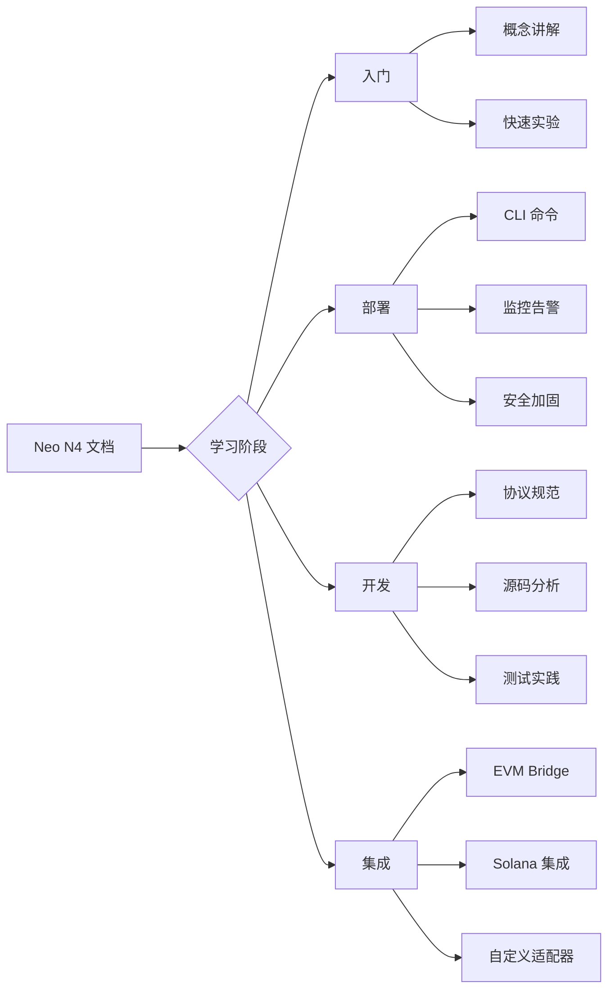

# Neo N4 开发者导航

这是一个为开发者设计的**Neo N4 Elastic Network**完整入门路径。无论您是刚接触、准备部署还是深入开发，都能找到适合您的阅读路径。

---

## 🎯 快速开始（根据角色选择）

### 👨‍💻 新手开发者：30 分钟入门

1. **[架构图解](./zh/developer-guide/introduction.md)** - 什么是 L2 Rollup？为什么需要 ZK 证明？
2. **[五分钟体验](./zh/developer-guide/quick-start.md)** - 本地运行第一个 private network
3. **[核心概念](./zh/developer-guide/key-concepts.md)** - Batcher、Prover、Sequencer 如何协作
4. **[SDK 使用](./zh/developer-guide/sdk-intro.md)** - TypeScript/Python/Rust 调用示例

👉 预计完成时间：**30 分钟**  
🎁 您将学会：理解基本架构、运行本地环境、发送第一条跨链消息

---

### 🚀 部署运营者：生产环境指南

1. **[操作手册](./getting-started.md)** - 安装依赖与环境配置
2. **[部署 L2 链条](./launching-an-l2.md)** - 一键命令启动私有网络
3. **[持续监控](./telemetry.md)** - Prometheus + Grafana 仪表盘
4. **[安全加固](./security-model.md)** - GAS escrow、紧急暂停、故障注入
5. **[备份与恢复](./persistence.md)** - RocksDB 状态持久化策略

👉 预计完成时间：**2 小时**  
🎁 您将学会：部署完整 L2 节点、配置监控告警、实施安全措施

---

### 🔧 核心贡献者：代码级深入

1. **[规范总览](./zh/specification/README.md)** - 完整协议设计
   - [系统模型](./zh/specification/01-system-model.md) (共识、gas 模型、状态机)
   - [架构详解](./zh/specification/02-architecture.md) (四支柱 NeoHub、Gateway)
   - [数据格式](./zh/specification/03-protocol-data.md) (canonical encoders、wire formats)
   - [实现指南](./zh/specification/04-implementation.md) (每层组件关系)
2. **[源码导览](./zh/specification/18-source-tour.md)** - 文件级追踪
3. **[测试规范](./testing-approach.md)** + **[测试覆盖率](./test-coverage.md)** 
4. **[审计证据](./audit/full-system-audit-2026-08-29.md)** - 安全验证清单

👉 预计完成时间：**1-2 天**  
🎁 您将学会：理解每一处字节编码、修改核心逻辑、提交 PR 到 r3e-network/neo

---

### 🌐 生态扩展者：Bridge & 外部集成

1. **[外部桥接路线图](./external-bridge-roadmap.md)** - EVM、Solana、Cosmos 支持计划
2. **[添加新 EVM 链](./external-bridge-evm-chains.md)** - 实战教程（Goerli 测试网为例）
3. **[资产桥接](./zh/specification/13-bridge-assets.md)** - Deposit/Withdrawal 流程
4. **[跨链消息传递](./zh/specification/10-batching-state.md)** - CrossChainMessage 协议

👉 预计完成时间：**半天**  
🎁 您将学会：连接任意 EVM 链、实现自定义 Asset Registry

---

## 📚 完整知识地图

---

## 🏗️ 技术栈全景图

| 层次 | 组件 | 语言 | 位置 |
|------|------|------|------|
| **合约层** | NeoHub.RollupHub / SharedBridge / ZkVerifier / GovernanceController | C# | `contracts/` |
| **L2 核心** | Batch / Settlement / Prover / DA Writer | Rust | `src/Neo.L2.*` |
| **证明系统** | SP1 Groth16 (BN254) | Rust | `bridge/neo-zkvm-host` |
| **CLI 工具** | neo-stack | C# | `tools/Neo.Stack.Cli` |
| **SDK** | TypeScript / Python / Rust | TS / Py / Rs | `sdk/*/` |

详细见 **[Tech Stack Coverage](./tech-stack-coverage.md)**

---

## 💡 交互式资源

### 🎮 Interactive Runtime Theater
访问 [interactive-runtime.html](../book/interactive-runtime.html) 观看：
- Batcher 如何收集 10,000+ 交易形成 batch
- Prover 如何用 SP1 生成 50ms 的 ZK proof
- L1 NeoHub 如何验证 proof 并提交状态根

### 📊 Interactive Math Lab
访问 [interactive-math.html](../book/interactive-math.html) 探索：
- Merkle Tree 构造过程（拖拽叶子节点可视化）
- Groth16 proof 的数学原理（参数交互 →  commitment → verification key）
- Fraud Proof 的 bisection game 模拟（双人对弈式挑战）

---

## 🔄 文档维护说明

本文档系统由以下部分组成：

- **中文规范书** (`docs/zh/specification/`) - 深度技术文档，对应 Phase-0~6 完整实现
- **英文运营指南** (`docs/*.md`) - 面向 Operator 的操作手册
- **审计报告** (`docs/audit/`) - 阶段性安全验证记录
- **图书站点** (`book/`) - MkDocs 生成的 HTML 静态站（含可视化图表）

**更新流程：**
1. 修改代码后同步更新对应规范章节
2. 运行 `mkdocs serve` 预览效果
3. PR 提交时附 screenshot 对比

---

## 📞 获取更多帮助

- 🐛 **Bug 报告**: GitHub Issues
- 💬 **讨论区**: [Discord #neo-n4-dev](https://discord.gg/neo-n4)
- 📖 **白皮书**: [WHITEPAPER.md](../WHITEPAPER.md)
- 🏁 **任务看板**: [TASKS.md](../TASKS.md)

---

**祝您学习愉快！** 🎓✨
