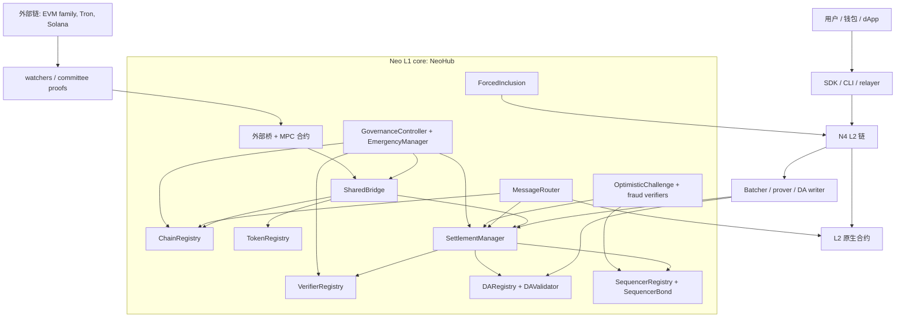
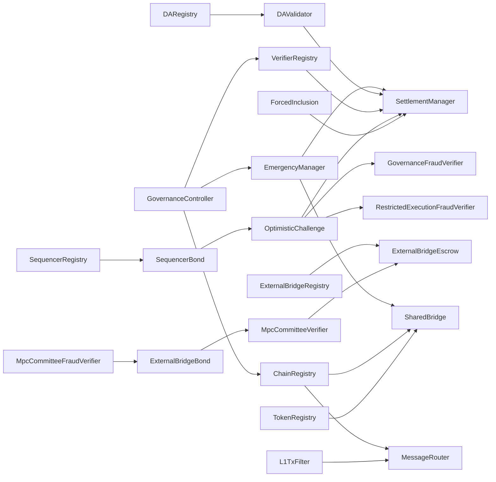
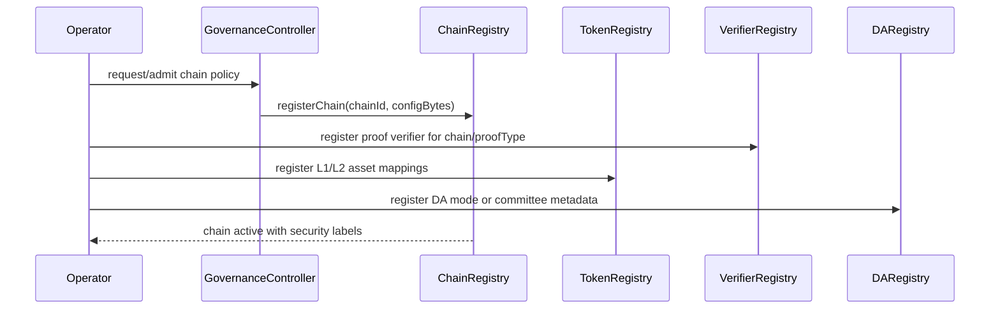
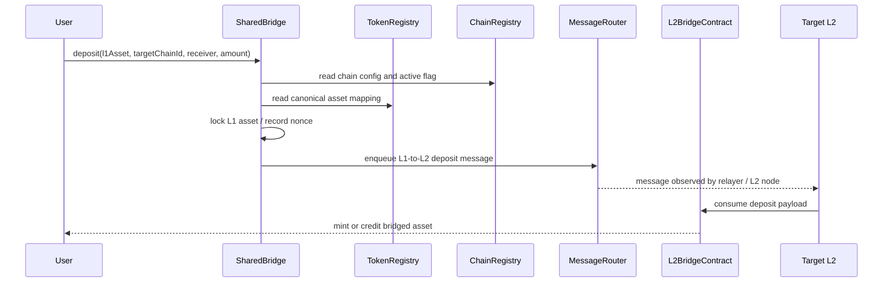
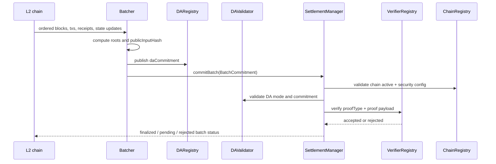
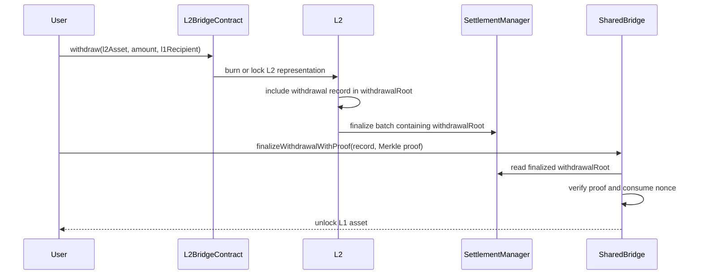
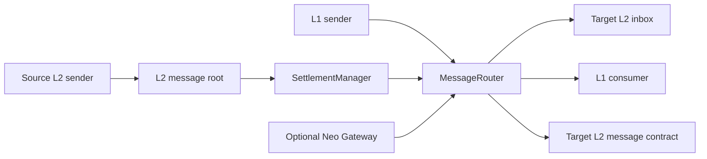
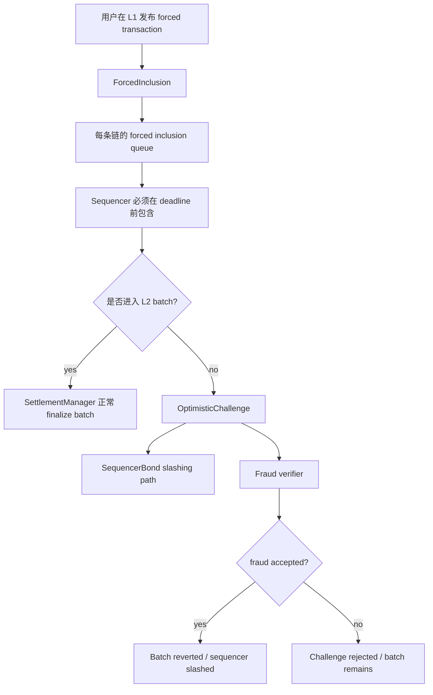
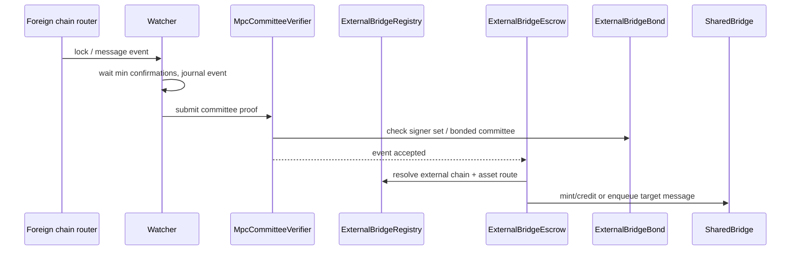
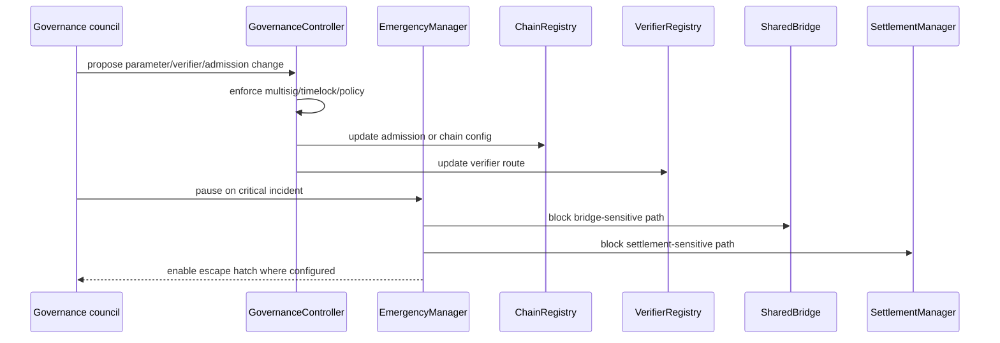

# NeoHub 架构与工作流

NeoHub 是 Neo Elastic Network 的 L1 锚定层。它负责让一条 L2 链在 L1 上
成为可验证的系统成员：链注册、资产托管、批次结算、提款证明、消息路由、
排序者保证金、治理和紧急控制都在这里收敛。

本文说明 NeoHub 作为一个系统如何工作，数据如何流动，以及每一个 NeoHub
合约在主要流程中承担什么职责。

## 1. 生产边界

本仓库中的 `contracts/NeoHub.*` 项目是参考实现、parity 来源和部署演练夹具。
生产目标是在 `r3e-network/neo` fork 中由 L1 core 原生承载：

- `r3e/neo-n3-core`：L1 core 分支，基于 upstream `master-n3`。NeoHub L1
  原生合约放在这里。
- `r3e/neo-n4-core`：L2 执行内核分支，基于 upstream `master`。L2 原生合约
  和 NeoVM2/RISC-V 执行 profile 放在这里。

当前状态：

- `neo-n4` 中有 23 个 `contracts/NeoHub.*` 项目。
- 其中 22 个是生产 NeoHub 合约；`ExternalBridgeStubVerifier` 只用于测试。
- 17 个 NeoHub 合约已经在 `r3e/neo-n3-core` 中有 native counterpart。
- 外部桥和 MPC 相关合约仍需迁移，迁移完成前不能声称 NeoHub 已完全 L1-native。

## 2. 系统视图

核心原则是：NeoHub 拥有 L1 真相，但不执行 L2 交易。L2 执行交易并产出各种
root；NeoHub 负责检查这些 root、证明模式、链注册状态、桥状态和安全策略，
然后决定是否把这些 root 作为 L1 上的最终状态。

## 3. 合约平面

| 平面 | 合约 | 负责什么 |
| --- | --- | --- |
| 链身份 | `ChainRegistry` | L2 准入、链配置、active/paused 状态、gateway flag、DA 和安全标签。 |
| 资产注册 | `TokenRegistry` | L1 资产与 L2 表示之间的 canonical 映射和 token metadata。 |
| 桥托管 | `SharedBridge` | L1 托管、deposit message、withdrawal finalization、withdrawal proof 校验。 |
| 结算 | `SettlementManager`, `VerifierRegistry` | 批次 commitment 校验、proof dispatch、root finalization、batch status。 |
| 数据可用性 | `DARegistry`, `DAValidator` | DA commitment、DA mode 校验、committee/DAC attestation。 |
| 消息 | `MessageRouter`, `L1TxFilter` | L1-to-L2 队列、L2-to-L1 消费、global root、可选 enqueue filter。 |
| 排序者安全 | `SequencerRegistry`, `SequencerBond` | active sequencer、保证金、slashing、exit window。 |
| 抗审查 | `ForcedInclusion` | L1 上发布的 forced transaction 和 inclusion deadline。 |
| 挑战/欺诈 | `OptimisticChallenge`, `GovernanceFraudVerifier`, `RestrictedExecutionFraudVerifier` | fraud acceptance、challenge window、restricted re-execution proof 校验。 |
| 治理/安全 | `GovernanceController`, `EmergencyManager` | 准入策略、升级控制、pause/resume、escape hatch。 |
| 外部桥 | `MpcCommitteeVerifier`, `MpcCommitteeFraudVerifier`, `ExternalBridgeRegistry`, `ExternalBridgeEscrow`, `ExternalBridgeBond`, `ExternalBridgeStubVerifier` | 外部链事件校验、committee bonding、外部托管。Stub verifier 只用于测试。 |

## 4. 核心数据对象

| 对象 | 生产者 | 消费者 | 为什么重要 |
| --- | --- | --- | --- |
| `L2ChainConfig` | operator / governance | `ChainRegistry`, SDK, explorer | 定义 chain id、operator、verifier、bridge/message adapter、安全等级、DA mode、gateway mode、exit model、active flag。 |
| `BatchCommitment` | L2 batcher | `SettlementManager`, verifier, auditor | L2 状态转换的 canonical 摘要：pre/post roots、tx root、receipt root、withdrawal root、message roots、DA commitment、public input hash、proof。 |
| `DA commitment` | DA writer / batcher | `DARegistry`, `DAValidator`, auditor | 说明 batch data 在哪里可用，以及使用哪一种 DA 信任模型。 |
| `Proof payload` | prover / committee / challenger | `VerifierRegistry`, fraud verifier | 说明批次在配置的 proof mode 下应被接受还是拒绝。 |
| `Deposit payload` | `SharedBridge` | L2 bridge native contract | 把 L1 托管事件带入目标 L2 的 mint/credit 路径。 |
| `Withdrawal record` | L2 bridge native contract | `SharedBridge` | 被包含在 batch 的 withdrawal root 中；用户用 inclusion proof 解锁 L1 托管资产。 |
| `Cross-chain message` | L1、L2 或外部 watcher | `MessageRouter`, L2 message contract, external bridge | 带 source/target chain id 和 nonce 的防重放消息 envelope。 |
| `Fraud proof payload` | challenger | `OptimisticChallenge`, fraud verifier | 证明某个 finalized 或 pending batch 在选定 fraud verifier 下无效。 |

## 5. 合约依赖图

这张图描述的是控制/数据依赖，不是严格调用顺序。实际运行顺序见下面的流程。

## 6. L2 注册工作流

注册是第一个关键边界。一条链在安全接收 deposit、finalize batch、消费 message
之前，至少需要：

1. `ChainRegistry` 中有非零且 active 的 config。
2. `VerifierRegistry` 知道该链 proof mode 对应哪个 verifier。
3. `TokenRegistry` 已经映射桥需要移动的资产。
4. `DARegistry` 和 `DAValidator` 可以评估该链的 DA mode。
5. 治理和紧急控制路径有明确 owner 或 council。

## 7. Deposit 数据流

Deposit 不变量：

- 资产托管保留在 L1 的 `SharedBridge`。
- chain id 和 nonce 是 message hash 的一部分，deposit 不能在另一条 L2 上重放。
- `TokenRegistry` 控制资产是否 canonical、是否 active、以及目标 L2 表示。
- `L1TxFilter` 可以限制某条链接受哪些 L1-to-L2 message。

## 8. 批次结算数据流

结算是最重要的信任边界。`SettlementManager` 不重新执行 L2 batch；它强制检查
该 batch 来自已注册链，使用配置中的 DA/proof mode，并且证明路径被 NeoHub 接受。
一旦被接受，post-state root、withdrawal root 和 message roots 就成为 L1 上的真相。

## 9. Withdrawal 数据流

Withdrawal 不变量：

- withdrawal 只能基于 finalized `withdrawalRoot`。
- proof 必须包含 chain id、batch number、recipient、asset、amount、nonce。
- `SharedBridge` 必须保证同一个 withdrawal 只能消费一次。
- 如果 batch 被 challenge 并 revert，该 withdrawal root 不能再接受新 claim。

## 10. 消息路由数据流

`MessageRouter` 是 canonical message index。它负责：

- L1-to-L2 enqueue：L1 合约或用户向目标 L2 发送 message。
- L2-to-L1 consume：用户证明某条 message 已包含在 finalized L2 root 中。
- L2-to-L2 route：根据链配置，source L2 message root 可以通过 Gateway 聚合，
  也可以直接证明。
- 防重放：source chain、target chain、nonce、message type、sender、receiver、
  payload 都参与 canonical hash。

## 11. Forced inclusion 与 challenge 工作流

安全栈是分层的：

- `ForcedInclusion` 在排序者审查交易时给用户一条 L1 escape route。
- `SequencerRegistry` 确定某条链有哪些 active sequencer。
- `SequencerBond` 持有可 slash 的价值并控制 exit window。
- `OptimisticChallenge` 协调针对 batch 的 challenge。
- `GovernanceFraudVerifier` 校验治理仲裁使用的 v1/v2 structural fraud payload。
- `RestrictedExecutionFraudVerifier` 校验 v3 storage-proof fraud payload，可以通过
  重新推导 pre/post roots 来接受无治理仲裁的受限重执行证明。

## 12. 外部桥数据流

外部桥平面故意与普通 L2 settlement 分离：外部链不产生 Neo L2 batch。Watcher
观察外部链事件，committee proof 验证事件，NeoHub 再把已接受事件路由到与 Neo L2
相同的资产和消息模型中。

## 13. 治理与紧急流程

紧急路径应当保持狭窄：它应该停止不安全的状态转换或桥操作，而不是静默改写历史。
恢复动作应通过事件和 operator runbook 保持可见。

## 14. 单合约参考

| 合约 | 主要职责 | 关键输入 | 关键输出/事件 | 常见调用者 |
| --- | --- | --- | --- | --- |
| `ChainRegistry` | 存储 canonical L2 chain config 和 active 状态。 | `chainId`, `configBytes`, governance owner。 | Chain registered/paused/resumed；安全标签可查询。 | Governance、operator tooling、settlement/bridge/message 读取方。 |
| `TokenRegistry` | 存储 L1 资产与 L2 表示之间的 canonical 映射。 | L1 asset、L2 chain id、L2 asset、asset type、mode、active flag。 | Mapping registered/updated；bridge 可解析资产路由。 | Governance/operator、`SharedBridge`。 |
| `DARegistry` | 按 chain/batch 记录 DA commitment。 | `chainId`, `batchNumber`, `daCommitment`, DA mode。 | Commitment recorded；结算和审计可查询。 | Batcher/DA writer、`SettlementManager`。 |
| `DAValidator` | 校验不同 DA mode 下的 attestation 和 commitment 形状。 | DA committee metadata、commitment、batch context。 | DA accepted/rejected。 | `SettlementManager`、operator setup。 |
| `L1TxFilter` | 为 L1-to-L2 enqueue 提供可选策略 hook。 | Sender、receiver、message type、payload、chain config。 | Accepted/rejected enqueue decision。 | `MessageRouter`。 |
| `VerifierRegistry` | 把 proof type 映射到 verifier 合约或 native verifier 路径。 | `proofType`、verifier hash、governance owner。 | Verifier registered/updated；proof dispatch result。 | `SettlementManager`、governance。 |
| `SettlementManager` | 校验并 finalize L2 batch commitment。 | `BatchCommitment`、DA commitment、proof payload、chain config。 | Batch committed/finalized/reverted；root 被存储用于桥和消息证明。 | Batcher、Gateway、challenge system。 |
| `SharedBridge` | 托管 L1 资产并 finalize withdrawal。 | Deposit、withdrawal record、Merkle proof、asset mapping。 | Deposit enqueued；withdrawal finalized；proof consumed marker。 | 用户、relayer、L2 bridge adapter。 |
| `MessageRouter` | 路由防重放的 L1/L2 message。 | Message envelope、source/target chain id、nonce、root/proof。 | L1-to-L2 enqueued；L2-to-L1 consumed；global root published。 | 用户、L2 node、relayer、settlement/gateway。 |
| `EmergencyManager` | pause/resume 关键 NeoHub 操作，并暴露 escape hatch 控制。 | Council/owner witness、pause scope、settlement/bridge reference。 | Paused/resumed/escape hatch events。 | Security council、governance。 |
| `GovernanceController` | 控制准入、verifier upgrade、协议参数和 bridge/governance wiring。 | Governance proposal、owner/council witness、target config。 | Parameter changed、verifier route changed、chain admission changed。 | Governance council、operator tooling。 |
| `SequencerBond` | 持有可 slash 的排序者保证金并处理 slashing/withdrawal window。 | Chain id、sequencer、amount、slasher、exit request。 | Bond deposited/slashed/withdrawn；active balance。 | Sequencer、`OptimisticChallenge`、governance。 |
| `SequencerRegistry` | 跟踪每条链 active sequencer 和 committee membership。 | Chain id、sequencer account、metadata、activation/exit action。 | Sequencer registered/removed/exit-started。 | Governance/operator、settlement/challenge 读取方。 |
| `ForcedInclusion` | 存储用户发布的 forced transaction 和 inclusion deadline。 | Chain id、sender、transaction bytes、deadline policy。 | Forced transaction queued/consumed/expired。 | 用户、L2 sequencer、challenge tooling。 |
| `OptimisticChallenge` | 对 disputed batch 运行 optimistic fraud challenge。 | Chain id、batch number、challenger、fraud payload、verifier。 | Challenge opened/accepted/rejected；batch status updated。 | Challenger、settlement、sequencer bond。 |
| `GovernanceFraudVerifier` | 校验治理仲裁路径使用的 v1/v2 structural fraud payload。 | Versioned fraud payload、claimed/replayed roots、optional witness。 | FraudProofAccepted 或带 reason code 的 FraudProofRejected。 | `OptimisticChallenge`、governance challenge path。 |
| `RestrictedExecutionFraudVerifier` | 通过 storage proof 重新推导 pre/post roots 来校验 v3 fraud payload。 | V3 payload、storage proofs、claimed/replayed roots、disputed tx witness。 | FraudProofAccepted 或精确 reason code。 | `OptimisticChallenge`、trustless restricted re-execution path。 |
| `MpcCommitteeVerifier` | 校验外部链 committee signatures 和 threshold。 | External event hash、committee signatures、signer metadata。 | External event accepted/rejected。 | Watcher、`ExternalBridgeEscrow`。 |
| `MpcCommitteeFraudVerifier` | challenge 或 slash 错误的外部 committee attestation。 | 针对 committee-signed external event 的 fraud proof。 | Fraud accepted/rejected；slashing path enabled。 | Challenger、`ExternalBridgeBond`。 |
| `ExternalBridgeRegistry` | 注册外部链、资产路由和 bridge adapter。 | External chain id、foreign asset/router、Neo asset/chain route。 | External route registered/updated。 | Operator/governance、`ExternalBridgeEscrow`。 |
| `ExternalBridgeEscrow` | 为外部链桥事件托管或释放资产。 | Verified external event、route、recipient、amount。 | External deposit/withdrawal/message consumed。 | Watcher、external bridge relayer、`SharedBridge`。 |
| `ExternalBridgeBond` | 对外部桥 committee member 进行 bonding 和 slashing。 | Committee member、bond amount、fraud/slash request。 | Bond deposited/slashed/withdrawn。 | Committee member、fraud verifier、governance。 |
| `ExternalBridgeStubVerifier` | 本地脚手架和负向测试使用的 test-only verifier。 | Stub event/proof data。 | Deterministic test result。 | 仅单元/集成测试使用；不进入生产部署 bundle。 |

## 15. 审计 NeoHub 的阅读顺序

审计或修改 NeoHub 时，建议按这个顺序阅读：

1. 先读 `ChainRegistry`，因为所有流程都由 `chainId` 和安全标签限定。
2. 再读 `SettlementManager` 和 `VerifierRegistry`，因为它们定义哪些 root 会被
   L1 接受为真相。
3. 再读 `SharedBridge` 和 `MessageRouter`，因为它们消费 finalized roots，并暴露
   用户可见的桥和消息接口。
4. 再读 `DARegistry` 和 `DAValidator`，因为 DA 假设错误会削弱结算安全。
5. 再读 `SequencerRegistry`、`SequencerBond`、`ForcedInclusion` 和
   `OptimisticChallenge`，因为它们决定抗审查和 fraud recovery。
6. 再读 `GovernanceController` 和 `EmergencyManager`，因为 upgrade 和 pause 权限会
   改变正常 liveness 假设。
7. 最后读外部桥合约，因为它们引入了另一套信任域：外部链 finality 加 committee
   attestation。

字节级 layout 见
[`architecture-wire-formats.md`](../architecture-wire-formats.md)。信任假设见
[`architecture-trust-boundaries.md`](../architecture-trust-boundaries.md)。native
迁移状态见 [`core-fork-policy.md`](../core-fork-policy.md)。
