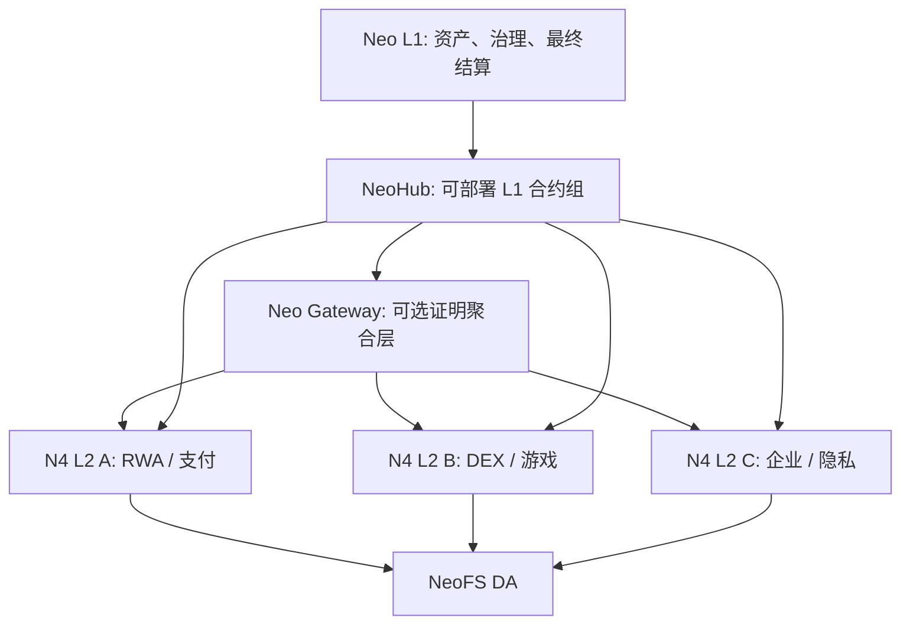

# 第 1 章：系统模型

本章解释 Neo N4 的基本对象和责任边界。理解这些边界后，后续的代码、合约和流程图会更容易读。

## 1.1 Neo N4 解决什么问题

Neo N4 的目标不是把 Neo L1 复制成另一条链，而是在 Neo Stack 上形成一个多 L2 网络：



核心思想是：

> 多条 L2 可以有不同应用场景和执行 profile，但资产根、状态证明、跨链消息、治理入口和安全标签必须统一。

## 1.2 五个系统平面

| 平面 | 主要组件 | 责任 |
| --- | --- | --- |
| L1 锚定平面 | NeoHub 可部署合约 | 链注册、资产托管、批次结算、证明路由、消息路由、治理和紧急控制 |
| L2 执行平面 | `external/neo` L2 core、L2 native contracts、executor | 执行交易、生成状态根、处理 L2 内置资产和消息 |
| DA 平面 | NeoFS DA writer / DARegistry / DAValidator | 保证批次数据可恢复，并把 DA commitment 纳入结算 |
| 证明平面 | attestation、optimistic、RISC-V/SP1、Gateway | 证明批次状态转移可接受 |
| 运维与应用平面 | CLI、SDK、watcher、devnet、Experience Hub | 启动、部署、观察、验证、对接应用 |

## 1.3 L1 与 L2 的分工

L1 不执行 L2 交易；L2 不拥有最终资产根。两者通过 commitment 和 proof 连接。

| 问题 | L1 负责 | L2 负责 |
| --- | --- | --- |
| 资产真实性 | 托管 L1 资产，记录 canonical mapping | 铸造/销毁 L2 表示，执行转账 |
| 状态正确性 | 记录最终 state root，检查 proof mode | 执行交易，生成 pre/post state roots |
| 数据可用性 | 检查 DA mode 与 DA commitment | 发布批次数据到 NeoFS 或配置的 DA 层 |
| 消息顺序 | 记录 L1/L2 消息根和消费状态 | 生产、消费、应用消息 |
| 故障处理 | pause、challenge、escape hatch | 停止出块、重放批次、恢复节点 |

## 1.4 为什么 NeoHub 是可部署合约

NeoHub 当前被设计为 L1 可部署合约组，而不是 L1 native contract set。原因是：

| 原因 | 解释 |
| --- | --- |
| 降低 L1 core 修改面 | L1 core 应尽量贴近 upstream `master-n3`，只在普通合约/插件无法解决时添加最小 hook。 |
| 便于升级和审计 | 可部署合约可以通过治理和部署计划逐项升级，不需要每次修改 L1 core。 |
| 适配多证明系统 | `ContractZkVerifier` 可以把 proof-system 验证委派给治理注册的可部署 verifier contract。 |
| 便于 testnet 演练 | `tools/Neo.Hub.Deploy` 可以生成、验证和执行结构化部署计划。 |

对应实现：

- L1 NeoHub 合约：`contracts/NeoHub.*`
- 部署工具：`tools/Neo.Hub.Deploy`
- 部署计划测试：`tests/Neo.Hub.Deploy.UnitTests`
- L1 core policy：[`../core-fork-policy.md`](../core-fork-policy.md)

## 1.5 L2 原生合约在哪里

“该是原生合约的就作为原生合约”这条规则用于 L2 内核，不用于 NeoHub L1 业务合约。当前 L2 native contracts 位于：

```text
external/neo/src/Neo/SmartContract/Native/L2NativeContracts.cs
```

当前 L2 native contract 集合包括：

| 合约 | 责任 |
| --- | --- |
| `L2SystemConfigContract` | L2 链级配置缓存 |
| `L2BatchInfoContract` | 当前批次、区块、L1 锚定信息 |
| `L2MessageContract` | L1/L2/L2 消息收发 |
| `L2BridgeContract` | L2 侧 deposit credit 与 withdrawal burn |
| `L2FeeContract` | 费用拆分与计量 |
| `L2PaymasterContract` | 费用抽象与赞助 |
| `L2NativeExternalBridgeContract` | 外部链桥接入口 |
| `L2AccountAbstraction` | 账户抽象能力 |
| `BridgedNep17Contract` | L2 bridged NEP-17 资产 |
| `L2InteropVerifier` | L2 互操作验证 |

## 1.6 默认 VM 与可选 VM

Neo N4 的默认 L2 VM 是 NeoVM2/RISC-V。它在文档、测试和实现中应被当作默认执行目标。

额外 VM 生态的正确表达是：

```text
N4 L2 execution profile / executor
```

例如未来可以有：

| Profile | 说明 |
| --- | --- |
| NeoVM2/RISC-V | 默认 profile，基于 PolkaVM-backed RISC-V 路线 |
| EVM profile | 可选 profile，用于引入 EVM 生态语义 |
| WASM profile | 可选 profile，用于通用 wasm 合约执行 |
| Move profile | 可选 profile，用于 Move 生态实验 |

这些 profile 都属于 N4 L2 stack，不应被写成 NeoX。

## 1.7 资产模型

N4 平台资产在 L2 边界做规范化：

| 资产 | L1 decimals | L2 decimals | 规则 |
| --- | ---: | ---: | --- |
| NEO | 0 | 8 | L2 上可小数表示；退出 L1 时必须能整除缩回 L1 整数 NEO |
| GAS | 8 | 8 | L1/L2 精度一致 |
| USDT | 6 | 6 | 平台通用稳定币目录资产 |
| USDC | 6 | 6 | 平台通用稳定币目录资产 |
| BTC | 8 | 8 | 平台通用 BTC 表示 |

这套规则让 L1↔L2 与 L2↔L2 的资产迁移在用户体验上尽量无感，同时避免 L1 NEO 不可分割属性被破坏。

