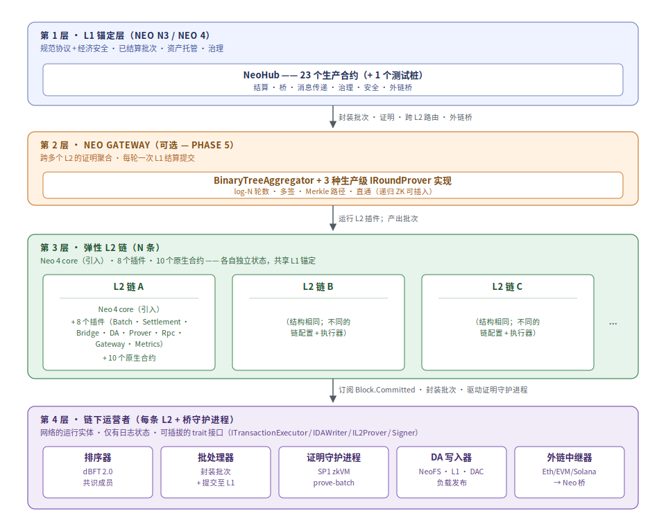
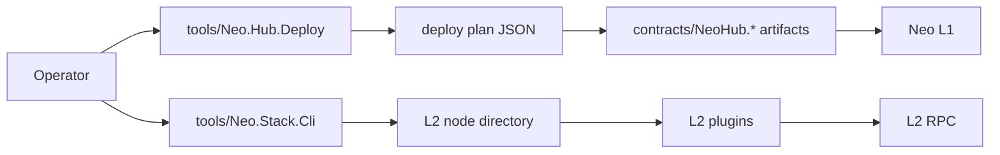

# 第 2 章：总体架构

本章从图和分层开始，解释 Neo N4 的系统形状。

## 2.1 系统上下文

  

Neo N4 的参与者可以分成 7 类：

| 参与者 | 入口 | 作用 |
| --- | --- | --- |
| 用户 | 钱包、SDK、Web Explorer | 发起交易、deposit、withdrawal、查询状态 |
| dApp | SDK、L2 RPC、合约 | 在某条 L2 上运行应用逻辑 |
| L2 节点 | `external/neo` + L2 plugins | 执行交易、维护状态、暴露 RPC |
| Batcher | `Neo.L2.Batch`、L2Batch plugin | 把 L2 blocks 封装成 batch commitment |
| Prover | `Neo.L2.Proving`、Rust zkVM host | 产生证明或证明封装 |
| NeoHub | `contracts/NeoHub.*` | L1 链注册、桥、结算、路由、治理 |
| Watcher | `watchers/*` | 观察外部链事件并生成 committee proof |

## 2.2 三层主结构

  

| 层 | 组成 | 设计目标 |
| --- | --- | --- |
| L1 NeoHub | 23 个生产可部署合约 + 1 个测试 stub | 保持 L1 真相、资产托管、结算和治理 |
| Neo Gateway | 可选聚合层 | 减少多 L2 结算成本、聚合 proofs、加速 L2↔L2 |
| N4 L2 | Neo 4 execution kernel、L2 native contracts、plugins | 执行应用、生成状态、发布 DA、提交证明 |

## 2.3 模块地图

  

| 模块族 | 路径 | 说明 |
| --- | --- | --- |
| L1 合约 | `contracts/NeoHub.*` | NeoHub 可部署合约，生产计划部署 23 个 |
| L2 core fork | `external/neo` | r3e Neo core fork，L2 native contracts 和 execution kernel |
| DevPack | `external/neo-devpack-dotnet` | 合约框架和 `nccs` 编译器 |
| RISC-V VM | `external/neo-riscv-vm` | PolkaVM-backed RISC-V execution support |
| zkVM | `bridge/neo-zkvm-*` | SP1 guest/host，证明执行路径 |
| .NET runtime | `src/Neo.L2.*` | 批次、状态、桥、证明、消息、DA、RPC、SDK |
| Node plugins | `src/Neo.Plugins.L2*` | L2 节点插件面 |
| CLI | `tools/*` | 部署、devnet、explorer、faucet、bridge、stack CLI |
| SDK/UI | `sdk/*` | TypeScript/Rust SDK 和静态 web explorer |
| Watchers | `watchers/*` | ETH/SOL/TRON 外部链观察器 |
| Tests | `tests/*` | 单元、集成、Experience Hub、交互 runtime 测试 |

## 2.4 NeoHub 合约平面

NeoHub 是 L1 锚定层。它不是一个单一大合约，而是一组合约平面：

| 平面 | 合约 | 责任 |
| --- | --- | --- |
| 链身份 | `ChainRegistry` | 注册 L2、记录 active/paused、DA mode、安全等级、gateway flag |
| 资产 | `TokenRegistry`, `SharedBridge` | 资产映射、L1 escrow、deposit、withdrawal finalization |
| 结算 | `SettlementManager`, `VerifierRegistry`, `ContractZkVerifier` | batch commitment、proof dispatch、state root finalization |
| DA | `DARegistry`, `DAValidator` | DA commitment 记录和模式校验 |
| 消息 | `MessageRouter`, `L1TxFilter` | L1→L2、L2→L1、L2→L2 消息 |
| 排序器安全 | `SequencerRegistry`, `SequencerBond` | sequencer 身份、质押、退出、惩罚 |
| 抗审查 | `ForcedInclusion` | L1 强制纳入请求 |
| 挑战 | `OptimisticChallenge`, fraud verifiers | optimistic 模式下的挑战和 fraud verification |
| 治理 | `GovernanceController`, `EmergencyManager` | 升级、暂停、恢复、escape hatch |
| 外部桥 | MPC / ExternalBridge 合约 | EVM/Tron/Solana 等异构链接入 |

## 2.5 批次生命周期

  

核心顺序是：

1. L2 节点执行交易，得到 receipts、messages、withdrawals。
2. Batcher 选择一段 L2 blocks，生成 `L2BatchCommitment`。
3. DA writer 把 batch data 发布到 NeoFS，得到 `DACommitment`。
4. Prover 生成 proof bytes 或 proof envelope。
5. `SettlementManager` 在 L1 检查 chain、DA、proof、state root 连续性。
6. 结算通过后，L1 记录新的 canonical state root。

## 2.6 为什么需要 Gateway

Gateway 是可选层，不是每条 L2 必须使用的层。

| 没有 Gateway | 有 Gateway |
| --- | --- |
| 每条 L2 各自向 L1 提交 proof | 多条 L2 的 proof 先聚合 |
| 简单，延迟低 | L1 成本更低，跨 L2 消息更集中 |
| 适合少量链或高价值链 | 适合大规模 L2 网络 |

当前实现中的 Gateway seam 位于 `src/Neo.Plugins.L2Gateway/`，包括 `BinaryTreeAggregator` 和多种 `IRoundProver`。

## 2.7 部署边界

设计要求是：部署计划必须可读、可审计、可 dry-run、可复核。真实链上部署不能靠手工拼命令完成。

