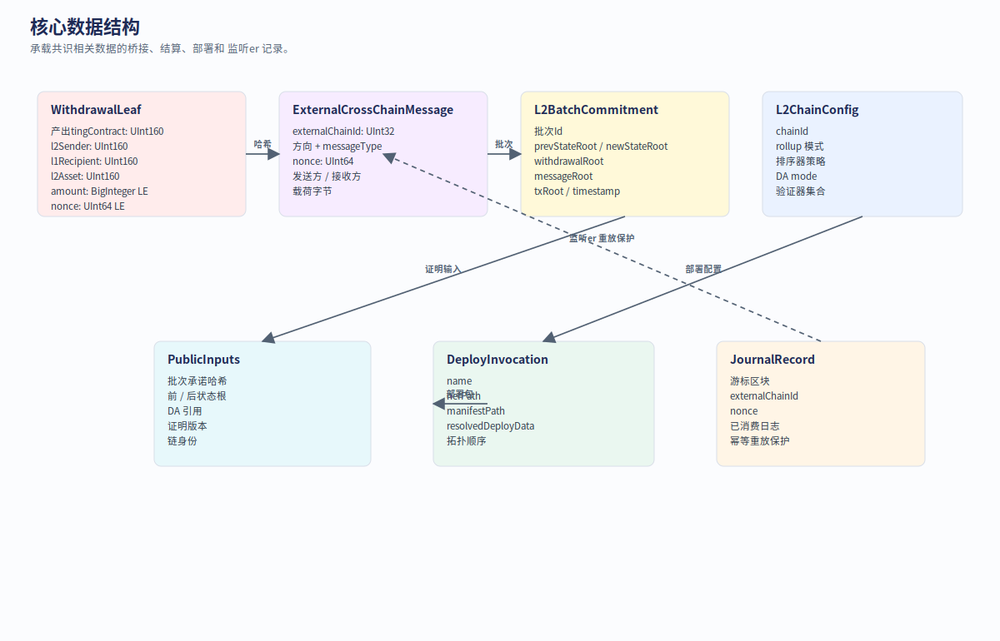
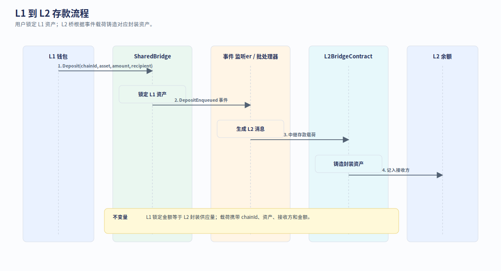
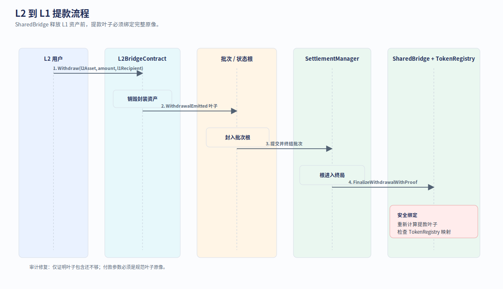

# 第 3 章：协议与数据结构

本章解释 Neo N4 中“必须一致”的数据对象。系统的安全性不来自文档描述，而来自每个边界都使用相同对象、相同编码、相同 hash 和相同验证规则。

## 3.1 数据结构总览

<p align="center">
  
</p>

| 对象 | 生产者 | 消费者 | 作用 |
| --- | --- | --- | --- |
| `L2ChainConfig` | operator / governance | `ChainRegistry`、SDK、explorer | 定义一条 L2 的身份和安全标签 |
| `L2BatchCommitment` | batcher | `SettlementManager`、verifier、auditor | 定义一次状态转换的公开承诺 |
| `DAReceipt` | DA writer | batcher、DA validator | 证明批次数据已发布到 DA |
| `DepositPayload` | `SharedBridge` | L2 bridge native contract | 把 L1 托管事件带入 L2 |
| `WithdrawalRecord` | L2 bridge | `SharedBridge` | 让用户从 L1 取回资产 |
| `CrossChainMessage` | L1/L2/watcher | `MessageRouter`、L2 message contract | 防重放跨链消息 envelope |
| `ProofPayload` | prover | `VerifierRegistry` / verifier | 证明某个 batch 应被接受 |

## 3.2 `L2ChainConfig`

实现位置：

```text
src/Neo.L2.Abstractions/Models/L2ChainConfig.cs
```

简化后结构：

```csharp
public sealed record L2ChainConfig
{
    public required uint ChainId { get; init; }
    public required UInt160 OperatorManager { get; init; }
    public required UInt160 Verifier { get; init; }
    public required UInt160 BridgeAdapter { get; init; }
    public required UInt160 MessageAdapter { get; init; }
    public required SecurityLevel SecurityLevel { get; init; }
    public required DAMode DAMode { get; init; }
    public required bool GatewayEnabled { get; init; }
    public required bool PermissionlessExit { get; init; }
    public required bool Active { get; init; }
    public SequencerModel Sequencer { get; init; }
    public ExitModel Exit { get; init; }
}
```

读法：

- `ChainId` 是全局唯一身份；
- `SecurityLevel` 是用户和桥都能看到的安全标签；
- `DAMode` 说明数据在哪里可用；
- `GatewayEnabled` 说明是否走聚合层；
- `PermissionlessExit` 和 `Exit` 说明最坏情况下用户如何退出。

## 3.3 `L2BatchCommitment`

实现位置：

```text
src/Neo.L2.Abstractions/Models/L2BatchCommitment.cs
```

简化后结构：

```csharp
public sealed record L2BatchCommitment
{
    public required uint ChainId { get; init; }
    public required ulong BatchNumber { get; init; }
    public required ulong FirstBlock { get; init; }
    public required ulong LastBlock { get; init; }
    public required UInt256 PreStateRoot { get; init; }
    public required UInt256 PostStateRoot { get; init; }
    public required UInt256 TxRoot { get; init; }
    public required UInt256 ReceiptRoot { get; init; }
    public required UInt256 WithdrawalRoot { get; init; }
    public required UInt256 L2ToL1MessageRoot { get; init; }
    public required UInt256 L2ToL2MessageRoot { get; init; }
    public required UInt256 DACommitment { get; init; }
    public required UInt256 PublicInputHash { get; init; }
    public required ProofType ProofType { get; init; }
    public required ReadOnlyMemory<byte> Proof { get; init; }
}
```

这个对象是 L2 与 L1 的核心协议边界。L1 不需要重放所有交易，但必须能检查：

| 字段 | 约束 |
| --- | --- |
| `ChainId` | 必须对应已注册且 active 的 L2 |
| `BatchNumber` | 必须单调递增 |
| `PreStateRoot` | 必须等于上一批次的 `PostStateRoot` |
| `PostStateRoot` | 被接受后成为新的 canonical root |
| `TxRoot` / `ReceiptRoot` | 证明执行输入和输出 |
| `WithdrawalRoot` | 让提款可以用 inclusion proof finalization |
| `DACommitment` | 绑定 NeoFS 或其他 DA 层数据 |
| `PublicInputHash` | ZK / aggregation proof 的公开输入摘要 |
| `ProofType` / `Proof` | 决定如何验证这次提交 |

## 3.4 Deposit 流程

<p align="center">
  
</p>

步骤：

1. 用户在 L1 调用 `SharedBridge` 并锁定资产。
2. `TokenRegistry` 查找 L1 资产到 L2 表示的映射。
3. `SharedBridge` 产生 deposit payload，并交给 `MessageRouter` 或目标 L2 消费队列。
4. L2 节点读取 deposit payload。
5. `L2BridgeContract` 在 L2 上 mint / credit 对应资产。
6. 后续 batch 把 deposit 消费状态写入 root，最终由 L1 settlement 接受。

## 3.5 Withdrawal 流程

<p align="center">
  
</p>

提款和充值是反方向：

1. 用户在 L2 请求 withdrawal。
2. L2 bridge native contract burn / lock L2 表示资产。
3. withdrawal record 进入 `WithdrawalRoot`。
4. 对应 batch 被 L1 接受后，用户拿 inclusion proof 调用 `SharedBridge`。
5. `SharedBridge` 验证 proof、检查是否已消费，然后释放 L1 escrow。

NEO 的特殊规则是：L2 NEO 有 8 decimals，但退出 L1 时必须能整除 `10^8`，否则会造成 L1 不可分割 NEO 的精度损失。

## 3.6 DA commitment

`IDAWriter` 是 DA 层抽象：

```csharp
public interface IDAWriter
{
    DAMode Mode { get; }

    ValueTask<DAReceipt> PublishAsync(
        DAPublishRequest request,
        CancellationToken cancellationToken = default);

    ValueTask<bool> IsAvailableAsync(
        DAReceipt receipt,
        CancellationToken cancellationToken = default);
}
```

N4 的规范方向是 NeoFS DA。DA 层不证明交易正确，只证明“批次数据可以被重新下载和审计”。正确性由 deterministic executor 和 proof system 负责。

## 3.7 Proof payload

`ProofType` 决定 L1 如何处理 `Proof`：

| ProofType | 用途 |
| --- | --- |
| Attestation / Multisig | 委员会签名证明，适合早期或高信任部署 |
| Optimistic | 先接受，挑战期内允许 fraud proof |
| ZK | `ContractZkVerifier` 路由到注册 verifier |
| Gateway | 先由 Gateway 聚合，再提交 L1 |

Proof 的关键不变量：

```text
verify(publicInputHash, proof, verificationKey) == true
```

如果 proof 只能证明 envelope，却没有真实 verifier 或 verification key，生产环境不能把它当成真正 ZK 安全。

## 3.8 消息 envelope

跨链消息至少需要包含：

| 字段 | 作用 |
| --- | --- |
| source chain | 防止不同来源伪造 |
| target chain | 决定路由目标 |
| nonce | 防重放 |
| sender / receiver | 调用权限和目标合约 |
| payload hash | 绑定实际消息内容 |
| proof / inclusion | 证明消息来自已接受 root |

消息不是“链间 HTTP 调用”。它是被 state root、message root 和消费状态保护的异步协议。

