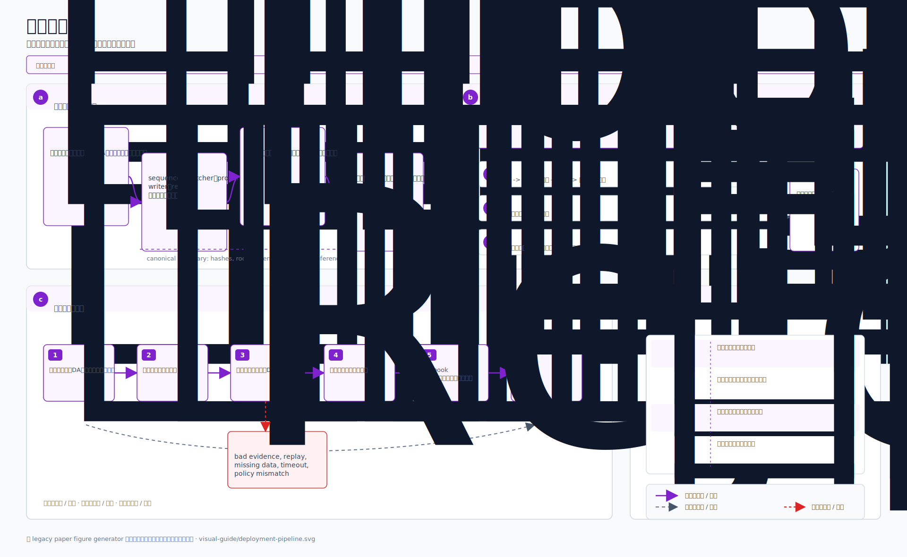
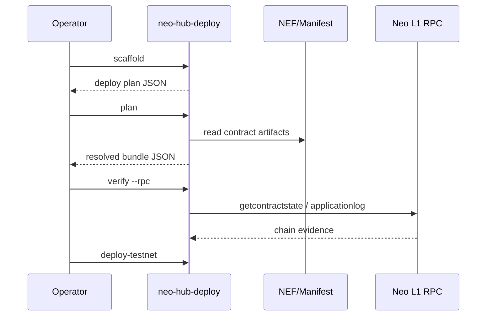

# 第 5 章：运维、部署与运行

本章解释如何把 Neo N4 从代码变成可运行系统。

## 5.1 本地运行的最小路径

最短验证路径：

```powershell
dotnet restore .\Neo.L2.sln /p:NuGetAudit=false --nologo
dotnet build .\Neo.L2.sln -c Release /p:NuGetAudit=false --nologo
dotnet test .\Neo.L2.sln -c Release --no-build /p:NuGetAudit=false --nologo
```

如果只想看一个 L2 devnet：

```powershell
dotnet run --project tools\Neo.L2.Devnet\Neo.L2.Devnet.csproj `
  -c Release -- 3 --config samples\general-rollup.config.json
```

预期看到：

- devnet run complete；
- DA writer 使用 NeoFS-like path；
- audit 输出包含 `da_availability`；
- batch/state root 连续。

## 5.2 私有网络测试

<p align="center">
  
</p>

私有网络测试的目标不是“看起来能启动”，而是覆盖这些问题：

| 问题 | 验证方式 |
| --- | --- |
| 配置是否正确 | `neo-stack validate` / sample configs |
| L2 是否能连续出批次 | `neo-l2-devnet` |
| DA 是否可用 | `DAReceipt` + `IsAvailableAsync` |
| 状态根是否连续 | explorer audit / unit tests |
| RISC-V executor 是否可运行 | `--executor riscv` devnet smoke |
| 文档是否可构建 | `mdbook build` |

## 5.3 NeoHub 部署工作流

NeoHub 部署应当走结构化计划：



命令：

```powershell
dotnet run --project tools\Neo.Hub.Deploy -- scaffold --output plan.json
dotnet run --project tools\Neo.Hub.Deploy -- plan --plan plan.json --output bundle.json
dotnet run --project tools\Neo.Hub.Deploy -- verify --plan plan.json --rpc https://testnet1.neo.coz.io:443
```

生产前必须确认：

- 23 个生产 NeoHub 合约存在；
- `ContractZkVerifier` 已部署并路由；
- `VerifierRegistry.getVerifier(ProofType.Zk)` 指向当前 verifier route；
- DARegistry / DAValidator 已接线；
- L1TxFilter 按链接线；
- governance / multisig / emergency owner 不是测试账户。

## 5.4 Testnet 与 mainnet 的区别

| 项目 | Testnet 可接受 | Mainnet 要求 |
| --- | --- | --- |
| WIF | 临时进程环境变量 | HSM/KMS/multisig，不落盘 |
| verifier | 可先部署 safe-by-default router | 真实 verifier + VK + 治理注册 |
| DA | NeoFS-like / NeoFS dev config | 生产 NeoFS 配置、复制策略、审计 |
| governance | 单 operator 演练 | 多签、timelock、变更流程 |
| bridge | 小额演练 | 资金上限、pause、rate limit、监控 |

## 5.5 运行时监控

运行时至少需要监控：

| 指标 | 意义 |
| --- | --- |
| L2 block height | L2 是否继续出块 |
| batch number | batcher 是否继续封批 |
| state root continuity | 状态是否断裂 |
| DA availability | NeoFS 数据是否可取回 |
| prover queue depth | proof 是否积压 |
| settlement latency | L2 root 多久进入 L1 |
| bridge pending deposits | 充值队列是否积压 |
| withdrawal finalization | 提款是否可完成 |
| challenge events | 是否有 fraud/challenge 信号 |

相关文档：

- [`../telemetry.md`](../telemetry.md)
- [`../private-network-testing.md`](../private-network-testing.md)
- [`../launching-an-l2.md`](../launching-an-l2.md)

## 5.6 Experience Hub

Experience Hub 是帮助用户理解和验证系统的静态界面：

```text
docs/experience-hub/index.html
```

它展示：

- NeoHub L1 deployed contracts；
- ContractZkVerifier 和 L1 deployable verifier route；
- NeoVM2/RISC-V L2 execution；
- NeoFS DA；
- Gateway / SharedBridge 同步状态；
- validation evidence；
- report timeline 和 test summary。

它不应该包含签名、部署或秘密控制。

