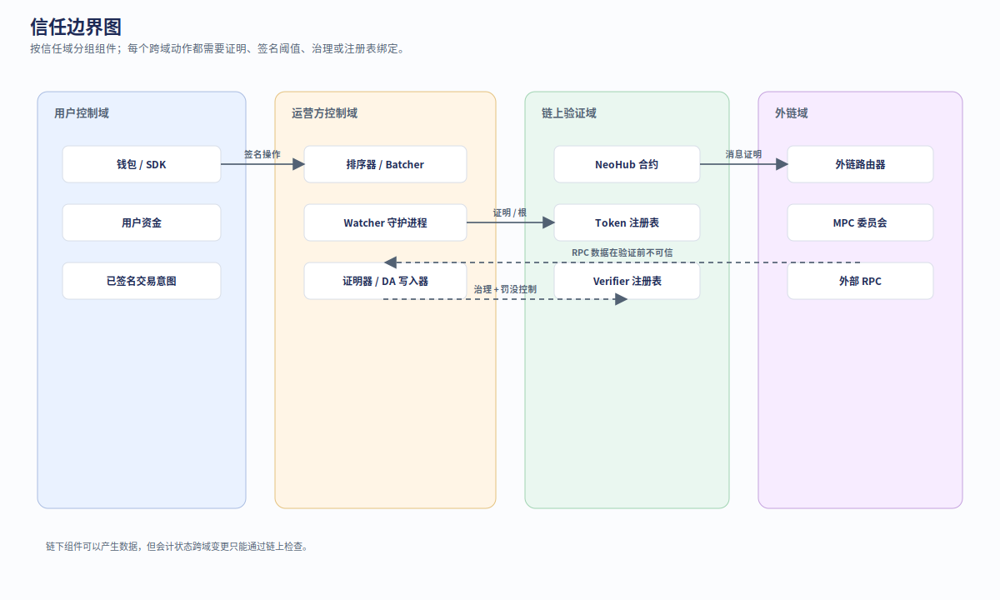
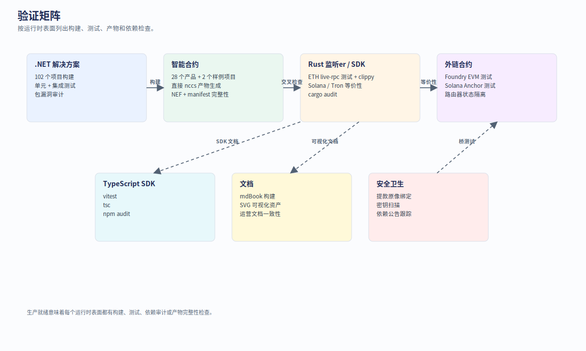

# 第 6 章：安全、测试与审计

Neo N4 的安全来自“边界明确 + 数据可复现 + 测试覆盖 + 生产门槛不伪装”。本章说明如何判断系统是否可信。

## 6.1 信任边界

  

| 边界 | 风险 | 缓解 |
| --- | --- | --- |
| 用户 → L2 RPC | RPC 可能撒谎 | SDK 校验 chain id、查询 L1 root、使用多 RPC |
| L2 executor → batch commitment | 非确定性或恶意 root | `IL2BatchExecutor` 纯函数边界、tests、proof |
| Batcher → DA | 数据不可用 | NeoFS DA receipt、DA validator、availability audit |
| Prover → L1 | proof 伪造或 envelope-only | verifier registry、VK 注册、malformed proof 测试 |
| Bridge → 资产 | 重放或错误 decimals | TokenRegistry、nonce、withdrawal spent 状态、精度检查 |
| Governance → 升级 | 单点权限 | multisig、timelock、emergency policy |
| Watcher → 外部链 | 虚假事件 | committee proof、bond、fraud verifier |

## 6.2 测试矩阵

  

当前测试覆盖的层次：

| 层 | 测试入口 |
| --- | --- |
| 合约 manifest / deploy plan | `tests/Neo.Hub.Deploy.UnitTests` |
| L2 native contracts | `external/neo/tests/Neo.UnitTests` |
| .NET runtime modules | `tests/Neo.L2.*.UnitTests` |
| Node plugins | `tests/Neo.Plugins.L2*.UnitTests` |
| Integration | `tests/Neo.L2.IntegrationTests` |
| Experience Hub | `tests/experience-hub/*.test.mjs` |
| Interactive runtime | `tests/interactive-runtime/*.test.mjs` |
| TypeScript SDK | `sdk/typescript` |
| Rust zkVM / watchers | `bridge/*`, `watchers/*` |

## 6.3 文档一致性测试

`UT_ProductionGapClosure` 不是普通单测，它也是仓库政策测试。它覆盖：

- 英文 Markdown 必须有中文 counterpart；
- 英文图表必须有中文 counterpart；
- 中文 SVG 必须包含中文文本；
- NeoHub 必须保持 deployable contract route；
- 当前文档必须使用 `ContractZkVerifier`；
- 当前 testnet evidence 不能回退到旧 `NativeZkVerifier`；
- `docs/audit` 只保留策展后的 Markdown/JSON evidence，不保留原始命令输出日志。

这类测试的意义是：文档、实现和审计证据必须一起演进。

## 6.4 生产前门槛

可以在本地和 testnet 通过很多测试，但 mainnet 前仍需要生产门槛：

| 门槛 | 必须完成的事 |
| --- | --- |
| 真实 verifier | 部署 proof verifier contracts，注册 verification keys |
| 治理 | 使用多签/timelock/变更记录 |
| DA | NeoFS 生产复制策略和可用性监控 |
| Bridge | 限额、暂停、资金审计、外部 watcher 多方部署 |
| 节点 | dBFT / sequencer 配置、备份、监控 |
| 安全 | 外部审计、密钥管理、incident runbook |

本书不会把这些门槛写成已完成；它们必须通过真实环境证据证明。

## 6.5 安全审计阅读顺序

审计者建议按这个顺序读：

1. [`../security-model.md`](../security-model.md)
2. [`../architecture-trust-boundaries.md`](../architecture-trust-boundaries.md)
3. [`../architecture-wire-formats.md`](../architecture-wire-formats.md)
4. [`../neohub-architecture-and-workflows.md`](../neohub-architecture-and-workflows.md)
5. [`../audit/comprehensive-audit-2026-05-20.md`](../audit/comprehensive-audit-2026-05-20.md)
6. [`../audit/full-stack-validation-2026-05-20/README.md`](../audit/full-stack-validation-2026-05-20/README.md)

## 6.6 常见错误

| 错误 | 为什么危险 |
| --- | --- |
| 把 NeoHub 写成 L1 native contract | 增大 L1 core 修改面，违背 contract-first 边界 |
| 把 EVM profile 写成 NeoX | 混淆项目定位和 Neo Stack/N4 L2 模型 |
| 把 envelope-only proof 当 ZK proof | 没有真实 verifier / VK 时不能提供 ZK 安全 |
| 在文档或日志保存 WIF | 直接泄露资金控制权 |
| 提交原始命令输出日志 | 增加噪声和潜在秘密泄露，降低文档可维护性 |
| 忽略 L1/L2 NEO decimals 差异 | 可能造成不可逆精度损失 |

