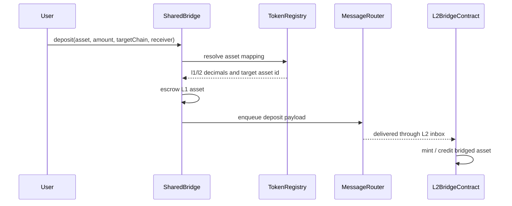

# 第 8 章：NeoHub 逐合约参考

NeoHub 是 N4 的 L1 控制面。读者可以把它理解成“多 L2 网络的内核合约层”：它不执行 L2 交易，但决定哪些 L2 被承认、哪些状态根被接受、哪些资产可以流动、哪些消息可以被消费、哪些紧急动作可以触发。

实现目录：

```text
contracts/NeoHub.*
tools/Neo.Hub.Deploy/
tests/Neo.Hub.Deploy.UnitTests/
```

## 8.1 合约分组

| 分组 | 合约 | 第一职责 |
| --- | --- | --- |
| 链注册 | `ChainRegistry` | 记录 L2 身份、配置和 active/paused 状态 |
| 资产 | `TokenRegistry`, `SharedBridge` | 维护资产映射和 L1 escrow |
| 结算 | `SettlementManager`, `VerifierRegistry`, `ContractZkVerifier` | 接受 batch commitment 和 proof |
| DA | `DARegistry`, `DAValidator` | 记录和验证 DA commitment |
| 消息 | `MessageRouter`, `L1TxFilter` | 处理跨层、跨 L2 消息 |
| 排序器 | `SequencerRegistry`, `SequencerBond` | 维护排序器身份和经济约束 |
| 抗审查 | `ForcedInclusion` | 给用户 L1 强制纳入通道 |
| 挑战 | `OptimisticChallenge`, `GovernanceFraudVerifier`, `RestrictedExecutionFraudVerifier` | optimistic/fraud proof 路径 |
| 治理 | `GovernanceController`, `EmergencyManager` | 升级、暂停、恢复、逃生 |
| 外部桥 | `MpcCommitteeVerifier`, `ExternalBridgeRegistry`, `ExternalBridgeEscrow`, `ExternalBridgeBond`, `MpcCommitteeFraudVerifier`, `ExternalBridgeStubVerifier` | 异构链事件验证和托管 |

## 8.2 `ChainRegistry`

`ChainRegistry` 是每条 L2 的 L1 身份登记处。它回答三个问题：

1. 这条链是否存在？
2. 这条链当前是否 active？
3. 这条链的 verifier、bridge adapter、message adapter、DA mode、安全等级是什么？

典型状态：

```text
chainId -> L2ChainConfig
chainId -> active / paused
chainId -> gateway flag
```

设计不变量：

| 不变量 | 原因 |
| --- | --- |
| `chainId` 不能重复 | 否则消息和资产会被路由到错误链 |
| paused 链不能继续 settlement | 避免故障链继续污染 L1 root |
| config 变更必须受 governance 控制 | 防止 operator 单方面替换 verifier 或 bridge |

## 8.3 `TokenRegistry`

`TokenRegistry` 维护 L1 token 与 L2 表示之间的 canonical mapping。

关键字段：

| 字段 | 说明 |
| --- | --- |
| L1 asset id | L1 上真实资产合约或原生资产 |
| L2 asset id | L2 上 bridged 表示 |
| L1 decimals | L1 原始精度 |
| L2 decimals | L2 显示与计算精度 |
| enabled flag | 是否允许桥接 |

NEO 的规则最容易出错：

```text
L1 NEO decimals = 0
L2 NEO decimals = 8
deposit:  1 L1 NEO -> 100000000 L2 NEO units
withdraw: 100000000 L2 units -> 1 L1 NEO
invalid:  1 L2 unit -> cannot exit to L1 NEO
```

## 8.4 `SharedBridge`

`SharedBridge` 是 L1 资产托管合约。它不是“普通转账工具”，而是资产真实性的根。

Deposit 逻辑：



Withdrawal 逻辑：

```text
L2 burn/lock -> withdrawal record -> WithdrawalRoot -> L1 accepted batch -> inclusion proof -> SharedBridge release
```

## 8.5 `SettlementManager`

`SettlementManager` 是状态根进入 L1 的门。

它必须检查：

| 检查 | 说明 |
| --- | --- |
| chain exists | `ChainRegistry` 中必须有这条链 |
| chain active | 暂停链不能提交 |
| batch number monotonic | 批次号必须连续 |
| state root continuity | `PreStateRoot` 必须等于上一批 `PostStateRoot` |
| DA commitment valid | `DARegistry` / `DAValidator` 必须接受 |
| proof accepted | `VerifierRegistry` 必须接受 proof |
| messages/withdrawals roots recorded | 后续提款和消息消费依赖这些 roots |

## 8.6 `VerifierRegistry`

`VerifierRegistry` 把 proof type 映射到 verifier。

```text
ProofType.Multisig   -> Attestation verifier
ProofType.Optimistic -> Optimistic path
ProofType.Zk         -> ContractZkVerifier
ProofType.Gateway    -> Gateway verifier
```

它的重点不是“自己验证所有证明”，而是做受治理控制的 proof dispatch。

## 8.7 `ContractZkVerifier`

`ContractZkVerifier` 是当前 contract-first 路线的核心。

它做三件事：

1. 管理 proof system 与 verification key；
2. 管理 proof system 到 L1 deployable verifier contract 的映射；
3. 在 `verify` 时把 proof 交给对应 verifier contract。

重要边界：

| 设计 | 说明 |
| --- | --- |
| 它是可部署合约 | 不是 L1 native contract |
| 默认 safe-by-default | 没有注册 verifier/VK 时不应假装 proof 有效 |
| 可升级 proof system | 通过治理注册新的 verifier contract |
| 不硬编码某个 ZK backend | SP1、Groth16、Halo2 等应通过同一 registry 模型接入 |

## 8.8 `DARegistry` 与 `DAValidator`

DA 合约只证明“数据可用性声明被记录并符合配置”，不证明交易执行正确。

典型记录：

```text
chainId
batchNumber
daMode
commitment
size / root / cid / committee attestation
```

NeoFS DA 的生产重点：

- batch bytes 必须可取回；
- CID / root 必须进入 commitment；
- 复制策略必须满足安全等级；
- availability check 失败时不能继续把系统写成健康。

## 8.9 `MessageRouter` 与 `L1TxFilter`

`MessageRouter` 管理异步消息：

| 消息方向 | 说明 |
| --- | --- |
| L1 -> L2 | deposit、forced tx、治理消息 |
| L2 -> L1 | withdrawal、应用消息、状态证明 |
| L2 -> L2 | 通过 L1/Gateway root 路由 |
| 外部链 -> N4 | 由 watcher 和 external bridge proof 进入 |

`L1TxFilter` 是可选过滤层，用于限制某些 L1 入队交易，例如只允许指定方法或指定 sender。

## 8.10 `SequencerRegistry` 与 `SequencerBond`

排序器安全有两个维度：

| 维度 | 合约 |
| --- | --- |
| 谁可以排序 | `SequencerRegistry` |
| 排序器作恶如何惩罚 | `SequencerBond` |

这两个合约并不能单独证明执行正确；它们提供身份和经济约束。正确性仍由 batch proof / challenge / settlement 负责。

## 8.11 `ForcedInclusion`

Forced inclusion 是抗审查机制。普通 L2 sequencer 如果拒绝用户交易，用户可以把交易放到 L1 强制队列。

流程：

```text
user posts forced tx on L1
-> deadline starts
-> batcher must include it
-> if not included, challenge / penalty path opens
```

## 8.12 Challenge 与 fraud verifiers

Optimistic 模式下，系统允许先接受状态，然后在挑战期内用 fraud proof 推翻错误 batch。

| 合约 | 用途 |
| --- | --- |
| `OptimisticChallenge` | 管理挑战窗口和挑战状态 |
| `GovernanceFraudVerifier` | 治理仲裁参考路径 |
| `RestrictedExecutionFraudVerifier` | 更严格的链上可验证 fraud proof 路径 |

## 8.13 Governance 与 Emergency

治理不是附属功能，而是生产系统的安全根。

| 合约 | 能力 |
| --- | --- |
| `GovernanceController` | 注册链、升级 verifier、调整参数 |
| `EmergencyManager` | pause、resume、escape hatch |

生产要求：

- owner 不能是单个热钱包；
- 升级必须有 timelock 或多签审批；
- pause/resume 必须记录事件；
- emergency action 必须有 runbook。

## 8.14 外部桥合约

外部桥合约让 EVM、Tron、Solana 等异构链事件进入 N4。

| 合约 | 说明 |
| --- | --- |
| `MpcCommitteeVerifier` | 验证 watcher committee 签名 |
| `MpcCommitteeFraudVerifier` | 对 committee 作恶提供 fraud path |
| `ExternalBridgeRegistry` | 注册外部链和 router |
| `ExternalBridgeEscrow` | 外部资产托管 |
| `ExternalBridgeBond` | committee / operator 质押 |
| `ExternalBridgeStubVerifier` | 测试用 stub，不能进生产 plan |

## 8.15 部署计划如何保证完整

`ScaffoldPlan.Default()` 定义生产 NeoHub deploy plan。单元测试确保：

- 25 个 `NeoHub.*` 项目存在；
- 24 个生产合约进入 deploy plan；
- test-only stub 不进入生产 plan；
- DAValidator、L1TxFilter、ContractZkVerifier 都在计划中；
- post-deploy wiring 提示不会遗漏关键接线。
