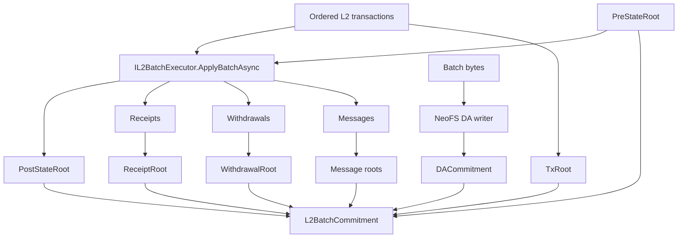

# 第 10 章：批次、状态与执行

L2 的核心工作是把一串交易变成一个可提交、可证明、可重放的状态转换。本章解释这个过程。

## 10.1 批次是什么

批次是 L2 到 L1 的最小结算单位。它不是简单的交易列表，而是一组 root：

```text
Batch = ordered txs
      + receipts
      + withdrawals
      + messages
      + DA commitment
      + pre/post state roots
      + proof
```

## 10.2 执行函数

执行边界由 `IL2BatchExecutor` 定义：

```csharp
public interface IL2BatchExecutor
{
    ValueTask<BatchExecutionResult> ApplyBatchAsync(
        BatchExecutionRequest request,
        CancellationToken cancellationToken = default);
}
```

这个接口要满足四个条件：

| 条件 | 说明 |
| --- | --- |
| 确定性 | 同样输入永远得到同样输出 |
| 完整输入 | 不能隐式读取网络、时间、随机数 |
| 可证明 | proof system 可以重跑或约束这个函数 |
| 可替换 | 不同 execution profile 通过同一输出形态接入 |

## 10.3 Root 链

状态 root 必须连续：

```text
batch N postStateRoot == batch N+1 preStateRoot
```

如果这个条件破坏，L1 必须拒绝后续 batch。否则攻击者可以跳过中间状态，直接提交一个无法追溯的 root。

## 10.4 Merkle roots

批次中通常包含多个 root：

| Root | 绑定内容 |
| --- | --- |
| `TxRoot` | 有序交易列表 |
| `ReceiptRoot` | 每笔交易执行结果 |
| `WithdrawalRoot` | 可在 L1 finalization 的提款记录 |
| `L2ToL1MessageRoot` | 出站到 L1 的消息 |
| `L2ToL2MessageRoot` | 出站到其他 L2 的消息 |
| `DACommitment` | DA 层数据 |
| `PublicInputHash` | proof 公开输入 |

## 10.5 从交易到 commitment



## 10.6 状态存储

生产系统不能只靠内存。当前仓库有：

| 后端 | 用途 |
| --- | --- |
| In-memory store | 单元测试、快速 devnet |
| RocksDB store | 生产默认方向 |

接口位于 `src/Neo.L2.Persistence`。状态 root 相关逻辑位于 `src/Neo.L2.State`。

## 10.7 批次审计

批次审计要检查：

1. batch number 连续；
2. state root 连续；
3. DA commitment 可用；
4. proof type 与 chain config 匹配；
5. withdrawal/message roots 可重算；
6. public input hash 与 proof 输入一致。

这些检查分布在：

```text
src/Neo.L2.Audit
tests/Neo.L2.Audit.UnitTests
tools/Neo.L2.Explore
```

## 10.8 常见实现错误

| 错误 | 后果 |
| --- | --- |
| batch serializer 使用非规范 JSON | 不同节点 hash 不一致 |
| executor 读取本机时间 | proof 无法复现 |
| receipt root 不包含失败交易 | 审计和 replay 不一致 |
| withdrawal root 不绑定 nonce | L1 可能重放提款 |
| DA commitment 不绑定 batch number | 数据替换攻击 |

