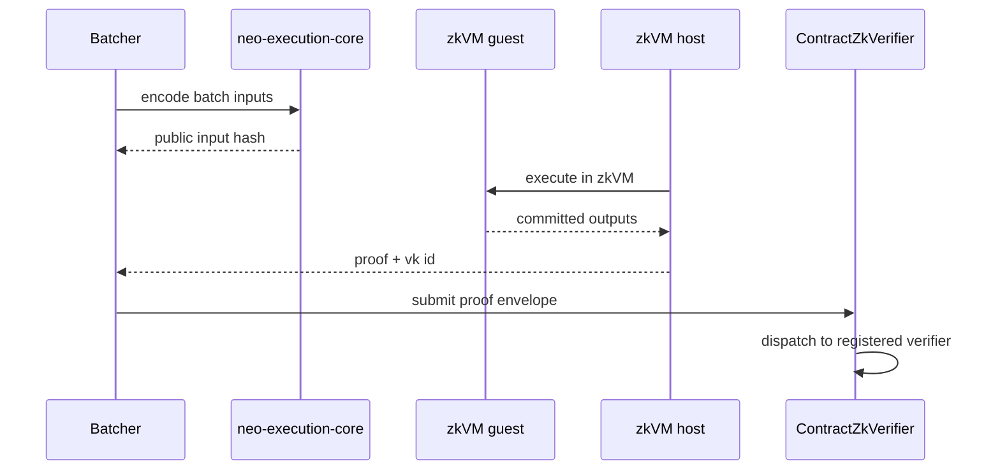

# 第 12 章：证明系统与 zkVM

证明系统回答的问题是：给定 batch commitment，L1 为什么应该相信 `PostStateRoot` 是从 `PreStateRoot` 正确执行得到的？

## 12.1 Proof mode 分层

| Proof mode | 信任模型 | 适用阶段 |
| --- | --- | --- |
| Multisig / Attestation | 信任委员会多数 | 早期部署、联盟链、测试网 |
| Optimistic | 先接受，挑战期内纠错 | 成本敏感场景 |
| ZK | 密码学证明执行正确 | 高安全生产路径 |
| Gateway aggregation | 多 L2 proof 聚合 | 大规模网络 |

## 12.2 `VerifierRegistry`

`VerifierRegistry` 是 proof dispatch 层。它根据 proof type 找到对应 verifier。

重要原则：

```text
SettlementManager 不应该知道每种 proof 的细节。
SettlementManager 只依赖 VerifierRegistry 的统一结果。
```

这样未来新增 proof system 时，不需要重写结算合约。

## 12.3 ContractZkVerifier 路线

当前路线是：

```text
SettlementManager
  -> VerifierRegistry
  -> ContractZkVerifier
  -> deployable proof verifier contract
```

为什么这样设计：

| 设计 | 好处 |
| --- | --- |
| NeoHub 保持可部署合约 | L1 core 修改面小 |
| verifier contract 可替换 | 支持多个 proof system |
| VK 由治理注册 | 防止任意 proof 被接受 |
| safe-by-default | 没有 verifier/VK 时默认拒绝 |

## 12.4 SP1 / RISC-V 路径

Rust 侧目录：

```text
bridge/neo-execution-core
bridge/neo-zkvm-guest
bridge/neo-zkvm-host
```

职责：

| 目录 | 作用 |
| --- | --- |
| `neo-execution-core` | 后端中立的 batch parsing、state folding、receipt root、public input hash |
| `neo-zkvm-guest` | 在 zkVM 中执行的 guest 程序 |
| `neo-zkvm-host` | host 侧生成 proof、验证 proof、运行 daemon |

## 12.5 Public input hash

ZK proof 不能只证明“我运行了某个程序”。它必须绑定公开输入：

```text
publicInputHash = H(
  chainId,
  batchNumber,
  preStateRoot,
  postStateRoot,
  txRoot,
  receiptRoot,
  withdrawalRoot,
  messageRoots,
  daCommitment
)
```

如果 proof 不绑定这些字段，攻击者可能把一个合法 proof 搭配到另一个 batch 上。

## 12.6 证明生成流程



## 12.7 Production checklist

真实 ZK 生产路径必须满足：

- guest source 被固定；
- guest ELF 可复现；
- verification key 被治理注册；
- proof verifier contract 被治理注册；
- malformed proof 会 FAULT / reject；
- public input hash 与 `L2BatchCommitment` 一致；
- proof size 和 verification gas 可接受；
- verifier upgrade 有 timelock / multisig。

## 12.8 与 NeoVM2/RISC-V 的关系

NeoVM2/RISC-V 是默认 L2 执行目标。zkVM 是证明这个执行目标正确性的工具链之一。

不要把二者混为一个概念：

| 名称 | 角色 |
| --- | --- |
| NeoVM2/RISC-V | L2 执行语义 |
| PolkaVM | RISC-V execution host 路线之一 |
| SP1 zkVM | 证明执行的 zkVM backend |
| `ContractZkVerifier` | L1 上 proof route |

## 12.9 常见错误

| 错误 | 后果 |
| --- | --- |
| proof 不绑定 DA commitment | 数据替换后仍可能通过 |
| verifier 没有 VK registry | 任意 proof system 混用 |
| envelope-only 模式进生产 | 没有真实密码学安全 |
| guest 和 host 使用不同编码 | proof 通过但 L1 commitment 不匹配 |

