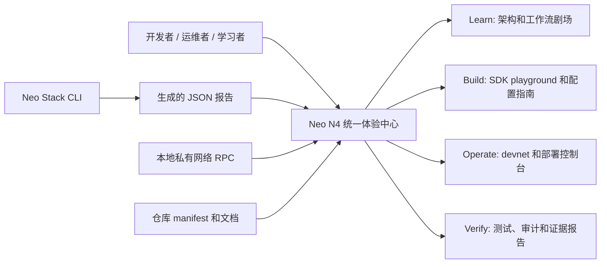
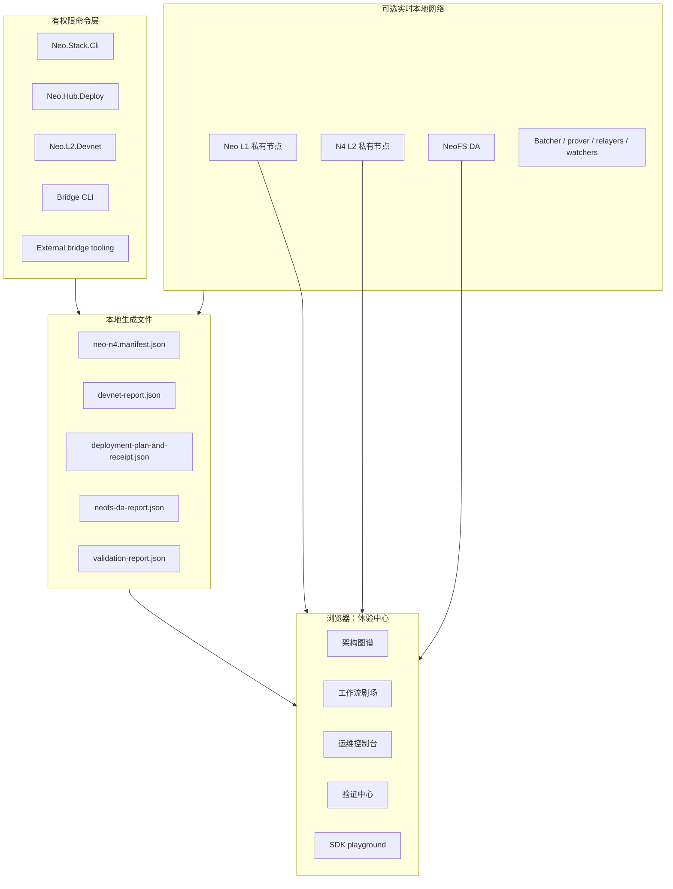
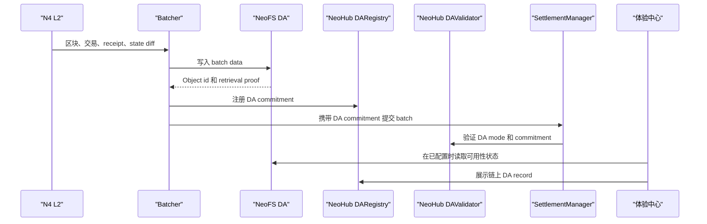
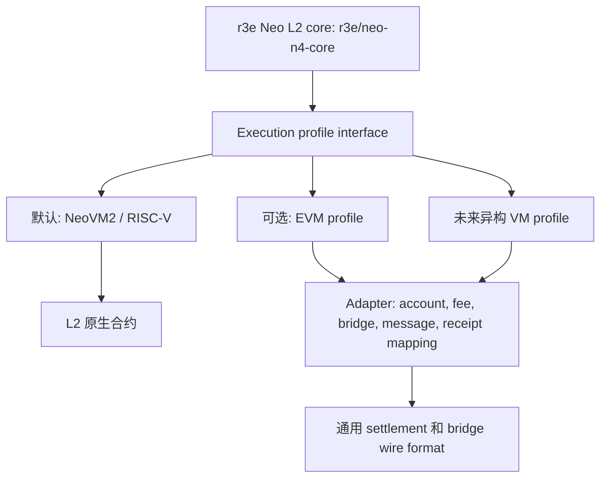
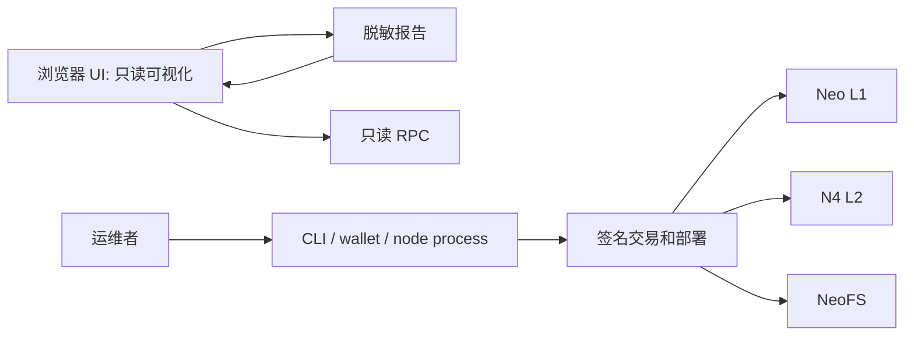

# Neo N4 统一体验中心设计

状态：设计方向已确认，尚未开始实现。

决策日期：2026-05-19。

已确认方向：方案 C，Unified Experience Hub。

优先用户：开发者和运维者优先，同时提供学习者友好的入口层。

英文版本：`docs/superpowers/specs/2026-05-19-neo-n4-unified-experience-hub-design.md`。

## 1. 问题

Neo N4 已经具备主要架构组件：NeoHub 可部署 L1 合约、r3e Neo core fork
中的 L2 原生合约、NeoFS 数据可用性路径、原生加速的 ZK verifier adapter、
桥接工具、devnet 工具、SDK、测试、架构文档，以及静态交互式运行剧场。

问题是，新的开发者或运维者仍然需要从很多文件和命令中拼出整体理解。目标体验应该让
Neo N4 易于理解、运行、验证、审计和讲解，同时不削弱生产架构，也不把有权限的操作放进浏览器。

## 2. 目标

- 提供一个一致的本地优先体验，用于学习、构建、运维和验证 Neo N4。
- 让架构可视化：L1 NeoHub 合约、L1 原生 ZK 加速器、NeoFS DA、Gateway、桥、L2 执行、L2 原生合约，以及可选 VM profile。
- 引导运维者完成私有网络搭建、部署演练、桥接演练、DA 验证、ZK 验证检查和报告生成。
- 为开发者提供 SDK playground，以及 deposit、withdrawal、batch settlement、message routing、external bridge 的精确数据流说明。
- 保持安全边界清晰：浏览器 UI 读取报告和 RPC 状态；CLI、钱包和节点进程执行有权限操作。
- 保持现有架构决定：NeoHub 是可部署 L1 合约包加插件和工具支持，不是 L1 原生合约集合。
- 将 NeoFS 作为 Neo N4 的一等 DA 路径。
- 将 NeoVM2/RISC-V 作为默认的标准 L2 VM。EVM 等额外 VM 是可插拔 N4 L2 execution profile，不是 NeoX。
- 新增的用户可见文档和图表保持中英文一致。

## 3. 非目标

- 不把 NeoHub 做成 L1 原生合约集合。
- 不在浏览器 UI 中保存私钥、助记词、治理凭据或部署签名密钥。
- 不绕过 `tools/Neo.Stack.Cli`、`tools/Neo.Hub.Deploy`、
  `tools/Neo.L2.Devnet`、桥接 CLI 或现有 SDK 边界。
- 不用本地私有网络演练冒充真实公网 testnet 或 mainnet 就绪。
- 不把可选 EVM 支持描述为 NeoX。它属于 Neo Stack / N4 L2 execution-profile 模型。

## 4. 当前锚点

设计必须建立在当前仓库结构上：

| 领域 | 当前锚点 |
| --- | --- |
| 运行学习 | `docs/interactive-runtime/index.html`, `docs/interactive-runtime/simulator.js`, `docs/interactive-runtime.md` |
| 架构文档 | `docs/neohub-architecture-and-workflows.md`, `docs/architecture-l1-vs-l2.md`, `docs/architecture-l2-lifecycle.md`, `docs/architecture-trust-boundaries.md`, `docs/architecture-wire-formats.md` |
| L1 合约边界 | `contracts/NeoHub.*`, `tools/Neo.Hub.Deploy`, `docs/core-fork-policy.md` |
| L2 core 边界 | `external/neo` 固定到 `r3e-network/neo` 的 `r3e/neo-n4-core` 分支 |
| 运维工具 | `tools/Neo.Stack.Cli`, `tools/Neo.L2.Devnet`, `tools/Neo.L2.Explore`, `tools/Neo.L2.Bridge.Cli`, `tools/Neo.External.Bridge.Cli` |
| SDK 和 playground | `sdk/typescript`, `sdk/web-explorer` |
| 文档本地化 | `docs/zh` 镜像英文文档 |

## 5. 产品形态

统一体验中心是一个由仓库工具启动或喂数据的本地优先 Web 应用。它应该有四个顶层工作区：

1. Learn
2. Build
3. Operate
4. Verify

第一版实现应支持静态打开，不依赖云服务。存在实时状态时，它可以连接本地 devnet RPC
并读取生成的报告文件。不存在实时状态时，它仍然可以基于内置 manifest 和确定性示例解释架构。



## 6. 信息架构

### 6.1 Learn

Learn 在要求用户运行命令之前先解释系统。

必需视图：

- 架构地图：L1、L2、NeoFS DA、Bridge、Gateway、原生 ZK 加速器、SDK、watcher、可选 VM profile。
- 工作流剧场：deposit、batch settlement、DA 发布、ZK proof、withdrawal、L2-to-L2 messaging、external-chain bridge、challenge and recovery。
- 合约浏览器：每个 NeoHub 合约的角色、调用方、存储、事件和关联工作流步骤。
- 术语浮层：chain id、batch root、withdrawal root、DA commitment、proof type、sequencer、forced inclusion、gateway 等定义。
- 中英文切换或镜像路由。

### 6.2 Build

Build 面向集成 Neo N4 的开发者。

必需视图：

- SDK playground：chain discovery、asset mapping、deposit、withdrawal、message envelope、report parsing。
- 平台资产地图：带 decimal 的 L2 NEO/GAS，以及 USDT、USDC、BTC 等常见平台资产。
- VM profile 地图：默认展示 NeoVM2/RISC-V；EVM 等可选执行层作为可插拔 N4 L2 profile 展示。
- 配置验证器：`chain.config.json`、verifier route、DA mode、bridge route、asset mapping、security label。

### 6.3 Operate

Operate 面向私有网络运行和部署演练。

必需视图：

- 私有网络仪表盘：L1 node、L2 node、NeoFS DA service、batcher、prover、bridge relayer、watcher、faucet 状态。
- 部署向导：plan、compile、deploy、wire、verify、export report。
- NeoFS DA 控制台：DA object id、namespace/bucket、commitment、availability status、retention policy、validation result。
- 桥接演练控制台：deposit、inclusion、settlement、withdrawal、replay protection、failure drill。
- 事故控制视图：pause state、forced inclusion queue、challenge status、emergency runbook 链接。

### 6.4 Verify

Verify 用于生产完备证据。

必需视图：

- 单元测试、集成测试、冒烟测试、合约编译、SDK、前端测试结果。
- 私有网络部署演练报告。
- 安全清单和威胁模型证据。
- ZK verifier 路径证据：`NativeZkVerifier` envelope 检查，以及 L1 原生加速器 dispatch 状态。
- 文档一致性检查：中英文文档一致性和图表覆盖。
- CI 就绪面板，明确区分本地证据和真实 GitHub Actions 结果。

## 7. 运行架构

UI 应该是基于生成状态的只读控制面。有权限状态变更仍然留在 CLI、钱包、节点进程和合约中。



## 8. 数据契约

体验中心应消费稳定的 JSON 报告 schema。这些 schema 应该有版本、脱敏，并被测试覆盖。

| 报告 | 生产者 | 消费者 | 用途 |
| --- | --- | --- | --- |
| `neo-n4.manifest.json` | 仓库工具 | Hub, docs tests | 列出模块、合约、工具、文档、图表、工作流和源码链接。 |
| `chain-config-report.json` | `Neo.Stack.Cli validate` | Build, Verify | 规范化 chain config、security label、DA mode、verifier route、gateway mode、asset mapping。 |
| `deployment-plan.json` | `Neo.Hub.Deploy plan` | Operate, Verify | 将部署什么、预期合约 hash、接线动作、所需 witness。 |
| `deployment-receipt.json` | `Neo.Hub.Deploy verify` | Operate, Verify | 已部署内容、hash、网络、区块高度、部署后检查。 |
| `devnet-report.json` | `Neo.L2.Devnet` | Operate, Verify | 节点状态、RPC endpoint、服务健康、冒烟测试证据。 |
| `neofs-da-report.json` | DA 工具或 devnet | Learn, Operate, Verify | DA object id、commitment、读取检查、retention policy、validation result。 |
| `bridge-drill-report.json` | bridge CLI | Operate, Verify | deposit、inclusion、settlement、withdrawal、failure、replay-protection 证据。 |
| `validation-report.json` | test harness | Verify | build、unit、integration、SDK、frontend、security、localization、docs consistency 结果。 |

报告要求：

- 包含 `schemaVersion`、`repoCommit`、`generatedAt`、`tool`、`network`、`redaction` 字段。
- 永不包含私钥、助记词、原始签名材料或长期凭据。
- 保留精确 hash、block height、contract hash、chain id、asset id、proof id、DA commitment、transaction id。
- 提供足够失败细节用于调试，同时不泄漏秘密。

## 9. NeoFS DA 位置

NeoFS 必须作为默认 DA 叙事可见，而不是脚注。



UI 必须展示：

- 该链配置了哪种 DA mode。
- NeoFS 写入和读取检查是否通过。
- batch commitment 中包含的 DA commitment。
- DA registry record 和 validation result。
- DA 不可用、过期或仅委员会证明时的风险。

## 10. VM Profile 模型

标准 L2 执行 profile 是 NeoVM2/RISC-V。体验中心不会替换它，而是让 VM 模型可理解、可扩展。



规则：

- 默认 L2 profile 保持 NeoVM2/RISC-V。
- 可选 profile 必须适配到统一的 N4 settlement、bridge、message、asset、receipt、DA 格式。
- 可选 profile 必须文档化为 N4 Layer-2 execution profile，不是 NeoX。
- 在实现存在之前，体验中心应将可选 profile 作为扩展点展示。

## 11. 资产体验

体验中心必须清晰解释全平台资产。

必需展示：

- L1 NEO：`decimals = 0`，在 L1 不可分割。
- L2 NEO：带 decimal 的内置平台资产，通常 `decimals = 8`。
- L1/L2 GAS：按链展示 canonical mapping。
- USDT、USDC、BTC 和未来 well-known asset：展示为全平台资产路由，包含 canonical origin、bridge mode、decimals、chain availability。
- L1-to-L2 和 L2-to-L2 转移路径应表现为同一个资产模型，只是 source chain 和 target chain 不同。

## 12. 安全模型

体验中心必须默认安全。

安全规则：

- 浏览器永不保存私钥、助记词、治理凭据或部署签名密钥。
- 签名通过钱包、CLI 或受控运维进程完成。
- 本地 Web server 默认绑定 localhost。
- 报告在 UI 读取前已经脱敏。
- UI 明确区分只读状态、模拟示例、本地私有网络证据和真实公网证据。
- 来自不可信目录的报告不能被视为权威。
- 外部链接和生成图表不得执行任意脚本。
- Live RPC 调用保持只读，除非未来单独设计并审查 signed action。

安全边界：



## 13. 实现位置

推荐位置：

- `docs/experience-hub/` 放本地优先 Web 体验，便于被文档嵌入，也可以不依赖远程服务打开。
- `docs/interactive-runtime/` 保留为工作流剧场模块，可被 hub 引入或链接。
- `sdk/web-explorer/` 保留为轻量 SDK explorer，达到功能等价后再考虑吸收。
- `tools/Neo.Stack.Cli` 增加 report export 和 hub launch 命令。
- 各领域工具输出自己的报告，UI 不通过抓取日志理解状态。
- `tests/experience-hub/` 覆盖前端数据解析、场景状态机、报告 schema fixture 和可访问性冒烟测试。

不要把主体验放进 `external/neo`。该仓库是 Neo core fork 边界。

## 14. 分阶段计划

### Phase 1: 体验基础

- 添加带版本的 report schema 和 fixture。
- 添加 repo manifest generator。
- 添加 Experience Hub shell，包含 Learn、Build、Operate、Verify 导航。
- 引入或链接现有 interactive runtime theater。
- 添加中英文文档入口。

### Phase 2: Learn 和 Build

- 构建架构浏览器和工作流 replay。
- 添加基于生成 manifest 的 NeoHub 合约浏览器。
- 添加 SDK playground 示例：asset mapping、deposit、withdrawal、message、report parsing。
- 添加以 NeoVM2/RISC-V 为默认的 VM profile 解释器。

### Phase 3: Operate

- 从 `Neo.L2.Devnet` 接入 devnet 状态。
- 添加 NeoFS DA 控制台。
- 从 `Neo.Hub.Deploy` 接入 deployment plan 和 deployment receipt 视图。
- 添加 bridge drill report 视图。

### Phase 4: Verify

- 接入 validation report。
- 添加文档本地化和图表一致性检查。
- 添加安全证据视图。
- 添加桌面和移动端前端测试。

### Phase 5: Production polish

- 添加可导出的 audit packet。
- 添加发布只读体验报告的 CI artifact。
- 添加严格 schema 兼容性检查。
- 添加针对私有网络的渐进式 live-RPC 健康检查。

## 15. 验收标准

实现达到以下条件时可接受：

- 新用户可以打开一个 hub，并在运行命令前理解 Neo N4 如何工作。
- 开发者可以为每个主要工作流找到正确的 SDK 和 wire-format 示例。
- 运维者可以启动私有网络、生成报告、检查 NeoFS DA 证据，并按引导命令运行桥接演练。
- UI 清楚区分模拟、本地私有网络证据和真实公网证据。
- NeoHub 仍然是可部署 L1 合约加工具支持；不被建模为 L1 原生合约。
- NeoFS DA 出现在架构、工作流、报告和验证视图中。
- NeoVM2/RISC-V 是默认执行 profile，未来 VM 建模为可插拔 N4 L2 execution profile。
- 英文和中文文档同步更新。
- 自动化测试覆盖 report parser、workflow simulation 和核心 UI 冒烟路径。

## 16. 验证计划

第一版实现的最低验证：

```bash
node --test tests/interactive-runtime/simulator.test.mjs
dotnet test Neo.L2.sln /p:NuGetAudit=false
```

体验中心实现后的额外验证：

- report parsing 和 workflow state machine 的前端单元测试。
- 桌面和移动端浏览器冒烟测试。
- 导航、对比度、键盘操作和图表文本的可访问性检查。
- 脱敏和 schema 兼容性的 fixture 测试。
- 私有网络演练，生成 `devnet-report.json`、`neofs-da-report.json`、
  `deployment-receipt.json`、`bridge-drill-report.json`、`validation-report.json`。

## 17. 风险和缓解

| 风险 | 缓解 |
| --- | --- |
| UI 变成第二个事实源 | UI 读取生成的 manifest 和报告；CLI 和合约保持权威。 |
| 浏览器意外变成运维钱包 | 浏览器只读；签名留在 CLI、钱包和进程边界。 |
| 静态示例和代码漂移 | 从源码生成 manifest，并用 fixture 测试示例。 |
| NeoFS DA 解释不足 | 在 Learn、Operate、Verify 中把 NeoFS DA 作为一等工作区。 |
| 可选 VM profile 让用户困惑 | 默认突出 NeoVM2/RISC-V，将其他 VM 标注为可选 N4 L2 execution profile。 |
| 文档本地化漂移 | 在 validation report 中加入中英文文档一致性检查。 |
| 范围膨胀成多个产品 | 保持一个 hub shell 和分阶段模块；没有证明必要前不拆多个 dashboard。 |

## 18. 实施计划阶段的待定决策

这些是计划阶段决策，不阻塞本设计：

- 第一版 UI 使用纯静态 TypeScript 还是 Vite app。
- `docs/experience-hub/` 在功能等价后是否替代 `sdk/web-explorer/`，还是只链接它。
- report export 和 hub launch 的精确命令名。
- JSON schema 的精确文件名和位置。
- Playwright 是否放在新的测试项目下，还是复用现有 Node 测试约定。

## 19. 设计审查结论

该设计面向产品体验，但保持协议边界不变。它提升理解和运维验证能力，同时不把 L1
NeoHub 逻辑移入原生合约，不削弱 NeoFS DA 路径，也不把浏览器当作签名入口。
