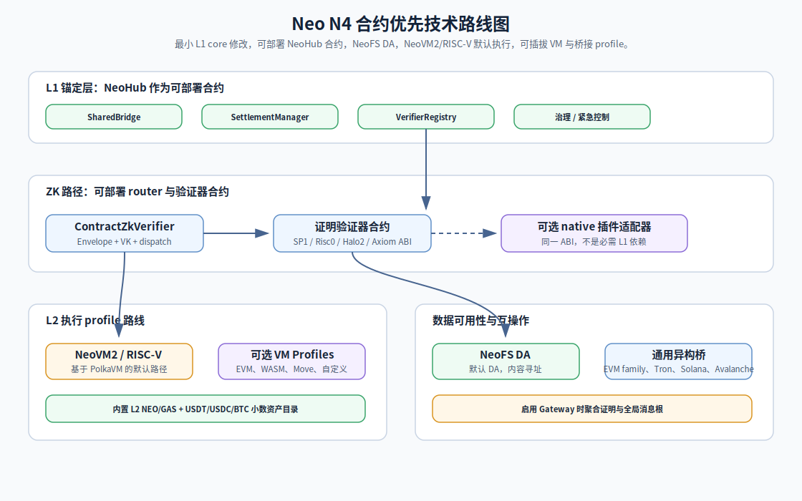

# Neo N4 技术路线图

这份路线图描述当前 Neo N4 的实现方向。核心原则是 **L1 合约优先**：
NeoHub 以 L1 可部署合约交付，L1 core 修改保持最小，native/precompile
加速只能作为可选插件路径，而不是默认依赖。

  

## 1. L1 策略

- NeoHub 是 `contracts/NeoHub.*` 下的 L1 可部署合约套件。
- `r3e-network/neo` 是 Neo core fork：`r3e/neo-n3-core` 跟踪 upstream
  `master-n3` 用于 L1 core，`r3e/neo-n4-core` 跟踪 upstream `master` 用于
  L2 执行内核。
- NeoHub 业务逻辑不应注册为 L1 native contract。
- 只有在合约、插件、SDK、relayer 或运维服务无法合理实现时，才考虑
  增加 L1 core hook。

## 2. ZK 验证路径

- `ContractZkVerifier` 是 `VerifierRegistry` 中默认的 `ProofType.Zk` 目标。
- 它校验 N4 batch commitment envelope、`RiscVProofPayload` 版本、
  proof-system tag、已登记 verification-key id、public-input hash 边界和
  proof size 限制。
- 生产链通过 `RegisterProofVerifier(proofSystem, verifier, allowed)` 为每个
  proof system 登记可部署验证器合约。
- 私有 devnet 和分阶段集成可以显式调用
  `SetEnvelopeOnlyAllowed(proofSystem, true)`，在真实验证器合约接入前完成
  系统联调。
- native 或 precompile 加速仍可存在，但只能作为同一可部署验证器 ABI 背后的
  可选实现：
  `verifyZkProof(byte proofSystem, byte[] verificationKeyId, byte[] publicInputHash, byte[] proofBytes)`。

## 3. L2 执行

- NeoVM2/RISC-V 是规范默认 L2 执行 profile。
- RISC-V executor 基于 PolkaVM 的 `external/neo-riscv-vm` 集成。
- EVM、WASM、Move 和自定义 VM 应建模为可插拔 N4 L2 execution profiles，
  不是 NeoX。
- VM profile 在 executor/profile 边界接入，并必须保持同一套 L1 结算、桥、
  消息、DA 和安全标签。

## 4. 数据可用性

- NeoFS 是默认 DA 层。
- L1 DA、external DA 和 DAC 是显式替代模式，必须通过 `ChainRegistry`、
  `DARegistry`、`DAValidator`、SDK 和 UI 标签暴露。
- 运维证据应包含 content id、replication policy、proof-of-storage/read
  检查，以及每个 batch 使用的 DA mode。

## 5. 资产模型

- L1 NEO 保持不可分割，`decimals = 0`。
- 每条 N4 L2 暴露 decimal NEO，`decimals = 8`。
- L2 GAS 保持 8 位小数，USDT/USDC 为 6 位小数，BTC 为 8 位小数。
- 平台资产目录在所有 L2 间共享，使 L1-to-L2 与 L2-to-L2 转移不需要为每条链
  制作用户不可见的特殊 wrapper。
- 退出回 L1 时必须拒绝有损小数取整，尤其是无法映射回 indivisible L1 NEO 的
  fractional L2 NEO。

## 6. 互操作

- 外部桥必须保持通用、chain-id driven。
- EVM-family 链，包括 Avalanche，应复用同一 watcher/router 模型，除非某条链
  需要不同的签名或事件验证 profile。
- Tron 和 Solana 保持独立 profile，因为签名和运行时细节不同于 EVM-family。
- Gateway 聚合是可选层，只聚合 proofs 和 global message roots，不从 NeoHub
  移走资产托管权。

## 7. 生产门槛

- 所有合约 artifact 必须能编译，并与 deploy planner 一致。
- 单元测试、冒烟测试、集成测试、私有网络测试，以及选定的公网 testnet 演练
  必须在 `docs/audit/` 下留下脱敏证据。
- 文档、图表和实现命名必须一致：默认 NeoHub 是可部署合约，L2 system contracts
  是 Neo core native contracts，native ZK acceleration 只是可选优化。
- 新增英文文档或图表时，必须在 `docs/zh/` 下提供中文对应版本。
