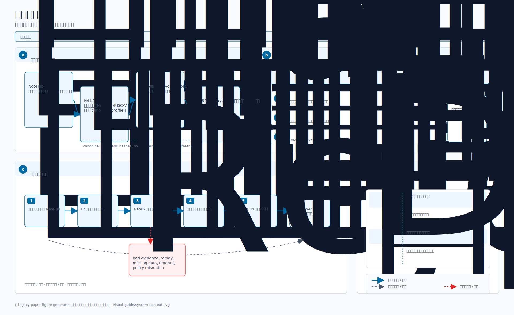
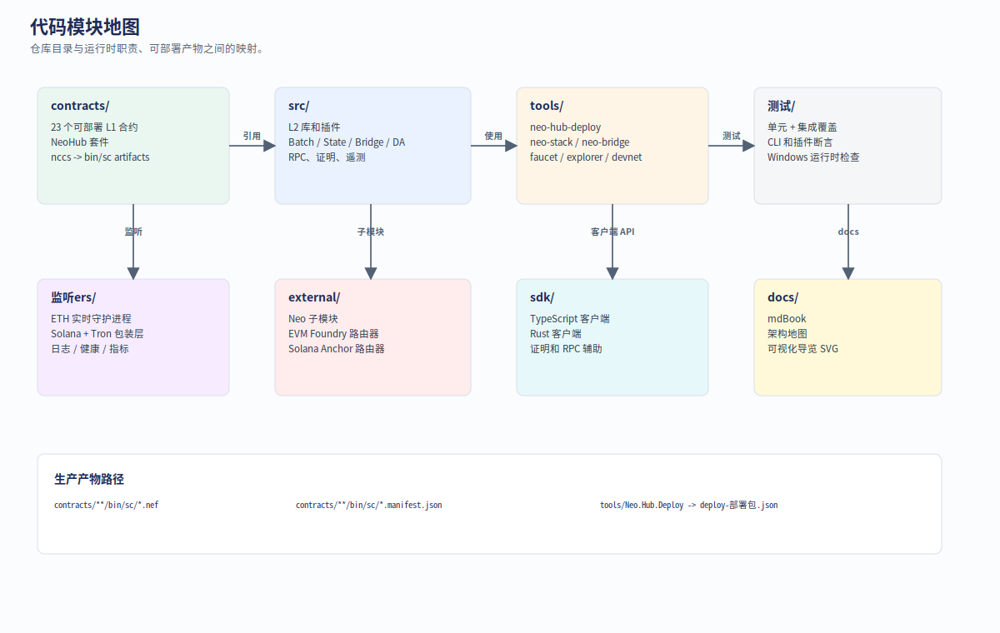
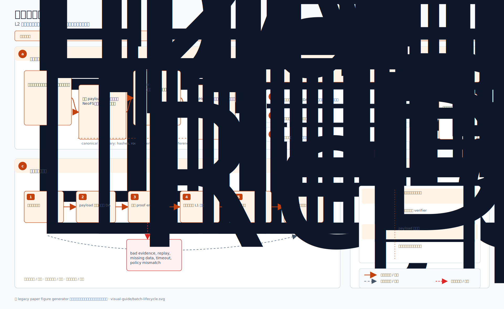
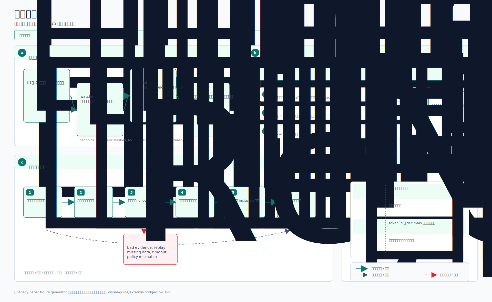
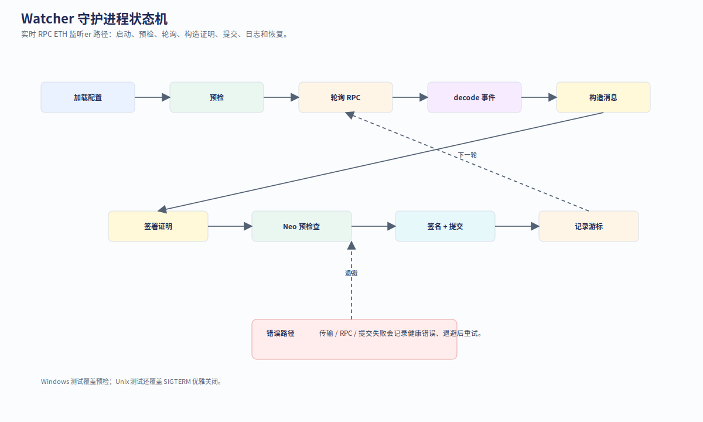
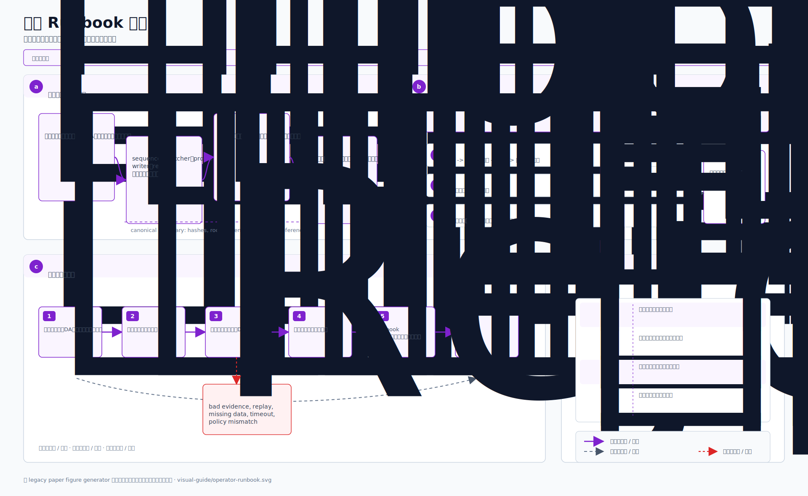
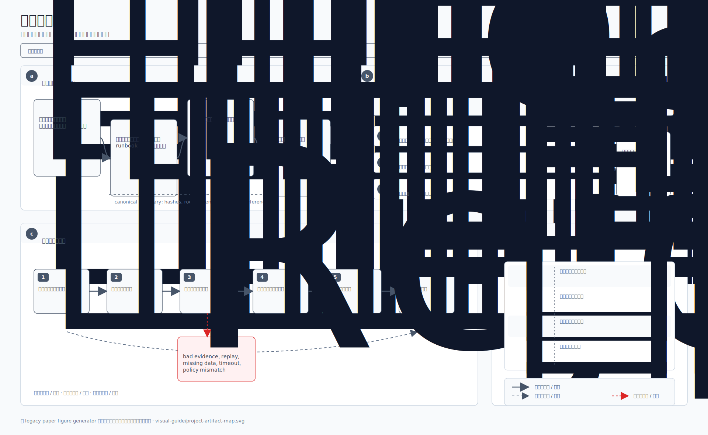

# 可视化导览

这页把 Neo N4 的系统架构、模块分布、桥接流程、部署管线、数据结构、信任边界和验证矩阵整理成一组 SVG 图。图内标签采用英文技术名，正文用中文解释，方便和代码、CLI、合约名直接对应。

## 阅读顺序

- 先看全局：**System context**。
- 找代码位置：**Code module map**、**Source to artifact map**。
- 理解桥：**Deposit flow**、**Withdrawal flow**、**External bridge data flow**。
- 准备上线：**Deployment pipeline**、**Operator runbook flow**。
- 做审计：**Core data structures**、**Trust boundary map**、**Verification matrix**。

## System Context



## Code Module Map



## L1 To L2 Deposit Flow


## L2 To L1 Withdrawal Flow


## Batch Settlement Lifecycle



## External Bridge Data Flow



## Production Deployment Pipeline


## Core Data Structures


## Trust Boundary Map


## Watcher Daemon State Machine



## Verification Matrix


## Operator Runbook Flow



## Source To Artifact Map



## 重新生成

架构变化后，从仓库根目录运行：

```powershell
docs/figures/visual-guide/generate.ps1
```
