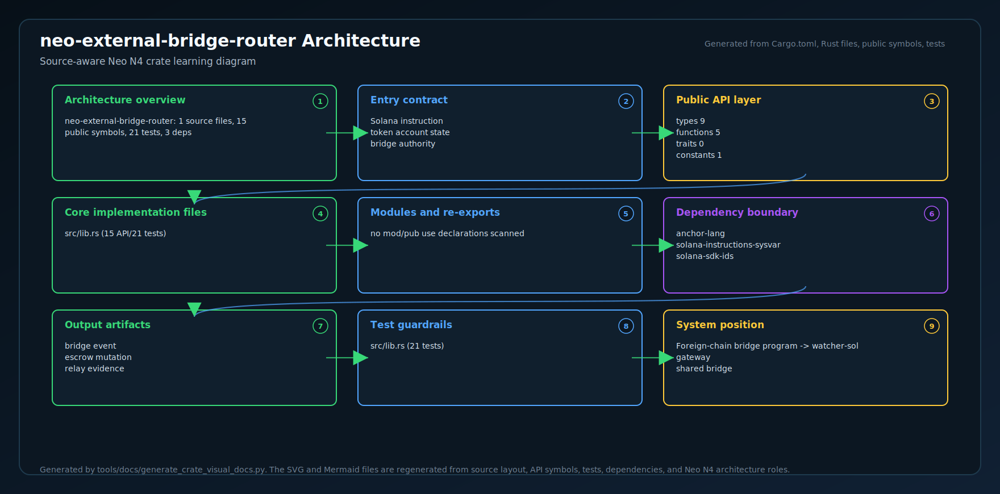
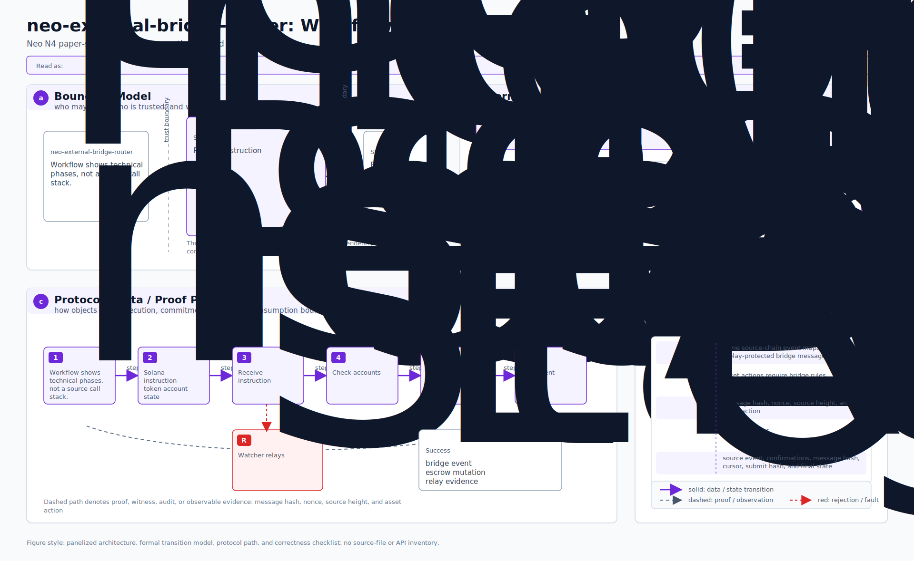
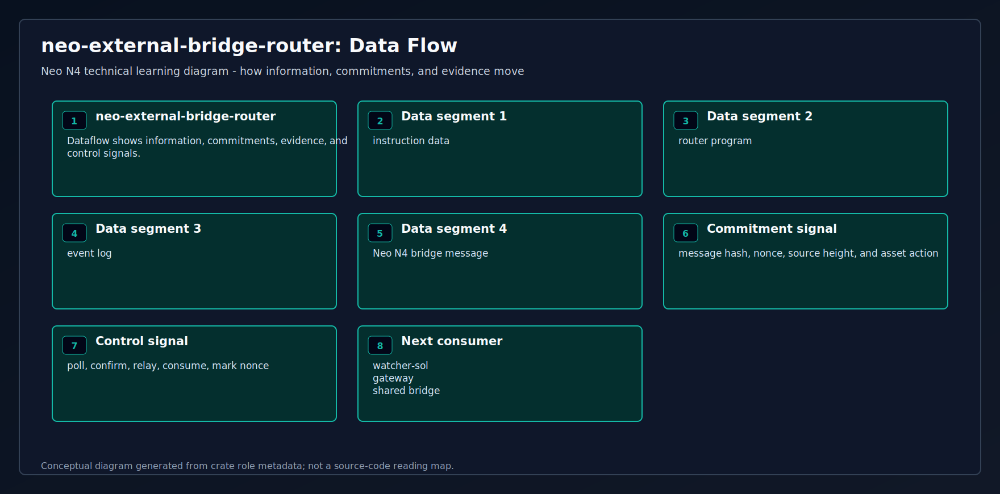

# neo-external-bridge-router

<!-- N4-CRATE-VISUAL-GUIDE:START -->

## Visual Architecture Guide

These diagrams explain where `neo-external-bridge-router` sits in the Neo N4 stack, how its main workflow runs, and how data moves through it.

| View | Diagram | Source |
| --- | --- | --- |
| Architecture |  | [Mermaid](docs/figures/architecture.mmd) |
| Workflow |  | [Mermaid](docs/figures/workflow.mmd) |
| Dataflow |  | [Mermaid](docs/figures/dataflow.mmd) |

### Role in Neo N4

- **Layer:** Foreign-chain bridge program
- **Purpose:** Solana-side bridge router that represents Neo N4 cross-chain lock, mint, burn, and unlock flows.
- **Primary inputs:** Solana instruction, token account state, bridge authority
- **Primary outputs:** bridge event, escrow mutation, relay evidence
- **Downstream consumers:** watcher-sol, gateway, shared bridge

### Learning Path

1. Start with the architecture diagram to understand the crate boundary.
2. Follow the workflow diagram to see the normal execution path.
3. Use the dataflow diagram to connect inputs, state changes, and outputs.
4. Read the crate source after the diagrams so module-level details have context.

<!-- N4-CRATE-VISUAL-GUIDE:END -->
