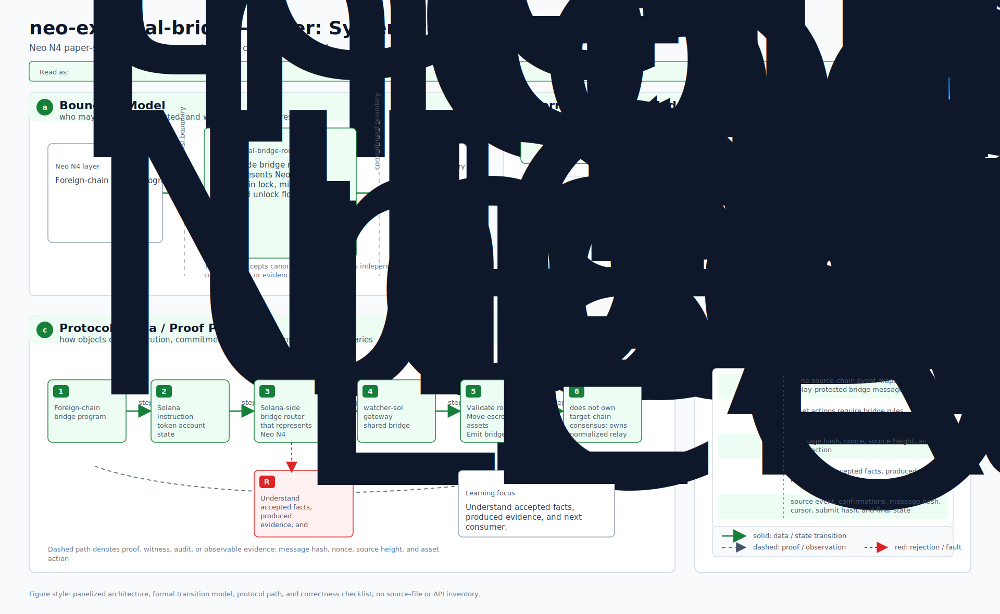
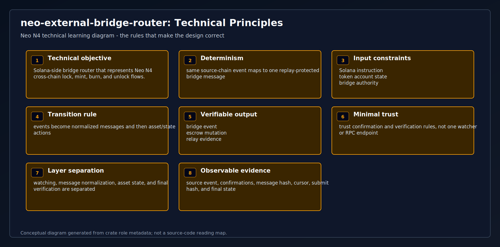
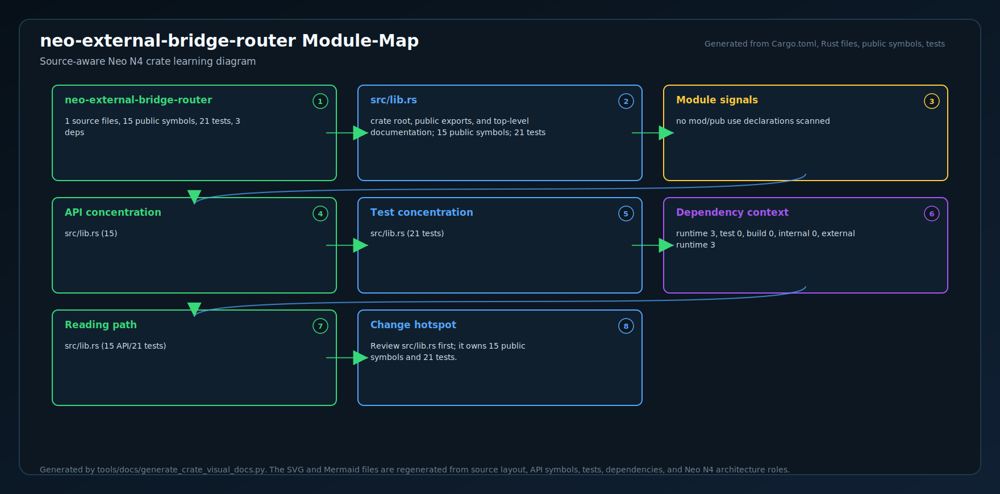
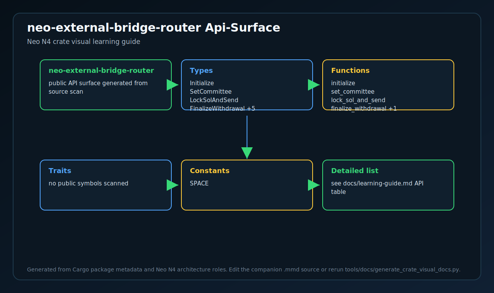
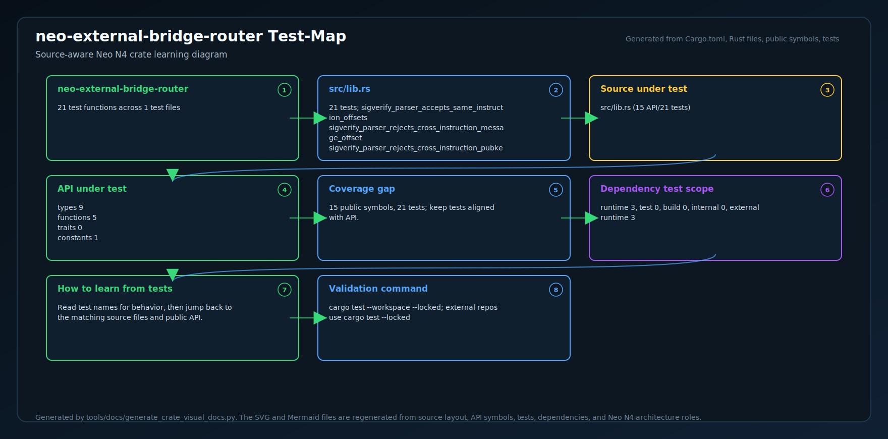
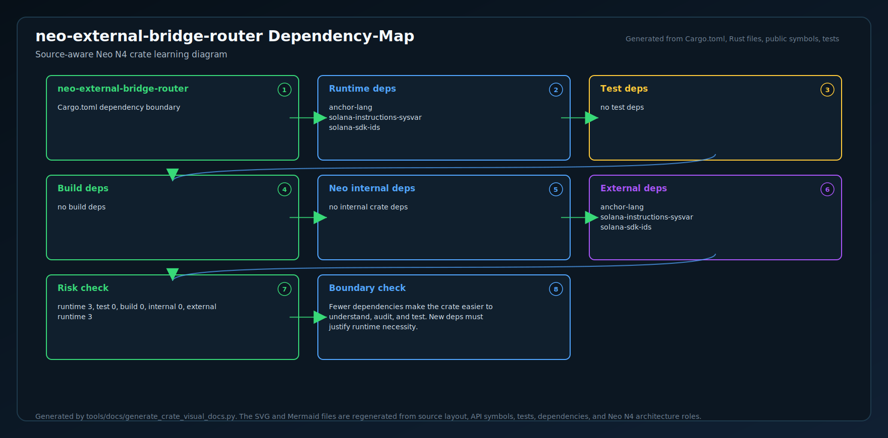
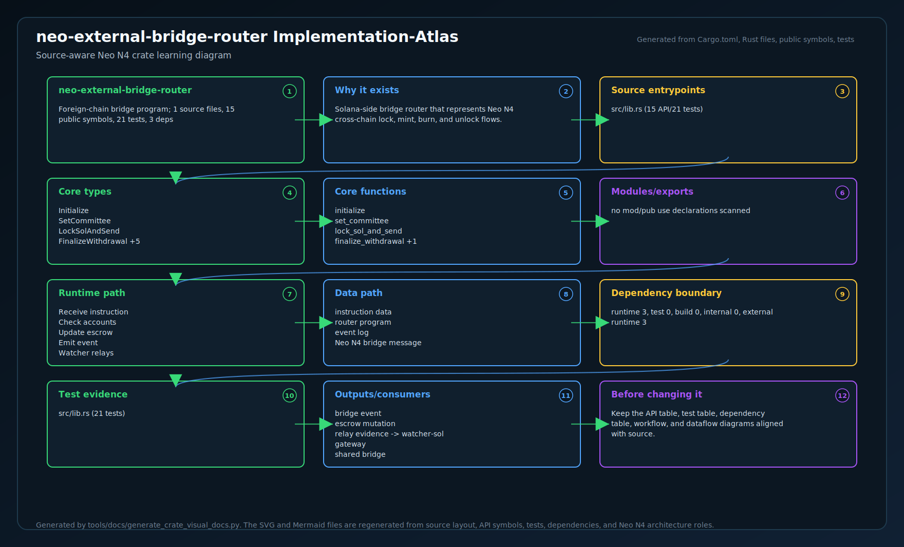

# neo-external-bridge-router

<!-- N4-CRATE-VISUAL-GUIDE:START -->

## Crate Visual Learning Guide

These diagrams are local to this crate. They explain `neo-external-bridge-router` as an independent unit: where it sits in the Neo N4 stack, which boundary it owns, how its internal workflow runs, and how data moves through it.

For the full source-level explanation, read [docs/learning-guide.md](docs/learning-guide.md).

| View | Diagram | Source |
| --- | --- | --- |
| Position in Neo N4 |  | [Mermaid](docs/figures/position.mmd) |
| Technical principles |  | [Mermaid](docs/figures/principles.mmd) |
| Architecture |  | [Mermaid](docs/figures/architecture.mmd) |
| Workflow |  | [Mermaid](docs/figures/workflow.mmd) |
| Dataflow |  | [Mermaid](docs/figures/dataflow.mmd) |
| Module map |  | [Mermaid](docs/figures/module-map.mmd) |
| Public API surface |  | [Mermaid](docs/figures/api-surface.mmd) |
| Test evidence |  | [Mermaid](docs/figures/test-map.mmd) |
| Dependency map |  | [Mermaid](docs/figures/dependency-map.mmd) |
| Implementation atlas |  | [Mermaid](docs/figures/implementation-atlas.mmd) |

### Role in Neo N4

- **Layer:** Foreign-chain bridge program
- **Purpose:** Solana-side bridge router that represents Neo N4 cross-chain lock, mint, burn, and unlock flows.
- **Primary inputs:** Solana instruction, token account state, bridge authority
- **Primary outputs:** bridge event, escrow mutation, relay evidence
- **Downstream consumers:** watcher-sol, gateway, shared bridge
- **Source files scanned:** 1
- **Public symbols scanned:** 15
- **Rust tests scanned:** 21

### Boundary and Responsibilities

- **Owns:** Validate route, Move escrowed assets, Emit bridge event
- **Consumes:** Solana instruction, token account state, bridge authority
- **Produces:** bridge event, escrow mutation, relay evidence
- **Used by:** watcher-sol, gateway, shared bridge

### Source Map Snapshot

| File | Why it matters | Public API | Tests |
| --- | --- | ---: | ---: |
| `src/lib.rs` | crate root, public exports, and top-level documentation | 15 | 21 |

### API Snapshot

| Kind | Representative symbols |
| --- | --- |
| Types | Initialize   SetCommittee   LockSolAndSend   FinalizeWithdrawal +5 |
| Functions | initialize   set_committee   lock_sol_and_send   finalize_withdrawal +1 |
| Trait | no public symbols scanned |
| Constants | SPACE |

### Learning Path

1. Start with the position diagram to understand why this crate exists and who calls it.
2. Read the technical principles diagram to identify the invariants and responsibility boundary.
3. Use the module map and API surface to identify the files and symbols to read first.
4. Follow the workflow, dataflow, test, and dependency diagrams before changing code.
5. Use the implementation atlas as the compact source-reading map when you want one dense view instead of separate technical views.

<!-- N4-CRATE-VISUAL-GUIDE:END -->
