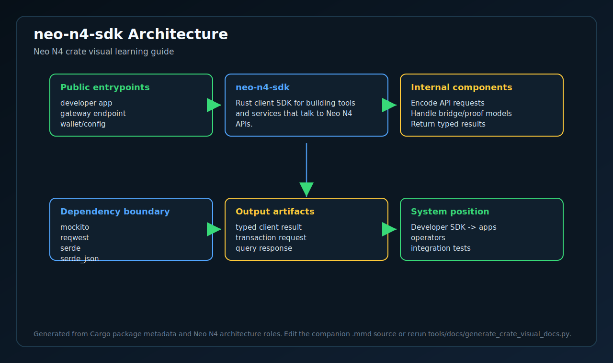
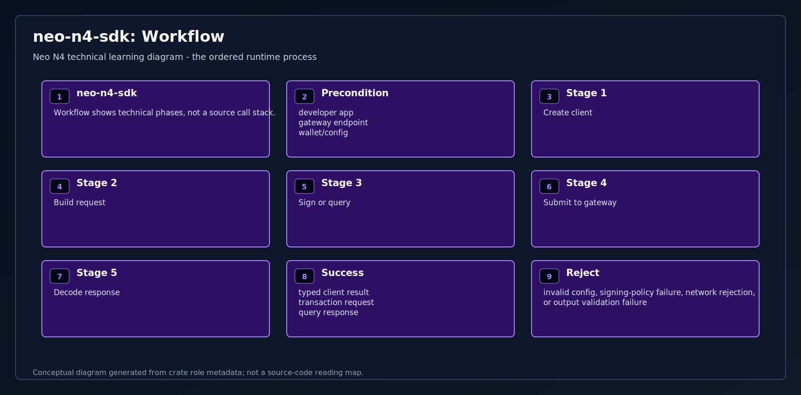
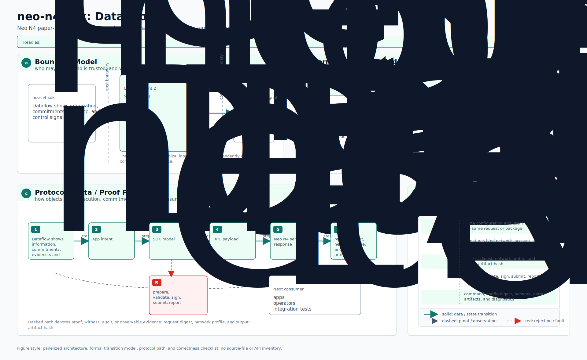

# neo-n4-sdk

<!-- N4-CRATE-VISUAL-GUIDE:START -->

## Visual Architecture Guide

These diagrams explain where `neo-n4-sdk` sits in the Neo N4 stack, how its main workflow runs, and how data moves through it.

| View | Diagram | Source |
| --- | --- | --- |
| Architecture |  | [Mermaid](docs/figures/architecture.mmd) |
| Workflow |  | [Mermaid](docs/figures/workflow.mmd) |
| Dataflow |  | [Mermaid](docs/figures/dataflow.mmd) |

### Role in Neo N4

- **Layer:** Developer SDK
- **Purpose:** Rust client SDK for building tools and services that talk to Neo N4 APIs.
- **Primary inputs:** developer app, gateway endpoint, wallet/config
- **Primary outputs:** typed client result, transaction request, query response
- **Downstream consumers:** apps, operators, integration tests

### Learning Path

1. Start with the architecture diagram to understand the crate boundary.
2. Follow the workflow diagram to see the normal execution path.
3. Use the dataflow diagram to connect inputs, state changes, and outputs.
4. Read the crate source after the diagrams so module-level details have context.

<!-- N4-CRATE-VISUAL-GUIDE:END -->
