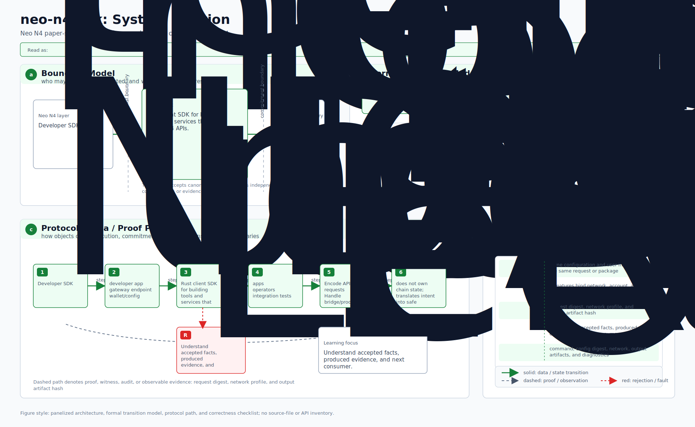
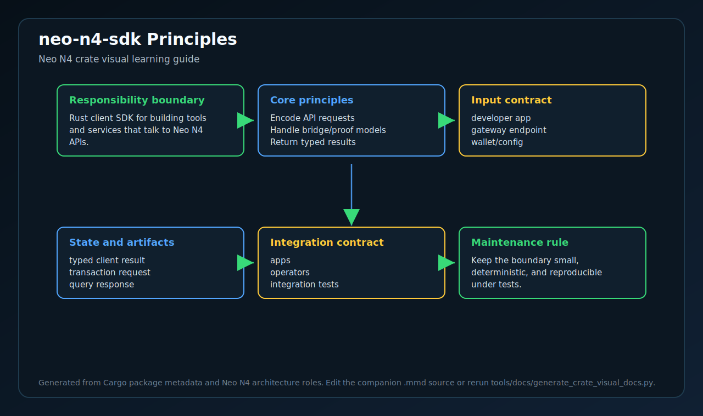
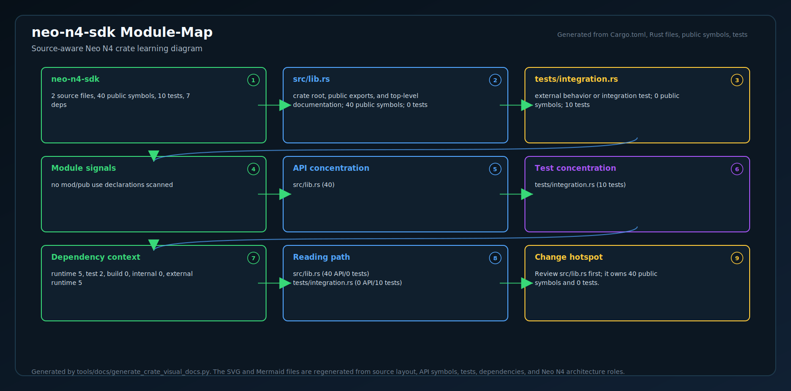
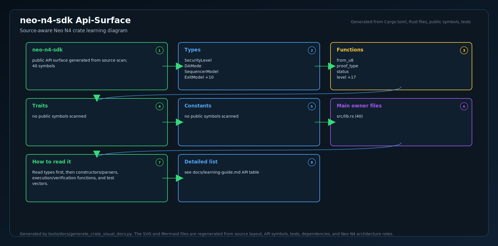
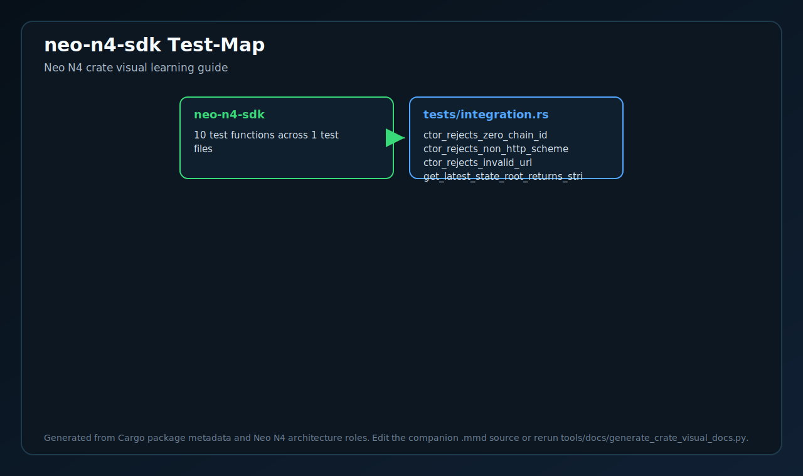
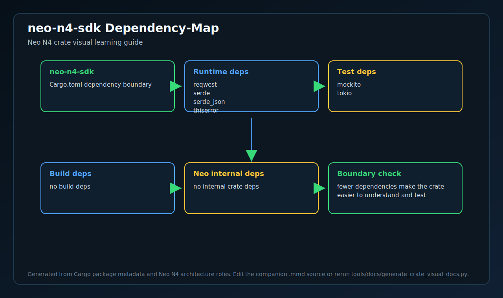

# neo-n4-sdk

<!-- N4-CRATE-VISUAL-GUIDE:START -->

## Crate Visual Learning Guide

These diagrams are local to this crate. They explain `neo-n4-sdk` as an independent unit: where it sits in the Neo N4 stack, which boundary it owns, how its internal workflow runs, and how data moves through it.

For the full source-level explanation, read [docs/learning-guide.md](docs/learning-guide.md).

| View | Diagram | Source |
| --- | --- | --- |
| Position in Neo N4 |  | [Mermaid](docs/figures/position.mmd) |
| Technical principles |  | [Mermaid](docs/figures/principles.mmd) |
| Architecture |  | [Mermaid](docs/figures/architecture.mmd) |
| Workflow |  | [Mermaid](docs/figures/workflow.mmd) |
| Dataflow |  | [Mermaid](docs/figures/dataflow.mmd) |
| Module map |  | [Mermaid](docs/figures/module-map.mmd) |
| Public API surface |  | [Mermaid](docs/figures/api-surface.mmd) |
| Test evidence |  | [Mermaid](docs/figures/test-map.mmd) |
| Dependency map |  | [Mermaid](docs/figures/dependency-map.mmd) |

### Role in Neo N4

- **Layer:** Developer SDK
- **Purpose:** Rust client SDK for building tools and services that talk to Neo N4 APIs.
- **Primary inputs:** developer app, gateway endpoint, wallet/config
- **Primary outputs:** typed client result, transaction request, query response
- **Downstream consumers:** apps, operators, integration tests
- **Source files scanned:** 2
- **Public symbols scanned:** 40
- **Rust tests scanned:** 10

### Boundary and Responsibilities

- **Owns:** Encode API requests, Handle bridge/proof models, Return typed results
- **Consumes:** developer app, gateway endpoint, wallet/config
- **Produces:** typed client result, transaction request, query response
- **Used by:** apps, operators, integration tests

### Source Map Snapshot

| File | Why it matters | Public API | Tests |
| --- | --- | ---: | ---: |
| `src/lib.rs` | crate root, public exports, and top-level documentation | 40 | 0 |
| `tests/integration.rs` | external behavior or integration test | 0 | 10 |

### API Snapshot

| Kind | Representative symbols |
| --- | --- |
| Types | SecurityLevel   DAMode   SequencerModel   ExitModel +10 |
| Functions | from_u8   proof_type   status   level +17 |
| Trait | no public symbols scanned |
| Constants | no public symbols scanned |

### Learning Path

1. Start with the position diagram to understand why this crate exists and who calls it.
2. Read the technical principles diagram to identify the invariants and responsibility boundary.
3. Use the module map and API surface to identify the files and symbols to read first.
4. Follow the workflow, dataflow, test, and dependency diagrams before changing code.

<!-- N4-CRATE-VISUAL-GUIDE:END -->
