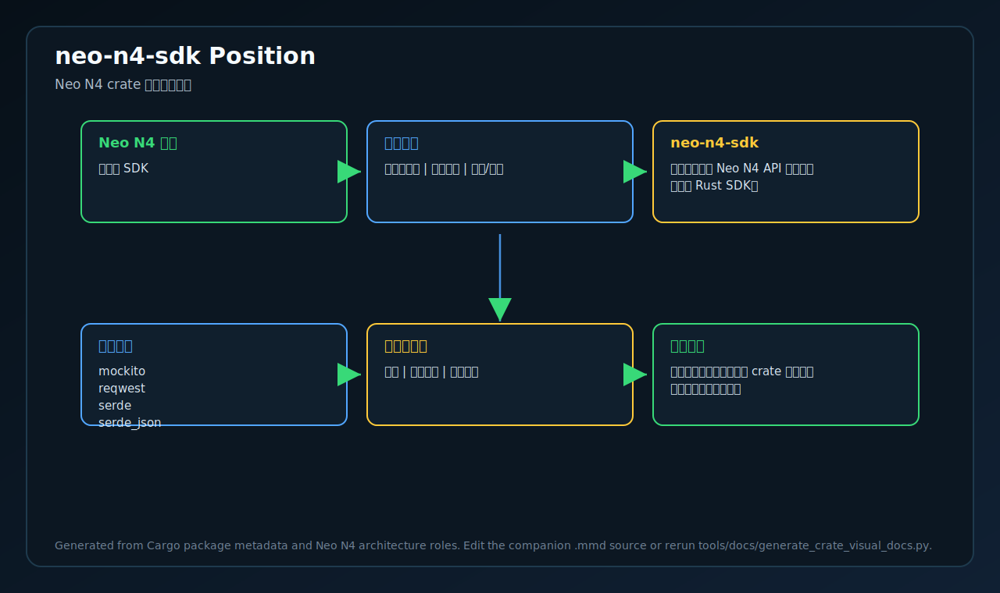
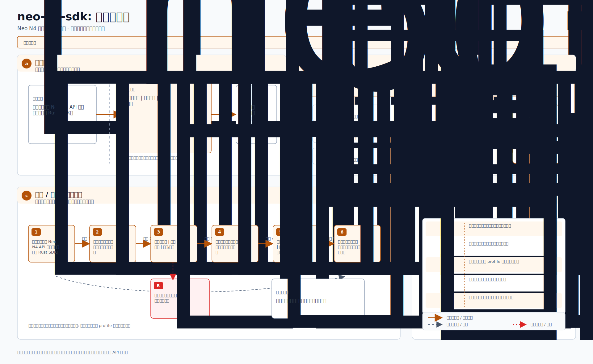

# neo-n4-sdk

<!-- N4-CRATE-VISUAL-GUIDE-ZH:START -->

## 可视化学习指南

这些图是 `neo-n4-sdk` 自己目录下的 crate 专属学习资料，用来说明它在 Neo N4 中的位置、自己负责的技术边界、内部工作流，以及数据如何流经它。

| 视图 | 图片 | 源文件 |
| --- | --- | --- |
| 在 Neo N4 中的位置 |  | [Mermaid](docs/figures/position.zh.mmd) |
| 技术原理 |  | [Mermaid](docs/figures/principles.zh.mmd) |
| 架构 |  | [Mermaid](docs/figures/architecture.zh.mmd) |
| 工作流 |  | [Mermaid](docs/figures/workflow.zh.mmd) |
| 数据流 |  | [Mermaid](docs/figures/dataflow.zh.mmd) |

### 在 Neo N4 中的作用

- **层级:** 开发者 SDK
- **目的:** 用于构建访问 Neo N4 API 的工具和服务的 Rust SDK。
- **主要输入:** 开发者应用、网关端点、钱包/配置
- **主要输出:** 强类型客户端结果、交易请求、查询响应
- **下游使用者:** 应用、运维工具、集成测试

### 边界与职责

- **本 crate 负责:** 编码 API 请求、处理桥/证明模型、返回强类型结果
- **本 crate 消费:** 开发者应用、网关端点、钱包/配置
- **本 crate 产出:** 强类型客户端结果、交易请求、查询响应
- **主要被谁使用:** 应用、运维工具、集成测试

### 学习路径

1. 先看位置图，明确这个 crate 为什么存在、上游是谁、下游是谁。
2. 再看技术原理图，理解它的核心不变量、职责边界和维护规则。
3. 然后看架构图，把公开入口、内部组件、依赖边界和输出产物串起来。
4. 最后看工作流和数据流，再进入源码和测试文件会更容易理解。

<!-- N4-CRATE-VISUAL-GUIDE-ZH:END -->
