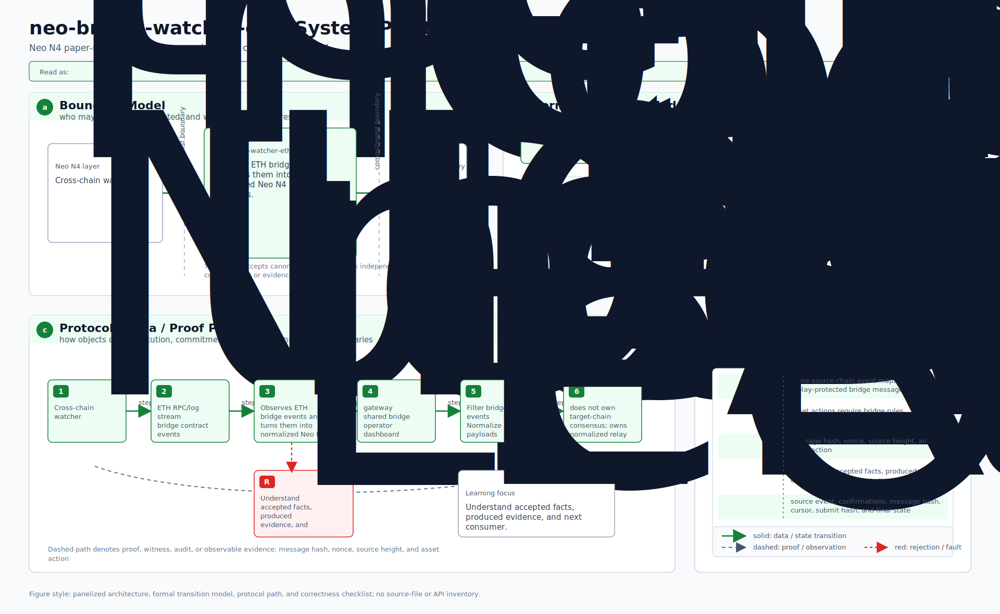
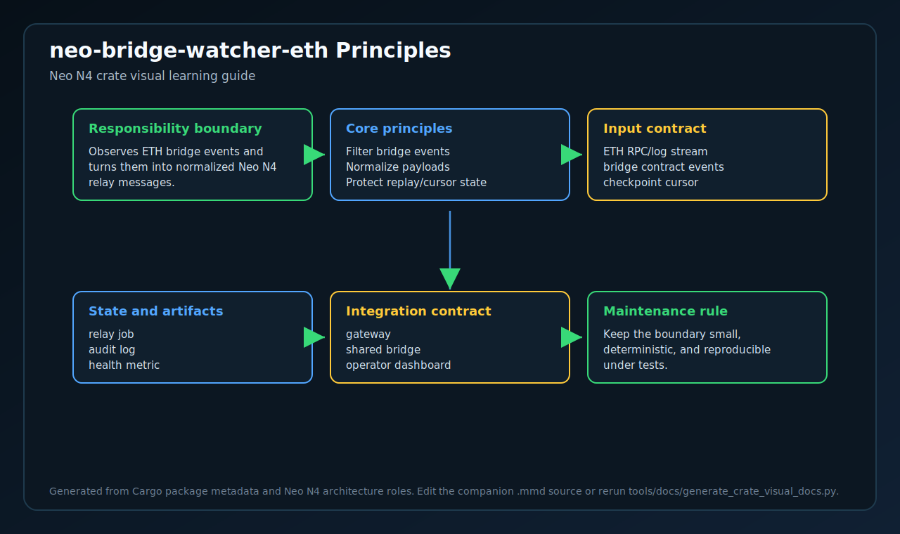
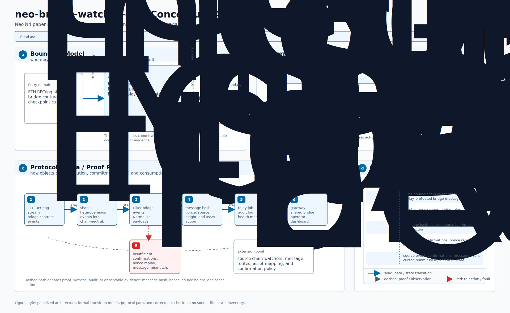
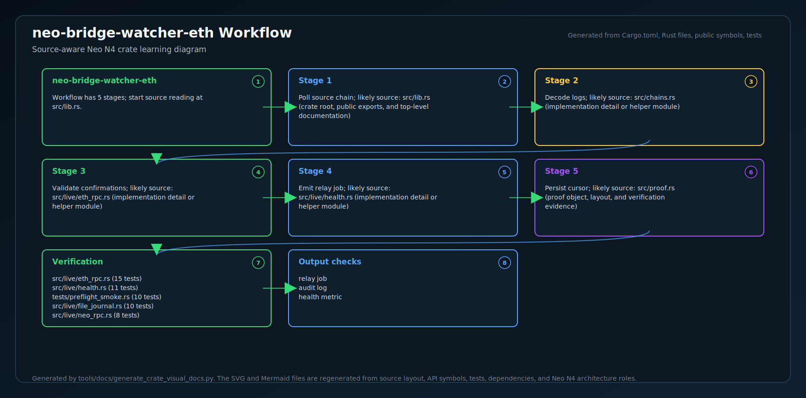
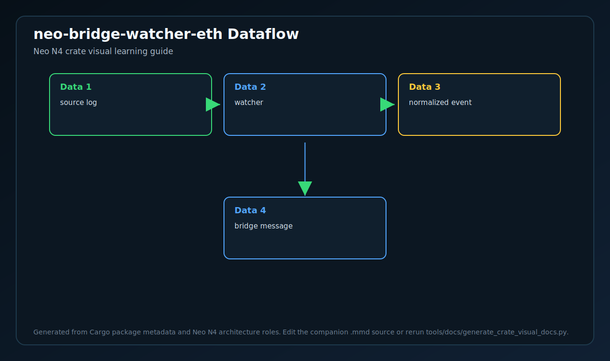
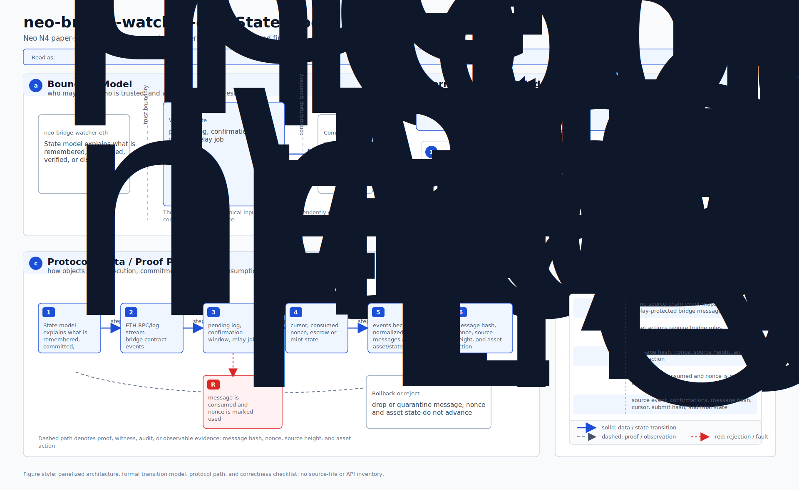
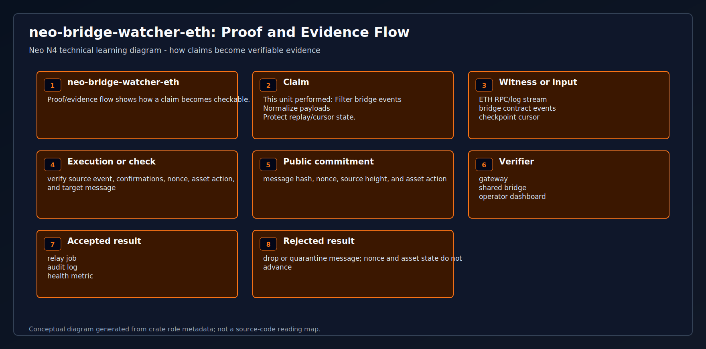
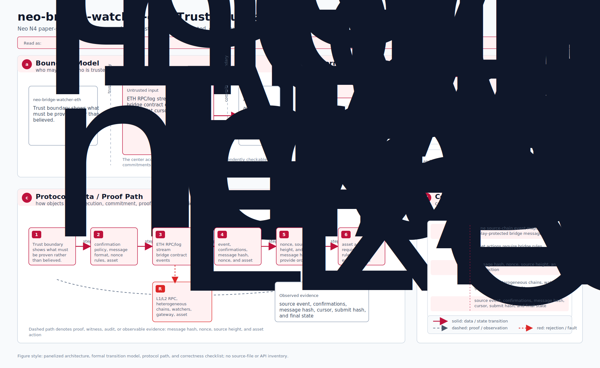
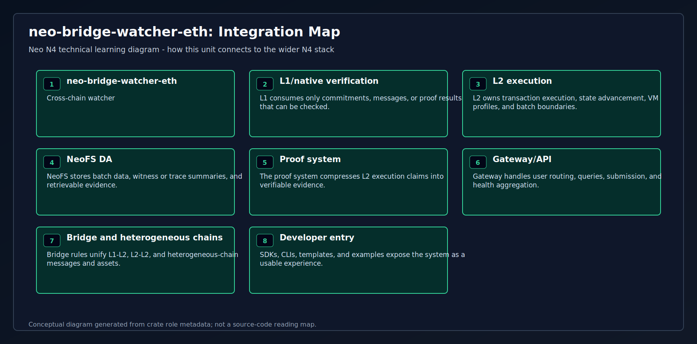
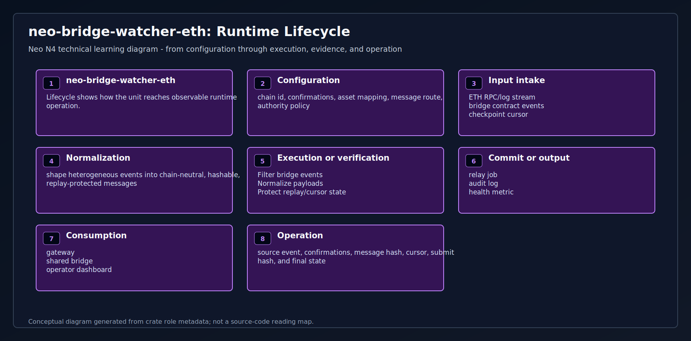

# neo-bridge-watcher-eth

Off-chain watcher daemon for Neo Elastic Network's Eth ↔ Neo external
bridge.

This crate serves the **entire EVM family** — Ethereum, BSC, Polygon,
Arbitrum, Optimism, Base, Avalanche, Linea, zkSync Era, Scroll,
Mantle, Fantom, Celo, plus Tron's EVM-flavored TVM. The same daemon
binary is fully chain-id-driven: changing one TOML field swaps which
chain is being watched. See
[`docs/external-bridge-evm-chains.md`](../../docs/external-bridge-evm-chains.md)
for the 5-step onboarding runbook + the canonical foreign-namespace
slot allocation; the constants live in [`src/chains.rs`](src/chains.rs).

Two build modes:

- **Default** (`cargo build`): the messaging + signing + orchestration
  core only — no networking deps. Tests + downstream watcher crates
  (Tron / Solana) consume this. Lean dep tree.
- **`--features live-rpc`** (`cargo build --release --features live-rpc`):
  builds the runnable daemon binary `neo-bridge-watcher-eth`. Pulls
  reqwest + serde + tiny-keccak + toml. Wires the four trait impls
  (FileSigner + EthRpcEventSource + NeoRpcSubmitter + FileJournal) into
  a continuous loop with exponential backoff on errors.

The split is intentional. The cryptographically-load-bearing pieces —
canonical wire-format encoding, ECDSA signing — sit alone in the lib,
with byte-for-byte parity tests against the C# implementations in
`src/Neo.L2.Bridge/External/`. The daemon binary is a thin layer on
top: load config, construct the four impls, run `WatcherCore::tick()`
in a loop. Splitting this way lets the signing path evolve
independently of the RPC plumbing (HSM integration becomes a trait
swap, not a rewrite).

## CLI surface

```text
Usage: neo-bridge-watcher-eth --config <watcher.toml> [--preflight]

Flags:
  --config <path>     Path to TOML config (required for normal runs).
  --preflight         Validate config + RPC reachability + signer + journal,
                      then exit. Does NOT start the watch loop.
  --journal-info      Print the journal's cursor + consumed-record summary +
                      recent records, then exit. Read-only; does NOT acquire
                      the journal flock (safe to run while the watcher
                      daemon is also running).
  --config-template   Print a starter TOML config to stdout + exit.
                      Pipe to a file: `... --config-template > watcher.toml`
                      then edit placeholders + run --preflight.
  --version, -V       Print version + exit.
  --help, -h          Print this help + exit.
```

## Run the daemon

```bash
# Build:
CPATH=~/.local/include cargo build --release -p neo-bridge-watcher-eth --features live-rpc

# Generate a watcher private key (one-time):
dotnet run --project tools/Neo.External.Bridge.Cli -- genkey --out watcher.priv

# Bootstrap a config (replaces the hand-rolled TOML below):
./target/release/neo-bridge-watcher-eth --config-template > watcher.toml
$EDITOR watcher.toml      # fill in the REPLACE_WITH_* placeholders

# Or write watcher.toml from scratch:
cat > watcher.toml <<TOML
external_chain_id   = 0xE0000002             # Sepolia (or any chain in chains.rs)
eth_rpc_url         = "https://rpc.sepolia.org"
eth_router_address  = "0x..."                # NeoExternalBridgeRouter on the EVM chain
neo_rpc_url         = "https://rpc.testnet.neo.org"
neo_escrow_address  = "0x..."                # NeoHub.ExternalBridgeEscrow on Neo
neo_signer_address  = "0x..."                # operator's Neo account
signer_key_path     = "watcher.priv"
journal_dir         = "./journal"

[poll]
poll_interval_secs    = 12     # ~target chain block time
backoff_initial_secs  = 5
backoff_max_secs      = 300
eth_chunk_size        = 5000
request_timeout_secs  = 30
min_confirmations     = 12     # see chains::recommended_confirmations

[health]                       # optional — for k8s readiness probes
bind                  = "0.0.0.0:9090"
threshold_secs        = 120
TOML

# Validate before deploy (config + signer + journal + RPC reachability):
./target/release/neo-bridge-watcher-eth --config watcher.toml --preflight

# Run:
./target/release/neo-bridge-watcher-eth --config watcher.toml
```

### Operator inspection commands

While the daemon is running, you can inspect its state without
disrupting it:

```bash
# Look at the journal: cursor + consumed records, grouped by chain.
# Read-only — does NOT acquire the flock — safe alongside the live daemon.
./target/release/neo-bridge-watcher-eth --config watcher.toml --journal-info

# Output:
#   journal_dir:  ./journal
#   cursor:       38400156 (block height)
#   consumed:     142 records
#   by chain:
#     0xE0000030 (BNB Smart Chain mainnet)  →  142
#   recent (last 5 records):
#     chain=0xE0000030  nonce=138
#     chain=0xE0000030  nonce=139
#     ...

# Live HTTP probes (when [health].bind is configured):
curl http://0.0.0.0:9090/healthz   # 200 (healthy) or 503 (stale)
curl http://0.0.0.0:9090/info      # always 200, full JSON snapshot
curl http://0.0.0.0:9090/metrics   # Prometheus exposition with chain_id label
```

The `--preflight` flag runs all setup checks (TOML schema, chain-id
namespace, address-non-zero, `min_confirmations` recommendation,
signer key load, journal `flock` acquire/release, `eth_blockNumber`
probe, router `eth_getCode` probe, Neo `getversion` probe) then exits
0 on success / non-zero on any failure. Designed for `kubectl apply`
gate scripts, systemd `ExecStartPre=`, and CI deploy gates.

The v0 daemon ships a `StubSignAndSend` that emits the `invokefunction`
script bytes + a synthetic tx hash but does NOT actually sign + submit
a Neo transaction. Production deployments replace it with an HSM/KMS-
backed `SignAndSend` impl that wraps the script in a signed Neo
`Transaction` + POSTs `sendrawtransaction`. The watcher's pre-check
against the Neo RPC catches verifier-rejection paths regardless.

### Operational features

| Feature | What it does | Where |
|---------|--------------|-------|
| **Graceful shutdown** | SIGTERM / SIGINT trigger clean exit within ~100ms (instead of being killed mid-tick or waiting for a long backoff to complete). Async-signal-safe handler flips an AtomicBool; the run loop polls it at top + during sleeps. Required for kubernetes shutdown grace periods. | `bin/.../main()` |
| **Concurrent-instance detection** | Two daemons pointed at the same `journal_dir` is a recipe for corrupting `consumed.log`. The journal acquires a `flock(LOCK_EX | LOCK_NB)` on a `.lock` sentinel — second instance fails fast with a typed error. | `live::file_journal::FileJournal::open` |
| **Per-chain confirmation buffer** | `[poll].min_confirmations = N` defends against short-reorg phantom mints. Source caps polling at `head - N`. The daemon WARNs at startup if `min_confirmations = 0` but the chain id has a non-zero recommendation in `chains::recommended_confirmations`. | `live::eth_rpc` + `chains` |
| **Mid-stream bootstrap** | `[poll].start_block = N` advances the journal cursor to `N` on first run if the cursor is below it. Skips the genesis-to-N scan when deploying a watcher against a long-running chain. Monotonic — restarts read from journal as normal. | bin's `run()` |
| **Preflight** | `--preflight` validates config + signer key + journal flock + chain-id namespace + actual RPC reachability (`eth_blockNumber` + Neo `getversion`) then exits 0/1. Plugs into systemd `ExecStartPre=` and k8s deploy gates so config issues fail before the watch loop starts. | bin's `preflight()` |
| **Health endpoint** | `GET /healthz` → 200 (healthy) or 503 (no successful tick within `threshold_secs`); `GET /info` → always 200 with same JSON body. K8s readiness/liveness probes consume the status code; dashboards consume the body. | `live::health` |
| **Prometheus metrics** | `GET /metrics` → exposition format with 9 metrics: `watcher_started_at_unix_timestamp`, `watcher_last_tick_success_unix_timestamp`, `watcher_ticks_total`, `watcher_events_processed_total`, `watcher_submissions_total`, `watcher_journal_cursor`, `watcher_last_error_unix_timestamp`, `watcher_healthy`. Same port as `/healthz`. Scrape config example in [`deploy/README.md`](./deploy/README.md). | `live::health` |

### Production deployment

Reference manifests for k8s + systemd live in
[`deploy/`](./deploy/). They cover the operational pieces above:
SIGTERM passthrough, health-probe wiring, journal volume mount,
key-file secret. Sketch:

```yaml
# k8s readinessProbe (full Deployment in deploy/k8s.yaml):
readinessProbe:
  httpGet: {path: /healthz, port: 9090}
  periodSeconds: 5
  failureThreshold: 24   # ~2 min stale → kick out of LB
livenessProbe:
  httpGet: {path: /healthz, port: 9090}
  periodSeconds: 30
  failureThreshold: 4    # ~2 min stale → restart pod
terminationGracePeriodSeconds: 30   # SIGTERM → clean exit (~100ms)
```

## Position in the stack

```
[Eth user]
  │ tx → NeoExternalBridgeRouter.lockETHAndSend(...)
  │
[Eth router emits Locked event]
  │
  ▼
[neo-bridge-watcher-eth daemon]                    ← lives in this crate
  • subscribes to Locked events (deferred — Phase B follow-on)
  • for each event, builds canonical
    ExternalCrossChainMessage bytes (this crate)
  • signs with secp256k1 + sha256 (this crate's Signer trait)
  • encodes proof bytes (NeoProofBytes for Neo, EthProofBytes for the
    Eth router)                                    (this crate)
  • submits to NeoHub.ExternalBridgeEscrow.Receive (deferred — Phase
    B follow-on)
  ▼
[Neo verifier accepts → escrow finalizes inbound]
```

## What lives here today

| Module        | Purpose                                                  |
|---------------|----------------------------------------------------------|
| `messaging`   | `ExternalCrossChainMessage` record + `canonical_message_bytes` + `message_hash`. Byte-for-byte parity with `Neo.L2.Messaging.ExternalMessageHasher`. |
| `proof`       | `NeoProofBytes` + `EthProofBytes` encoders. Same signatures, two wire formats — Neo's verifier wants 33B pubkey + 64B sig per signer; Eth's wants 1B index + 65B (r,s,v). The watcher generates both from one signing round. |
| `signer`      | `Signer` trait + a `FileSigner` for development. Production deployments plug HSM/KMS-backed implementations behind the trait. |
| `event_source`| `EventSource` trait + `LockedEvent` (Solidity event mapping) + `MockEventSource` for tests. |
| `submitter`   | `NeoSubmitter` trait — posts (messageBytes, proofBytes) to `NeoHub.ExternalBridgeEscrow.Receive`. `MockSubmitter` for tests. |
| `journal`     | `Journal` trait — last-processed block cursor + dedup of `(chainId, nonce)` so a transient submit failure never advances cursor or marks unsubmitted nonces as done. `InMemoryJournal` for tests. |
| `core`        | `WatcherCore` — wires Signer + EventSource + NeoSubmitter + Journal into the canonical pipeline. `process_event` is the hot path; `tick` / `drain` drive it from the event source. End-to-end tests with mocks pin the failure semantics (cursor MUST NOT advance on submit failure; replay rejection; chain-id mismatch). |

## What's deferred

| Component                                  | Reason for deferral                       |
|--------------------------------------------|-------------------------------------------|
| `ethers-rs` `EventSource` impl             | Needs a live Eth RPC + WebSocket setup; cleanest to land alongside an `anvil`-driven integration test rather than as untested glue. The `EventSource` trait is the abstraction; the production impl is a thin adapter. |
| Neo JSON-RPC `NeoSubmitter` impl           | Same; needs a live Neo devnet/RPC. The `NeoSubmitter` trait is the abstraction. |
| Bonded watcher orchestration               | The on-chain `NeoHub.ExternalBridgeBond` is wired but the watcher's auto-bond / auto-rebond logic needs a deployment pattern that's still being decided. |
| RocksDB `Journal` impl                     | `InMemoryJournal` is what tests use; the production impl is a 50-line RocksDB wrapper around the same trait. Lands with the daemon main loop. |
| HSM `Signer` impl                          | The `Signer` trait is the abstraction; HSM bindings (AWS KMS / GCP KMS / hardware) are operator-specific. |
| Daemon main loop                           | A trivial wrapper around `WatcherCore::tick` once the live impls of the three traits land. |

## Build + test

```bash
# From the repo root (workspace member):
CPATH=~/.local/include cargo test --release -p neo-bridge-watcher-eth
# 17 tests across messaging + proof + signer modules + parity integration.
```

The `tests/parity.rs` integration test pins byte-for-byte equivalence
with the C# encoders. A change to either side that breaks the constants
breaks both Rust and C# test suites simultaneously, forcing both
implementations to update together. That's the design.

## Wire-format parity test vector

Anchor for cross-language testing — both the Rust and C# tests assert
against this:

```
externalChainId      = 0xE000_0001 (Eth mainnet)
neoChainId           = 1099
nonce                = 7
direction            = ForeignToNeo (2)
sender               = 0x1111...11 (20B)
recipient            = 0xaaaa...aa (20B)
deadlineUnixSeconds  = 1_900_000_000
sourceTxRef          = 0xeeee...ee (32B)
messageType          = AssetTransfer (0)
payload              = ExternalAssetTransferPayload {
                         foreignAsset: 0xeeee...ee (20B),
                         amount: 1_000_000 (3-byte LE = 40 42 0F)
                       }.encode()  →  27 bytes total

canonical_message_bytes (129 B):
  010000e0 4b040000 0700000000000000 02
  1111111111111111111111111111111111111111
  aaaaaaaaaaaaaaaaaaaaaaaaaaaaaaaaaaaaaaaa
  00b33f7100000000
  eeeeeeeeeeeeeeeeeeeeeeeeeeeeeeeeeeeeeeeeeeeeeeeeeeeeeeeeeeeeeeee
  00 1b000000
  eeeeeeeeeeeeeeeeeeeeeeeeeeeeeeeeeeeeeeee 03000000 40420f

raw Hash256 = ce681e5ecb3eaf452d1834fd94c397271a6556736a4ecfa1e66e4d67e9e1bfac
            (C# UInt256.ToString reverses for display: acbfe1e9...)
```

<!-- N4-CRATE-VISUAL-GUIDE:START -->
## Technical Visual Guide

These diagrams are local to this crate and explain `neo-bridge-watcher-eth` at the technical architecture level. They focus on system role, principles, data movement, workflow, state, proof/evidence, trust boundaries, integration, and runtime lifecycle.

Full technical explanation: [docs/learning-guide.md](docs/learning-guide.md).

| View | Diagram | Mermaid |
| --- | --- | --- |
| System Position |  | [Mermaid](docs/figures/position.mmd) |
| Technical Principles |  | [Mermaid](docs/figures/principles.mmd) |
| Conceptual Architecture |  | [Mermaid](docs/figures/architecture.mmd) |
| Workflow |  | [Mermaid](docs/figures/workflow.mmd) |
| Data Flow |  | [Mermaid](docs/figures/dataflow.mmd) |
| State Model |  | [Mermaid](docs/figures/state-model.mmd) |
| Proof and Evidence Flow |  | [Mermaid](docs/figures/proof-flow.mmd) |
| Trust Boundaries |  | [Mermaid](docs/figures/trust-boundaries.mmd) |
| Integration Map |  | [Mermaid](docs/figures/integration-map.mmd) |
| Runtime Lifecycle |  | [Mermaid](docs/figures/lifecycle.mmd) |

### Technical Role

- **Layer:** Cross-chain watcher
- **Purpose:** Observes ETH bridge events and turns them into normalized Neo N4 relay messages.
- **Inputs:** ETH RPC/log stream | bridge contract events | checkpoint cursor
- **Responsibilities:** Filter bridge events | Normalize payloads | Protect replay/cursor state
- **Outputs:** relay job | audit log | health metric
- **Consumers:** gateway | shared bridge | operator dashboard

### Reading Order

1. Start with system position and conceptual architecture.
2. Read technical principles, trust boundaries, and state model to understand correctness.
3. Follow workflow and dataflow to see runtime movement.
4. Use proof/evidence flow, integration map, and lifecycle for operational understanding.
<!-- N4-CRATE-VISUAL-GUIDE:END -->
