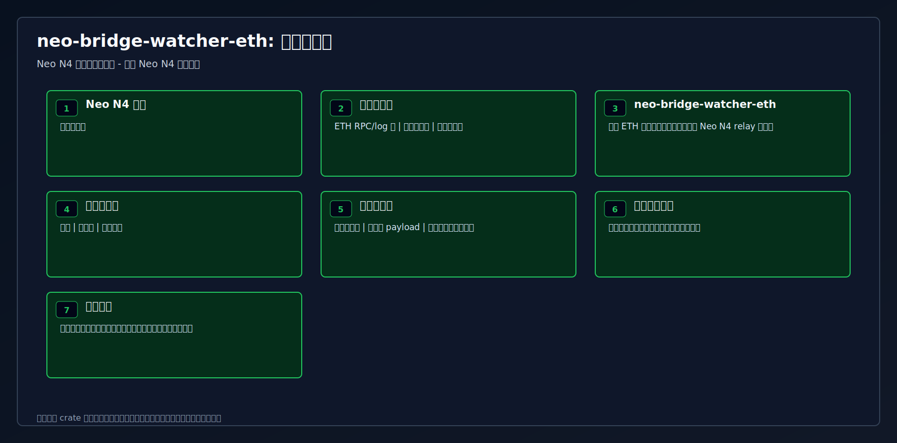
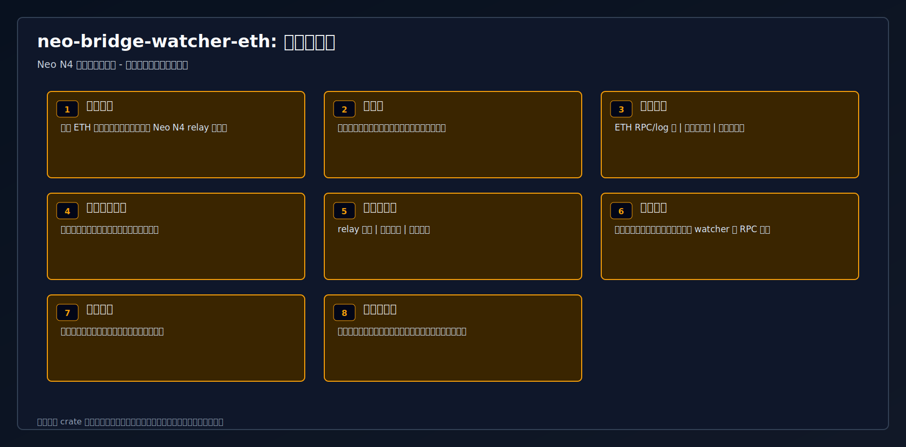
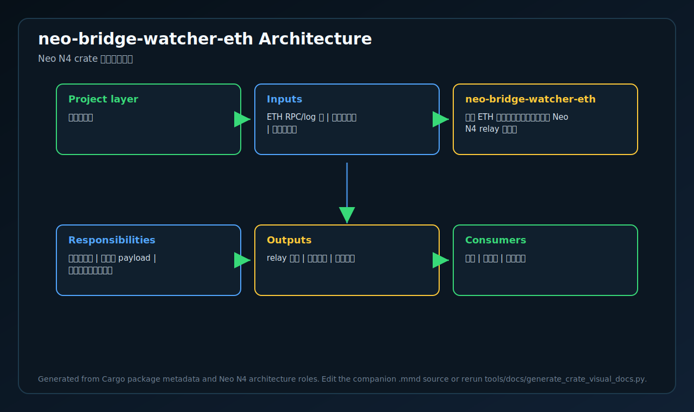
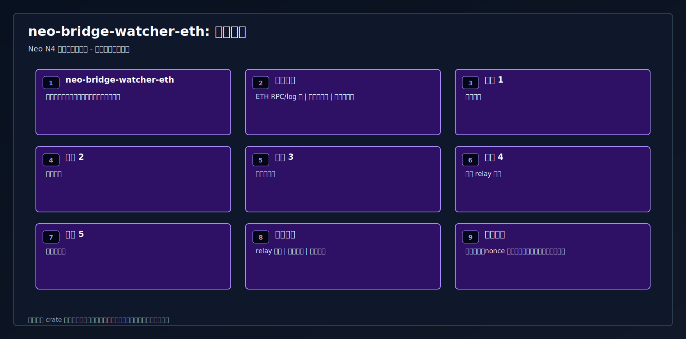
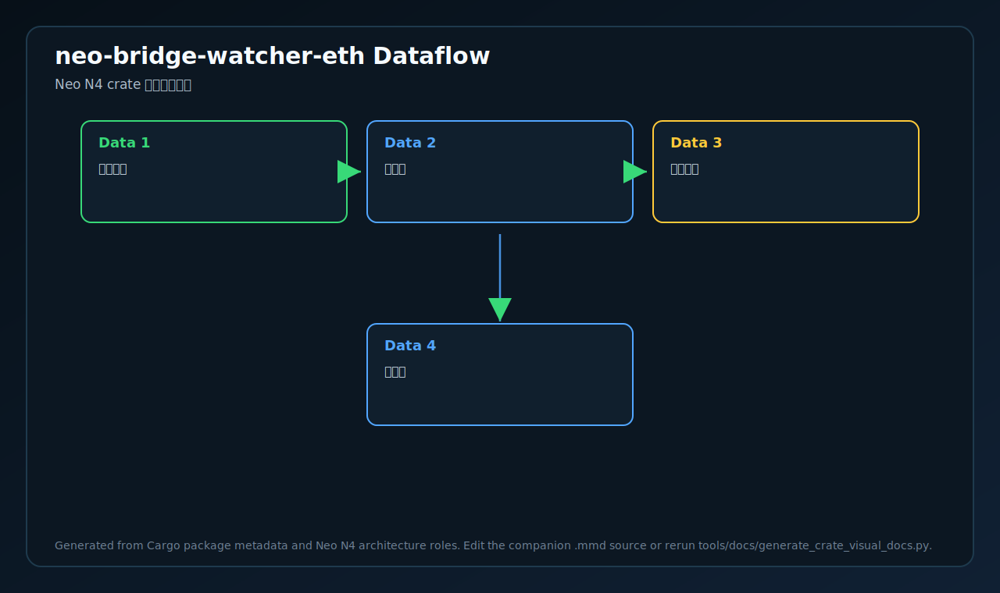
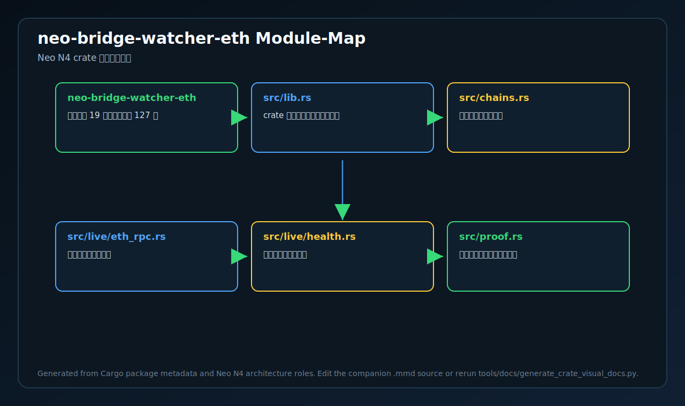
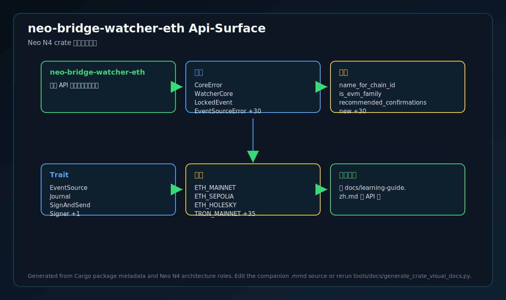
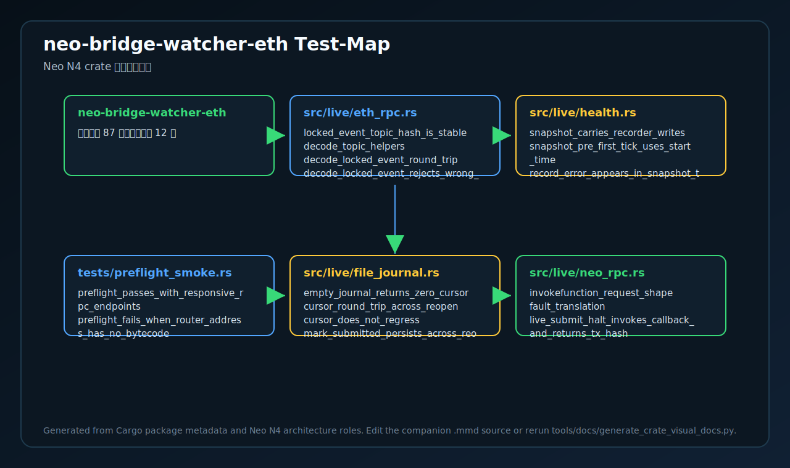
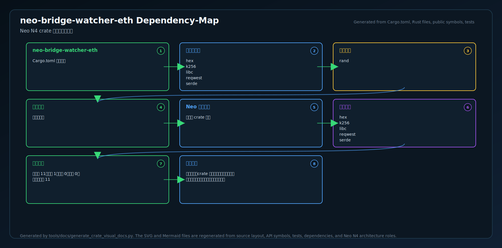
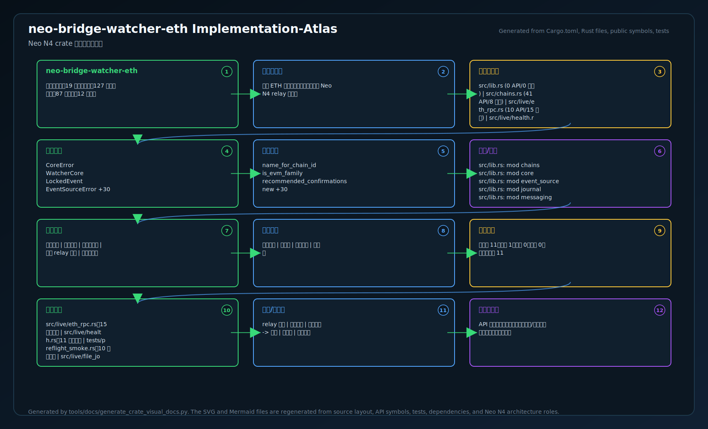

# neo-bridge-watcher-eth

<!-- N4-CRATE-VISUAL-GUIDE-ZH:START -->

## 可视化学习指南

这些图是 `neo-bridge-watcher-eth` 自己目录下的 crate 专属学习资料，用来说明它在 Neo N4 中的位置、自己负责的技术边界、内部工作流，以及数据如何流经它。

完整的源码级解释见 [docs/learning-guide.zh.md](docs/learning-guide.zh.md)。

| 视图 | 图片 | 源文件 |
| --- | --- | --- |
| 在 Neo N4 中的位置 |  | [Mermaid](docs/figures/position.zh.mmd) |
| 技术原理 |  | [Mermaid](docs/figures/principles.zh.mmd) |
| 架构 |  | [Mermaid](docs/figures/architecture.zh.mmd) |
| 工作流 |  | [Mermaid](docs/figures/workflow.zh.mmd) |
| 数据流 |  | [Mermaid](docs/figures/dataflow.zh.mmd) |
| 模块图 |  | [Mermaid](docs/figures/module-map.zh.mmd) |
| 公开 API 图 |  | [Mermaid](docs/figures/api-surface.zh.mmd) |
| 测试证据图 |  | [Mermaid](docs/figures/test-map.zh.mmd) |
| 依赖图 |  | [Mermaid](docs/figures/dependency-map.zh.mmd) |
| 实现全景图 |  | [Mermaid](docs/figures/implementation-atlas.zh.mmd) |

### 在 Neo N4 中的作用

- **层级:** 跨链监听器
- **目的:** 监听 ETH 桥事件，并转换为标准化 Neo N4 relay 消息。
- **主要输入:** ETH RPC/log 流、桥合约事件、检查点游标
- **主要输出:** relay 任务、审计日志、健康指标
- **下游使用者:** 网关、共享桥、运维面板
- **扫描到的源码文件:** 19
- **扫描到的公开符号:** 127
- **扫描到的 Rust 测试:** 87

### 边界与职责

- **本 crate 负责:** 过滤桥事件、规范化 payload、保护重放与游标状态
- **本 crate 消费:** ETH RPC/log 流、桥合约事件、检查点游标
- **本 crate 产出:** relay 任务、审计日志、健康指标
- **主要被谁使用:** 网关、共享桥、运维面板

### 源码地图快照

| 文件 | 为什么重要 | 公开 API | 测试 |
| --- | --- | ---: | ---: |
| `src/lib.rs` | crate 根、公开导出和顶层文档 | 0 | 0 |
| `src/chains.rs` | 实现细节或辅助模块 | 41 | 8 |
| `src/live/eth_rpc.rs` | 实现细节或辅助模块 | 10 | 15 |
| `src/live/health.rs` | 实现细节或辅助模块 | 11 | 11 |
| `src/proof.rs` | 证明对象、布局和验证证据 | 10 | 5 |
| `src/live/neo_rpc.rs` | 实现细节或辅助模块 | 8 | 8 |
| `src/messaging.rs` | 实现细节或辅助模块 | 7 | 5 |
| `src/core.rs` | 实现细节或辅助模块 | 6 | 7 |

### API 快照

| 类型 | 代表符号 |
| --- | --- |
| 类型 | CoreError   WatcherCore   LockedEvent   EventSourceError +30 |
| 函数 | name_for_chain_id   is_evm_family   recommended_confirmations   new +30 |
| Trait | EventSource   Journal   SignAndSend   Signer +1 |
| 常量 | ETH_MAINNET   ETH_SEPOLIA   ETH_HOLESKY   TRON_MAINNET +35 |

### 学习路径

1. 先看位置图，明确这个 crate 为什么存在、上游是谁、下游是谁。
2. 再看技术原理图，理解它的核心不变量、职责边界和维护规则。
3. 然后看模块图和 API 图，确定先读哪些文件、哪些符号。
4. 最后看工作流、数据流、测试证据图和依赖图，再进入源码会更容易理解。
5. 如果希望一张图看完整体，就看实现全景图；它把源码入口、API、数据流、测试、依赖和修改检查点放在一起。

<!-- N4-CRATE-VISUAL-GUIDE-ZH:END -->
