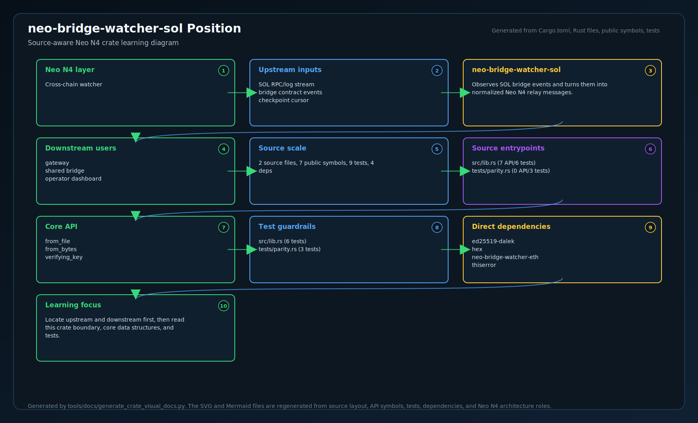
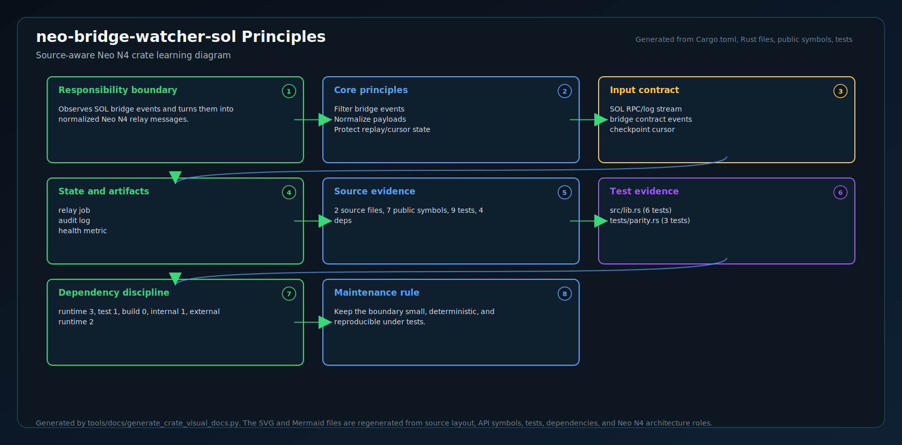
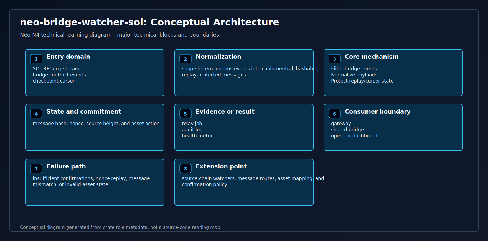
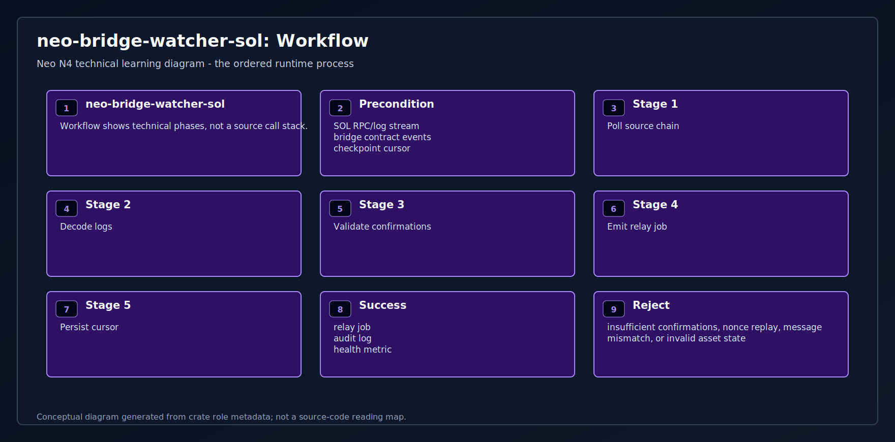
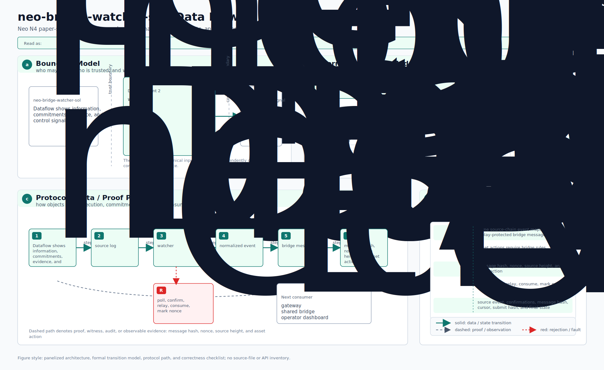
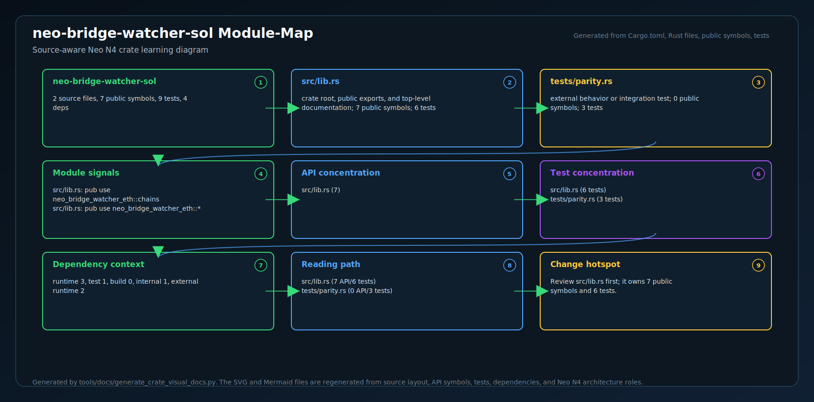
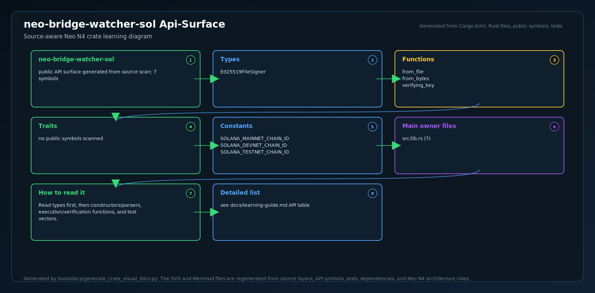
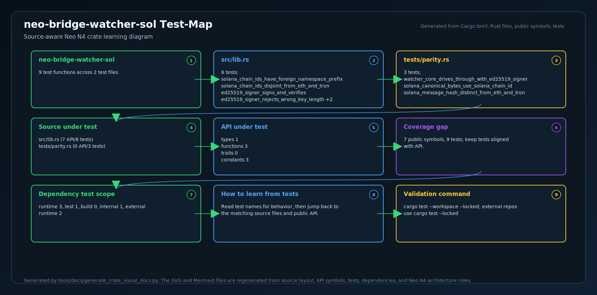
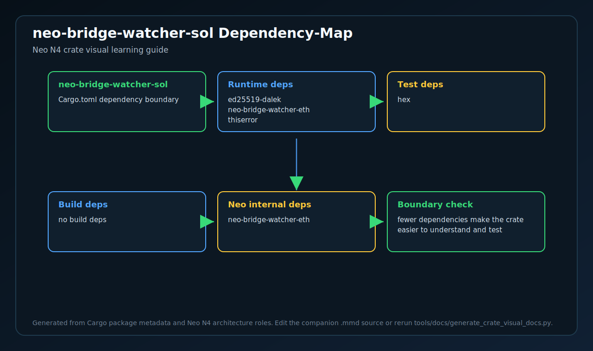

# neo-bridge-watcher-sol

<!-- N4-CRATE-VISUAL-GUIDE:START -->

## Crate Visual Learning Guide

These diagrams are local to this crate. They explain `neo-bridge-watcher-sol` as an independent unit: where it sits in the Neo N4 stack, which boundary it owns, how its internal workflow runs, and how data moves through it.

For the full source-level explanation, read [docs/learning-guide.md](docs/learning-guide.md).

| View | Diagram | Source |
| --- | --- | --- |
| Position in Neo N4 |  | [Mermaid](docs/figures/position.mmd) |
| Technical principles |  | [Mermaid](docs/figures/principles.mmd) |
| Architecture |  | [Mermaid](docs/figures/architecture.mmd) |
| Workflow |  | [Mermaid](docs/figures/workflow.mmd) |
| Dataflow |  | [Mermaid](docs/figures/dataflow.mmd) |
| Module map |  | [Mermaid](docs/figures/module-map.mmd) |
| Public API surface |  | [Mermaid](docs/figures/api-surface.mmd) |
| Test evidence |  | [Mermaid](docs/figures/test-map.mmd) |
| Dependency map |  | [Mermaid](docs/figures/dependency-map.mmd) |

### Role in Neo N4

- **Layer:** Cross-chain watcher
- **Purpose:** Observes SOL bridge events and turns them into normalized Neo N4 relay messages.
- **Primary inputs:** SOL RPC/log stream, bridge contract events, checkpoint cursor
- **Primary outputs:** relay job, audit log, health metric
- **Downstream consumers:** gateway, shared bridge, operator dashboard
- **Source files scanned:** 2
- **Public symbols scanned:** 7
- **Rust tests scanned:** 9

### Boundary and Responsibilities

- **Owns:** Filter bridge events, Normalize payloads, Protect replay/cursor state
- **Consumes:** SOL RPC/log stream, bridge contract events, checkpoint cursor
- **Produces:** relay job, audit log, health metric
- **Used by:** gateway, shared bridge, operator dashboard

### Source Map Snapshot

| File | Why it matters | Public API | Tests |
| --- | --- | ---: | ---: |
| `src/lib.rs` | crate root, public exports, and top-level documentation | 7 | 6 |
| `tests/parity.rs` | external behavior or integration test | 0 | 3 |

### API Snapshot

| Kind | Representative symbols |
| --- | --- |
| Types | Ed25519FileSigner |
| Functions | from_file   from_bytes   verifying_key |
| Trait | no public symbols scanned |
| Constants | SOLANA_MAINNET_CHAIN_ID   SOLANA_DEVNET_CHAIN_ID   SOLANA_TESTNET_CHAIN_ID |

### Learning Path

1. Start with the position diagram to understand why this crate exists and who calls it.
2. Read the technical principles diagram to identify the invariants and responsibility boundary.
3. Use the module map and API surface to identify the files and symbols to read first.
4. Follow the workflow, dataflow, test, and dependency diagrams before changing code.

<!-- N4-CRATE-VISUAL-GUIDE:END -->
